# はじめに

## 対象読者

本書は Unity の uGUI の基本原理を深く理解したいと願う読者のために書かれている。もし、すぐに効果が出る Tips や便利な UI アセットの紹介を期待しているのであれば、残念ながら期待外れになるかもしれない。だが、こんな経験はないだろうか？

- 便利な UI アセットが特定のプラットフォームに対応していない

- Unity のバージョンを上げたら便利な UI アセットが動かなくなった

- 何もしていないのに便利な UI アセットが動かなくなった

本書の内容を理解することで、そのような状況に遭遇した場合でも落ち着いて対応ができるようになるだろう。

また、本書の内容はパフォーマンス改善のためにも非常に役に立つはずである。たとえば、uGUI でのパフォーマンス最適化の手法としては

- Canvas を分割する

- 無駄な RaycastTarget を減らす

- Camera.main の利用を避ける

- Auto Layout の Layout Group をなるべく使わないようにする

- Animation や Timeline で UI をアニメーションさせない

などが一般的に知られている。本書を通読した暁には、それらの手法がなぜ有効なのかの理由を理解することができるようになるだろう。

本書では uGUI のコンポーネントのプロパティや public メソッドの解説を記述してある。これらの解説は公式リファレンスのコピーではなく、著者がソースコードを確認した上で実際に呼び出して挙動を検証を経た結果である。さらに、顕著な *GC Alloc* が発生する場合には注釈を入れている。これにより、公式リファレンスでは得られない詳細な挙動を知ることができるはずである。

プログラミング言語やゲームエンジンなどのミドルウェアを深く理解する方法として、リファレンスやソースコードを一通り全部読むという方法は非常に有用である。本書を全部読破することで uGUI のみならず Unity 全般への深い理解が得られるだろう。

## uGUI のソースコードへのアクセス

uGUI の C# 部分のソースコードは公開されている。

Unity 2019.2 以降であれば、**Project** ウィンドウの *Packages* から *Unity UI* を開けば、ソースコードを含めた uGUI のパッケージの中を見ることができる。ソースを見るだけではなく、`Debug.Log()` を仕込んだりソースコードを変更したいのであれば、以下の手順に従う必要がある。

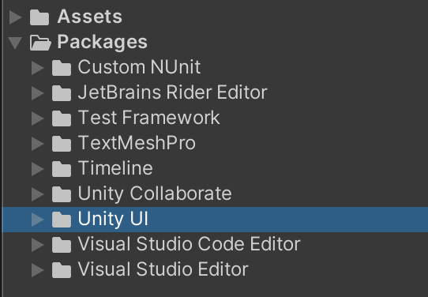

1. **Project** ウィンドウの **Packages/Unity UI** フォルダを右クリックして、Windows であれば *Show in Explorer*、MacOS であれば *Reveal in Finder* で開く。

2. そうすると Package が置かれているフォルダが開かれるので、**com.unity.ugui@1.0.0** フォルダをコピーする。

3. **com.unity.ugui@1.0.0** を自分のプロジェクトの **Packages** フォルダ（例：`"C:\MyProject\Packages`）にペーストする。

4. ペーストした **com.unity.ugui@1.0.0** フォルダを **com.unity.ugui** にリネームする。

これで uGUI のパッケージを自分で変更できるようになる。また、変更できるようになるだけではなく、Visual Studio での参照の検索にも引っかかるようになる。

> もし、Unity 2019.1 以前のソースコードを見たいのであれば GitHub で公開されているレポジトリを見ると良いだろう。
> 
> https://github.com/Unity-Technologies/uGUI

当然ながら `Canvas` などの C++ で書かれたコンポーネントのソースコードは公開されていない。C# で書かれているのは（`Image` や `Text` などの）`UnityEngine.UI` あるいは `UnityEngine.EventSystems` 名前空間に属するコンポーネントのみであり、`Canvas` などは `UnityEngine` 名前空間に属するコンポーネントだからである。

## UI Toolkit (UIElements) の現状

Unity は新しい UI フレームワークとして UI Toolkit の開発を進めている。これは、これはかつて UI Elements と呼ばれていたものである。UI Toolkit は Unity 2021.2 でランタイム対応となったので、ゲーム中の UI として利用できることになった。しかしながら、2021.2 の時点では未実装の機能も多い。特にワールド空間での UI が未対応であることには注意しよう。

少なくとも 2021 年 8 月の時点では新規プロジェクトであっても、UI Toolkit を GUI の基本機能として利用する理由は無いだろう。uGUI が登場してからもパフォーマンス等の問題から NGUI を使い続けるプロジェクトは多かったが、それと同様の状況になるだろう（実際は 2021 年の時点でも NGUI で作られたアプリケーションは多く存在している）。

UI Toolkit は uGUI と共存可能である。当面は uGUI を使いながら、少しずつ UI Toolkit に移行していくというやり方も良いかもしれない。いずれにしても我々はまだしばらくは uGUI と付き合っていく必要があり、それが本書の執筆理由でもある。

## 対象 Unity バージョン

本書は基本的には Unity 2020.2 を前提に書かれている。もっとも、それ以前から追加されていた uGUI の新機能についても随時触れていくつもりである。たとえば、Unity 2020.1 で導入された `Mask` コンポーネントのソフトマスク（端をぼかす機能）や UI シェーダーの乗算済み透明、レイキャスト領域のパディングなどについては知らない読者もいるかもしれない。本書を通じてそういった新機能についても学ぶことができる。

## ライセンス

本書のサンプルコードは、Unity uGUI 由来のものもオリジナルのものも全て Unity uGUI のライセンスの下で頒布する。Unity uGUI のライセンス については Unity UI Package の LICENSE を参照のこと。大抵の場合は製品内で Unity uGUI のライセンス表記も行っているはずなので特別なことをする必要はないだろう。

# Chapter 1 Canvas と関連コンポーネント

## Canvas の概要

`Canvas` は uGUI の UI 要素をレンダリングするためのコンポーネントである。`Canvas` をよく理解することが uGUI の理解に繋がる。

`Canvas` は同一 `GameObject` にアタッチされている `CanvasScaler` や `GraphicRaycaster` などのコンポーネントと協調動作してキャンバスとしての動作を実現する。

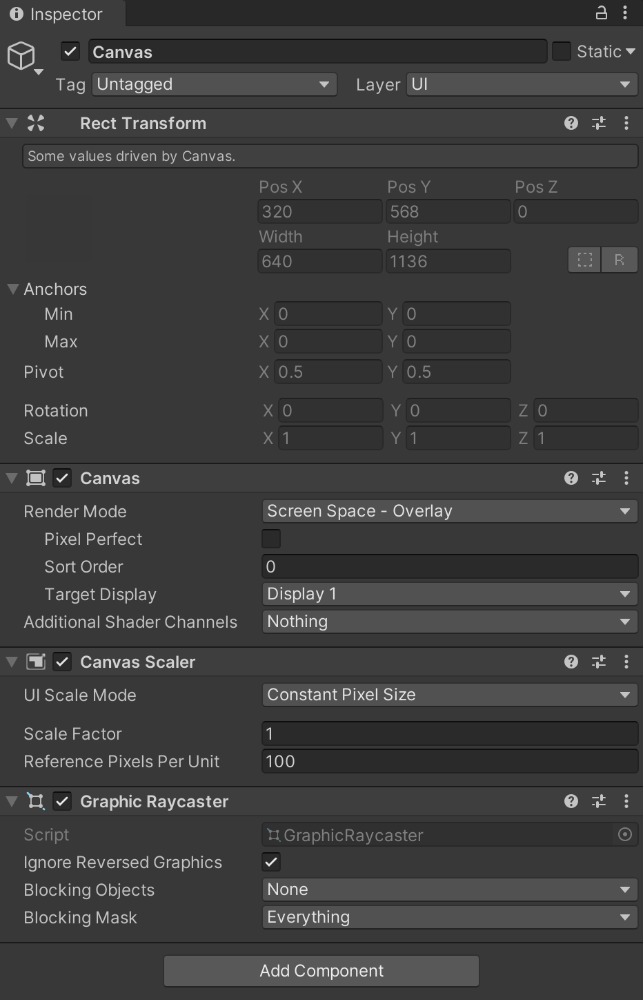

`Canvas` はネイティブコード（C++）で書かれた Unity コンポーネントである。uGUI の多くのコンポーネントは C# で書かれていて、ソースコードも公開されているが `Canvas` に関してはそうではない。

> `Canvas` の C# bindings コードは GitHub に公開されている。
> 
> https://github.com/Unity-Technologies/UnityCsReference/blob/master/Modules/UI/ScriptBindings/UICanvas.bindings.cs

`Canvas` が行っている処理は、簡単に言えば以下の 3 つである。

1. UI を表示するスクリーンの描画方法やサイズを決定する。

2. レンダリングする直前に `Canvas.willRenderCanvases` に登録されたコールバックを呼ぶことで他のクラスにレンダリングの準備をさせる（Canvas リビルド）。

3. 配下にある `CanvasRenderer` のメッシュをまとめてレンダリングする（バッチビルド）。

`Canvas` 自体は、描画しようとしているメッシュが画像なのかテキストなのかなどについては関知していない。またタッチイベントの処理についても `Canvas` は直接関わってはおらず、`EventSystem` や `StandAloneInputModule` が処理を行っている。

1 点目のスクリーンの描画方法やサイズは **Inspector** やスクリプトから `renderMode` などのプロパティにアクセスすることで制御できる。

2 点目の Canvas リビルドは `Canvas` 自体ではなく `CanvasUpdateRegistry` というクラスが担当している。`Canvas` はあくまで適切なタイミングで `CanvasUpdateRegistry` に処理を任せるだけである。

3 点目のバッチビルドについてだが、`Canvas` は配下にある各 UI 要素のジオメトリを `CanvasRenderer` から取得してバッチに結合し、適切なレンダーコマンドを生成して Unity のグラフィックシステムに送る。この動作を **バッチビルド（Batch Build）**と呼ぶ。このバッチビルドの処理はネイティブコードで行われる。`Canvas` のバッチビルドが必要な場合、「`Canvas` はダーティーである」と呼ぶことがある。バッチビルドの詳細については *Chapter 2 UI 要素と Canvas のリビルド* の *Canvas のバッチビルド* の項で説明する。

## Canvas コンポーネント

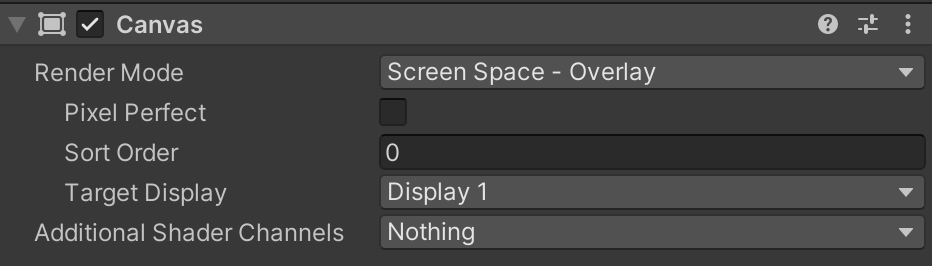

`Canvas` クラスの定義を以下に示す。

```c#
[RequireComponent(typeof(RectTransform)),
    NativeClass("UI::Canvas"),
    NativeHeader("Modules/UI/Canvas.h"),
    NativeHeader("Modules/UI/UIStructs.h")]
public sealed class Canvas : Behaviour
```

これは `Canvas` の C# の bindings コードから抜粋したものである。

`Canvas` の親クラスである`Behaviour` は、`MonoBehaviour` の親クラスである。継承関係は以下の通りである。

```
UnityEngine.Object
    ← UnityEngine.Component
        ← UnityEngine.Behaviour
            ← UnityEngine.MonoBehaviour
```

さて、ここからは `Canvas` コンポーネントのプロパティ、public メソッド、イベントを見ていく。Unity 公式のドキュメントでは説明が簡素すぎることも多いので、詳細に解説していく。

### Canvas のプロパティ

#### renderMode

```c#
public extern RenderMode renderMode { get; set; }
```

UI をスクリーンに描画するのか、あるいは 3D 空間のオブジェクトとして存在させるかを取得/指定する。**Inspector** では **Render Mode** として表示されている。

`RenderMode` の定義は以下の通りである。

```c#
/// <summary>
///   <para>Canvas の RenderMode</para>
/// </summary>
public enum RenderMode
{
    /// <summary>
    ///   <para>2D Canvas を使ってシーンの最後にレンダリングする。</para>
    /// </summary>
    ScreenSpaceOverlay,

    /// <summary>
    ///   <para>Canvas に設定された Camera を使ってレンダリングする。</para>
    /// </summary>
    ScreenSpaceCamera,

    /// <summary>
    ///   <para>シーン内の Camera を使ってレンダリングする。</para>
    /// </summary>
    WorldSpace
}
```

デフォルト値は `ScreenSpaceOverlay` である。

以下、各モードについて説明する。

#### ScreenSpaceOverlay モード


`renderMode` が `ScreenSpaceOverlay` に設定されている場合、スクリーンに直接 UI の描画が行われる。この場合、Canvas にカメラの設定をする必要はない。レンダリングは他の全てのカメラのレンダリングが終わった後に上書きして最後に描かれる。

`ScreenSpaceOverlay` のメリット

  - `Camera` を設定する必要が無い。

  - 複数の `Canvas` が存在する場合に `renderOrder` の値の大小だけで `Canvas` 間の描画順を調整できるので管理が楽。

`ScreenSpaceOverlay` のデメリット

  - `Canvas` の上に `MeshRenderer` などで 3D モデルを表示したり Particle を表示するのが難しい。無理にやろうとするなら、それらを一度 `RenderTexture` にレンダリングして、その結果を `RawImage` として表示するなどの工夫が必要となり、パフォーマンスの劣化や管理の複雑さが増す。

  - 他の `renderMode` が設定された `Canvas` の子にしてしまうと、UI が一切表示されない。

複雑なことを行わない通常の UI であればこの `ScreenSpaceOverlay` モードを使って良いだろう。このモードで問題が発生しそうであれば、`ScreenSpaceCamera` モードを使うことを検討すること。

また、このモードで描画している場合、**Frame Debugger** では `Canvas.RenderOverlays` 以降にドローコールが表示される。

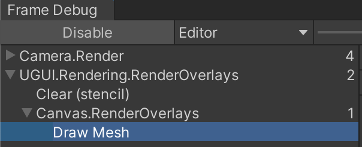

#### ScreenSpaceCamera モード

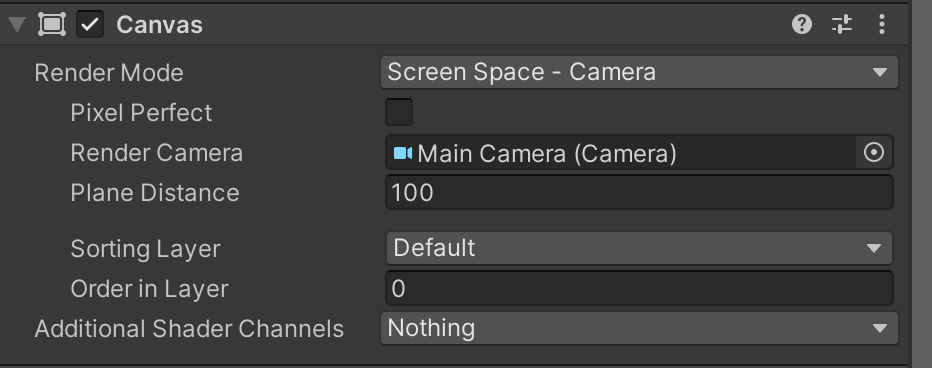

上記で説明した `ScreenSpaceOverlay` の 3D との混在の問題を解決するには この `ScreenSpaceCamera` モードを使えば良い。

このモードでは明示的にカメラを設定しなくても動作するが、そうすると `Camera.main` に毎回アクセスすることになって CPU 時間を消費するので、必ず `worldCamera` プロパティ（**Inspector** では **Render Camera** と表示されている）に `Camera` を設定するようにしたい。

このモードでの `Canvas` 間の描画順は基本的に `sortingOrder` で調整することになるだろう。実際の描画順決定には他のパラメータも絡んでくるので、詳細は `sortingOrder` プロパティの項で説明する。

> `Camera.main` へのアクセス速度は 2019.4.9f1 以降で多少改善されている。

また、このモードで描画している場合、**Frame Debugger** では `Render.TransparentGeometry` 以降にドローコールが表示される。

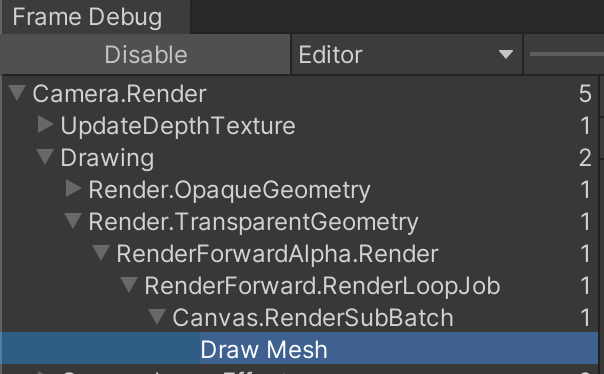

#### WorldSpace モード

3D 空間に UI を置く場合はこのモードを選択することになる。`worldCamera` プロパティ（**Inspector** では **Event Camera** と表示されている）に `Camera` を設定しておく必要がある。

このモードの場合にのみ、`CanvasScaler` コンポーネントの `dynamicPixelsPerUnit` の設定が使われるようになり、遠くの `Text` を描画するのに使うピクセル数を減らしてパフォーマンスを稼ぐことができる。

また、このモードで描画している場合、**Frame Debugger** では `Render.TransparentGeometry` 以降にドローコールが表示される。


#### pixelPerfect

```c#
public extern bool pixelPerfect { get; set; }
```

UI 要素をドット・バイ・ドットでくっきり表示させるかどうかを取得/設定する。

デフォルト値は `false` である。

**Inspector** では **Pixel Perfect** として表示されている。このプロパティは `renderMode` が `ScreenSpaceOverlay` または `ScreenSpaceCamera` の場合にのみ使われる。

ドット・バイ・ドット表示を有効にすることは、パフォーマンス上のコストが非常に高い。また、ドット・バイ・ドットが有効になったからといって必ずしもくっきり表示されるとは限らない。モバイルの場合、デバイスの解像度とレンダリング解像度が異なることがあるので、そのような状況下では仮に設定が有効であってもデバイスのドット・バイ・ドットの表示が実現できるとは限らない。

このオプションをどうしても使いたい場合は、UI 要素が動かない `Canvas` でのみ使うべきである。あるいは、`Texture2D` の `FilterMode` を `Point` にするだけで望む画作りができるかもしれないので、まずはそちらを検討すべきである。

#### overridePixelPerfect

```c#
public extern bool overridePixelPerfect { get; set; }
```

この `Canvas` が親 `Canvas` の `pixelPerfect` の設定を引き継ぐかどうかを取得/設定する。

デフォルト値は `true` であり、つまり 親 `Canvas` の設定を引き継ぐ。

**Inspector** では **Pixel Perfect** を **Inherit**(引き継ぐ)か、**On**(親の設定に関わらず Pixel Perfect にする)、**Off**（親の設定に関わらず Pixel Perfect にしない）のいずれかから選ぶことになる。

#### sortingOrder

```c#
public extern int sortingOrder  { get; set; }
```

同一 **Sorting Layer** 内での描画優先度を取得/設定する。

数値が高い `Canvas` が後に描画される。

デフォルト値は `0` である。

**Inspector** では **Sort Order** として表示されている。

> **Sorting Layer** は **Layer** とは別物である。自分で **Sorting Layer** を追加していないのであれば、**Sorting Layer** は *Default* 一種類のみとなっている。**Sorting Layer** を追加/削除したい場合、*Project Settings* から *Tags and Layers* を開いて編集する。

`renderMode` が `ScreenSpaceOverlay` であれば、`Camera` の `depth` や **Sorting Layer** は考慮されず、この `sortingOrder` のみで描画順を制御することになる。

`renderMode` が `ScreenSpaceCamera` あるいは `WorldSpace` であれば、まずは `Camera` の `depth` 値が小さい `Canvas` から描画され、次に **Sorting Layer** が小さい `Canvas`、`sortingOrder` が小さい `Canvas`、カメラから遠い `Canvas` の順に描画される。

まとめると、以下のような順に `Canvas` が選ばれ、選ばれた順に（奥に）描画される。

`ScreenSpaceOverlay` の場合、`sortingOrder` が小さい `Canvas` から描画される。

`ScreenSpaceCamera` あるいは `WorldSpace` の場合、

1. `Camera` の `depth` 値が小さい `Canvas`
2. **Sorting Layer** が小さい `Canvas`
3. `sortingOrder` が小さい `Canvas`
4. `ScreenSpaceCamera` の場合は `planeDistance` が大きい `Canvas`
5. `WorldSpace` の場合は `Camera` から遠い `Canvas`

という順で `Canvas` が選ばれて描画される。

描画順の詳細については *Chapter 3 レンダリング* の *Unity における描画順* の項で説明する。

#### overrideSorting

```c#
public extern bool overrideSorting  { get; set; }
```

この `Canvas` が親 `Canvas` の `sortingOrder` を上書きするかどうかを取得/設定する。

デフォルト値は `false` であり、つまり、親 `Canvas` の `sortingOrder` が使われる。

このプロパティの値が `true` の場合、**Inspector** から **Sort Order** を設定することができるようになる。

#### worldCamera

```c#
[NativeProperty("Camera", false, TargetType.Function)]
public extern Camera worldCamera { get; set; }
```

`renderMode` が `ScreenSpaceOverlay` の場合、このプロパティの値は使われない。

`renderMode` が `ScreenSpaceCamera` の場合、このプロパティの値は `Canvas` のサイズ調整を行うために使われる `Camera` である。**Inspector** に **Render Camera** と表示される。

`renderMode` が `WorldSpace` の場合、このプロパティの値はイベントが送られる `Camera` であり、**Inspector** に **Event Camera** と表示されている。

#### targetDisplay

```c#
public extern int targetDisplay  { get; set; }
```

`renderMode` が `ScreenSpaceOverlay` である場合に、UI を表示するディスプレイの ID を取得/設定する。

`renderMode` が `ScreenSpaceOverlay` 以外の場合は、`worldCamera` の
**Target Display** の設定次第で表示されるディスプレイが決まる。

#### additionalShaderChannels

```c#
public extern AdditionalCanvasShaderChannels additionalShaderChannels { get; set; }
```

uGUI のデフォルトの頂点シェーダーでは `position`, `color`, `uv0` しか使っていない（受け取っていない）が、もし他のチャンネル (`uv1`, `uv2`, `uv3`, `normal`, `tangent`) を使いたい場合にこのプロパティを取得/設定する。

`AdditionalCanvasShaderChannels` の定義は以下の通りである。

```c#
/// <summary>
///   <para>Canvas のメッシュが作成される際に既存のチャンネルに追加で含めるパラメータ</para>
/// </summary>
[Flags]
public enum AdditionalCanvasShaderChannels
{
    /// <summary>
    ///   <para>追加のシェーダーパラメータは必要ない。</para>
    /// </summary>
    None = 0x0,

    /// <summary>
    ///   <para>メッシュの頂点に UV1 を含める。</para>
    /// </summary>
    TexCoord1 = 0x1,

    /// <summary>
    ///   <para>メッシュの頂点に UV2 を含める。</para>
    /// </summary>
    TexCoord2 = 0x2,

    /// <summary>
    ///   <para>メッシュの頂点に UV3 を含める。</para>
    /// </summary>
    TexCoord3 = 0x4,

    /// <summary>
    ///   <para>メッシュの頂点に Normal を含める。</para>
    /// </summary>
    Normal = 0x8,

    /// <summary>
    ///   <para>メッシュの頂点に Tangent を含める。</para>
    /// </summary>
    Tangent = 0x10
}
```

`AdditionalCanvasShaderChannels` 列挙型はビットのフラグとなっている。

このプロパティのデフォルト値は `None` である。

もし `PositionAsUV1` コンポーネントを使いたいのなら `additionalShaderChannels` に `TexCoord1` のビットを立てて置く必要がある。他にも、`UV1` などの追加のチャンネルを使って UI シェーダーに何らかのパラメータを与えたいのであれば、各ビットを立てておく必要がある。たとえば TextMeshPro の `TextMeshProUGUI` コンポーネントは `TexCoord1` と `Normal` と `Tangent` を利用しており、テキストメッシュ生成時にそれらに対応した `AdditionalCanvasShaderChannels` のフラグを立てている。

UI シェーダーではテクスチャなどの例外を除いて Material Property Block（`[PerRendererData]`）を使うことができないので、頂点のチャンネルを使って各 UI 要素固有の挙動を指定するというテクニックを使うことがある。`additionalShaderChannels` はそのような場合にも使うことができる。もし、よくわからないのであればデフォルトの `None`（**Inspector** では **Nothing**）のままにしておこう。

#### planeDistance

```c#
public extern float planeDistance { get; set; }
```

`renderMode` が `ScreenSpaceCamera` の場合に、この `Canvas` が `worldCamera` からどれくらい離れているのかを取得/設定する。

デフォルト値は `100` である。

**Inspector** では **Plane Distance** と表示されている。

この値が小さければ `worldCamera` から近いことになって、手前に表示される。逆にこの値が大きければ `worldCamera` から遠いということになって、奥に表示されることになる。

#### renderOrder

```c#
public extern int renderOrder { get; }
```

シーン内の各 `Canvas` の描画順を取得する…ことになっているものの、実際には適切な値は返ってこない。なので、このプロパティの値をあてにしてはいけない。複数の `Canvas` が存在する場合の描画順については前述の `sortingOrder` プロパティの項の説明を参照のこと。

#### sortingLayerName

```c#
public extern string sortingLayerName { get; set; }
```

`Canvas` の **Sorting Layer** の名前を取得/設定する。

デフォルト値は `"Default"` である。

#### cachedSortingLayerValue

```c#
public extern int cachedSortingLayerValue { get; }
```

`Canvas` の **Sorting Layer** の ID を取得する。

実質的には `SortingLayer.GetLayerValueFromName(canvas.sortingLayerName)` を呼ぶのと同じである。

#### sortingLayerID

```c#
public extern int sortingLayerID { get; set; }
```

`Canvas` の **Sorting Layer** の ID を取得/設定する。

`"Default"` の ID は `0` なので、このプロパティのデフォルト値は `0` である。

**Sorting Layer** の ID はユニークな ID であり、自分で **Sorting Layer** を追加した場合、追加した **Sorting Layer** の ID は `1317894267` や `702774661` などのようなランダムな値となる。ID ではなく、**Sorting Layer** の値（つまり優先度）を取得したいのであれば、`cachedSortingLayerValue` を参照すること。

#### isRootCanvas

```c#
public extern bool isRootCanvas { get; }
```

この `Canvas` が root Canvas がどうか（＝サブ Canvas ではない）を取得する。

#### rootCanvas

```c#
public extern Canvas rootCanvas { get; }
```

root Canvas を取得する。

もし自分自身が root Canvas なら自分自身を返す。

#### pixelRect

```c#
public extern Rect pixelRect { get; }
```

この `Canvas` の領域を表す矩形を取得する。

`renderMode` の設定や `worldCamera` の位置に関わらず `x` と `y` は `0` 固定である。`width` と `height` は `Canvas` の幅と高さとなっている。

#### scaleFactor

```c#
public extern float scaleFactor { get; set; }
```

`Canvas` の大きさを拡大/縮小させる係数を取得/設定する。

`renderMode` が `WorldSpace` の場合、このプロパティの値は使われない。

実際には、同一 `GameObject` にアタッチされている `CanvasScaler` の `scaleFactor` から値がコピーされてこのプロパティに設定される。逆に、Canvas の `scaleFactor` から `CanvasScaler` の `scaleFactor` への値のコピーは発生しない。値の不一致を防ぐため、このプロパティ経由での値の設定はすべきではない。なお、`CanvasScaler` の `scaleFactor` からこのプロパティへの値のコピーは `CanvasScaler` の `Update()` のタイミングで行われる。

#### referencePixelsPerUnit

```c#
public extern float referencePixelsPerUnit { get; set; }
```

1 単位あたりのピクセル数を計算する際に使われる値を取得/設定する。

> `Image` を描画する際に `sprite` の `pixelsPerUnit`（デフォルト値は `100`）をこのプロパティで割った値が 1 単位あたりのピクセル数になる（`CanvasScaler` の `uiScaleMode` が `ConstantPhysicalSize` 以外であれば、1 単位あたり 1 ピクセルになる）。

同一 `GameObject` にアタッチされている `CanvasScaler` の `referencePixelsPerUnit` 値を元に計算されてこのプロパティに設定される。詳細は *CanvasScaler* の項で説明する。`scaleFactor` と同様に、このプロパティ経由での値の設定はすべきではない。また、なお、`CanvasScaler` からこのプロパティへの値の設定は `CanvasScaler` の `Update()` のタイミングで行われる。

#### normalizedSortingGridSize

```c#
[NativeProperty("SortingBucketNormalizedSize", false, TargetType.Function)]
public extern float normalizedSortingGridSize { get; set; }
```

`Canvas` がレンダリング領域を分割するサイズを取得する。

最小値は `0` で最大値は `1` であり、デフォルト値は `0.1f` である。値を `0` に設定してもデフォルト値の `0.1f` が設定される。

`Canvas` がレンダリングを行う際にはレンダリング領域はグリッドに分割されて Job として処理される。たとえば、レンダリング領域が `100` 単位で、`normalizedSortingGridSize` が `0.1f` であったなら、各グリッドは `10` 単位となる。

この値は Canvas リビルドの際のパフォーマンスに影響する。分割数があまりにも多いと Job の数が多すぎてパフォーマンスが落ちることがある（レンダリング用 Job の `Semaphone.WaitForSignal` の処理時間が長くなる）。Canvas リビルドが多い場合は（サブ Canvas に分割するなどの基本的な最適化を行った上で）このプロパティを `0.5f` などに増やすとパフォーマンスが向上する可能性があるので、最終手段として検討してほしい。

### Canvas の static メソッド

#### ForceUpdateCanvases

```c#
public static void ForceUpdateCanvases();
```

`Canvas` の更新を強制する。

このメソッドを呼ぶと、毎フレーム呼ばれる `Canvas.SendWillRenderCanvases()` が強制的に呼ばれ、その先で `CanvasUpdateRegistry.PerformUpdate()` での Canvas リビルドが行われる。Canvas リビルドについては後で詳しく説明する。

#### GetDefaultCanvasMaterial

```c#
[FreeFunction("UI::GetDefaultUIMaterial")] 
public static extern Material GetDefaultCanvasMaterial();
```

何もマテリアルが指定されていない場合に使われるデフォルトのマテリアルを取得する。

#### GetETC1SupportedCanvasMaterial

```c#
[FreeFunction("UI::GetETC1SupportedCanvasMaterial")] 
public static extern Material GetETC1SupportedCanvasMaterial();
```

何もマテリアルが指定されていない場合に使われる ETC1 用のデフォルトのマテリアルを取得する。

### Canvas のイベント

#### willRenderCanvases イベント

```c#
public static event WillRenderCanvases willRenderCanvases;
```

Canvas のレンダリングが発生する直前に呼び出される。Canvas リビルドはこのイベント経由で発生する。`willRenderCanvases` については本書で何度も説明する。

ここに独自にイベントを追加することができる。

```c#
class MyImage : MonoBehaviour
{
    void Start()
    {
        Canvas.willRenderCanvases += MyEvent;
    }

    void OnDestroy()
    {
        Canvas.willRenderCanvases -= MyEvent;
    }

    void MyEvent()
    {
        Debug.Log("Canvas.willRenderCanvases イベントが発生した");
    }
}
```

## CanvasScaler コンポーネント

### CanvasScaler の概要

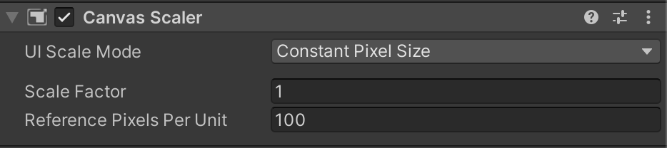

```c#
[RequireComponent(typeof(Canvas))]
[ExecuteAlways]
[AddComponentMenu("Layout/Canvas Scaler", 101)]
[DisallowMultipleComponent]
public class CanvasScaler : UIBehaviour
```

`CanvasScaler` コンポーネントは、`Canvas` 内の UI 要素の全体的なスケールとピクセル密度を制御するために使用される。

このコンポーネントは **Hierarhy** 内での右クリック、または *GameObject -> UI -> Canvas* から `Canvas` が作成された際に自動的に `Canvas` にアタッチされる。`CanvasScaler` をうまく使うことで解像度に依存しない UI 配置を実現することができる。

`CanvasScaler` によるスケーリングは `Canvas` 配下の全てに影響を与える。フォントのサイズや画像の境界などもスケーリングの影響を受ける。

`Canvas` の `renderMode` が `ScreenSpaceOverlay` または `ScreenSpaceCamera` の場合、`uiScaleMode` を設定することができる。`uiScaleMode` には `ConstantPixelSize` と `ScaleWithScreenSize` と `ConstantPhysicalSize` の 3 種類が存在する。


`uiScaleMode` が `ConstantPixelSize` の場合、UI 要素の位置とサイズはスクリーン上のピクセル数で指定する。これは `CanvasScaler` がアタッチされていなかった場合の `Canvas` のデフォルトの挙動となっている。ただし、`scaleFactor` の値を変更すると、`Canvas` 内の全ての UI 要素がスケーリングされる。

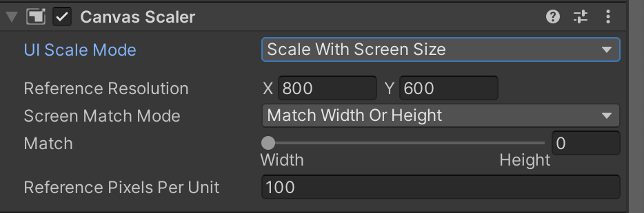

`uiScaleMode` が `ScaleWithScreenSize` の場合、UI 要素の位置とサイズは `referenceResolution` のピクセル数に応じて指定する。もし、現在の画面解像度が `referenceResolution` よりも大きいなら、`Canvas` は `referenceResolution` を維持したまま画面解像度に合うように拡大される。逆に現在の画面解像度が `referenceResolution` よりも小さいなら、`Canvas` は画面の解像度に合うように縮小される。

さらに、現在の画面解像度と `referenceResolution` のアスペクト比が異なるのであれば `Canvas` を拡大または縮小すると歪んでしまう。それを回避するため、`Canvas` の解像度は `referenceResolution` とは別のものに変更される。どのように変更されるのかについては `screenMatchMode` の設定に依存する。

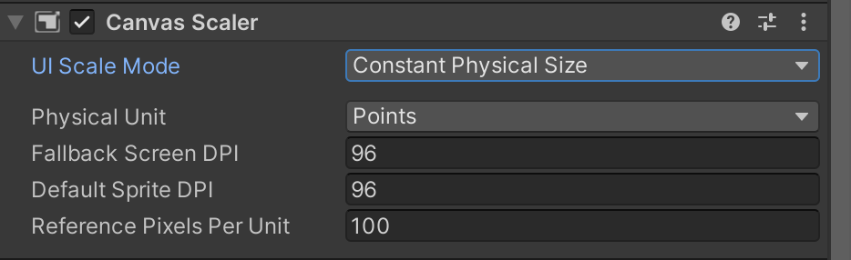

`uiScaleMode` が `ConstantPhysicalSize` の場合、UI 要素の位置とサイズはミリメートルやポイントなどの物理的な単位で指定される。このモードはデバイスが画面の DPI を適切に報告するという前提で動作する。デバイス が DPI を適切に報告しないの場合に備えて、フォールバックの DPI を指定することができる。

`Canvas` の `renderMode` が `WorldSpace` の場合には、UI 要素のピクセル濃度を設定することができる。

### CanvasScaler のプロパティ

#### uiScaleMode

```c#
public CanvasScaler.ScaleMode uiScaleMode { get; set; }
```

各モードに応じて、Canvas 内の UI 要素をどのようにスケーリングするかを取得/設定する。

`CanvasScaler.ScaleMode` の定義は以下の通りである。

```c#
public enum ScaleMode
{
    /// <summary>
    /// Constant Pixel Size モードでは、UI 要素の位置とサイズはスクリーンのピクセル数で指定する。
    /// </summary>
    ConstantPixelSize,
    
    /// <summary>
    /// Scale With Screen Size モードでは、UI 要素の位置とサイズは referenceResolution で指定されたピクセル数に応じて指定することができる。もし、現在の画面解像度が referenceResolution よりも大きかった場合、Canvas は referenceResolution を維持したまま画面に合うように拡大される。逆に現在の画面解像度が referenceResolution よりも小さかった場合、縮小される。
    /// </summary>
    ScaleWithScreenSize,

    /// <summary>
    /// Constant Physical Size モードでは、UI 要素の位置とサイズはミリメートルやポイントなどの物理単位で指定される。
    /// </summary>
    ConstantPhysicalSize
}
```

各モードの説明は以下の通りである。

##### Constant Pixel Size モード

UI 要素のサイズがスクリーンサイズに依存しないモードである。デフォルトではこのモードである。また、`CanvasScaler` がアタッチされていない `Canvas` もこのモードと同じ挙動となる。

このモードでは「UI 要素のサイズがスクリーンサイズに依存しない」とは書いたが、`scaleFactor` の値を変更することで UI 要素のサイズを大きくしたり小さくしたりすることができる。想定解像度と、実機上のスクリーンサイズである `Screen.width` あるいは `Screen.height` を比較した係数を `scaleFactor` に設定することで、UI 要素のサイズを調整することができる。ただし、実際には `Canvas` の `RectTransform` のサイズが `scaleFactor` に合わせて増減する。

スクリーンのアスペクト比が Unity Editor 上と実機とで変わらないのであればこの対処で十分である。ただし、世の中のスマートフォンやタブレット端末は様々な解像度およびアスペクト比を持っているので、その場合は **Scale With Screen Size** モードを使用することをおすすめする。

##### Scale With Screen Size モード

現在の画面解像度が `referenceResolution` より大きければ `Canvas` は拡大され、もし逆に小さければ、`Canvas` は縮小される。

画面解像度と `referenceResolution` のアスペクト比が一致している場合、UI の見た目は保たれる。アスペクト比が一致していない場合の挙動は `Screen Match Mode` の設定によって変わる。

##### Constant Physical Size モード

UI 要素が画面解像度に依存せず、物理サイズを維持するモードである。

UI 要素の位置とサイズはミリメートル、ポイント、パイカなどの物理単位で指定される。

#### referenceResolution

```c#
public Vector2 referenceResolution { get; set; }
```

`uiScaleMode` が `ScaleWithScreenSize` だった際の `Canvas` の基準解像度を取得/設定する。

デフォルト値は `(800, 600)` である。

#### screenMatchMode

```c#
public CanvasScaler.ScreenMatchMode screenMatchMode { get; set; }
```

`uiScaleMode` が `ScaleWithScreenSize` だった際に、現在の画面解像度のアスペクト比と `referenceResolution` のアスペクト比が異なった場合にどのように `Canvas` をスケールさせるのかを取得/設定する。

`CanvasScaler.ScreenMatchMode` の定義は以下の通りである。

```c#
/// <summary>
/// Canvas の拡大/縮小方法を指定する。
/// </summary>
public enum ScreenMatchMode
{
    /// <summary>
    /// 
    /// Canvas のスケールの基準を幅にするか、高さにするか、その中間のどこかにする
    /// </summary>
    MatchWidthOrHeight = 0,

    /// <summary>
    /// Canvas のサイズが referenceResolution よりも小さくならないように、水平方向あるいは垂直方向を拡大する。
    /// </summary>
    Expand = 1,
    
    /// <summary>
    /// Canvas のサイズが referenceResolution よりも大きくならないように、水平方向あるいは垂直方向を切り捨てる
    /// </summary>
    Shrink = 2
}
```

デフォルト値は `MatchWidthOrHeight` である。

各モードの説明は以下の通りである。

##### MatchWidthOrHeight モード

`Canvas` の幅と高さのどちらかを `referenceResolution` に合わせる。どちらに合わせるのかは `matchWidthOrHeight` プロパティの値によって決まる。

`matchWidthOrHeight` の値が `0`（= **Width**）の場合、`Canvas` は横幅いっぱいに描かれる。つまり、`referenceResolution` よりも画面解像度のほうが縦長であれば上下に隙間ができ、逆に画面解像度のほうが横長であれば上下が切られて表示される。

`matchWidthOrHeight` の値が `1`（= **Height**）の場合、`Canvas` は縦幅いっぱいに描かれる。つまり、`referenceResolution` よりも画面解像度のほうが縦長であれば左右は切られて表示され、逆に画面解像度のほうが横長であれば左右に隙間ができる。

`matchWidthOrHeight` の値が `0` から `1` の間であれば、上記の挙動をブレンドした形となる。

##### Expand モード

アスペクト比が一致していなくても必ず `Canvas` 全体が表示されるように拡大縮小される。つまり、上下左右が切れて表示されることはない。スマートフォンおよびタブレット端末の両対応を行う場合、このモードが有用である。詳細は *Chapter 2 UI 要素と Canvas のリビルド* の *スマートデバイスで可変解像度を実現する* の項で解説する。

##### Shrink モード

アスペクト比が一致していなくても隙間が表示されないように拡大縮小される。なので、`Canvas` の上下左右が切れて表示される可能性がある。

#### matchWidthOrHeight

```c#
public float matchWidthOrHeight { get; set; }
```

`uiScaleMode` が `ScaleWithScreenSize` だった場合に `Canvas` の幅と高さのどちらかを `referenceResolution` に合わせるかを指定する。

デフォルト値は `0` であり、つまり幅に合わせる。

詳細は *MatchWidthOrHeight モード* の項で説明した。

#### scaleFactor

```c#
public float scaleFactor { get; set; }
```

`Cavans` 内の全ての UI 要素の拡大/縮小の割合を取得/設定する。

デフォルト値は `1` である。

このプロパティを変更すると、それに応じてこの `GameObject` の `localScale` が変更される。たとえば、`scaleFactor` を `2` に変更すると、`localScale` は `(2, 2, 2)` となり、それによって配下の UI 要素がスケーリングされることになる。

#### physicalUnit

```c#
public CanvasScaler.Unit physicalUnit { get; set; }
```

位置とサイズを指定するための物理単位を取得/設定する。

このプロパティは `uiScaleMode` が `ConstantPhysicalSize` の場合に使われる。

`CanvasScaler.Unit` 列挙型の定義は以下の通りである。

```c#
/// <summary>
/// 物理単位のタイプ
/// </summary>
public enum Unit
{
    /// <summary>
    /// センチメートル
    /// </summary>
    Centimeters,

    /// <summary>
    /// ミリメートル
    /// </summary>
    Millimeters,

    /// <summary>
    /// インチ
    /// </summary>
    Inches,

    /// <summary>
    /// ポイント
    /// 1 ポイントは 1/12 パイカであり, つまり 1/72 インチである
    /// </summary>
    Points,

    /// <summary>
    /// パイカ
    /// 1 パイカは 1/6 インチである
    /// </summary>
    Picas
}
```

デフォルト値は `Unit.Points` である。

#### fallbackScreenDPI

```c#
public float fallbackScreenDPI { get; set; }
```

もしデバイスが正しい DPI を報告しなかった場合に、代わりに DPI として使用する値を取得/設定する。

デフォルト値は `96` である。

#### defaultSpriteDPI

```c#
public float defaultSpriteDPI { get; set; }
```

`Sprite` の `pixelsPerUnit` の値が `CanvasScaler` の `referencePixelsPerUnit` が一致した際の 1 インチあたりの `Sprite` のピクセル数を取得/設定する。

デフォルト値は `96` である。

#### dynamicPixelsPerUnit

```c#
public float dynamicPixelsPerUnit { get; set; }
```

`Text` など UI に動的にビットマップを作成するために使用する 1 ユニットあたりのピクセル量を取得/設定する。

デフォルト値は `1` である。

このプロパティは `Canvas` の `renderMode` が  `WorldSpace` の場合のみ有効である。デフォルトの `1` から減すとぼやけて、増やすとクッキリと表示される。ワールド空間に置かれた UI の場合、Canvas が Camera から遠いのであれば値を減らしておけばレンダリングのパフォーマンスが改善される。逆に、Canvas が Camera に近いのであれば値を増やせば良い見た目を得られるだろう。

#### referencePixelsPerUnit

```c#
public float referencePixelsPerUnit { get; set; }
```

1 単位あたりのピクセル数を計算する際に使われる値を取得/設定する。

デフォルト値は `100` である。

`Sprite` の `pixelsPerUnit`（**Inspector** では **Pixels Per Unit**）はデフォルトでは `100` であるが、この場合 `Sprite` の 1 ピクセルが UI の 1 ピクセルに対応する。実際に各数値を変更して、どのような影響が出るのかをみてみよう。

まず、`CanvasScaler` の `referencePixelsPerUnit` を `200` に変更してみよう。

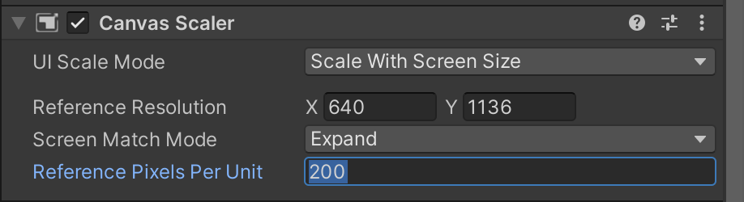

このままでは何も見た目は変わらないが、`Image` の **Set Native Size** ボタンを押すと `RectTransform` の `width` と `height` が `200` に変わり、見た目が大きくなる。

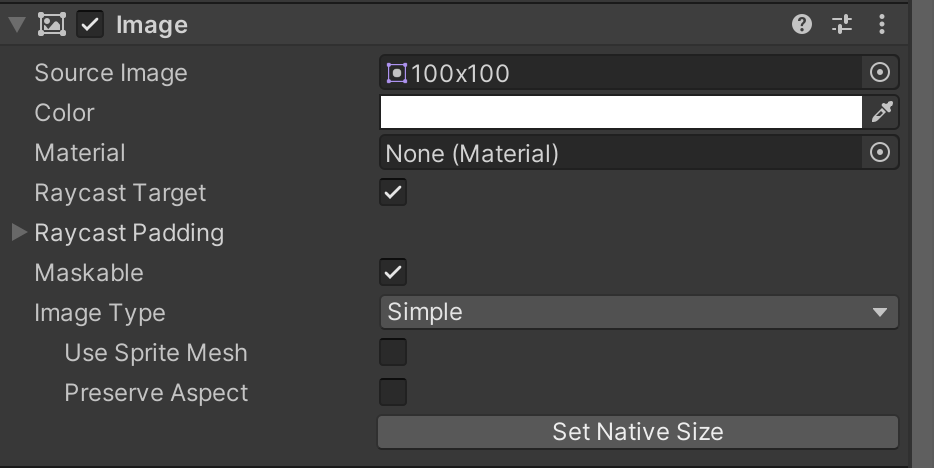

今度は、`Image` の `Sprite` アセットの **Pixels Per Unit** を `200` に設定して **Apply** ボタンを押す。

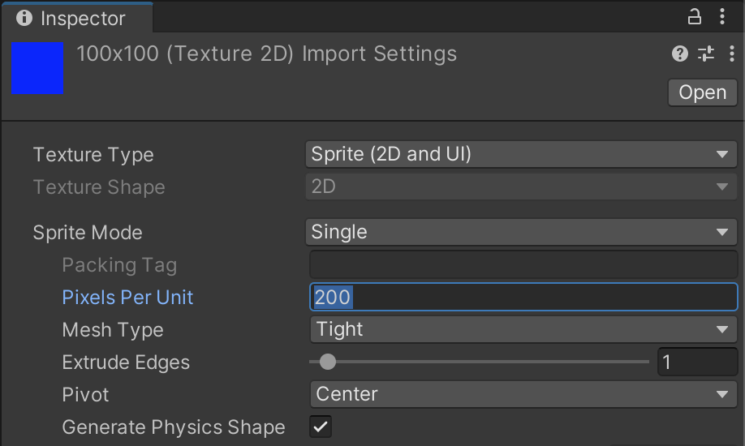

再び `Image` の **Set Native Size** ボタンを押すと `RectTransform` の `width` と `height` が 100 に変わって元の大きさに戻る。

更にこの状態で `CanvasScaler` の `referencePixelsPerUnit` を 100 に戻して `Image` の **Set Native Size** ボタンを押すと `RectTransform` の `width` と `height` が `50` になり半分のサイズになる。

## GraphicRaycaster コンポーネント

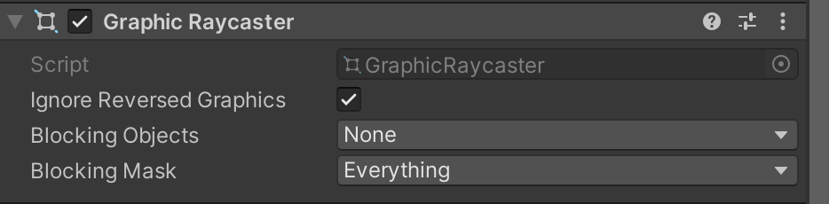

`GraphicRaycaster` はキャンバス上にある全ての `Graphic` を監視して、レイキャストがどれにヒットしたのかを調べる。もう少し具体的な言い方をすると、`GraphicRaycaster` は `EventSystem` からタッチイベントを受け取り、キャンバス内の UI 要素のどれがタッチされたのかを判定する。

詳細については *Chapter 10 EventSystem* の *GraphicRaycaster* の項で詳しく説明するが、ここでは **Inspector** に表示されている項目のみを簡単に説明する。

### Ignore Reversed Graphics

裏面を向いている UI 要素がヒットしても無視するかどうかを指定する。

デフォルト値は `true` である。

**World Space Canvas** で、キャンバスが裏返っている場合を想定してみよう。デフォルトでは UI 要素がタッチされても無視されるが、このプロパティが `false` に設定されていれば、裏面からタッチしても反応するようになる。

### Blocked Objects

レイキャストをブロックするオブジェクトのタイプを指定する。

デフォルト値は `None` なので、全てのレイキャストヒットが判定される（つまり、ブロックされない）。

`TwoD` であれば 2D Physics をブロックし、`ThreeD` であれば 3D Physics をブロックし、`All` であれば 2D Physics と 3D Physics の両方をブロックする。Canvas の下に 2D あるいは 3D オブジェクトが存在し、それらのタッチ判定を得るような画面で使うことになるだろう。

### Blocking Mask

`LayerMask` を利用して、どの `Layer` のオブジェクトのレイキャスト判定を行うかを指定する。

デフォルトでは全ての `Layer` が対象となる。

## CanvasGroup コンポーネント

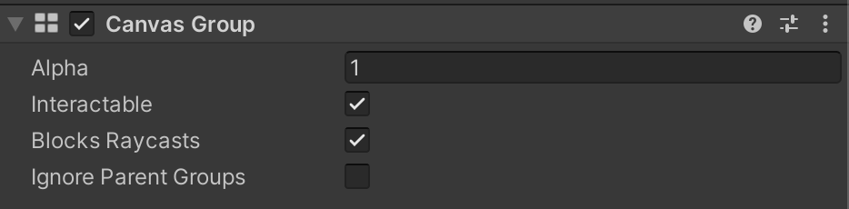

`CanvasGroup` は、配下の UI 要素全てに特定の影響を与えるための補助的なコンポーネントである。具体的には、配下の UI 要素全てのアルファ値とレイキャストと `interactable` を変更することができる。また、`CanvasGroup` はネストすることができる。

### CanvasGroup のプロパティ

#### alpha

```c#
public float alpha { get; set; }
```

グループ全体に適用するアルファ値（不透明度）を取得/設定する。

デフォルト値は `1` である。

実際には各 UI 要素の頂点カラーのアルファがこの値となる。アルファ値は掛け算になるので、描画に使われるアルファの値は `CanvasRenderer` の `GetAlpha()` で得られるアルファ値と、`Image` の `color` のアルファ値と、（もしあれば）マテリアルの **Tint** のアルファ値と、この `CanvasGroup` の `alpha` の 4 つを掛け合わせた結果になる。

特筆すべき点としては、`Image` の `color` のアルファ値やマテリアルの **Tint** のアルファ値が `0` であってもドローコールは発生するが、`CanvasGroup` の **Alpha** が `0` ならドローコールが発生しないことが挙げられる。このドローコール削減は `CanvasGroup` 側の機能である（と推定される）。一方、頂点カラーのアルファが全てゼロである UI 要素を（`Graphic` クラスを独自に拡張して）作成した場合には、ドローコールは発生する。

#### interactable

```c#
public bool interactable { get; set; }
```

このグループの（ボタンなどの）UI 要素が入力を受け付けるかどうかを取得/設定する。

デフォルト値は `true` であり、つまり入力に反応する。

#### blocksRaycasts

```c#
public bool blocksRaycasts { get; set; }
```

グループ全体をレイキャストの判定対象とするかどうかを取得/設定する。

デフォルト値は `true` であり、レイキャストの判定対象となる。

`interactable` と `blocksRaycasts` は似ているが動作は異なる。`interactable` が `false` の場合でもレイキャストヒット判定自体は行われるので、タッチされたボタンは無反応であってもそれ以上のレイキャスト判定は行われない。一方、`blocksRaycasts` が `false` の場合はレイキャストヒット判定が行われないので、その下に重なっているボタンは反応する。

#### ignoreParentGroups

```c#
public bool ignoreParentGroups { get; set; }
```

`CanvasGroup` が入れ子だった場合に、親の `CanvasGroup` の影響を無視するかどうかを取得/設定する。

デフォルト値は `false` であり、つまり親の `CanvasGroup` の `alpha`、`interactable`、`blockRaycasts` の設定の影響を受ける。

### CanvasGroup の public メソッド

#### IsRaycastLocationValid

```c#
public bool IsRaycastLocationValid (Vector2 sp, Camera eventCamera);
```

グループに対するレイキャスト判定を行う。

引数で与えられた `screenPoint` の位置でレイキャストヒットしたなら `true` を返す。

# Chapter 2 UI 要素と Canvas のリビルド

この章では `Canvas` の配下に置かれる UI 要素と、リビルドと呼ばれる `Canvas` のレイアウトおよびジオメトリの再構築処理について説明する。

`Canvas` 配下に存在する UI 要素の `GameObject` は以下の特徴を持っている。

1. `UIBehaviour` を継承したコンポーネントを持つ。

2. `Transform` を拡張した `RectTransform` を持つ。

3. 描画対象であれば `CanvasRenderer` を持つ。

まずは `UIBehaviour` について見ていこう。

## UIBehaviour クラス

```c#
public abstract class UIBehaviour : MonoBehaviour
```

`UIBehaviour` は UI 関連コンポーネントの共通動作を定義したコンポーネントである。`UIBehaviour` で定義されているメソッドは以下の通りである。

1. 基本的な `MonoBehaviour` のライフサイクル関連メソッド

    - `Awake()`
    - `OnEnable()`
    - `Start()`
    - `OnDisable()`
    - `OnDestroy()`

2. オブジェクトの生存判定用メソッド

    - `IsActive()`
    - `IsDestroyed()`

3. Editor 用メソッド

    - `OnValidate()`
    - `Reset()`

4. UI 要素固有の状態変化の際に呼ばれるメソッド

    - `OnRectTransformDimensionsChange()`
    - `OnBeforeTransformParentChanged()`
    - `OnTransformParentChanged()`
    - `OnDidApplyAnimationProperties()`
    - `OnCanvasGroupChanged()`
    - `OnCanvasHierarchyChanged()`

上記の「2. オブジェクトの生存判定用メソッド」以外の実装は空であり、継承した各コンポーネントで必要に応じて override されて実装されるので、実態としては `UIBehaviour` はインターフェースに近いクラスである。

次に、`UIBehaviour` を継承した UI 関連コンポーネントの継承関係を以下に示そう。

```
MonoBehaviour
    ← UIBehaviour
        ← EventSystem
        ← BaseInput
        ← BaseInputModule
        ← PointerInputModule
            ← StandaloneInputModule
    ← BaseRaycaster
        ← GraphicRaycaster
        ← PhysicsRaycaster
            ← Physics2DRaycaster
    ← Graphic
        ← MaskableGraphic
            ← Image
            ← RawImage
            ← Text
    ← Selectable
        ← Button
        ← Dropdown
        ← InputField
        ← Scrollbar
        ← Slider
        ← Toggle
    ← ScrollRect
    ← ToggleGroup
    ← BaseMeshEffect
        ← Shadow
            ← Outline
      ← PositionAsUV1
```

このように `Image` や `Text` や `Button` などの UI 要素だけではなく、`EventSystem` などのコンポーネントも `UIBehaviour` を継承していることがわかる。

### UIBehaviour のメソッド

#### OnRectTransformDimensionsChange

```c#
protected virtual void OnRectTransformDimensionsChange()
```

`RectTransform` のサイズが変わった際に呼ばれる。

`RectTransform` の `sizeDelta`、`offsetMax`、`offsetMin`、`anchorMax`、`anchorMin`、`pivot` を変更した際に呼ばれる可能性がある。

この後に、Layout リビルドが発生する可能性がある。Layout リビルドについては後述する。

#### OnBeforeTransformParentChanged

```c#
protected virtual void OnBeforeTransformParentChanged()
```

`SetParent()` などで親が変わる前に呼ばれる。

直接の親だけはなく、親の親などの上の階層が変わる前にも呼ばれる。`OnTransformParentChanged()` の項も参照のこと。

#### OnTransformParentChanged

```c#
protected virtual void OnTransformParentChanged()
```

`SetParent()` などで親が変わった際に呼ばれる。

直接の親だけはなく、親の親などの上の階層が変わった際にも呼ばれる。

以下のサンプルでは、`SetParent()` を呼んだ際に `OnBeforeTransformParentChanged()` と `OnTransformParentChanged()` が呼ばれ、前者が呼ばれた時点では親は変わっておらず、後者が呼ばれた時点では親が変わったことを確認することができる。

```c#
using UnityEngine;
using UnityEngine.EventSystems;

public class OnTransformParentChangedSample : UIBehaviour
{
    private Transform oldParent;

    // Inspector から設定しておく
    public Transform newParent;

    protected override void Start()
    {
        base.Start();

        if (transform.parent != null)
        {
            oldParent = transform.parent as RectTransform>;
        }

        transform.SetParent(newParent);
    }

    protected override void OnBeforeTransformParentChanged()
    {
        Debug.Log("OnBeforeTransformParentChanged IsParentOld? " + (transform.parent == oldParent) + ", IsParentNew? " + (transform.parent == newParent));
    }

    protected override void OnTransformParentChanged()
    {
        Debug.Log("OnTransformParentChanged IsParentOld? " + (transform.parent == oldParent) + ", IsParentNew? " + (transform.parent == newParent));
    }
}
```

*Console の出力結果*
```
OnBeforeTransformParentChanged IsParentOld? True, IsParentNew? False
OnTransformParentChanged IsParentOld? False, IsParentNew? True
```

#### OnDidApplyAnimationProperties

```c#
protected virtual void OnDidApplyAnimationProperties();
```

`Animation` や `Timeline` などのアニメーションによって何らかのプロパティが変更された際に呼び出される。

このメソッドが呼ばれた際にどのプロパティが変更されたのかは分からない。なので、`Graphic` コンポーネントは念のため Layout リビルドと Graphic リビルドの両方を行うようにしている。それによって余計な負荷が発生する可能性がある。uGUI で `Animation` や `Timeline` の利用が推奨されない理由がこれである。

#### OnCanvasGroupChanged

```c#
protected virtual void OnCanvasGroupChanged();
```

自身が属する `CanvasGroup` の `alpha`、`interactable`、`blocksRaycasts`、`ignoreParentGroups` が変更された際に呼ばれる。

### OnCanvasHierarchyChanged

```c#
protected virtual void OnCanvasHierarchyChanged();
```

自身が属する `Canvas` またはそれ以上の親 `Canvas` の `GameObject` のアクティブ/非アクティブが切り替わった際に呼ばれる。あるいは、自身が属する `Canvas` がサブ `Canvas` の場合に、その `Canvas` の `overrideSorting` が変更された際に呼ばれる。

## RectTransform コンポーネント

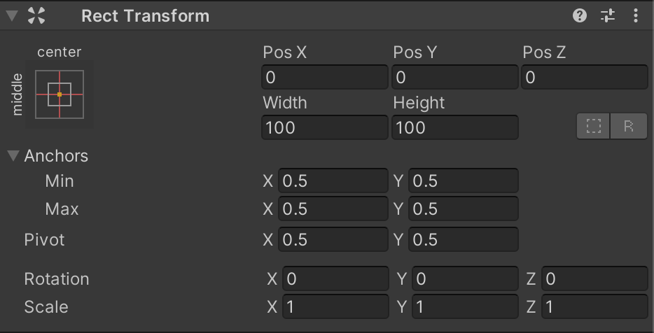

`RectTransform` コンポーネントは `Transform` のサブクラスであり、UI の レイアウトのために使われる。

Editor 上で `Canvas` 内に空のオブジェクトを作成した場合、`RectTransform` が自動的にアタッチされる。一方、スクリプトから `new GameObject()` でオブジェクトを生成して  親を `Canvas` あるいは UI 要素にしただけでは `RectTransform` はアタッチされない。その場合は `AddComponent<RectTransform>()` を呼んで明示的に `RectTransform` をアタッチするか、`Image` などのコンポーネントをアタッチする必要がある。

> `Image` の親クラス（正確には親の親クラス）である `Graphic` は `[RequireComponent(typeof(RectTransform))]` 属性を持っているので、アタッチすると自動的に `RectTransform` もアタッチされる。

スクリプトから `RectTransform` を取得する際は `GetComponent` 経由で

```c#
RectTransform rectTransform = GetComponent<RectTransform>();
```

で取得することが多いかもしれない。だが、`RectTransform` は `Transform` のサブクラスなので、実は

```c#
RectTransform rectTransform = transform as RectTransform;
```

のようにキャストして取得することも可能であり、こちらのほうが若干パフォーマンスが良い。

いずれにしても `RectTransform` の取得は CPU 時間を消費するので、メンバ変数などにキャッシュしておくことで無駄な CPU 利用を避けることができる。

### RectTransform のプロパティ

#### anchoredPosition / anchoredPosition3D

```c#
public Vector2 anchoredPosition { get; set; }
```

親からの相対的な位置を取得/設定する。

スクリプトリファレンスによれば「アンカー基準点に対する RectTransform の相対的なピボットの位置」となっている。これらは **Inspector** 上では `PosX` と `PosY` として表示されているので馴染みのある数値だろう。`anchoredPosition3D` は `anchoredPosition` を `Vector3` に変換し、Z としては `localPosition.z` を返すようになっている。

アンカーやピボットを変更した際には `anchoredPosition` の再計算が行われて値が変更される。

#### anchorMax / anchorMin

```c#
public Vector2 anchorMax { get; set; }
public Vector2 anchorMin { get; set; }
```

**アンカー** は「親から見た領域の四隅の位置」を示す数値である。

右上は `(anchorMax.x, anchorMax.y)` で表され、左下は `(anchorMin.x, anchorMin.y)` で表される。

デフォルトでは左上は `(0.5f, 0.5f)` で、右上も `(0.5f, 0.5f)` であり、親からの相対的な位置は中心となる。**Inspector** の 左上の四角をクリックして、**Anchor Preset** を選択するとわかりやすくなるだろう。

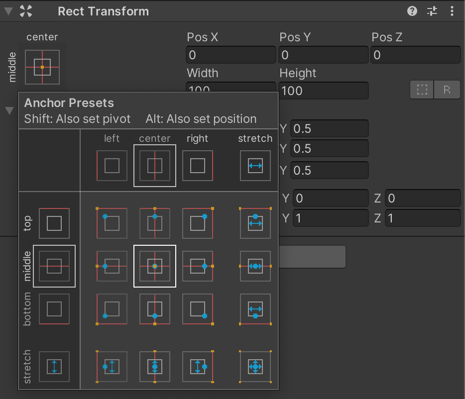

アンカーは、親からの相対的な位置を指定するための数値である。ヘッダーなどの画面上部に表示したい UI であれば親の上部からの距離を指定したいだろうし、フッターなどの画面下部に表示したい UI であれば親の下部からの距離を指定したくなるだろう。これらのアンカーを適切に設定することで、画面のアスペクト比が変わっても UI の位置が破綻させずに済む。

アンカーの上下方向は、上揃えの **top**、中心揃えの **middle**、下揃えの **bottom** の他に、引き伸ばしの **stretch** を指定できる。また、左右方向は同様に、左揃えの **left**、中心揃えの **center**、右揃えの **right** の他に引き伸ばしの **stretch** を指定できる。プリセットのいずれかを選択すると、**Inspector** で **anchorMax** と **anchorMin** に対応した数値が変更される。

**stretch** の場合、**Inspector** 上での表示が変わる。

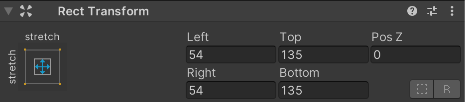

左右が **stretch** の場合、`PosX` の代わりに左端からの距離を示す `Left` が表示され、`Width` の代わりに右端からの距離を示す `Right` が表示される。また、上下が **strech** の場合、`PosY` の代わりに上端からの距離を表す `Top` が表示され、`Height` の代わりに下端からの距離を表す `Bottom` が表示される。。たとえば、`Left` と `Right` を `0` に設定すれば領域は左右いっぱいに広がり、`Bottom` と `Top` を 0 に設定すれば上下いっぱいに広がる。

#### pivot

```c#
public Vector2 pivot { get; set; }
```

回転の中心位置を取得/設定する。

デフォルト値は中心を表す `(0.5f, 0.5f)` となっている。

この値を `(0, 0)` に設定すれば回転の中心は左下になり、`(1, 1)` に設定すれば回転の中心は右上となる。

#### rect

```c#
public Rect rect { get; }
```

pivot からの矩形の左下の相対的な位置および幅と高さを取得する。

pivot が中心 `(0.5f, 0.5f)` に位置にあるのであれば、`x` は `width * -0.5f` となり、`y` は `rect.height` となる。rect の値を直接編集することは出来ない。スクリプトから幅や高さを変更したい場合には、`sizeDelta` を変更することになる。

#### sizeDelta

```c#
public Vector2 sizeDelta { get; set; }
```

矩形のサイズとアンカー間の距離の差を取得/設定する。

矩形のサイズとは、`(rect.width, rect.height)` で示される大きさである。

`x` アンカー間の距離は `anchorMax.x - anchorMin.x` であり、`y` アンカー間の距離は `anchorMax.y - anchorMin.y` である。つまり、アンカーの左右が **center** である（つまり `anchorMax.x = 0.5f かつ anchorMin.x = 0.5f`）ならば `x` アンカー間の距離は `0` となり、上下が **middle** である（`anchorMax.y = 0.5f` かつ `anchorMin.y = 0.5f`）ならば `y` アンカー間の距離は `0`　となる。

`x` アンカー間の距離が `0` であれば `sizeDelta.x` の値は `rect.width` と等しくなり、`y` アンカー間の距離が `0` であれば `sizeDelta.y` の値は `rect.height` と等しくなる。

さて、アンカー間の距離が `0` でない場合の例を考えてみよう。

`Canvas` の幅が `1280` ピクセルかつ 高さが `760` ピクセルの場合に、上下それぞれ `100` ピクセル、左右それぞれ `60` ピクセルの隙間を開けた **strech** なアンカーをもつ `RectTransform` を設定したと想定しよう。

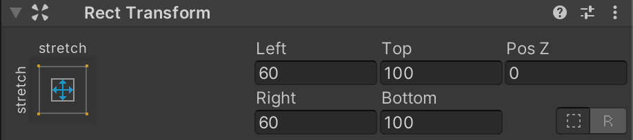

この場合、矩形のサイズは `(1280 - 60 - 60, 760 - 100 - 100) = (1160, 560)` となる。

アンカー間の距離は親の矩形の大きさとなり、この `RectTransform` と `Canvas` の間に **stretch** なアンカーが存在していないのであれば、アンカー間の距離は `Canvas` の大きさと等しくなるので、`(1160, 560)` となる。`sizeDelta` は矩形のサイズ - アンカー間の距離なので、`(1160, 560) - (1280, 760) = (-120, -200)` となる。

> **Inspector** から `sizeDelta` を見たい場合は、表示モードを **Debug** にすれば見ることができる。

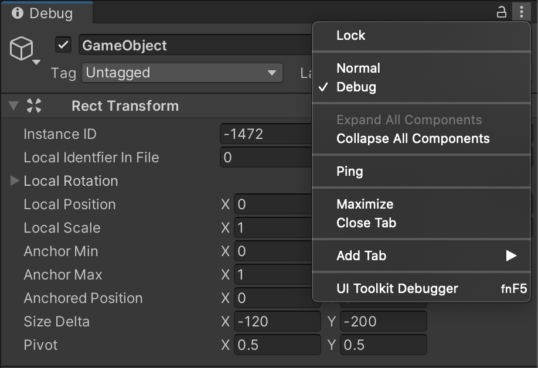

親の中に **stretch** なアンカーを持つ `RectTransform` が含まれている場合、アンカー間の距離はその `RectTransform` の矩形のサイズとなる。

```
アンカー間の距離 = (Inspector の RectTransform の Left) + rect.width + (Inspector の RectTransform の Right)
```

もし、矩形の幅や高さを変更したいのであれば rect ではなく sizeDelta を変更することになるが、アンカーが **stretch** の場合には上で説明したとおり取り扱いがややこしい。

- アンカーが **stretch** 以外の場合、`sizeDelta.x` は `rect.width` と一致し、`sizeDelta.y` は `rect.height` と一致する。

- アンカーが **stretch** の場合、`sizeDelta.x` は、`-1 * ((Inspector 上 の Left) + (Inspector 上 の Right))` となり、`sizeDeta.y` は `-1 * ((Inspector 上 の Top) + (Inspector 上 の Bottom))` となる。

#### offsetMax / offsetMin

```c#
public Vector2 offsetMax { get; set; }
```

`offsetMax` は「右上のアンカーを基準にした矩形の右上角のオフセット」であり、`offsetMin` は「左下のアンカーを基準にした矩形の左下角のオフセット」となっている。

これらの値は **Inspector** 上には直接表示されない。

`offsetMax` は

```c#
anchoredPosition + Vector2.Scale(sizeDelta, Vector2.one - pivot);
```

であり、`offsetMin` は

```c#
anchoredPosition - Vector2.Scale(sizeDelta, pivot);
```

と計算される。

なお、`Vector2.Scale` はそれぞれの `x`、`y` 成分を乗算したものを返す。

```c#
Vector2.Scale(a, b) =  new Vector(a.x * b.x, a.y * b.y);
```

`offsetMax` や `offsetMin` の値を変更した場合には `anchoredPosition` および `sizeDelta` が変更される。具体的には

`offsetMax` を変更した場合には

```c#
Vector2 vector = offsetMax - (anchoredPosition + Vector2.Scale(sizeDelta, Vector2.one - pivot));
sizeDelta += vector;
anchoredPosition += Vector2.Scale(vector, pivot);
```

となり、

`offsetMin` を変更した場合には

```c#
Vector2 vector = value - (anchoredPosition - Vector2.Scale(sizeDelta, pivot));
sizeDelta -= vector;
anchoredPosition += Vector2.Scale(vector, Vector2.one - pivot);
```

となる。

### RectTransform の public メソッド

#### ForceUpdateRectTransforms

```c#
public extern void ForceUpdateRectTransforms();
```

`RectTransforms` の内部データの再計算を強制する。

このメソッドを呼ぶと Canvas リビルドが発生する。

#### GetLocalCorners

```c#
public void GetLocalCorners(Vector3[] fourCornersArray);
```

ローカル座標での四隅の座標を取得する。

たとえば、`rect.size` が `(80, 100)` であると想定しよう。

この場合、pivot が `(0.5f, 0.5f)` であれば

```
(-40.0, -50.0, 0.0)
(-40.0, 50.0, 0.0)
(40.0, 50.0, 0.0)
(40.0, -50.0, 0.0)
```

の配列が返ってくる。

一方、pivot が `(0.0f, 0.0f)` であれば

```
(0.0, 0.0, 0.0)
(0.0, 100.0, 0.0)
(80.0, 100.0, 0.0)
(80.0, 0.0, 0.0)
```

の配列が返ってくる。

このプロパティはローカル座標なので、親の影響は受けない。

#### GetWorldCorners

```c#
public void GetWorldCorners(Vector3[] fourCornersArray);
```

ワールド座標での四隅の座標を取得する。

`GetLocalCorners()` の結果にワールド座標を加えた結果が返ってくることになる。

#### SetInsetAndSizeFromParentEdge

```c#
public void SetInsetAndSizeFromParentEdge(Edge edge, float inset, float size);
```

矩形の辺のいずれか 1 つを選び開始地点とサイズを指定することで、矩形のアンカーと位置とサイズを変更する。変更を適用するためには `edge` で縦軸と横軸それぞれを指定した呼び出しを 1 回ずつ行う必要がある。

ややこしいので、実際の例を見た方が分かりやすいだろう。

以下のコードを実行すると

```c#
var rectTransform = transform as RectTransform;
rectTransform.SetInsetAndSizeFromParentEdge(RectTransform.Edge.Top, 10, 100);
rectTransform.SetInsetAndSizeFromParentEdge(RectTransform.Edge.Left, 20, 200);
```

- アンカーが top/left
- Canvas の上端から `20` ピクセル下の位置から下へ高さ `100` ピクセル
- Canvas の左端から `10` ピクセル右の位置から右へ幅 `200` ピクセル

の矩形へと変更される。

今度は以下のコードを実行すると

```c#
var rectTransform = transform as RectTransform;
rectTransform.SetInsetAndSizeFromParentEdge(RectTransform.Edge.Bottom, 10, 100);
rectTransform.SetInsetAndSizeFromParentEdge(RectTransform.Edge.Right, 20, 200);
```

- アンカーが bottom/right
- Canvas の下端から `20` ピクセル上の位置から上へ高さ `100` ピクセル
- Canvas の右端から `10` ピクセル左の位置から左へ幅 `200` ピクセル

の矩形へと変更される。

#### SetSizeWithCurrentAnchors

```c#
public void SetSizeWithCurrentAnchors(Axis axis, float size);
```

現在のアンカーを保ったまま幅または高さを変更する。

たとえば、以下のコードはアンカーを変えずに幅を `200` ピクセルに変更する。

```c#
var rectTransform = transform as RectTransform;
rectTransform.SetSizeWithCurrentAnchors(RectTransform.Axis.Horizontal, 200);
```

### RectTransform のイベント

#### reapplyDrivenProperties

```c#
public static event ReapplyDrivenProperties reapplyDrivenProperties;
```

`RectTransform` のドリブンプロパティが再適用されるタイミングで呼ばれるコールバックである。実際には `GameObject` のアクティブを切り替えた際に呼ばれる。

ドリブンプロパティというのは Auto Layout などによって手動で編集することができない状態になっているプロパティのことである。ドリブンプロパティの詳細ついては *Chapter 9 Auto Layout* の *RectTransform のドリブンプロパティ* で説明する。

### RectTransform の Raw Edit モード

通常のモードでは、アンカーやピボットを変更すると（見た目場の位置は変わらないが）`anchoredPosition` やサイズが変更される。しかし、**Raw Edit モード** を有効にすると、ピボットやアンカーを変更しても位置やサイズが変更されなくなる。

**Raw Edit モード** を有効にするには、**Height** の右にある R と書かれたボタンを押せばよい。

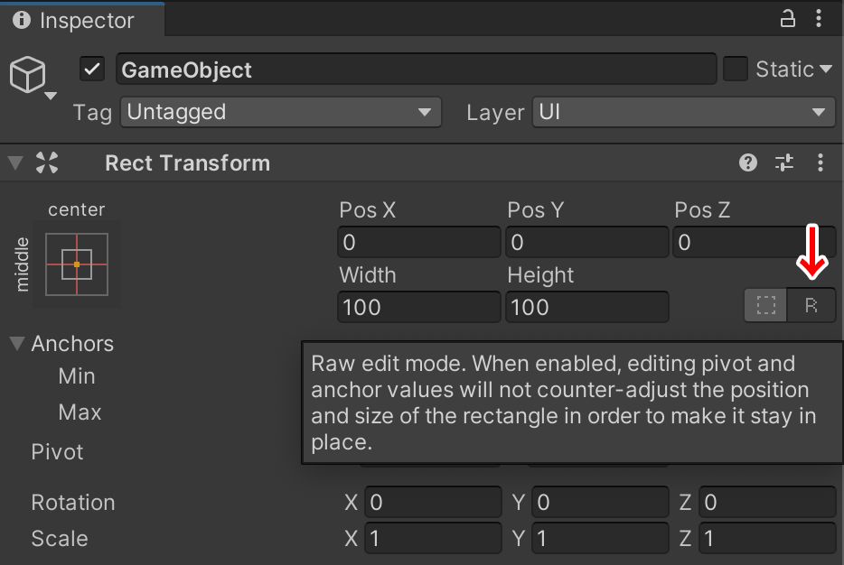

### RectTransform の Blue Print モード

**Rotation** や **Scale** を変更しても、**Rect Tool** を選択した状態での **SceneView** で元の矩形が分かるようになる。また、元の状態を使ったスナップ操作も有効となる。

**Rect Tool** は Edtior ウィンドウ右上の四角のボタンを押すと有効になる。**Blue Print モード** を有効にするには、**Height** の右にある点線の四角ボタンを押せばよい。

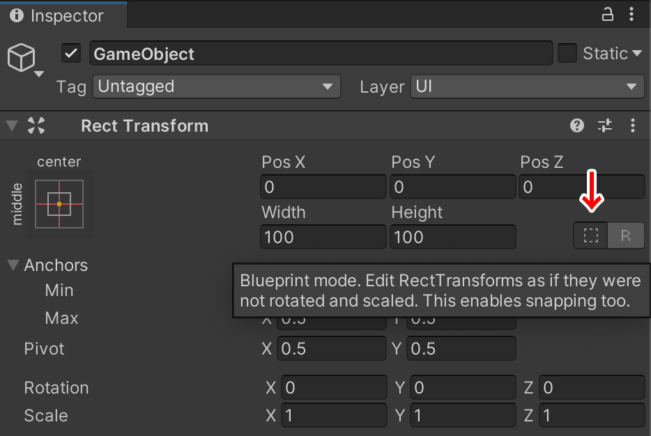

## スマートデバイスで可変解像度を実現する

一般的なスマートデバイス向けゲームのように、画面上部のヘッダー部分にプレイヤー情報、画面下部のフッター部分にメニューボタン、画面中央部にメインとなる情報が表示される UI を想定する。

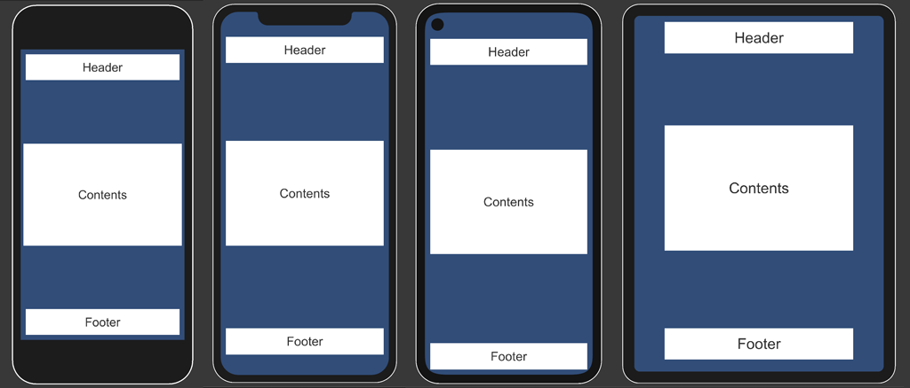

縦長スマートフォンで上下に黒枠が表示されたり、タブレット端末で左右に黒枠が表示されるのを避けようとすると、レイアウトを少々工夫しなくてはいけなくなる。また、iPhoneX 以降のノッチ（およびそれに付随するセーフエリア）に対応する必要も出てくるだろう。

ここでは縦持ちゲームを前提とするが、横持ちでも基本的な考えは同じである。

1. UI 配置基準となるデバイスを決める。今回は iPhone5（幅 640 x 高さ 1136）とする。

2. `CanvasScaler` の `referenceResolution` を `(640, 1136)` にする。

3. `CanvasScaler` の `scaleMode` を `ScaleWithScreenSize` にする。

4. `CanvasScaler` の `screenMatchMode` を `Expand` にする。これにより `referenceResolution` よりも横長の画像解像度なら左右に隙間が出来るようになる。

5. Canvas 直下に空のゲームオブジェクトを配置し、下記の `SafeAreaRect` をアタッチする。

6. `SafeAreaRect` の下に UI を配置する。
    - Header のアンカーは top/center（上揃え）
    - Contents のアンカーは middle/center（中揃え）
    - Footer のアンカーは bottom/center（下揃え）

    階層構造は以下のようになる。

    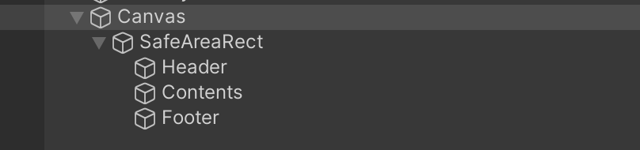

`SafeAreaRect` コンポーネントのソースコードを下に示す。

```c#
using UnityEngine;

[ExecuteAlways]
[RequireComponent(typeof(RectTransform))]
public class SafeAreaRect : MonoBehaviour
{
    private RectTransform rectTransform;
    private Canvas canvas;
    private Rect safeArea = new Rect(0, 0, 1, 1);

#if UNITY_EDITOR
    private void OnEnable()
    {
        UnityEditor.EditorApplication.update += UpdateSafeArea;
    }

    private void OnDisable()
    {
        UnityEditor.EditorApplication.update -= UpdateSafeArea;
    }

    // Editor 上で解像度がおかしい場合は false を返す
    private bool IsScreenResolutionCorrect()
    {
        if (canvas == null)
        {
            canvas = GetComponentInParent<Canvas>();
        }

        if (canvas.pixelRect.width == 0 || canvas.pixelRect.height == 0)
        {
            return false;
        }

        string[] editorScreenRes = UnityEditor.UnityStats.screenRes.Split('x');
        if (editorScreenRes.Length >= 2)
        {
            if (int.TryParse(editorScreenRes[0], out int editorScreenResWidth))
            {
                if (int.TryParse(editorScreenRes[1], out int editorScreenResHeight))
                {
                    if (Screen.width == editorScreenResWidth && Screen.height == editorScreenResHeight)
                    {
                        return true;
                    }
                }
            }
        }

        return false;
    }
#endif

    private void Update()
    {
        // ・一部の Android 端末では Start() 時でも Screen.safeArea が正しい値を返してこない可能性があるので、Update() 時に Screen.safeArea が変わっていないかをチェックしている。
        UpdateSafeArea();
    }

    private void UpdateSafeArea()
    {
#if UNITY_EDITOR
        if (!IsScreenResolutionCorrect())
        {
            return;
        }
#else
        if (safeArea == Screen.safeArea)
        {
            return;
        }
#endif
        if (canvas == null)
        {
            canvas = GetComponentInParent<Canvas>();
        }

        if (rectTransform == null)
        {
            rectTransform = transform as RectTransform>;
        }

        float anchorMinX = Screen.safeArea.position.x / canvas.pixelRect.width;
        float anchorMinY = Screen.safeArea.position.y / canvas.pixelRect.height;

        float anchorMaxX = (Screen.safeArea.position.x + Screen.safeArea.size.x) / canvas.pixelRect.width;
        float anchorMaxY = (Screen.safeArea.position.y + Screen.safeArea.size.y) / canvas.pixelRect.height;

        rectTransform.anchorMin = new Vector2(anchorMinX, anchorMinY);
        rectTransform.anchorMax = new Vector2(anchorMaxX, anchorMaxY);

        safeArea = Screen.safeArea;
    }
}
```

なお、ここでは `CanvasScaler` の `screenMatchMode` を `Expand` にしたが、
`MatchWidthOrHeight` にした上で `matchWidthOrHeight` を動的に変更すると `Expand` に似た挙動を実現することができる。

```c#
using UnityEngine;
using UnityEngine.UI;

[ExecuteAlways]
[RequireComponent(typeof(Canvas))]
public class SmartDeviceCanvasScaleHelper : MonoBehaviour
{
    // 例として iPhone 5 のピクセル数を基準とする
    [SerializeField] private float standardWidth = 640.0f;
    [SerializeField] private float standardHeight = 1136.0f;

    private CanvasScaler scaler;
    private Canvas canvas;

    private void Start()
    {
        UpdateScaler();
    }

#if UNITY_EDITOR
    private void OnEnable()
    {
        UnityEditor.EditorApplication.update += UpdateScaler;
    }

    private void OnDisable()
    {
        UnityEditor.EditorApplication.update -= UpdateScaler;
    }

    private void Update()
    {
        UpdateScaler();
    }
#endif

    private void UpdateScaler()
    {
        if (scaler == null)
        {
            scaler = GetComponent<CanvasScaler>();
            scaler.uiScaleMode = CanvasScaler.ScaleMode.ScaleWithScreenSize;
            scaler.referenceResolution = new Vector2(standardWidth, standardHeight);
            scaler.screenMatchMode = CanvasScaler.ScreenMatchMode.MatchWidthOrHeight;
        }

        if (canvas == null)
        {
            canvas = GetComponent<Canvas>();
        }

        if (canvas.pixelRect.width == 0 || canvas.pixelRect.height == 0)
        {
            return;
        }

        float standardAspectRatio = standardWidth / standardHeight;
        float currentAspectRatio = canvas.pixelRect.width / canvas.pixelRect.height;

        // 縦が短いデバイスはタブレット端末とみなす    
        if (currentAspectRatio > standardAspectRatio)
        {
            // 高さにマッチさせる（横に隙間が出来る）
            scaler.matchWidthOrHeight = 1;
        }
        else
        {
            // 幅にマッチさせる（縦に伸びる）
            scaler.matchWidthOrHeight = 0;
        }
    }    
}
```

この `CustomExpandCanvasScalerHelper` を `Canvas` にアタッチしてカスタマイズすることで、特定の端末だけ左右に隙間を開けたり、あるいは逆に縦に伸ばすようにすることができる。

## CanvasRenderer コンポーネント

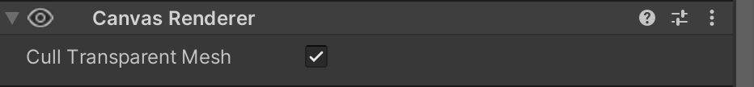

```c#
[NativeClass ("UI::CanvasRenderer")]
[NativeHeader ("Modules/UI/CanvasRenderer.h")]
public sealed class CanvasRenderer : Component
```

`CanvasRenderer` は `Canvas` 内に含まれる描画可能 UI 要素を描画するためのコンポーネントである。`CanvasRenderer` は C# ではなく C++ で書かれたネイティブコンポーネントなので、`UnityEngine.UI` ではなく `UnityEngine` 名前空間に属する。

直感に反して `CanvasRenderer` は `Renderer` のサブクラスではないのでキャストして変換することはできない。

```c#
/// エラー！
var canvasRenderer = GetComponent<Renderer>() as CanvasRenderer; 
```

`Image` などの UI 要素のコンポーネントは `CanvasRenderer` を便利に扱うためのコンポーネントにすぎない。`CanvasRenderer` を直接触ることで描画を制御することが可能である。

### CanvasRenderer のプロパティ

#### absoluteDepth

```c#
public int absoluteDepth { get; }
```

サブ `Canvas` も含めた `Canvas` ヒエラルキー内での `CanvasRenderer` の順番を取得する。

`Canvas` 直下で一番上の要素が `0`、その子あるいはその下が `1` といった形になる。ヒエラルキーの中に `CanvasRenderer` を持たない `GameObject` があっても、それはカウントされない。

サンプルの **Hierarchy** を以下に示す。

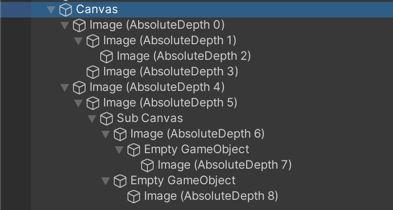

`GameObject` が非アクティブだったりして `Canvas` のレンダリング対象から外れている場合には、このプロパティは `-1` という値を返す。また、初回フレームが完了する前もこのプロパティは `-1` を返す。

> `absoluteDepth` の値は初回フレームから 1 フレーム経過しないと確定しないようなので、`Awake()` や `Start()` で参照すべきではない。

uGUI 組み込みの C# コード内では `Graphic.depth` 経由で `GraphicRaycaster` がこのプロパティを利用している。

#### relativeDepth

```c#
public int relativeDepth { get; }
```

この `CanvasRenderer` が属する `Canvas` ヒエラルキー内での `CanvasRenderer` の順番を返す。`Canvas` 直下で一番上の要素が `0`、その子あるいはその下が `1` といった形になる。ヒエラルキーの中に `CanvasRenderer` を持たない `GameObject` があっても、それはカウントされない。

サンプルの **Hierarchy** を以下に示す。

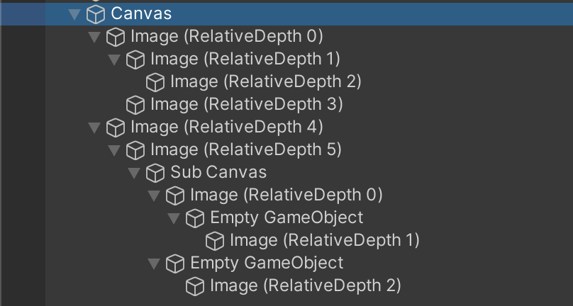

`GameObject` が非アクティブだったりして `Canvas` のレンダリング対象から外れている場合には、このプロパティは `-1` という値を返す。また、初回フレームが完了する前もこのプロパティは `-1` を返す。

> `absoluteDepth` と同様に `relativeDepth` の値も初回フレームから 1 フレーム経過しないと確定しないようなので、`Awake()` や `Start()` で参照すべきではない。

#### clippingSoftness

```c#
public Vector2 clippingSoftness { get; set; }
```

Unity 2020.1 から導入された `MaskableGraphic` の Soft Mask（端をぼかす機能）の範囲を取得/設定する。

この値が UI シェーダーの `_MaskSoftnessX` および `_MaskSoftnessY` に渡される。

#### cull

```c#
public bool cull { get; set; }
```

この `CanvasRenderer` が生成するジオメトリを無視するか（カリングするか）どうかを示す。

このプロパティに `true` を設定するとレンダリングされなくなる。その際にはドローコールも発生しない。

ただし、レイキャスト判定は生きているので、レンダリングがされなくてもタッチ判定は生き続けることに注意したい。

#### cullTransparentMesh

```c#
public bool cullTransparentMesh { get; set; }
```

メッシュの全ての頂点カラーのアルファが `0` であった場合にジオメトリを無視するかどうかを取得/設定する。

スクリプトからこのプロパティを `true` を設定すると、全頂点カラーのアルファが `0` の場合（たとえば、`Image` の `Color` プロパティのアルファが `0` の場合）にレンダリングされなくなる。その際にはドローコールも発生しない。

`cull` と同様に、レンダリングがされなくてもタッチ判定は生き続けることに注意したい。

#### hasMoved

```c#
public bool hasMoved { get; }
```

生成されたジオメトリの位置を無効にするような変化が起きた場合に `true` が返ってくる。

「生成されたジオメトリの位置を無効にするような変化」というのは、たとえば `anchoredPosition` の変更である。なお、サイズだけが変更された場合には `true` は返ってこない。

#### hasPopInstruction

```c#
public bool hasPopInstruction { get; set; }
```

子の UI 要素を全てレンダリングした後に `PopMaterial` を使って再度レンダリングするかどうかを取得/設定する。

デフォルト値は `false` である。

ステンシルマスクを利用する際に `Mask.GetModifiedMaterial()` 内で `true` に設定される。

#### hasRectClipping

```c#
public bool hasRectClipping { get; }
```

矩形のクリッピングが有効の場合に `true` が返ってくる。

クリッピングの有効/無効は `CanvasRenderer.EnableRectClipping()` および `CanvasRenderer.DisableRectClipping()` で切り替えられる。`RectMask2D` コンポーネントが `MaskableGraphic` 経由でこれらのメソッドを呼び出している。

#### materialCount

```c#
public int materialCount { get; set; }
```

`CanvasRenderer` が使用するマテリアルの数を取得/設定する。

#### popMaterialCount

```c#
public int popMaterialCount { get; set; }
```

pop 命令のために使うマテリアルの数を取得/設定する。

このプロパティはステンシルマスクを利用する際に `Mask.GetModifiedMaterial()` 内で `true` に設定される。

### CanvasRenderer の public メソッド

#### Clear

```c#
public void Clear();
```

内部にキャッシュされたすべての頂点を削除する。

`Graphic` クラスが `SetMesh` で設定したメッシュの頂点をクリアするために `OnDisable()` などから呼んでいる。

#### EnableRectClipping / DisableRectClipping

```c#
public void EnableRectClipping(Rect rect);
public void DisableRectClipping();
```

矩形クリッピングを有効/無効にする。

有効にすると、与えられた矩形の外側はレンダリングされなくなる。

特殊な使い方として、引数として `Rect.zero` を渡すことでこの `CanvasRenderer` を描画させなくさせることができる。これを解除するには `DisableRectClipping()` を呼べばよい。

#### SetColor / GetColor / SetAlpha / GetAlpha

```c#
public void SetColor(Color color);
public Color GetColor();
public void SetAlpha(float alpha);
public float GetAlpha();
```
カラー/アルファ値を設定または取得する。

ここで設定した色は `Graphic` クラスなどで設定された頂点カラーと乗算される。たとえば `Image` で出力される色は

```
(Image の Color) x (Image の Material の Tint カラー) x (CanvasRender の Color)
```

となる。

さらに、アルファ値の場合には `CanvasGroup` の `alpha` も乗算されることになる。
`CanvasRenderer` のアルファ値が `0` の場合にはドローコールは発生しない。

#### GetInheritedAlpha

```c#
public float GetInheritedAlpha();
```

全ての親の `CanvasGroup` のアルファ値を掛け合わせた結果の値を得る。

同一 `GameObject` に `CanvasGroup` がアタッチされていた場合には、そのアルファ値も対象となる。

例えば、自身のヒエラルキーの上に *CanvasGroup2* という親があり、さらにその親に *CanvasGroup1* が存在していたとする。

```
CanvasGroup1
    CanvasGroup2
        MyGameObject
```

この場合、`GetInheritedAlpha()` で得られる値は `(CanvasGroup1 の Alpha) * (CanvasGroup2 の Alpha)` となる。

#### SetMaterial / GetMaterial

```c#
public void SetMaterial(Material material, Texture texture);
public void SetMaterial(Material material, int index);
public Material GetMaterial(int index);
```

このレンダラーで使用するマテリアルを設定/取得する。

もしテクスチャが指定されているなら、このマテリアルの `MainTex` の代わりにそのテクスチャが使われる。

通常の `Renderer` では `material` プロパティにアクセスするとコピーしたインスタンスが生成されてしまうため、インスタンスの生成を防ぐために `sharedMaterial` を使うことがあるが、`CanvasRenderer` ではマテリアルへのアクセスによるコピーは発生しない。逆に言えば、`CanvasRenderer` の `material` は `sharedMaterial` のような挙動をするので、個別のシェーダープロパティ変更を行いたいのであれば、別のマテリアルを用意する必要がある。

#### SetPopMaterial / GetPopMaterial

```c#
public void SetPopMaterial(Material material, int index);
public Material GetPopMaterial(int index);
```

pop 命令のために使うマテリアルを設定/取得する。

このマテリアルはステンシルマスクを利用する際に使われる。

#### SetAlphaTexture

```c#
public void SetAlphaTexture(Texture texture);
```

シェーダーの `_AlphaTex` プロパティに設定されるアルファテクスチャを設定する。

画像フォーマットが ETC1 の場合に利用される。

#### SetMesh

```c#
public void SetMesh(Mesh mesh);
```

このレンダラーで使用する `Mesh` を設定する。

この `Mesh` は **read/write enabled** でなければならない。

#### SetTexture

```c#
public void SetTexture(Texture texture);
```

このレンダラーで使用するテクスチャを設定する。

ここで指定されたテクスチャは組み込み UI シェーダーの `_MainTex` プロパティに設定される。

`GetTexture()` メソッドは用意されていないので、テクスチャを取得するためには

- マテリアルが設定されているのであれば `GetMaterial().mainTexture` プロパティ
- マテリアルが設定されていないのであれば `Graphic` クラスの `mainTexture` プロパティ

で取得する必要がある。

### CanvasRenderer の static メソッド

#### AddUIVertexStream

```c#
public static void AddUIVertexStream (List<UIVertex> verts, List<Vector3> positions, List<Color32> colors, List<Vector4> uv0S, List<Vector4> uv1S, List<Vector3> normals, List<Vector4> tangents);

public static void AddUIVertexStream (List<UIVertex> verts, List<Vector3> positions, List<Color32> colors, List<Vector4> uv0S, List<Vector4> uv1S, List<Vector4> uv2S, List<Vector4> uv3S, List<Vector3> normals, List<Vector4> tangents);
```

頂点のリストを受け取り、頂点コンポーネントのリスト（`positions`, `colors`, `uv0s`, `uv1s`, `normals`, `tangents`）に分割する。`VertexHelper.AddUIVertexStream()` から呼ばれるためこのようなメソッド名になっていると思われる。

`AddUIVertexStream()` で得られた `m_Positions` を使って `Mesh` を初期化し、それを`CanvasRenderer.SetMesh()` に渡すことで描画が実現できる。

以下に `AddUIVertexStream()` を使って Canvas に描画するサンプルコードを示す。

```c#
using System.Collections.Generic;
using UnityEngine;

// CanvasRenderer に直接アクセスして Canvas に描画する
public class SetMeshToCanvasRendererSample : MonoBehaviour
{
    private void Start()
    {
        Canvas.willRenderCanvases += MyRebuild;
    }

    private void OnDestroy()
    {
        Canvas.willRenderCanvases -= MyRebuild;
    }

    // Graphic.Rebuild() と同じようなことをする
    void MyRebuild()
    {
        var canvasRenderer = gameObject.GetComponent<CanvasRenderer>();
        if (canvasRenderer == null)
        {
            canvasRenderer = gameObject.AddComponent<CanvasRenderer>();
        }

        // 描画したい頂点のリスト
        List<UIVertex> verts = new List<UIVertex>();
        verts.Add(new UIVertex
        {
            position = new Vector3(-50, -50, 0),
            uv0 = new Vector2(0, 0),
            color = new Color32(255, 0, 0, 255),
        });
        verts.Add(new UIVertex
        {
            position = new Vector3(-50, 50, 0),
            uv0 = new Vector2(0, 1),
            color = new Color32(0, 255, 0, 255),
        });
        verts.Add(new UIVertex
        {
            position = new Vector3(50, 50, 0),
            uv0 = new Vector2(1, 1),
            color = new Color32(0, 0, 255, 255),
        });

        // 描画したいインデックスのリスト
        List<int> indices = new List<int>();
        indices.Add(0);
        indices.Add(1);
        indices.Add(2);

        // AddUIVertexStream から受け取るリスト
        List<Vector3> positions = new List<Vector3>();
        List<Color32> colors = new List<Color32>();
        List<Vector2> uv0s = new List<Vector2>();
        List<Vector2> uv1s = new List<Vector2>();
        List<Vector2> uv2s = new List<Vector2>();
        List<Vector2> uv3s = new List<Vector2>();
        List<Vector3> normals = new List<Vector3>();
        List<Vector4> tangents = new List<Vector4>();

        // verts リストに分割する
        CanvasRenderer.AddUIVertexStream(verts, positions, colors, uv0s, uv1s, uv2s, uv3s, normals, tangents);

        // AddUIVertexStream から受け取ったリストから生成するメッシュ
        Mesh mesh = new Mesh();
        mesh.SetVertices(positions);
        mesh.SetColors(colors);
        mesh.SetUVs(0, uv0s);
        mesh.SetUVs(1, uv1s);
        mesh.SetUVs(2, uv2s);
        mesh.SetUVs(3, uv3s);
        mesh.SetNormals(normals);
        mesh.SetTangents(tangents);
        mesh.SetTriangles(indices, 0);
        mesh.RecalculateBounds();

        // CanvasRenderer に描画するメッシュを渡すことで描画が実現できる
        canvasRenderer.SetMesh(mesh);
        canvasRenderer.materialCount = 1;
        canvasRenderer.SetMaterial(Canvas.GetDefaultCanvasMaterial(), 0);
        canvasRenderer.SetColor(Color.white);
    }
}
```

#### CreateUIVertexStream

```c#
public static void CreateUIVertexStream (List<UIVertex> verts, List<Vector3> positions, List<Color32> colors, List<Vector2> uv0S, List<Vector2> uv1S, List<Vector3> normals, List<Vector4> tangents, List<int> indices);
```

`AddUIVertexStream` とは逆に、頂点コンポーネントのリスト（`positions`, `colors`, `uv0s`, `uv1s`, `normals`, `tangents`）とインデックスのリストを受け取って、頂点のリストを返す。

#### SplitUIVertexStreams

```c#
public static void SplitUIVertexStreams (List<UIVertex> verts, List<Vector3> positions, List<Color32> colors, List<Vector2> uv0S, List<Vector2> uv1S, List<Vector3> normals, List<Vector4> tangents, List<int> indices);
```

三角形の頂点のリストを受け取って、頂点コンポーネントのリストとインデックスのリストを返す。

渡す頂点の数は 3 で割り切れる必要がある。

### CanvasRenderer のイベント

#### onRequestRebuild

```c#
public static event OnRequestRebuild onRequestRebuild;
```

`CanvasRenderer` のデータが無効になったり、リビルドが必要になった際に呼ばれる。

このイベントは Editor でのみ有効である。例えば、アセットが再インポートされた場合にこのイベントが発生する。このイベントは `UnityEngine.UI.GraphicRebuildTracker` クラスで使われており、`CanvasRenderer` のデータが無効になった際に全ての `Graphic` に対して `MonoBehaviour.OnValidate()` を呼んでいる。

```c#
using UnityEngine;

// テクスチャなどのアセットが再インポートされて CanvasRenderer のデータが無効になったことを検出する。
[ExecuteAlways]
public class CanvasRendererOnRequestRebuild : MonoBehaviour
{
#if UNITY_EDITOR
    void Start()
    {
        CanvasRenderer.onRequestRebuild += OnRebuildRequested;
    }

    private void OnDestroy()
    {
        CanvasRenderer.onRequestRebuild -= OnRebuildRequested;
    }

    public static void OnRebuildRequested()
    {
        Debug.Log("CanvasRenderer のデータが無効になりました");
        // この際に、全ての Graphic に対して MonoBehaviour.OnValidate() を呼んだりする
    }
#endif
}
```

## Graphic 関連コンポーネント

`Graphic` クラスは C# で実装された uGUI の描画対象クラス全てのベースクラスである。

```c#
[DisallowMultipleComponent]
[RequireComponent(typeof(RectTransform))]
[ExecuteAlways]
public abstract class Graphic : UIBehaviour, ICanvasElement
```

`Graphic` を継承したコンポーネントとしては `RawImage`、`Image`、`Text` が挙げられる（実際にはこれらは `Graphic` の子クラスの `MaskableGraphic` の子クラスである）。一方、`Button` や `Slider` や `ScrollRect` などは `Graphic` 系コンポーネントではない。

`Graphic` の主な機能は、描画されるジオメトリを Canvas に提供することである。また、`Graphic` クラスの子クラスとして実装されているほとんどのコンポーネントは `MaskableGraphic` サブクラス経由で実装されているため、マスクする（＝クリッピングしたり、ステンシルでマスクしたりする）ことも可能となっている。

`Graphic` コンポーネントについては *Chapter 4 Graphic* で詳しく説明する。

## Canvas リビルド

Canvas リビルドとは

「Canvas が配下の UI 要素のレイアウトとジオメトリを再構成してレンダリングの準備を行う処理」

のことである。

Canvas リビルドは、`CanvasUpdateRegistry` クラスによる Layout リビルドおよび Graphic リビルド、そして Canvas のバッチビルドから構成される。さらに、Graphic リビルドはダーティとマークされた Geometry の再作成および Material の再設定から構成される。

Canvas リビルドで行われる処理をまとめると以下のようになる。

- `CanvasUpdateRegistry` によるリビルド
    - Layout リビルド（位置の調整）
    - Graphic リビルド（頂点とマテリアルの再作成）
        - ダーティとマークされた Geometry の再作成
        - ダーティとマークされた Material の再設定
- Canvas のバッチビルド（Canvas 全体の頂点の再作成）

Layout リビルドと Graphic リビルドは、`CanvasUpdateRegistry` が `ICanvasElement` インターフェースを実装したコンポーネントの `Rebuild()` を呼ぶことで行われる。

一方、Canvas のバッチビルドは、Canvas 内の UI 要素の頂点をまとめることでドローコールおよび SetPass を減らすためのバッチング処理であり、ゲームエンジンのネイティブ側で行われる。

Canvas リビルドは非常に負荷の高い処理なので、頻度と処理内容を減らすことが重要である。

### CanvasUpdateRegistry によるリビルド

`CanvasUpdateRegistry` によるリビルドは `CanvasUpdateRegistry` が `ICanvasElement` インターフェースを実装したコンポーネントの `Rebuild()` を呼ぶことで行われる。

`CanvasUpdateRegistry` によるリビルドは C# で書かれているので詳しく追っていくことができる。まずは、このリビルドの対象となるコンポーネントが実装している `ICanvasElement` インターフェースについて見ていこう。

#### ICanvasElement

`ICanvasElement` インターフェースは、リビルドの対象になるコンポーネントが実装するためのインターフェースである。

以下に `ICanvasElement` の定義を示す。

*Packages/com.unity.ugui/Runtime/UI/CanvasUpdateRegistry.cs*
```c#
public interface ICanvasElement
{
    /// <summary>
    /// 要素に対して特定のステージのリビルドを行う。
    /// </summary>
    /// <param name="executing">リビルドのステージ</param>
    void Rebuild(CanvasUpdate executing);

    /// <summary>
    /// ICanvasElement に関連付けられた transform を取得する。
    /// </summary>
    Transform transform { get; }

    /// <summary>
    /// この ICanvasElement が Layout リビルドを完了した際に呼ばれるコールバック。
    /// </summary>
    void LayoutComplete();

    /// <summary>
    /// この ICanvasElement が Graphic リビルドを完了した際に呼ばれるコールバック。
    /// </summary>
    void GraphicUpdateComplete();

    /// <summary>
    /// このオブジェクトのネイティブ側の実体が破棄されたかどうかを確認するために使われる。
    /// </summary>
    /// <returns>この要素が破棄されたのであれば true を返す</returns>
    bool IsDestroyed();
}
```

`ICanvasElement` インターフェース実装しているコンポーネントとしては `Graphic`、`Slider`、`ScrollRect` などが挙げられる。`Button` や `Dropdown` などは `ICanvasElement` インターフェースを実装していないので、Canvas リビルドの対象とはならない。

また、`LayoutRebuilder` という Layout のためのヘルパークラスも `ICanvasElement` を実装している。Layout リビルドが必要な UI 要素は、自身の `RectTransform` を `LayoutRebuilder.MarkLayoutForRebuild()` で登録しておくと Layout リビルドの際に `Requild()` が呼ばれるようになる。

#### CanvasUpdateRegistry 

```c#
public class CanvasUpdateRegistry
```

`CanvasUpdateRegistry` は、リビルドが必要な `ICanvasElement` を追跡し、`Canvas` が `willRenderCanvases` イベントを発生させた際に個々の要素に更新を促すためのクラスである。

`CanvasUpdateRegistry` は Layout リビルドが必要な UI 要素と Graphic リビルドが必要な UI 要素を以下のようにそれぞれ別に管理している。

*Packages/com.unity.ugui/Runtime/UI/Core/CanvasUpdateRegistry.cs*
```c#
public class CanvasUpdateRegistry
{
    ...
    // Layout リビルドの対象の UI 要素のリスト
    private readonly IndexedSet<ICanvasElement> m_LayoutRebuildQueue = new IndexedSet<ICanvasElement>();

    // Graphic リビルドの対象の UI 要素のリスト
    private readonly IndexedSet<ICanvasElement> m_GraphicRebuildQueue = new IndexedSet<ICanvasElement>();
    ...
```

> Graphic リビルドという名前になっているが、Graphic リビルドの対象となり得るのは `Graphic` コンポーネントに限らず、`ICanvasElement` を実装したコンポーネント全てである。実際、`Graphic` クラスを継承していない `InputField` コンポーネントも Graphic リビルドの対象となっている。

`CanvasUpdateRegistry` で重要なメソッドは `PerformUpdate()` である。`PerformUpdate()` が Layout リビルドおよび Graphic リビルドの本体である。`PerformUpdate()` は 毎フレーム発生する `Canvas.WillRenderCanvases` イベントのタイミングで呼ばれる。

ここで、Profiler で **Deep Profile** を有効にして `CanvasUpdateRegistry.PerformUpdate` がどのような経緯で呼ばれているのかを見てみよう。

```
PlayerLoop
    PostLateUpdate.PlayerUpdateCanvases
        UIEvents.WillRenderCanvases
            UGUI.Rendering.UpdateBatches
                Canvas.SendWillRenderCanvases
                    CanvasUpdateRegistry.PerformUpdate
```

`PlayerLoop` の `PostLateUpdate.PlayerUpdateCanvases` から `Canvas.SendWillRenderCanvases()` を経て `CanvasUpdateRegistry.PerformUpdate()` が呼ばれているのが確認できるだろう。

`CanvasUpdateRegistry.PerformUpdate()` の呼び出しは以下のように `Canvas.willRenderCanvases` へのイベント追加で実現されている。

*Packages/com.unity.ugui/Runtime/UI/Core/CanvasUpdateRegistry.cs*
```c#:
/// <summary>
/// CanvasElements がリビルドのために自身を登録するクラス
/// </summary>
public class CanvasUpdateRegistry
{
    ...
    protected CanvasUpdateRegistry()
    {
        Canvas.willRenderCanvases += PerformUpdate;
    }        
    ...
    private void PerformUpdate()
    {
        /// 実際のリビルド処理
    ...
```

ここでちょっと脇道にそれて、大元の `PostLateUpdate.PlayerUpdateCanvases` という呼び出しがどういうタイミングなのかについて調べてみよう。

#### Unity の PlayerLoop

Unity 2018.1 から `PlayerLoop` という、毎フレーム行われる処理の順番を制御することができる機構が登場した。この `PlayerLoop` の中身をチェックすることにより、uGUI の内部処理がどのタイミングで呼ばれているのかを確認することができる。

`UnityEngine.PlayerLoop` 名前空間には PlayerLoop の各フェーズを表す構造体が存在している。`UnityEngine.LowLevel.PlayerLoop.GetDefaultPlayerLoop()` を呼ぶと PlayerLoop に定義されているフェーズ（サブシステム）の配列を得ることができる。

```c#
// 定義済みの PlayerLoop をログに出力する。
public void DumpAllPlayerLoopSubSystems()
{
    UnityEngine.LowLevel.PlayerLoopSystem[] subSystemList1 = UnityEngine.LowLevel.PlayerLoop.GetDefaultPlayerLoop().subSystemList;
    for (int i = 0; i < subSystemList1.Length; i++)
    {
        UnityEngine.LowLevel.PlayerLoopSystem[] subSystemList2 = subSystemList1[i].subSystemList;

        for (int j = 0; j < subSystemList2.Length; j++)
        {
            Debug.LogFormat("{0} {1} {2} {3}", i, j, subSystemList1[i].ToString(), subSystemList2[j].ToString());
        }
    }
}
```

*Console の出力*
```
0 0 TimeUpdate WaitForLastPresentationAndUpdateTime
1 0 Initialization UpdateCameraMotionVectors
1 1 Initialization DirectorSampleTime
1 2 Initialization AsyncUploadTimeSlicedUpdate
1 3 Initialization SynchronizeInputs
1 4 Initialization SynchronizeState
1 5 Initialization XREarlyUpdate
2 0 EarlyUpdate PollPlayerConnection
2 1 EarlyUpdate ProfilerStartFrame
2 2 EarlyUpdate GpuTimestamp
2 3 EarlyUpdate AnalyticsCoreStatsUpdate
2 4 EarlyUpdate UnityWebRequestUpdate
2 5 EarlyUpdate ExecuteMainThreadJobs
2 6 EarlyUpdate ProcessMouseInWindow
2 7 EarlyUpdate ClearIntermediateRenderers
2 8 EarlyUpdate ClearLines
2 9 EarlyUpdate PresentBeforeUpdate
2 10 EarlyUpdate ResetFrameStatsAfterPresent
2 11 EarlyUpdate UpdateAsyncReadbackManager
2 12 EarlyUpdate UpdateStreamingManager
2 13 EarlyUpdate UpdateTextureStreamingManager
2 14 EarlyUpdate UpdatePreloading
2 15 EarlyUpdate RendererNotifyInvisible
2 16 EarlyUpdate PlayerCleanupCachedData
2 17 EarlyUpdate UpdateMainGameViewRect
2 18 EarlyUpdate UpdateCanvasRectTransform
2 19 EarlyUpdate XRUpdate
2 20 EarlyUpdate UpdateInputManager
2 21 EarlyUpdate ProcessRemoteInput
2 22 EarlyUpdate ScriptRunDelayedStartupFrame
2 23 EarlyUpdate UpdateKinect
2 24 EarlyUpdate DeliverIosPlatformEvents
2 25 EarlyUpdate ARCoreUpdate
2 26 EarlyUpdate DispatchEventQueueEvents
2 27 EarlyUpdate PhysicsResetInterpolatedTransformPosition
2 28 EarlyUpdate SpriteAtlasManagerUpdate
2 29 EarlyUpdate PerformanceAnalyticsUpdate
3 0 FixedUpdate ClearLines
3 1 FixedUpdate NewInputFixedUpdate
3 2 FixedUpdate DirectorFixedSampleTime
3 3 FixedUpdate AudioFixedUpdate
3 4 FixedUpdate ScriptRunBehaviourFixedUpdate
3 5 FixedUpdate DirectorFixedUpdate
3 6 FixedUpdate LegacyFixedAnimationUpdate
3 7 FixedUpdate XRFixedUpdate
3 8 FixedUpdate PhysicsFixedUpdate
3 9 FixedUpdate Physics2DFixedUpdate
3 10 FixedUpdate PhysicsClothFixedUpdate
3 11 FixedUpdate DirectorFixedUpdatePostPhysics
3 12 FixedUpdate ScriptRunDelayedFixedFrameRate
4 0 PreUpdate PhysicsUpdate
4 1 PreUpdate Physics2DUpdate
4 2 PreUpdate CheckTexFieldInput
4 3 PreUpdate IMGUISendQueuedEvents
4 4 PreUpdate NewInputUpdate
4 5 PreUpdate SendMouseEvents
4 6 PreUpdate AIUpdate
4 7 PreUpdate WindUpdate
4 8 PreUpdate UpdateVideo
5 0 Update ScriptRunBehaviourUpdate
5 1 Update ScriptRunDelayedDynamicFrameRate
5 2 Update ScriptRunDelayedTasks
5 3 Update DirectorUpdate
6 0 PreLateUpdate AIUpdatePostScript
6 1 PreLateUpdate DirectorUpdateAnimationBegin
6 2 PreLateUpdate LegacyAnimationUpdate
6 3 PreLateUpdate DirectorUpdateAnimationEnd
6 4 PreLateUpdate DirectorDeferredEvaluate
6 5 PreLateUpdate UIElementsUpdatePanels
6 6 PreLateUpdate EndGraphicsJobsAfterScriptUpdate
6 7 PreLateUpdate ConstraintManagerUpdate
6 8 PreLateUpdate ParticleSystemBeginUpdateAll
6 9 PreLateUpdate Physics2DLateUpdate
6 10 PreLateUpdate ScriptRunBehaviourLateUpdate
7 0 PostLateUpdate PlayerSendFrameStarted
7 1 PostLateUpdate DirectorLateUpdate
7 2 PostLateUpdate ScriptRunDelayedDynamicFrameRate
7 3 PostLateUpdate PhysicsSkinnedClothBeginUpdate
7 4 PostLateUpdate UpdateRectTransform
7 5 PostLateUpdate PlayerUpdateCanvases
7 6 PostLateUpdate UpdateAudio
7 7 PostLateUpdate VFXUpdate
7 8 PostLateUpdate ParticleSystemEndUpdateAll
7 9 PostLateUpdate EndGraphicsJobsAfterScriptLateUpdate
7 10 PostLateUpdate UpdateCustomRenderTextures
7 11 PostLateUpdate UpdateAllRenderers
7 12 PostLateUpdate UpdateLightProbeProxyVolumes
7 13 PostLateUpdate EnlightenRuntimeUpdate
7 14 PostLateUpdate UpdateAllSkinnedMeshes
7 15 PostLateUpdate ProcessWebSendMessages
7 16 PostLateUpdate SortingGroupsUpdate
7 17 PostLateUpdate UpdateVideoTextures
7 18 PostLateUpdate UpdateVideo
7 19 PostLateUpdate DirectorRenderImage
7 20 PostLateUpdate PlayerEmitCanvasGeometry
7 21 PostLateUpdate PhysicsSkinnedClothFinishUpdate
7 22 PostLateUpdate FinishFrameRendering
7 23 PostLateUpdate BatchModeUpdate
7 24 PostLateUpdate PlayerSendFrameComplete
7 25 PostLateUpdate UpdateCaptureScreenshot
7 26 PostLateUpdate PresentAfterDraw
7 27 PostLateUpdate ClearImmediateRenderers
7 28 PostLateUpdate PlayerSendFramePostPresent
7 29 PostLateUpdate UpdateResolution
7 30 PostLateUpdate InputEndFrame
7 31 PostLateUpdate TriggerEndOfFrameCallbacks
7 32 PostLateUpdate GUIClearEvents
7 33 PostLateUpdate ShaderHandleErrors
7 34 PostLateUpdate ResetInputAxis
7 35 PostLateUpdate ThreadedLoadingDebug
7 36 PostLateUpdate ProfilerSynchronizeStats
7 37 PostLateUpdate MemoryFrameMaintenance
7 38 PostLateUpdate ExecuteGameCenterCallbacks
7 39 PostLateUpdate ProfilerEndFrame
```

上記のフェーズは上から順に毎フレーム実行される。
`PostLateUpdate.PlayerUpdateCanvases` は

```
7 5 PostLateUpdate PlayerUpdateCanvases
```

となっているので、Canvas リビルドはフレーム中ではかなり遅めのフェーズで実行されることがわかる。

#### CanvasUpdateRegistry.PerformUpdate()

`CanvasUpdateRegistry.PerformUpdate()` は Graphic リビルドおよび Layout リビルドの実体である。このメソッドはリビルド対象の UI 要素があろうとなかろうと必ず毎フレーム呼ばれる。このメソッドは 3 つのステップを実行する。

1. Layout リビルド：Layout がダーティとなっているコンポーネントのリストの要素に対して Layout の前処理/実処理/後処理を行う。

2. Clipping のカリング ： `RectMask2D` などの `Clipping` コンポーネント全てに対して `ClipperRegistry.Cull()` を呼んでカリング処理を行う。

3. Graphic リビルド：ジオメトリがダーティとなっているコンポーネントのリストの要素に対してレンダリング前処理を行う。

`Canvas` のリビルドには複数のステージが存在する。これは `CanvasUpdate` 列挙型として定義されている。

*Packages/com.unity.ugui/Runtime/UI/Core/CanvasUpdateRegistry.cs*
```c#
namespace UnityEngine.UI
{
    public enum CanvasUpdate
    {
        /// <summary>
        /// レイアウト処理の前に呼ばれる
        /// </summary>
        Prelayout = 0,

        /// <summary>
        /// レイアウト処理のために呼ばれる
        /// </summary>
        Layout = 1,

        /// <summary>
        /// レイアウト処理の後に呼ばれる
        /// </summary>
        PostLayout = 2,

        /// <summary>
        /// レンダリングの前に呼ばれる
        /// </summary>
        PreRender = 3,

        /// <summary>
        /// レンダリングの前に PreRender の後に呼ばれる
        /// </summary>
        LatePreRender = 4,

        /// <summary>
        /// enum の最大値
        /// </summary>
        MaxUpdateValue = 5
        ...
```

`CanvasUpdate` を `ICanvasElement.Rebuild()` に引数として渡すことでリビルドの各ステージを実行するように各 UI 要素に指示する。

*Packages/com.unity.ugui/Runtime/UI/Core/CanvasUpdateRegistry.cs*
```c#
public interface ICanvasElement
{
    /// <summary>
    /// 各ステージごとに要素をリビルドする
    /// </summary>
    /// <param name="executing">リビルドしようとしている現在の CanvasUpdate ステージ</param>
    void Rebuild(CanvasUpdate executing);
```

Layout リビルドは `PreLayout`、`Layout`、`PostLayout` の 3 つのステージで行われる。一方、Graphic リビルドは `PreRender` と `LatePreRender` の 2 つのステージで行われる。

Layout リビルド完了時には `ICanvasElement.LayoutComplete()`　が呼ばれ、Graphic リビルド完了時には `ICanvasElement.GraphicUpdateComplete()` が呼ばれるようになっている。

#### Layout リビルド

Layout リビルドは、対象の UI 要素を含むヒエラルキー内の全ての `RectTransform` を調整する処理である。Layout リビルドの処理の大半は Auto Layout 関連なので Auto Layout を使っていないのであればそれほど負荷は高くないものの、Layout リビルド対象の UI 要素の数が多いと負荷を無視できなくなる。
Layout リビルドは `PreLayout`、`Layout`、`PostLayout` の 3 つのステージで行われる。

Layout リビルドが発生するのは、`ICanvasElement` を実装した UI 要素が自身の Layout がダーティだと判断した場合である。「自身の Layout がダーティ」となる条件はコンポーネントごとに異なっている。たとえば `Graphic` 関連コンポーネントの場合、自身の Layout がダーティとなる条件は以下のようになっている。

- `RectTransform` のサイズが変更された。
    （`OnRectTransformDimensionsChange()` が呼ばれた）

- コンポーネントの有効/無効が変更された。
    （`OnEnable()` か `OnDisable()` が呼ばれた）

- 親が変更された。
    （`OnBeforeTransformParentChanged()` が呼ばれた）

- `Animation` や `Timeline` によってプロパティが変更された。
    （`OnDidApplyAnimationProperties()` が呼ばれた）

- `Image` の `sprite` が変更された。

- `Text` の `text` が変更された。

- `Text` の フォント、フォントサイズ、フォントテクスチャが変更された。

- `Text` の各種表示設定が変更された。
    （`alignment`、`lineSpacing`、`WrapMode`、`fontStyle` など）

Layout がダーティとなった UI 要素は、`CanvasUpdateRegistry` の `RegisterCanvasElementForLayoutRebuild()` に自身を渡す。

```c#
public static void RegisterCanvasElementForLayoutRebuild(ICanvasElement element);
```

これによって、`CanvasUpdateRegistry` が管理しているダーティな Layout のリストに自身が追加される。

コンポーネントの適切な位置とサイズを再計算するためには、ヒエラルキーの順に応じてレイアウトを調整する必要がある。親コンポーネントは、子や孫のコンポーネントの位置やサイズを変更する可能性があるので、位置やサイズを先に計算しなければならない。このため、Layout がダーティーとされたコンポーネントはヒエラルキー内の深さによってソートされる。ヒエラルキー内で上位の UI 要素はリストの先に移動される。

このソートされたリストの要素に対して、`ICanvasElement.Rebuild()` を引数 `CanvasUpdate.Prelayout`、`CanvasUpdate.Layout`、`CanvasUpdate.PostLayout` で呼び出すことで Layout リビルドが行われる。

Layout リビルドが完了すると `CanvasUpdateRegistry` が各 UI 要素に対して `ICanvasElement.LayoutComplete()` を呼ぶ。

#### Graphic リビルド

Graphic リビルドは、UI 要素自身のジオメトリ（≒頂点）情報やマテリアルを変更する処理である。Graphic リビルドは `PreRender` と `LatePreRender` の 2 つのステージで行われる。Graphic リビルドで何らかの処理を行っているコンポーネントは `Graphic` と `InputField` のみである。以下では `Graphic` コンポーネントを中心に解説していく。

`Graphic` コンポーネントにおいて Graphic リビルドが発生するのは自身のジオメトリあるいはマテリアルがダーティだと判断した場合である。

ジオメトリがダーティとなる条件は以下の通りである。

- `RectTransform` のサイズが変更された。
    （`OnRectTransformDimensionsChange()` が呼ばれた）

- `color` が変更された。

- 親が変更された。
    （`OnBeforeTransformParentChanged()` が呼ばれた）

- コンポーネントが有効になった。
    （`OnEnable()` が呼ばれた）

- `Animation` や `Timeline` によってプロパティが変更された。
    （`OnDidApplyAnimationProperties()` が呼ばれた）

- `RawImage` の `texture` が変更された。

- `RawImage` の `uvRect` が変更された。

- `Image` の `sprite` または `overrideSprite` が変更された。

- `Image` の 各種表示設定が変更された。
    （`type`、`preserveAspect`、`fillMethod`、`useSpriteMesh`、

- `Text` の `text` が変更された。

- `Text` の フォント、フォントサイズ、フォントテクスチャが変更された。

- `Text` の各種表示設定が変更された。
    （`alignment`、`lineSpacing`、`WrapMode`、`fontStyle` など）

マテリアルがダーティとなる条件は以下の通りである。

- `material` が変更された。

- 親が変更された。
    （`OnBeforeTransformParentChanged()` が呼ばれた）

- コンポーネントが有効になった。
    （`OnEnable()` が呼ばれた）

- `Animation` や `Timeline` によってプロパティが変更された。
    （`OnDidApplyAnimationProperties()` が呼ばれた）

- `Image` の `sprite` が変更された。

- `Text` の フォント、フォントテクスチャが変更された。

ジオメトリかマテリアルがダーティである場合、Graphic リビルドが行われることになる。`CanvasUpdateRegistry.PerformUpdate()` の `PreRender` ステージで `Graphic.Rebuild()` が呼ばれると以下の 2 つの処理が行われる。

1. ジオメトリがダーティならメッシュをリビルドする。`OnPopulateMesh()` が呼ばれて頂点が再作成され、MeshEffect が適用され、`CanvasRenderer.SetMesh()` でこの UI 要素のメッシュが `CanvasRenderer` に渡される。

2. マテリアルがダーティーなら `CanvasRenderer` のマテリアルを更新する。`CanvasRenderer` の `materialCount` が `1` に設定され、`CanvasRenderer.SetMaterial()` と `CanvasRenderer.SetTexture()` でマテリアルとテクスチャが設定される。

### Canvas のバッチビルド

ここまでは `CanvasUpdateRegistry` による Layout ビルド および Graphic リビルドを見てきた。今度は Canvas リビルドのもう 1 つの仕組みである Canvas のバッチビルドについて説明する。

UI を表示するためには、スクリーンに表示される UI コンポーネントに対応するジオメトリを作成しなければならない。この処理には、一つのメッシュに出来るだけ多くのジオメトリを統合してドローコールを最小限にする処理が含まれる。

Canvas 内の描画可能な UI 要素が変更された場合、Canvas はバッチビルド処理を再度実行しなければならない。この処理は Canvas 内の描画可能な UI 要素を、それらが変更されているかどうかに関わらず全て再度分析する。ここで言う変更というのは UI オブジェクトの見た目に影響する全ての変更であり、`CanvasUpdateRegistry` による Layout リビルドや Graphic リビルドとは限らない。

たとえば、Auto Layout の対象ではない UI 要素の `RectTransform` の `anchoredPosition` を変更しただけでは Layout リビルドも Graphic リビルドも発生しないが、表示する頂点の位置は変わるので Canvas のバッチビルドを行う必要がある。

Canvas のバッチリビルドでは、UI 要素のメッシュを結合してグラフィックスパイプラインに送るレンダリングコマンドが生成される。この処理の結果はキャッシュされ、Canvas がダーティになるまで再利用される。なお、サブ Canvas に含まれている `CanvasRenderer` は、この Canvas のバッチのリビルドの対象外である。

バッチを行うために深度によるメッシュのソートを行ったりマテリアルでのソートを行う必要があるが、このソート処理はメインスレッドとは別の `Canvas.GeometryJob` という Job として実行される。

### Canvas リビルドの一旦まとめ

ここで一旦、UI 要素でよく行われる操作と、Layout リビルド / Graphic リビルド / Canvas バッチビルドの発生可否を以下にまとめる。

| 　 | Layout リビルド | Graphic リビルド（ジオメトリ) | Graphic リビルド（マテリアル） | Canvas バッチビルド |
| ---- | ---- | ---- | ---- | ---- |
| 位置/スケールの変更（Auto Layout 無し） | - | - | - |  ○ | 
| 位置/スケールの変更（Auto Layout 有り） | ○ | - | - |  ○ | 
| サイズの変更（Auto Layout 無し） | - | ○ | - |  ○ | 
| サイズの変更（Auto Layout 有り） | ○ | ○ | - |  ○ | 
| コンポーネントの有効/無効切替 | ○ | ○ | ○ | ○ |
| text の変更 | - | - | △ | ○ |
| color の変更 | - | - | ○ | ○ |
| Animation や Timeline | ○ | ○ | ○ | ○ |

○ が発生を示す。

このように、コンポーネントの有効/無効の切り替え（および `GameObject` のアクティブ/非アクティブ切り替え）と `Animation` や `Timeline` によるプロパティ変更は特に Canvas リビルドの負荷が高い。なので、これらを避けるべきだろう。具体的には以下の回避策を取ることができる。

1. UI の表示/非表示を切り替える場合、`GameObject` の `SetActive()` を使うのではなく `localScale` を `Vector3.one` または `Vector3.zero` に変更ことで行う。詳細は *Chapter 3 レンダリング* の *UI 要素の表示/非表示の切替* で説明する。

2. UI の見た目の大きさだけを変えたい場合、`RectTransform` の `sizeDelta` ではなく `localScale` の変更を行う。

3. `Animation` や `Timeline` を使って UI のアニメーションを行わない。**DOTween** などの Tween ライブラリを使ってスクリプトから必要なプロパティだけを編集するようにしたほうが良い。

4. Auto Layout （の Layout Group）を使わない。Layout Group ではなく `RectTransform` のアンカー を活用することで目的のレイアウトを実現できることもある。また、Editor 上での配置の際でのみ Auto Layout を使って配置情報を得て、実行時には Auto Layout を使わないという方法もある。

パフォーマンスを向上させるためには最低限これらの対応を取る必要があるが、それでもまだ改善すべき点が多数存在する。以降はさらに Canvas リビルドの負荷を減らすためのテクニックについて説明しよう。

### UI 要素の数を減らす

Canvas で描画する UI 要素の数が多い場合、バッチビルドの計算自体が非常に負荷が高くなる可能性がある。なぜなら、UI 要素のソートと計算のコストが UI 要素の数に対して線形よりも激しく増加するからである。なので、単純なことであるが UI 要素の数を減らすことが効果的である。

### サブ Canvas への分割

Canvas をサブ Canvas へ適切に分割することでパフォーマンスを向上させることができる。サブ Canvas というのは Canvas コンポーネントの中にネストされた子 Canvas のことを指す。

Canvas の一部を分割してサブ Canvas にすることで、Layout リビルドおよびバッチビルドのの影響範囲を減らすことができる。子 Canvas で Layout リビルドやバッチビルドが必要になったとしても、親 Canvas には影響しない。逆に、親 Canvas でLayout リビルドやバッチビルドが必要になったとしても子 Canvas には影響しない。ただし例外として、親 Canvas へ行った変更によって子キャンバスのサイズ変更が行われることがある。

Canvas を複数のサブ Canvas に分割するのはよく行われる最適化手法である。これは、UI の特定部分を他の部分と別の深さにしなければならない場合に最もよく使われる。一般的には、全く別の Canvas を作成するよりもサブ Canvas を作成したほうが便利である。というのも、サブ Canvas は、表示設定を親 Canvas から引き継ぐからである。

ただし、サブ Canvas に分割し過ぎるとレンダリングバッチが途切れてドローコールが増え、パフォーマンスは悪化してしまう。リビルドの影響範囲の最小化とバッチによるドローコールの削減のバランスを考慮して Canvas を分割しなければならない。

よくある分割方法は、背景画像などのような静的な UI 要素を配置する Canvas と頻繁に変更される動的な UI 要素を配置する Canvas の 2 つを用意することである。もし、動的な要素が非常に多いのであれば、さらに動的な要素を分割して定期的に変更されるもの（プログレスバー、タイマー、アニメーションするもの）と、たまに変更されるものに分けても良いかもしれない。現実的には Canvas は 3 個程度で十分足りるだろう。

### CanvasRenderer の代わりに SpriteRenderer を使う

これまで見てきたように、頻繁にアニメーションする描画要素を `CanvasRenderer` で描画すると Canvas リビルドによってパフォーマンスが悪化する。よって、他の手法を選択することになるが、そこで選択肢として上がるのが `SpriteRenderer` である。

`CanvasRenderer` の代わりに `SpriteRenderer` を使う場合、いくつかの注意点がある

- `CanvasRenderer` での描画と異なり、`SpriteRenderer` での描画は自動でバッチングはしてくれない。マテリアルが異なるとバッチが分断されることに注意する。

- 位置や大きさを `Camera` に合わせて適切に変換する必要がある。

- `SpriteRenderer` を表示する `Camera` の *Projection* を *Orthographic* に設定する。

もともと `Image` などで描画されていた画像を `SpriteRnderer` で置き換える場合、`SpriteRenderer` の位置や大きさを元の `Image` に一致させるためにはちょっとした計算が必要であり、その計算方法は `Canvas` の `renderMode` や `CanvasScaler` の `uiScaleMode` の設定などに依存する。かなりパターンが多くてややこしいので、以下に計算のためのメソッドを用意した。

```c#
using UnityEngine;
using UnityEngine.UI;

public class CanvasToSpriteUtils : MonoBehaviour
{
    // srcImage の場所に一致するように targetSpriteCamera の下に Sprite を作成する
    public static Sprite CreateSpriteForImage(Image srcImage, Camera spriteCamera)
    {
        var go = new GameObject(srcImage.name + "_sprite");
        go.transform.SetParent(spriteCamera.transform, false);

        var spriteRenderer = go.AddComponent<SpriteRenderer>();
        var targetRectTransform = srcImage.transform as RectTransform>;

        var sprite = srcImage.sprite;
        if (sprite == null)
        {
            // Sprite.Create() は非常に重いので注意
            sprite = Sprite.Create((Texture2D)srcImage.mainTexture, new Rect(0, 0, 1, 1), new Vector2(0.5f, 0.5f));
        }

        spriteRenderer.sprite = sprite;
        spriteRenderer.color = srcImage.color;

        SetSpriteTransformByRectTransform(spriteRenderer, spriteCamera, targetRectTransform);

        return sprite;
    }

    // spriteCamera に映る spriteRender の位置/大きさを rectTransform と同じ位置/大きさにする
    public static void SetSpriteTransformByRectTransform(SpriteRenderer spriteRenderer, Camera spriteCamera, RectTransform rectTransform)
    {
        var canvas = rectTransform.GetComponentInParent<Canvas>();
        canvas.worldCamera.orthographic = true;

        switch (canvas.renderMode)
        {
            case RenderMode.ScreenSpaceOverlay:
                SetSpriteTransformByRectTransformScreenSpaceOverlay(spriteRenderer, spriteCamera, rectTransform, canvas);
                break;

            case RenderMode.ScreenSpaceCamera:
                SetSpriteTransformByRectTransformScreenSpaceCamera(spriteRenderer, spriteCamera, rectTransform, canvas);
                break;

            case RenderMode.WorldSpace:
                SetSpriteTransformByRectTransformWorldSpace(spriteRenderer, spriteCamera, rectTransform, canvas);
                break;
        }
    }

    public static void SetSpriteTransformByRectTransformScreenSpaceOverlay(SpriteRenderer spriteRenderer, Camera spriteCamera, RectTransform rectTransform, Canvas canvas)
    {
        Sprite sprite = spriteRenderer.sprite;
        float positionRate = 1.0f;
        float scaleRate = 1.0f;
        Vector3 canvasScale = canvas.GetComponent<RectTransform>().localScale;
        var canvasScaler = canvas.GetComponent<CanvasScaler>();
        float refX = canvasScaler.referenceResolution.x;
        float refY = canvasScaler.referenceResolution.y;
        float canvasW = canvas.pixelRect.width;
        float canvasH = canvas.pixelRect.height;
        float spritePPU = sprite.pixelsPerUnit;
        float spriteW = sprite.rect.width;
        float spriteH = sprite.rect.height;
        float srcX = rectTransform.position.x;
        float srcY = rectTransform.position.y;
        float baseX = (srcX / canvasW - 0.5f) * canvasW;
        float baseY = (srcY / canvasH - 0.5f) * canvasH;
        float overlayBaseRate = 2.0f / canvasH * spriteCamera.orthographicSize;
        const float spriteOffsetZ = 1;

        switch (canvasScaler.uiScaleMode)
        {
            case CanvasScaler.ScaleMode.ConstantPixelSize:
                positionRate = overlayBaseRate;
                scaleRate = positionRate * (spritePPU / spriteW);
                break;

            case CanvasScaler.ScaleMode.ConstantPhysicalSize:
                float unitScaleRate = 1.0f;
                float dpi = Screen.dpi;
                if (dpi == 0)
                {
                    dpi = canvasScaler.fallbackScreenDPI;
                }

                switch (canvasScaler.physicalUnit)
                {
                    case CanvasScaler.Unit.Points:
                        unitScaleRate = 72.0f / dpi;
                        break;

                    case CanvasScaler.Unit.Inches:
                        unitScaleRate = 1.0f / dpi;
                        break;

                    case CanvasScaler.Unit.Centimeters:
                        unitScaleRate = 1.0f / dpi * 2.54f;
                        break;

                    case CanvasScaler.Unit.Millimeters:
                        unitScaleRate = 1.0f / dpi * 2.54f * 10.0f;
                        break;

                    case CanvasScaler.Unit.Picas:
                        unitScaleRate = 1.0f / dpi * 6.0f;
                        break;
                }

                positionRate = overlayBaseRate * canvasScale.x * unitScaleRate;
                scaleRate = positionRate * (spritePPU / spriteW) / unitScaleRate;
                break;

            case CanvasScaler.ScaleMode.ScaleWithScreenSize:
                switch (canvasScaler.screenMatchMode)
                {
                    case CanvasScaler.ScreenMatchMode.MatchWidthOrHeight:
                        float lerpValue = Mathf.Pow(2, canvasScaler.matchWidthOrHeight) - 1;
                        positionRate = Mathf.Lerp(overlayBaseRate * canvasScale.x * refX / canvasW,
                             overlayBaseRate * canvasScale.y * refY / canvasH,
                            lerpValue);
                        scaleRate = Mathf.Lerp(positionRate * (spritePPU / spriteW) * canvasW / refX,
                                               positionRate * (spritePPU / spriteH) * canvasH / refY,
                                               canvasScaler.matchWidthOrHeight);
                        break;

                    case CanvasScaler.ScreenMatchMode.Expand:
                        if (canvasW / canvasH < refX / refY)
                        {
                            positionRate = overlayBaseRate * canvasScale.x * refX / canvasW;
                            scaleRate = positionRate * (spritePPU / spriteW) * canvasW / refX;
                        }
                        else
                        {
                            positionRate = overlayBaseRate * canvasScale.y * refY / canvasH;
                            scaleRate = positionRate * (spritePPU / spriteH) * canvasH / refY;
                        }
                        break;

                    case CanvasScaler.ScreenMatchMode.Shrink:
                        if (canvasW / canvasH < refX / refY)
                        {
                            positionRate = overlayBaseRate * canvasScale.y * refY / canvasH;
                            scaleRate = positionRate * (spritePPU / spriteH) * canvasH / refY;
                        }
                        else
                        {
                            positionRate = overlayBaseRate * canvasScale.x * refX / canvasW;
                            scaleRate = positionRate * (spritePPU / spriteW) * canvasW / refX;
                        }
                        break;
                }
                break;
        }

        spriteRenderer.transform.localPosition = new Vector3(baseX * positionRate / spriteCamera.transform.localScale.x,
            baseY * positionRate / spriteCamera.transform.localScale.y, spriteOffsetZ);
        spriteRenderer.transform.localRotation = rectTransform.transform.localRotation;
        spriteRenderer.transform.localScale = new Vector3(rectTransform.rect.width * scaleRate / spriteCamera.transform.localScale.x,
            rectTransform.rect.height * scaleRate / spriteCamera.transform.localScale.y, 1);
    }

    public static void SetSpriteTransformByRectTransformScreenSpaceCamera(SpriteRenderer spriteRenderer, Camera spriteCamera, RectTransform rectTransform, Canvas canvas)
    {
        Sprite sprite = spriteRenderer.sprite;
        float positionRate = 1.0f;
        float scaleRate = 1.0f;
        Vector3 canvasScale = canvas.GetComponent<RectTransform>().localScale;
        var canvasScaler = canvas.GetComponent<CanvasScaler>();
        float refX = canvasScaler.referenceResolution.x;
        float refY = canvasScaler.referenceResolution.y;
        float canvasW = canvas.pixelRect.width;
        float canvasH = canvas.pixelRect.height;
        float spritePPU = sprite.pixelsPerUnit;
        float spriteW = sprite.rect.width;
        float spriteH = sprite.rect.height;
        Vector3 srcScreenPos = RectTransformUtility.WorldToScreenPoint(canvas.worldCamera, rectTransform.position);
        float srcX = srcScreenPos.x;
        float srcY = srcScreenPos.y;
        float baseX = (srcX / canvasW - 0.5f) * canvasW;
        float baseY = (srcY / canvasH - 0.5f) * canvasH;
        const float spriteOffsetZ = 1;

        switch (canvasScaler.uiScaleMode)
        {
            case CanvasScaler.ScaleMode.ConstantPixelSize:
                positionRate = canvasScale.x;
                scaleRate = positionRate * (spritePPU / spriteW);
                break;

            case CanvasScaler.ScaleMode.ConstantPhysicalSize:
                float unitScaleRate = 1.0f;
                float dpi = Screen.dpi;
                if (dpi == 0)
                {
                    dpi = canvasScaler.fallbackScreenDPI;
                }

                switch (canvasScaler.physicalUnit)
                {
                    case CanvasScaler.Unit.Points:
                        unitScaleRate = 72.0f / dpi;
                        break;

                    case CanvasScaler.Unit.Inches:
                        unitScaleRate = 1.0f / dpi;
                        break;

                    case CanvasScaler.Unit.Centimeters:
                        unitScaleRate = 1.0f / dpi * 2.54f;
                        break;

                    case CanvasScaler.Unit.Millimeters:
                        unitScaleRate = 1.0f / dpi * 2.54f * 10.0f;
                        break;

                    case CanvasScaler.Unit.Picas:
                        unitScaleRate = 1.0f / dpi * 6.0f;
                        break;
                }

                positionRate = canvasScale.x * unitScaleRate;
                scaleRate = positionRate * (spritePPU / spriteW) / unitScaleRate;
                break;

            case CanvasScaler.ScaleMode.ScaleWithScreenSize:
                switch (canvasScaler.screenMatchMode)
                {
                    case CanvasScaler.ScreenMatchMode.MatchWidthOrHeight:
                        float lerpValue = Mathf.Pow(2, canvasScaler.matchWidthOrHeight) - 1;
                        positionRate = Mathf.Lerp(canvasScale.x * refX / canvasW, canvasScale.y * refY / canvasH, lerpValue);
                        scaleRate = Mathf.Lerp(positionRate * (spritePPU / spriteW) * canvasW / refX,
                                               positionRate * (spritePPU / spriteH) * canvasH / refY,
                                               canvasScaler.matchWidthOrHeight);
                        break;

                    case CanvasScaler.ScreenMatchMode.Expand:
                        if (canvasW / canvasH < refX / refY)
                        {
                            positionRate = canvasScale.x * refX / canvasW;
                            scaleRate = positionRate * (spritePPU / spriteW) * canvasW / refX;
                        }
                        else
                        {
                            positionRate = canvasScale.y * refY / canvasH;
                            scaleRate = positionRate * (spritePPU / spriteH) * canvasH / refY;
                        }
                        break;

                    case CanvasScaler.ScreenMatchMode.Shrink:
                        if (canvasW / canvasH < refX / refY)
                        {
                            positionRate = canvasScale.y * refY / canvasH;
                            scaleRate = positionRate * (spritePPU / spriteH) * canvasH / refY;
                        }
                        else
                        {
                            positionRate = canvasScale.x * refX / canvasW;
                            scaleRate = positionRate * (spritePPU / spriteW) * canvasW / refX;
                        }
                        break;
                }
                break;
        }

        spriteRenderer.transform.localPosition = new Vector3(baseX * positionRate / spriteCamera.transform.localScale.x,
            baseY * positionRate / spriteCamera.transform.localScale.y, spriteOffsetZ);
        spriteRenderer.transform.localRotation = rectTransform.transform.localRotation;
        spriteRenderer.transform.localScale = new Vector3(rectTransform.rect.width * scaleRate / spriteCamera.transform.localScale.x,
            rectTransform.rect.height * scaleRate / spriteCamera.transform.localScale.y, 1);
    }

    public static void SetSpriteTransformByRectTransformWorldSpace(SpriteRenderer spriteRenderer, Camera spriteCamera, RectTransform rectTransform, Canvas canvas = null)
    {
        Sprite sprite = spriteRenderer.sprite;
        float positionRate = 1.0f;
        float scaleRate = 1.0f;
        Vector3 canvasScale = canvas.GetComponent<RectTransform>().localScale;
        var canvasScaler = canvas.GetComponent<CanvasScaler>();
        float refX = canvasScaler.referenceResolution.x;
        float refY = canvasScaler.referenceResolution.y;
        float canvasW = canvas.pixelRect.width;
        float canvasH = canvas.pixelRect.height;
        float spritePPU = sprite.pixelsPerUnit;
        float spriteW = sprite.rect.width;
        float spriteH = sprite.rect.height;
        Vector3 srcScreenPos = RectTransformUtility.WorldToScreenPoint(canvas.worldCamera, rectTransform.position);
        float srcX = srcScreenPos.x;
        float srcY = srcScreenPos.y;
        float baseX = (srcX / canvasW - 0.5f) * canvasW;
        float baseY = (srcY / canvasH - 0.5f) * canvasH;
        const float spriteOffsetZ = 1;

        switch (canvasScaler.uiScaleMode)
        {
            case CanvasScaler.ScaleMode.ConstantPixelSize:
                positionRate = canvasScale.x;
                scaleRate = positionRate * (spritePPU / spriteW);
                break;

            case CanvasScaler.ScaleMode.ConstantPhysicalSize:
                float unitScaleRate = 1.0f;
                float dpi = Screen.dpi;
                if (dpi == 0)
                {
                    dpi = canvasScaler.fallbackScreenDPI;
                }

                switch (canvasScaler.physicalUnit)
                {
                    case CanvasScaler.Unit.Points:
                        unitScaleRate = 72.0f / dpi;
                        break;

                    case CanvasScaler.Unit.Inches:
                        unitScaleRate = 1.0f / dpi;
                        break;

                    case CanvasScaler.Unit.Centimeters:
                        unitScaleRate = 1.0f / dpi * 2.54f;
                        break;

                    case CanvasScaler.Unit.Millimeters:
                        unitScaleRate = 1.0f / dpi * 2.54f * 10.0f;
                        break;

                    case CanvasScaler.Unit.Picas:
                        unitScaleRate = 1.0f / dpi * 6.0f;
                        break;
                }

                positionRate = canvasScale.x * unitScaleRate;
                scaleRate = positionRate * (spritePPU / spriteW) / unitScaleRate;
                break;

            case CanvasScaler.ScaleMode.ScaleWithScreenSize:
                switch (canvasScaler.screenMatchMode)
                {
                    case CanvasScaler.ScreenMatchMode.MatchWidthOrHeight:
                        float lerpValue = Mathf.Pow(2, canvasScaler.matchWidthOrHeight) - 1;
                        positionRate = Mathf.Lerp(canvasScale.x * refX / canvasW, canvasScale.y * refY / canvasH, lerpValue);
                        scaleRate = Mathf.Lerp(positionRate * (spritePPU / spriteW) * canvasW / refX,
                                               positionRate * (spritePPU / spriteH) * canvasH / refY,
                                               canvasScaler.matchWidthOrHeight);
                        break;

                    case CanvasScaler.ScreenMatchMode.Expand:
                        if (canvasW / canvasH < refX / refY)
                        {
                            positionRate = canvasScale.x * refX / canvasW;
                            scaleRate = positionRate * (spritePPU / spriteW) * canvasW / refX;
                        }
                        else
                        {
                            positionRate = canvasScale.y * refY / canvasH;
                            scaleRate = positionRate * (spritePPU / spriteH) * canvasH / refY;
                        }
                        break;

                    case CanvasScaler.ScreenMatchMode.Shrink:
                        if (canvasW / canvasH < refX / refY)
                        {
                            positionRate = canvasScale.y * refY / canvasH;
                            scaleRate = positionRate * (spritePPU / spriteH) * canvasH / refY;
                        }
                        else
                        {
                            positionRate = canvasScale.x * refX / canvasW;
                            scaleRate = positionRate * (spritePPU / spriteW) * canvasW / refX;
                        }
                        break;
                }
                break;
        }

        spriteRenderer.transform.localPosition = new Vector3(baseX * positionRate / spriteCamera.transform.localScale.x,
            baseY * positionRate / spriteCamera.transform.localScale.y, spriteOffsetZ);
        spriteRenderer.transform.localRotation = rectTransform.transform.localRotation;
        spriteRenderer.transform.localScale = new Vector3(rectTransform.rect.width * scaleRate / spriteCamera.transform.localScale.x,
            rectTransform.rect.height * scaleRate / spriteCamera.transform.localScale.y, 1);
    }
}
```

UI 設計時は Canvas 上で作成しておいて、頻繁にアニメーションする箇所だけ `SpriteRenderer` での描画に置き換えるという方法は十分に検討する価値がある。

# Chapter 3 レンダリング

## Unity における描画順

Unity におけるオブジェクトは、以下の条件の上から順に該当したものから先にレンダリングされる。

- **Depth** が小さい `Camera`
  - **Sorting Layer** が小さい `SpriteRenderer` または `Canvas`
    - **Order in Layer** が小さい `Renderer` または `Canvas`
      - **RenderQueue** が小さいマテリアル
        - 不透明 RenderQueue であれば `Camera` から近いメッシュ
        - 透明 RenderQueue であれば `Camera` から遠いメッシュ
- **Render Mode** が **Screen Space - Overlay** に設定されている `Canvas`
  - **Sorting Order** が小さい `Canvas`
  
### Camera の Depth

シーン内に複数の `Camera` が存在する場合、**Depth** が低い `Camera` が先に描画される。**Depth** は、スクリプトからは `depth` プロパティとしてアクセスできる。

> **Depth** という名前だが、深度バッファや深度テクスチャとは無関係である。

### Sorting Layer

**Sorting Layer** は、同一カメラ内での `SpriteRenderer` と `Canvas` の描画順を決定するための `struct` である。これは `UnityEngine.SortingLayer` として定義されている。

```c#
namespace UnityEngine
{
    public struct SortingLayer
    {
        private int m_Id;

        public int id => m_Id;
        public string name => IDToName(m_Id);
        public int value => GetLayerValueFromID(m_Id);
        public static SortingLayer[] layers
        {
            ...
        }

        private static extern int[] GetSortingLayerIDsInternal();
        public static extern int GetLayerValueFromID(int id);
        public static extern int GetLayerValueFromName(string name);
        public static extern int NameToID(string name);
        public static extern string IDToName(int id);
        public static extern bool IsValid(int id);
    }
}
```

デフォルトでは *Default* という 1 つの `SortingLayer` のみが定義されている。定義を追加するには `SpriteRenderer` あるいは `Canvas` の **Inspector** の **Sorting Layer** プルダウンをクリックして **Add Sorting Layer** を選択する。あるいは *Edit -> Project Settings..* から **Tags and Layers** を選択して追加する。

先にある（＝配列のインデックスが小さい） **Sorting Layer** から順に描画される。なお、`Canvas` の **Sorting Layer** は **Render Mode** が **World Space** の場合でのみ考慮される。

スクリプトから全ての **Sorting Layer** をログ出力したいのであれば、以下のようなコードを書けば良い。

```c#
public static void DumpSortingLayers()
{
    foreach (var layer in UnityEngine.SortingLayer.layers)
    {
        Debug.LogFormat("name:{0}, value:{1}, id:{2}", layer.name, layer.value, layer.id);
    }
}
```

出力結果は以下のようになる。

```
name:SortingLayerMinus1, value:-1, id:885640979
name:Default, value:0, id:0
name:SortingLayerPlus1, value:1, id:813054017
```

`UnityEngine.SortingLayer.layers` は `value` の昇順で並んでおり、`value` の小さいものが先に描画される。*Default* の `value` は `0` 固定となっている。`id` は各 **Sorting Layer** 固有の数値でなければならない。

スクリプトから **Sorting Layer** を追加するのは少々厄介である。**Sorting Layer** は *ProjectSettings* フォルダの *TagManager.asset* に格納されているので、それを `SerializedObject` として開いて要素を追加することになる。この作業は Editor モードで実行する必要がある（Play モードで実行しても、停止すると元に戻ってしまう）。

以下に、スクリプトから **Sorting Layer** を追加するためのサンプルコードを示す。

```c#
using UnityEngine;
#if UNITY_EDITOR
using UnityEditor;

public class AddSortingLayer : MonoBehaviour
{
    public static void Add(string layerName, int index = -1)
    {
        SerializedObject serializedObject = new UnityEditor.SerializedObject(UnityEditor.AssetDatabase.LoadMainAssetAtPath("ProjectSettings/TagManager.asset"));
        SerializedProperty sortingLayers = serializedObject.FindProperty("m_SortingLayers");

        for (int i = 0; i < sortingLayers.arraySize; i++)
        {
            string nameStringValue = sortingLayers.GetArrayElementAtIndex(i).FindPropertyRelative("name").stringValue;
            if (nameStringValue == layerName)
            {
                return;
            }
        }

        if (index < 0 || sortingLayers.arraySize < index)
        {
            index = sortingLayers.arraySize;
        }

        sortingLayers.InsertArrayElementAtIndex(index);
        SerializedProperty newLayer = sortingLayers.GetArrayElementAtIndex(index);

        newLayer.FindPropertyRelative("name").stringValue = layerName;
        newLayer.FindPropertyRelative("uniqueID").intValue = Random.Range(int.MinValue, int.MaxValue);

        serializedObject.ApplyModifiedProperties();
    }
}
#endif
```

`UnityEngine.SortingLayer.layers` の `value` に相当する値は配列のインデックスから自動的に設定される。*Default* の **Sorting Layer** の `value` は `0` 固定なので、それより前にある **Sorting Layer** の `value` は負の数となり、`Default` より後にある**Sorting Layer** の `value` は正の数となる。

### Order in Layer (sortingOrder)

**Order in Layer** は同一 **Sorting Layer** 内での `Renderer` または `Canvas` の描画順を決定するための整数値（`int` 型）である。**Order in Layer** が小さいものから順に描画される。

デフォルト値は `0` である。

スクリプトからは `sortingOrder` プロパティとしてアクセスすることができる。

*Renderer の sortingOrder の定義*
```c#
namespace UnityEngine
{
    public class Renderer : Component
    {
        ...
        public int sortingOrder 
        {
            ...
        }
    }
}
```

*Canvas の sortingOrder の定義*
```c#
namespace UnityEngine
{
    public sealed class Canvas : Behaviour
    {
        public int sortingOrder
        {
            ...
        }        
    }
```

### Render Queue

`RenderQueue` は同一 **Order in Layer** 内でのマテリアルの描画順を決定する。`RenderQueue` は `UnityEngine.Rendering.RenderQueue` 列挙型として定義されている。

```c#
/// <summary>
///   <para>オブジェクトのレンダリング順を決定する</para>
/// </summary>
public enum RenderQueue
{
    /// <summary>
    ///   <para>このレンダーキューは他のいずれよりも先に描画される</para>
    /// </summary>
    Background = 1000,

    /// <summary>
    ///   <para>不透明なジオメトリがこのキューを使用する</para>
    /// </summary>
    Geometry = 2000,

    /// <summary>
    ///   <para>アルファテストされるジオメトリがこのキューを使用する</para>
    /// </summary>
    AlphaTest = 2450,

    /// <summary>
    ///   <para>不透明用の最後のレンダーキュー</para>
    /// </summary>
    GeometryLast = 2500,

    /// <summary>
    ///   <para>Geometry と AlphaTest の後に、後ろから前にレンダリングされる</para>
    /// </summary>
    Transparent = 3000,

    /// <summary>
    ///   <para>オーバーレイ効果のためのレンダーキュー</para>
    /// </summary>
    Overlay = 4000
}
```

`RenderQueue` は `Material` の `renderQueue` プロパティやシェーダーの中で指定できる。`Material` の `renderQueue` がデフォルト値である `-1` の場合、シェーダーで設定された `Queue` の値が使われる。逆に、`Material` の `renderQueue` が `-1` 以外に設定されるとシェーダーの `Queue` の値は無視されるので注意。

```
Shader "Transparent Queue Example"
{
    SubShader
    {
        Tags { "Queue" = "Transparent" }
        ...
}
```

`2500` (`= Geometry + 500`) までのキューは不透明なオブジェクトのために用意されており、オブジェクトの描画順はパフォーマンスを重視して適宜最適化される。

`Camera` で設定されている **Skybox** は、不透明なオブジェクトと透明なオブジェクトの間（`GeometryLast` である `2500` と `2501` の間のタイミング）で描画される。不透明オブジェクトの後に skybox を描くことでフィルレートを節約することができる。

`2500` より大きいレンダーキューは透明なオブジェクト用とみなされ、オブジェクトは最も遠いものから最も近いものの順にレンダリングされる。

なお、定義済みのキューの間に新たにキューを定義することもできる。

*独自のキュー設定*
```
Tags { "Queue" = "Geometry+1" }
```

この場合の `RenderQueue` は `2001` となり、他の通常の不透明オブジェクト（`Geometry` キュー）よりも後に描画される。

`Canvas` によって描画されるジオメトリは `Transparent` キューで描画される。つまり、常に後ろから前へアルファブレンド付きで描画される。この場合、不透明ポリゴンで完全に覆われているオブジェクトのレンダリングは無駄（＝オーバードロー）となってしまい、GPU のフィルレート能力を消費してしまう。

## レンダリングのパフォーマンス改善

### フィルレート

フィルレートとは、簡単に言えばフラグメント（≒ポリゴンのピクセル）を塗りつぶす上限速度のことである。塗りつぶさなければいけないフラグメントの数がフィルレートを超えると処理落ちが発生する。UI のレンダリングで使われる頂点の数はそれほど多くないので、パフォーマンスのボトルネックはこのフィルレートとなることが多い。よって、GPU のフラグメントパイプラインの負荷を下げる、つまりフラグメント処理を減らすのが重要となる。特にモバイルデバイスでは消費電力を下げるためにフィルレートが低く抑えられているので、フラグメント処理を減らすことが最優先事項となる。

フラグメントパイプラインの負荷を下げるためには、フラグメントシェーダーをシンプルにしたり、サンプリングするピクセルの数を減らす必要がある。

たいていの場合、uGUI 用のシェーダーは組み込みの UI シェーダーをそのままを使うことになるので、フラグメントパイプラインの負荷を減らすためにはピクセルのサンプリング数を減らすことに注力することになる。サンプリングするピクセル数を減らすためには、単純にテクスチャの解像度や描画面積を減らせばよい。必要以上に高解像度なテクスチャが使われていないか、オーバーラップした UI 要素が大量に存在したりするとーバードローが発生していないか、などの無駄の見直しをしていくことになる。

### オーバードロー

同じピクセルに対して再描画が行われることをオーバードローと呼ぶ。オーバードローは **Scene View** の左上のドロップダウンから **OverDraw** を選択すると色の明るい部分として表示される。

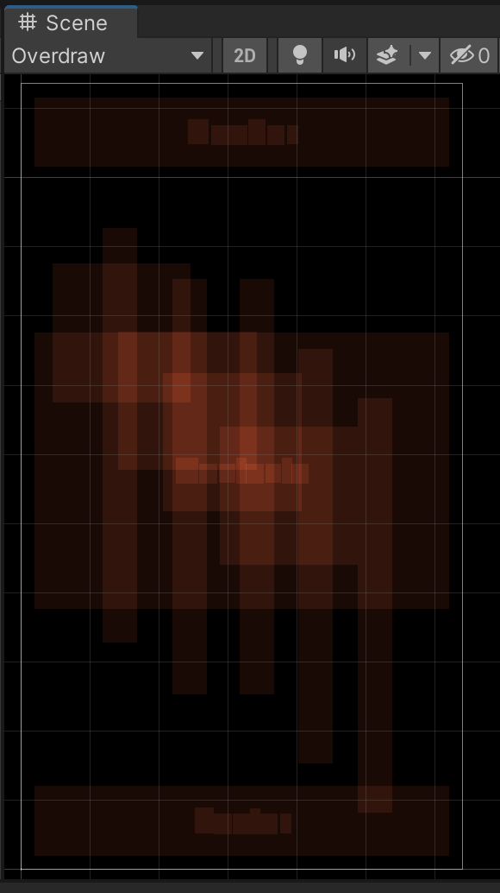

オーバードローを削減するため、プレイヤーに見えない要素を無効にすることが重要である。不透明な背景の UI の下に隠れている全ての UI 要素を非表示にして描画されないようにしよう。具体的な方法については *UI 要素の表示/非表示の切替* で後述する。

また、`Image` などの `Graphic` の `color` のアルファ値や、`Material` のアルファ値が `0` となっている UI 要素が無いことも確認しよう。それらは画面に表示されなくてもドローコールを発生させてしまう。

### UI 要素の表示/非表示の切替

UI の個別の部分を表示/非表示する際には、UI の root にある `GameObject` のアクティブ/非アクティブを切り替えるのが一般的である。これによって、無効になった UI は入力やコールバックを受け取らなくなる。

しかし、これによって `Canvas` が *VBO（Vertex Buffer Object)* データを捨てることになる。この UI を再度有効にすると `Canvas` のリビルド（Graphic リビルドと Layout リビルドと Canvas バッチビルドの全て）が行われることになる。

もしこのような状況が頻繁に発生するのであれば、増加した CPU 使用率によってアプリケーションのフレームレートが下がることになる。さらに、`GameObject` のアクティブ/非アクティブを切り替えたり `Image` などのコンポーネントの有効/無効を切り替えたりすると、比較的負荷の高い `Graphic.OnEnable()` が呼ばれて CPU 時間が消費される。さらに、Editor のみではあるが *GC Alloc* が発生する。Editor のみであるため実機では *GC Alloc* は発生しないがプロファイリングの妨げになるため、UI の表示/非表示を切り替えるための別の方法を検討してみよう。

> 存在しないコンポーネントに対して `GetComponent()` を呼ぶと、Editor 上でのみ約 0.5 KB の *GC Alloc* が発生する。上記の *GC Alloc* はこの挙動によるものである。

    *Packages/com.unity.ugui/Runtime/UI/Core/MaskableGraphic.cs*
    ```c#
    protected override void OnDisable()
    {
        ...    
        // Mask がアタッチされていない場合、
        // Editor 上でのみ GC Alloc が発生する
        if (GetComponent<Mask>() != null) 
    ```

> なお、`TryGetComponent()` では存在しないコンポーネントに対して呼び出しても *GC Alloc* は発生しない。

以下に UI 要素の表示/非表示を切り替える方法をいくつか示す。

1. `CanvasGroup` の `alpha` を `0` にする。

    既に説明したように `CanvasGroup` の `alpha` を `0` にすることで自身および子の要素を非表示にすることができる。この場合、非表示であればドローコールも発生しない。ただし、このままでは Raycast 自体は生きているのでタッチした場合には反応することに注意しよう。タッチを無効にするには、`CanvasGroup` の `blocksRaycasts` を `false` にする必要がある。また、各コンポーネント自体は有効なので `Update()` やコルーチンなどは呼ばれ続ける。

2. `CanvasRenderer` の `alpha` を `0` にする。

    こちらも既に説明したように `CanvasRenderer` の `alpha` を 0 にすることで自身を非表示にすることができる。この場合、非表示であればドローコールも発生しない。ただし、このままでは Raycast 自体は生きているのでタッチした場合には反応することに注意しよう。また、他のコンポーネントは有効なので `Update()` やコルーチンなどは呼ばれ続ける。

3. `RectTransform` の `localScale` を変更する

    `RectTransform` の `localScale` を `Vector3.one` あるいは `Vector3.zero` に設定することで UI 要素の表示/非表示を切り替えることができる。この場合、レイキャストの矩形も（通常は）ゼロになるのでタッチに反応しなくなる。ただし、各コンポーネント自体は有効のままであるのは他の手法と同様である。
    
上記の 1 〜 3 の方法のいずれでも Graphic リビルドおよび Layout リビルドは避けられるが Canvas バッチビルドだけは発生する。

### Graphic の拡大縮小

UI 要素の拡大縮小を行う場合、`RectTransform` の `sizeDelta` あるいは `localScale` を変更することになるが、`localScale` を変更したほうがパフォーマンスが良い。`sizeDelta`　を変更した場合には頂点データがダーティとなるので、Graphic リビルドが発生してしまう。なので、特にアニメーションを行う場合には可能な限り `localScale` 経由で拡大縮小を行った方が良い。

### UI の色の変化をシェーダーで実現する

ボタンを押すことができないことを示すために、ボタンの色をモノトーン（灰色）にすることがよくある。これを実現するために 2 つのボタンを用意して都度切り替えるとなると、当然ながら UI 要素の数が増えてリビルドの時間が長くなってしまう。この場合、モノトーン表示するようなシェーダーを書いておけば、UI 要素を増やすことなく要件を実現できる。このシェーダーについてはこの章の *HSV 色空間シェーダー* で後述する。

### フォルダ代わりの GameObject を作らない

UI 要素をまとめてグループにするために何も無い `GameObject` を `Canvas` 内に置くと、Canvas リビルドの時間が長くなってしまう。頻繁に変更が行われるような Canvas にはこのようなフォルダ代わりの `GameObject` をできるだけ作らないようにしよう。

### UI の奥の 3D ワールド空間のレンダリングを省く

3D ワールド空間を映しているカメラの手前に不透明なフルスクリーン UI が表示されているのであれば、ワールド空間のレンダリングは全くの無意味となる。この場合、3D ワールド空間を映しているカメラを無効にすれば描画の負荷を抑えることができる。

そこまで極端では事例ではなくても、画面の大部分が UI で覆われていて、3D ワールド空間（のカメラおよびオブジェクト）が動かないのであれば、事前に 3D ワールド空間を `RenderTexture` にレンダリングしておいて、そのテクスチャを背景 UI として使えば（`RenderTexture` の分のメモリ使用量は増えるものの）CPU および GPU 負荷を減らすことができる。この際、背景 UI 全体を描画するのではなく、見える範囲だけ描画するようにすれば、オーバードローを減らすことができる。

### 画像を統合する

標準の UI パーツを組み合わせたり装飾を施したりして最終的な UI の見た目にするというのは一般的によく行われている。だが、`CanvasRenderer` は `Transparent` キューなので奥から手前にレンダリングされるため、このようなやり方はドローコールやオーバードローの増加につながってしまう。

よって、もし可能であればパーツを統合して一つの画像にしてしまうのがパフォーマンス改善に有効である。これによって CPU / GPU 負荷が減るが、その一方、テクスチャメモリ使用量が増加することになる。このバランスについてはケースバイケースであるが、フレームレートが気になるのであればパーツを統合することを検討したほうが良いかもしれない。この際に増えてしまったテクスチャメモリ使用量を減らす方法については、この章の *テクスチャフォーマット* の項が役に立つかもしれない。

### ヒエラルキー内の順序を調整する

UI 要素は奥から手間の順に構築されるが、この順序はヒエラルキー内のオブジェクトの順によって決まる。ヒエラルキー内で上位にあるオブジェクトはヒエラルキー内で奥にあるとされる。Canvas バッチビルドはヒエラルキーを上から下へ順に見ていって、同じマテリアルかつ同じテクスチャを持っていて間に何もないオブジェクトをひとまとめにする。

*Chapter 11 プロファイリング* で後述するが、**Profiler** と **Frame Debugger** を使って、オブジェクトの間に何かがはさまっているかどうかを調査ですることができる。下の図は、ある描画可能オブジェクトが、互いにバッチ化できるはずの 2 つの他のオブジェクトの間に挟まっている状態である。

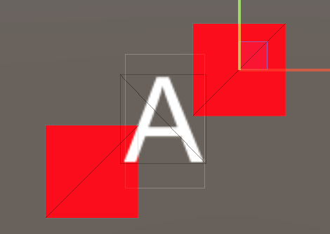

こういった問題は、`Image` と `Text` が近くに置かれている場合によく発生する。`Text` の境界が近くの `Image` にうっかり重なってしまうことがよくあるのである。というのは、`Text` のポリゴンの大部分は透明なので気付きにくいためである。これは 2 つの方法で解決することができる。

1. バッチを妨げるオブジェクトをバッチにまとめられるオブジェクト群の前か後に移動させる。

2. 見えないオーバーラップ領域を無くすようにオブジェクトの位置を調整する。

**Frame Debugger** でドローコールの数を観察するだけで、オーバーラップした UI 要素による無駄なドローコールの数をできる順序と位置を見つけることができるだろう。

## シェーダー

uGUI 用で使われる UI シェーダーは Unity にあらかじめ組み込まれている。`Graphic` コンポーネントにマテリアルが何も設定されていない場合、デフォルトの *UI/Default* シェーダーが使われる。

組み込み UI シェーダーの中身を見たいのであれば、Unity のダウンロードページから各バージョンのビルトインシェーダーをダウンロードして見ることができる。

<https://unity3d.com/jp/get-unity/download/archive>

### デフォルトの UI シェーダー

デフォルトの *UI/Default* シェーダーの中身を見てみよう。*UI/Default* シェーダーはダウンロードしたビルトインシェーダーの *DefaultResourcesExtra/UI* フォルダの *UI-Default.shader* である。ここではデフォルトシェーダーに日本語コメントを付けたものを載せた。

*DefaultResourcesExtra/UI/UI-Default.shader*
```
Shader "UI/Default"
{
    Properties
    {
        // テクスチャが一致した場合にバッチングが効くようにするため、
        // テクスチャは Material から直接ではなく MaterialPropertyBlock 経由で設定する
        // （なお、UI シェーダーでは基本的に MaterialPropertyBlock を使うことはできない）。
        // 実際にテクスチャを設定するのは CanvasRenderer である。
        [PerRendererData] _MainTex ("Sprite Texture", 2D) = "white" {}

        // 色
        _Color ("Tint", Color) = (1,1,1,1)
        
        // ステンシル比較関数
        // UnityEngine.Rendering.CompareFunction で定義されている
        // https://docs.unity3d.com/ja/current/ScriptReference/Rendering.CompareFunction.html
        // 8 は Always であり、常にステンシルテストが成功する
        _StencilComp ("Stencil Comparison", Float) = 8

        // ステンシルテストの基準値（0 ～ 255）
        _Stencil ("Stencil ID", Float) = 0

        // ステンシルテスト成功時の挙動
        // UnityEngine.Rendering.StencilOp で定義されている
        // https://docs.unity3d.com/ja/current/ScriptReference/Rendering.StencilOp.html
        // 0 は Keep であり、変更を行わない
        _StencilOp ("Stencil Operation", Float) = 0

        // ステンシルテストを行った後にバッファに基準値を書き込むビットを指定するマスク
        // 0xFF なので基準値もバッファの内容もそのまま比較する
        _StencilWriteMask ("Stencil Write Mask", Float) = 255

        // ステンシルテストを行う前に基準値とバッファの内容の両方にかける論理和マスク
        // 0xFF なので基準値もバッファの内容もそのまま比較する
        _StencilReadMask ("Stencil Read Mask", Float) = 255

        // 描画を反映しないカラーチャンネルの設定
        // UnityEngine.Rendering.ColorWriteMask で定義されている
        // https://docs.unity3d.com/ja/current/ScriptReference/Rendering.ColorWriteMask.html
        // 15 は　All であり、全てのチャンネル(A/B/G/R)を出力する
        _ColorMask ("Color Mask", Float) = 15

        // UNITY_UI_ALPHACLIP を define するかどうか
        // 0 なら define しない
        // Mask を使わないのであれば必要ない
        [Toggle(UNITY_UI_ALPHACLIP)] _UseUIAlphaClip ("Use Alpha Clip", Float) = 0
    }

    SubShader
    {
        // タグを使っていつ/どのようにレンダリングするかを指定する
        // https://docs.unity3d.com/ja/current/Manual/SL-SubShaderTags.html
        Tags
        {
            // UI 用なので RenderQueue は Transparent
            "Queue"="Transparent"

            // Projector コンポーネントの影響を受けない
            "IgnoreProjector"="True"

            // シェーダの分類。RenderQueue とは別
            // Shader Replacement を使わないなら必要ないが一応書いておく
            "RenderType"="Transparent"

            // Inspector の下のマテリアルビューの表示方式
            // デフォルトは Sphere（球体）だが Plane（2D）または Skybox（スカイボックス）が選べる
            "PreviewType"="Plane"

            // このシェーダーが Sprite 用かつアトラス化された場合には動作しないことを明示したい場合には False にする
            // 基本的には True で良い
            "CanUseSpriteAtlas"="True"
        }

        // プロパティで指定されたステンシルの設定値を実際に設定する
        // https://docs.unity3d.com/ja/current/Manual/SL-Stencil.html
        Stencil
        {
            // ステンシルテストの基準値
            Ref [_Stencil]

            // 比較関数
            Comp [_StencilComp]

            // ステンシルテスト成功時の挙動
            Pass [_StencilOp]

            // バッファ読み込み時ビットマスク
            ReadMask [_StencilReadMask]

            // バッファ書き込み時ビットマスク
            WriteMask [_StencilWriteMask]
        }

        // https://docs.unity3d.com/ja/current/Manual/SL-CullAndDepth.html
        // UI なのでカリング不要
        Cull Off

        // レガシーな固定機能ライティング（非推奨）
        // https://docs.unity3d.com/ja/current/Manual/SL-Material.html
        // 現在では（UI に限らず）基本的には Off で良い
        Lighting Off

        // 深度バッファへの書き込み
        // https://docs.unity3d.com/ja/current/Manual/SL-CullAndDepth.html
        // Transparent なので ZWrite は不要
        ZWrite Off

        // 深度テストの方法
        // https://docs.unity3d.com/ja/current/Manual/SL-CullAndDepth.html
        // Canvas が Overlay なら Always（常に描画）
        // それ以外なら LEqual（描画済みオブジェクトとの距離が距離が等しいまたはより近い場合に描画）
        ZTest [unity_GUIZTestMode]

        // https://docs.unity3d.com/ja/current/Manual/SL-Blend.html
        // Unity 2020.1 からピクセルブレンドは乗算済み透明（Premultiplied transparency）になった
        // https://issuetracker.unity3d.com/issues/transparent-ui-gameobject-ignores-opaque-ui-gameobject-when-using-rendertexture
        // 以前のブレンドにしたいなら Blend SrcAlpha OneMinusSrcAlpha にしてフラグメントシェーダーの乗算済み透明の処理を消す
        Blend One OneMinusSrcAlpha

        // 描画を反映しないカラーチャンネルの設定はプロパティで設定した値を使う
        ColorMask [_ColorMask]

        Pass
        {
            // UsePass で使う名前
            // https://docs.unity3d.com/ja/current/Manual/SL-Name.html
            Name "Default"

        // Cg/HLSL 開始
        CGPROGRAM

            // HLSL スニペット
            // https://docs.unity3d.com/ja/2018.4/Manual/SL-ShaderPrograms.html

            // 頂点シェーダーの関数名を指定
            #pragma vertex vert

            // フラグメントシェーダーの関数名を指定
            #pragma fragment frag
            
            // ターゲットレベルは全プラットフォーム向け
            // https://docs.unity3d.com/ja/current/Manual/SL-ShaderCompileTargets.html
            #pragma target 2.0

            // インクルードファイルの指定
            // インクルードファイルの場所は (Unity のインストール先)/Editor/Data/CGIncludes
            #include "UnityCG.cginc"
            #include "UnityUI.cginc"

            // Mask や RectMask2D が有効かどうかでクリッピング機能の有無を切り替えるためのシェーダーバリアント
            // UNITY_UI_CLIP_RECT キーワードはグローバルではなく、このシェーダーのみ対象で OK なのでローカル
            #pragma multi_compile_local _ UNITY_UI_CLIP_RECT

            // アルファ値でクリッピングする機能無しと有りの 2 種類のシェーダーバリアントを用意
            // UNITY_UI_ALPHACLIP キーワードはグローバルではなく、このシェーダーのみ対象で OK なのでローカル
            #pragma multi_compile_local _ UNITY_UI_ALPHACLIP

            // メッシュの頂点データの定義
            struct appdata_t
            {
                // 位置
                float4 vertex   : POSITION;

                // 頂点カラー
                float4 color    : COLOR;

                // 1 番目の UV 座標
                float2 texcoord : TEXCOORD0;

                // インスタンシングが有効な場合に
                //    uint instanceID : SV_InstanceID
                // という定義が付け加えられる。
                // 詳細は UnityInstancing.cginc を参照のこと
                UNITY_VERTEX_INPUT_INSTANCE_ID
            };

            // 頂点シェーダーからフラグメントシェーダーに渡すデータ
            struct v2f
            {
                // 頂点のクリップ座標
                // システムが使う（GPU がラスタライズに使う）値なので SV (System Value) が付く
                float4 vertex   : SV_POSITION;

                // 色
                fixed4 color    : COLOR;

                // 1 番目の UV 座標
                float2 texcoord  : TEXCOORD0;

                // 2 番目の UV 座標に頂点のワールド空間での位置を格納して渡す
                float4 worldPosition : TEXCOORD1;

                // 3 番目の UV 座標にマスクのデータを格納して渡す
                half4  mask : TEXCOORD2;

                // VR 用。シングルパスで両目のレンダリングを可能にする。
                UNITY_VERTEX_OUTPUT_STEREO
            };

            // テクスチャデータを参照するためにはテクスチャサンプラ型の値をプロパティ経由で受け取る
            sampler2D _MainTex;

            // 色
            fixed4 _Color;

            // UI 用に Unity によって自動的に設定される。
            // 使用するテククチャが Alpha8 型なら (1,1,1,0) 、それ以外なら (0,0,0,0) になる
            fixed4 _TextureSampleAdd;

            // MaskableGraphic.SetClipRect() 等から CanvasRenderer.EnableRectClipping() で設定
            float4 _ClipRect;

            // テクスチャ変数名 に _ST を追加すると Tiling と Offset の値が入ってくる
            // x, y は Tiling 値の x, y で、z, w は Offset 値の z, w が入れられる
            float4 _MainTex_ST;

            // Unity 2020.1 から導入されたソフトマスク（端をぼかす機能）の範囲
            // MaskableGraphic.SetClipSoftness() 等から CanvasRenderer.clippingSoftness で設定
            float _MaskSoftnessX;
            float _MaskSoftnessY;

            // 頂点シェーダー
            // appdata_t を受け取って v2f を返す
            v2f vert(appdata_t v)
            {
                // フラグメントシェーダーに渡す変数
                v2f OUT;

                // VR 用の目の情報と、GPU インスタンシングのためのインスタンシングごとの座標を反映させる
                // UnityInstancing.cginc を参照のこと
                UNITY_SETUP_INSTANCE_ID(v);

                // VR 用のテクスチャ配列の目を GPU に伝える
                UNITY_INITIALIZE_VERTEX_OUTPUT_STEREO(OUT);

                // オブジェクト空間の頂点の座標をカメラのクリップ空間に変換する
                // UnityShaderUtilities.cginc より
                // mul(UNITY_MATRIX_VP, float4(mul(unity_ObjectToWorld, float4(inPos, 1.0)).xyz, 1.0));
                //   UNITY_MATRIX_VP : 現在のビュー * プロジェクション行列
                //   unity_ObjectToWorld : 現在のモデル行列
                //   https://docs.unity3d.com/ja/2018.4/Manual/SL-UnityShaderVariables.html
                // 実態としては mul(UNITY_MATRIX_MVP, v.vertex) と等しい
                float4 vPosition = UnityObjectToClipPos(v.vertex);

                // 2 番目の UV 座標に頂点のワールド空間を渡す
                OUT.worldPosition = v.vertex;

                // 変換した頂点のクリップ座標を渡す
                OUT.vertex = vPosition;

                // w はカメラからの距離
                float2 pixelSize = vPosition.w;

                // _ScreenParams : 現在のスクリーン（レンダーターゲット）サイズ
                // UNITY_MATRIX_P : 現在のプロジェクション行列
                // 1 ピクセルに相当する大きさを求める
                pixelSize /= float2(1, 1) * abs(mul((float2x2)UNITY_MATRIX_P, _ScreenParams.xy));

                // 精度を落として Mask テクスチャの UV を作成
                float4 clampedRect = clamp(_ClipRect, -2e10, 2e10);
                float2 maskUV = (v.vertex.xy - clampedRect.xy) / (clampedRect.zw - clampedRect.xy);

                // マスクされた部分切り取ってテクスチャの UV を作成
                OUT.texcoord = float4(v.texcoord.x, v.texcoord.y, maskUV.x, maskUV.y);

                // ソフトマスクを考慮したクリッピング用のデータ
                OUT.mask = half4(v.vertex.xy * 2 - clampedRect.xy - clampedRect.zw, 
                0.25 / (0.25 * half2(_MaskSoftnessX, _MaskSoftnessY) + abs(pixelSize.xy)));

                // 頂点カラーにプロパティのカラーを乗算
                OUT.color = v.color * _Color;

                return OUT;
            }

            // フラグメントシェーダー
            fixed4 frag(v2f IN) : SV_Target
            {
                // テクスチャから色のサンプリング
                half4 color = (tex2D(_MainTex, IN.texcoord) + _TextureSampleAdd) * IN.color;

                #ifdef UNITY_UI_CLIP_RECT
                // ソフトマスクを考慮したクリッピング
                half2 m = saturate((_ClipRect.zw - _ClipRect.xy - abs(IN.mask.xy)) * IN.mask.zw);
                color.a *= m.x * m.y;
                #endif

                #ifdef UNITY_UI_ALPHACLIP
                // アルファが 0.001 以下なら（＝ほぼ透明なら）ピクセルを破棄する
                // エッジが汚い場合は数字を増やしてもいいかもしれない
                clip (color.a - 0.001);
                #endif

                // 乗算済み透明（Premultiplied transparency）なので RGB に Alpha を乗算しておく
                color.rgb *= color.a;

                return color;
            }
        // Cg/HLSL 終了
        ENDCG
        }
    }
}
```

### カスタム UI シェーダー

もし、ステンシルマスクやクリッピングなどの機能が不要なのであれば自分でカスタマイズした UI シェーダーを使うことが可能である。また、上記のデフォルトの UI シェーダー内のコメントにも書いたように、Unity 2020.1 からはピクセルブレンドは乗算済み透明（Premultiplied transparency）なったため、若干のパフォーマンス低下が発生する可能性がある（ただし、乗算済み透明のほうが本来表示されるべき色である）。なので、カスタマイズする価値はある。

#### 軽量シェーダー

例えば、以下の方針で軽量な UI シェーダーを作成してみよう。

- `Mask` や `RectMask2D` 対応を無くす。
- 乗算済み透明ではなく、Unity 2019.4 以前のようなブレンディングにする。
- マテリアルのカラーは使わない（テクスチャカラーをそのまま出力）。

実際のシェーダーコードは以下のようになる。

```shaderlab
Shader "UI/LightWeight"
{
    Properties
    {
        [PerRendererData] _MainTex("Base (RGB), Alpha (A)", 2D) = "white" {}
    }

    SubShader
    {
        Tags
        {
            "Queue" = "Transparent"
            "IgnoreProjector" = "True"
            "RenderType" = "Transparent"
            "PreviewType" = "Plane"
            "CanUseSpriteAtlas" = "True"
        }
    
        Cull Off
        Lighting Off
        ZWrite Off
        ZTest[unity_GUIZTestMode]
        Blend SrcAlpha OneMinusSrcAlpha
    
        Pass
        {
            CGPROGRAM
            #pragma vertex vert
            #pragma fragment frag
    
            #include "UnityCG.cginc"
            #include "UnityUI.cginc"
    
            struct appdata_t
            {
                float4 vertex   : POSITION;
                float2 texcoord : TEXCOORD0;
            };
    
            struct v2f
            {
                float4 vertex   : SV_POSITION;
                half2 texcoord  : TEXCOORD0;
                float4 worldPosition : TEXCOORD1;
            };
    
            v2f vert(appdata_t IN)
            {
                v2f OUT;
                OUT.worldPosition = IN.vertex;
                OUT.vertex = UnityObjectToClipPos(OUT.worldPosition);
                OUT.texcoord = IN.texcoord;
        
                return OUT;
            }
    
            sampler2D _MainTex;
            fixed4 frag(v2f IN) : SV_Target
            {
                return tex2D(_MainTex, IN.texcoord);
            }
            ENDCG
        }
    }
}
```

### HSV 色空間シェーダー

RGB 色空間を HSV 空間に変換することで多彩な表現が可能になる。たとえば、彩度を落とすことで画像をモノトーンにしてボタンが押せないことを表現したり、青い画像を赤い画像にすることで画像リソースを削減したりすることができたりする。

以下はデフォルトシェーダーを元にした HSV 色空間シェーダーである。**Inspecotr** から **Hue**（色相）、**Saturation**（彩度）、**Brightness**（明度）、Contrast（コントラスト）のスライドバーを移動して、それぞれどのように見え方が変わるのか確認してほしい。Unity 2020.1 以降の乗算済み透明に対応したものと、Unity 2019.4 以前のもののそれぞれを用意したので、適宜使い分けてほしい。

*Unity 2020.1 以降の UI デフォルトシェーダーを元にした HSV 色空間シェーダー*
```
Shader "UI/HSV"
{
    Properties
    {
        [PerRendererData] _MainTex("Sprite Texture", 2D) = "white" {}
        _Color("Tint", Color) = (1,1,1,1)

        // 色相
        _Hue("Hue", Range(0.0, 1.0)) = 0.0
        // 彩度
        _Saturation("Saturation", Range(0.0, 1.0)) = 0.5
        // 明度
        _Brightness("Brightness", Range(0.0, 1.0)) = 0.5
        // コントラスト
        _Contrast("Contrast", Range(0, 1.0)) = 0.5

        _StencilComp("Stencil Comparison", Float) = 8
        _Stencil("Stencil ID", Float) = 0
        _StencilOp("Stencil Operation", Float) = 0
        _StencilWriteMask("Stencil Write Mask", Float) = 255
        _StencilReadMask("Stencil Read Mask", Float) = 255

        _ColorMask("Color Mask", Float) = 15

        [Toggle(UNITY_UI_ALPHACLIP)] _UseUIAlphaClip("Use Alpha Clip", Float) = 0
    }

    SubShader
    {
        Tags
        {
            "Queue" = "Transparent"
            "IgnoreProjector" = "True"
            "RenderType" = "Transparent"
            "PreviewType" = "Plane"
            "CanUseSpriteAtlas" = "True"
        }

        Stencil
        {
            Ref[_Stencil]
            Comp[_StencilComp]
            Pass[_StencilOp]
            ReadMask[_StencilReadMask]
            WriteMask[_StencilWriteMask]
        }

        Cull Off
        Lighting Off
        ZWrite Off
        ZTest[unity_GUIZTestMode]
        Blend One OneMinusSrcAlpha
        ColorMask[_ColorMask]

        Pass
        {
        CGPROGRAM
            #pragma vertex vert
            #pragma fragment frag
            #pragma target 2.0

            #include "UnityCG.cginc"
            #include "UnityUI.cginc"

            #pragma multi_compile_local _ UNITY_UI_CLIP_RECT
            #pragma multi_compile_local _ UNITY_UI_ALPHACLIP

            // 色相に応じて色を変える
            inline float3 tweekHue(float3 color, float hue)
            {
                float3 k = float3(0.57735, 0.57735, 0.57735);
                float hueAngle = radians(hue);
                float cosHue = cos(hueAngle);
                float sinHue = sin(hueAngle);

                return color * cosHue + cross(k, color) * sinHue + k * dot(k, color) * (1 - cosHue);
            }

            // RGB カラーを HSV 変換する
            inline float4 convertToHSV(float4 rgbaColor, fixed4 hsvc)
            {
                float hue = 360 * hsvc.r;
                float saturation = hsvc.g * 2;
                float brightness = hsvc.b * 2 - 1;
                float contrast = hsvc.a * 2;

                float4 hsvcColor;
                hsvcColor.rgb = tweekHue(rgbaColor.rgb, hue);
                hsvcColor.rgb = (hsvcColor.rgb - 0.5f) * contrast + 0.5f;
                hsvcColor.rgb = hsvcColor.rgb + brightness;
                float3 intensity = dot(hsvcColor.rgb, float3(0.39, 0.59, 0.11));
                hsvcColor.rgb = lerp(intensity, hsvcColor.rgb, saturation);

                return hsvcColor;
            }

            struct appdata_t
            {
                float4 vertex   : POSITION;
                float4 color    : COLOR;
                float2 texcoord : TEXCOORD0;
                UNITY_VERTEX_INPUT_INSTANCE_ID
            };

            struct v2f
            {
                float4 vertex   : SV_POSITION;
                fixed4 color : COLOR;
                float2 texcoord  : TEXCOORD0;
                float4 worldPosition : TEXCOORD1;
                half4  mask : TEXCOORD2;
                UNITY_VERTEX_OUTPUT_STEREO
            };

            sampler2D _MainTex;
            fixed4 _Color;

            // 色相/彩度/明度/コントラストをプロパティから受け取る
            fixed _Hue;
            fixed _Saturation;
            fixed _Brightness;
            fixed _Contrast;

            fixed4 _TextureSampleAdd;
            float4 _ClipRect;
            float4 _MainTex_ST;
            float _MaskSoftnessX;
            float _MaskSoftnessY;

            // 頂点シェーダーはデフォルトシェーダーと同じ
            v2f vert(appdata_t v)
            {
                v2f OUT;
                UNITY_SETUP_INSTANCE_ID(v);
                UNITY_INITIALIZE_VERTEX_OUTPUT_STEREO(OUT);
                float4 vPosition = UnityObjectToClipPos(v.vertex);
                OUT.worldPosition = v.vertex;
                OUT.vertex = vPosition;

                float2 pixelSize = vPosition.w;
                pixelSize /= float2(1, 1) * abs(mul((float2x2)UNITY_MATRIX_P, _ScreenParams.xy));

                float4 clampedRect = clamp(_ClipRect, -2e10, 2e10);
                float2 maskUV = (v.vertex.xy - clampedRect.xy) / (clampedRect.zw - clampedRect.xy);
                OUT.texcoord = float4(v.texcoord.x, v.texcoord.y, maskUV.x, maskUV.y);
                OUT.mask = half4(v.vertex.xy * 2 - clampedRect.xy - clampedRect.zw, 0.25 / (0.25 * half2(_MaskSoftnessX, _MaskSoftnessY) + abs(pixelSize.xy)));

                OUT.color = v.color * _Color;
                return OUT;
            }

            fixed4 frag(v2f IN) : SV_Target
            {
                half4 color = (tex2D(_MainTex, IN.texcoord) + _TextureSampleAdd) * IN.color;

                #ifdef UNITY_UI_CLIP_RECT
                half2 m = saturate((_ClipRect.zw - _ClipRect.xy - abs(IN.mask.xy)) * IN.mask.zw);
                color.a *= m.x * m.y;
                #endif

                #ifdef UNITY_UI_ALPHACLIP
                clip(color.a - 0.001);
                #endif
                // ここまではデフォルトシェーダーと同じ

                // ここから HSV 色空間の調整
                fixed4 hsvc = fixed4(_Hue, _Saturation, _Brightness, _Contrast);
                float4 hsvcColor = convertToHSV(color, hsvc);
                color.rgb = hsvcColor * color.a;

                return color;
            }
        ENDCG
        }
    }
}

```

*Unity 2019.4 以前の UI デフォルトシェーダーを元にした HSV 色空間シェーダー*
```
Shader "UI/LegacyHSV"
{
    Properties
    {
        [PerRendererData] _MainTex("Sprite Texture", 2D) = "white" {}
        _Color("Tint", Color) = (1,1,1,1)

        // 色相
        _Hue("Hue", Range(0.0, 1.0)) = 0.0
        // 彩度
        _Saturation("Saturation", Range(0.0, 1.0)) = 0.5
        // 明度
        _Brightness("Brightness", Range(0.0, 1.0)) = 0.5
        // コントラスト
        _Contrast("Contrast", Range(0, 1.0)) = 0.5

        _StencilComp("Stencil Comparison", Float) = 8
        _Stencil("Stencil ID", Float) = 0
        _StencilOp("Stencil Operation", Float) = 0
        _StencilWriteMask("Stencil Write Mask", Float) = 255
        _StencilReadMask("Stencil Read Mask", Float) = 255

        _ColorMask("Color Mask", Float) = 15

        [Toggle(UNITY_UI_ALPHACLIP)] _UseUIAlphaClip("Use Alpha Clip", Float) = 0
    }

    SubShader
    {
        Tags
        {
            "Queue" = "Transparent"
            "IgnoreProjector" = "True"
            "RenderType" = "Transparent"
            "PreviewType" = "Plane"
            "CanUseSpriteAtlas" = "True"
        }

        Stencil
        {
            Ref[_Stencil]
            Comp[_StencilComp]
            Pass[_StencilOp]
            ReadMask[_StencilReadMask]
            WriteMask[_StencilWriteMask]
        }

        Cull Off
        Lighting Off
        ZWrite Off
        ZTest[unity_GUIZTestMode]
        Blend SrcAlpha OneMinusSrcAlpha
        ColorMask[_ColorMask]

        Pass
        {
        CGPROGRAM
            #pragma vertex vert
            #pragma fragment frag
            #pragma target 2.0

            #include "UnityCG.cginc"
            #include "UnityUI.cginc"

            #pragma multi_compile_local _ UNITY_UI_CLIP_RECT
            #pragma multi_compile_local _ UNITY_UI_ALPHACLIP

            // 色相に応じて色を変える
            inline float3 tweekHue(float3 color, float hue)
            {
                float3 k = float3(0.57735, 0.57735, 0.57735);
                float hueAngle = radians(hue);
                float cosHue = cos(hueAngle);
                float sinHue = sin(hueAngle);

                return color * cosHue + cross(k, color) * sinHue + k * dot(k, color) * (1 - cosHue);
            }

            // RGB カラーを HSV 変換する
            inline float4 convertToHSV(float4 rgbaColor, fixed4 hsvc)
            {
                float hue = 360 * hsvc.r;
                float saturation = hsvc.g * 2;
                float brightness = hsvc.b * 2 - 1;
                float contrast = hsvc.a * 2;

                float4 hsvcColor;
                hsvcColor.rgb = tweekHue(rgbaColor.rgb, hue);
                hsvcColor.rgb = (hsvcColor.rgb - 0.5f) * contrast + 0.5f;
                hsvcColor.rgb = hsvcColor.rgb + brightness;
                float3 intensity = dot(hsvcColor.rgb, float3(0.39, 0.59, 0.11));
                hsvcColor.rgb = lerp(intensity, hsvcColor.rgb, saturation);

                return hsvcColor;
            }

            struct appdata_t
            {
                float4 vertex   : POSITION;
                float4 color    : COLOR;
                float2 texcoord : TEXCOORD0;
                UNITY_VERTEX_INPUT_INSTANCE_ID
            };

            struct v2f
            {
                float4 vertex   : SV_POSITION;
                fixed4 color : COLOR;
                float2 texcoord  : TEXCOORD0;
                float4 worldPosition : TEXCOORD1;
                half4  mask : TEXCOORD2;
                UNITY_VERTEX_OUTPUT_STEREO
            };

            sampler2D _MainTex;
            fixed4 _Color;

            // 色相/彩度/明度/コントラストをプロパティから受け取る
            fixed _Hue;
            fixed _Saturation;
            fixed _Brightness;
            fixed _Contrast;

            fixed4 _TextureSampleAdd;
            float4 _ClipRect;
            float4 _MainTex_ST;
            float _MaskSoftnessX;
            float _MaskSoftnessY;

            // 頂点シェーダーはデフォルトシェーダーと同じ
            v2f vert(appdata_t v)
            {
                v2f OUT;
                UNITY_SETUP_INSTANCE_ID(v);
                UNITY_INITIALIZE_VERTEX_OUTPUT_STEREO(OUT);
                float4 vPosition = UnityObjectToClipPos(v.vertex);
                OUT.worldPosition = v.vertex;
                OUT.vertex = vPosition;

                float2 pixelSize = vPosition.w;
                pixelSize /= float2(1, 1) * abs(mul((float2x2)UNITY_MATRIX_P, _ScreenParams.xy));

                float4 clampedRect = clamp(_ClipRect, -2e10, 2e10);
                float2 maskUV = (v.vertex.xy - clampedRect.xy) / (clampedRect.zw - clampedRect.xy);
                OUT.texcoord = float4(v.texcoord.x, v.texcoord.y, maskUV.x, maskUV.y);
                OUT.mask = half4(v.vertex.xy * 2 - clampedRect.xy - clampedRect.zw, 0.25 / (0.25 * half2(_MaskSoftnessX, _MaskSoftnessY) + abs(pixelSize.xy)));

                OUT.color = v.color * _Color;
                return OUT;
            }

            fixed4 frag(v2f IN) : SV_Target
            {
                half4 color = (tex2D(_MainTex, IN.texcoord) + _TextureSampleAdd) * IN.color;

                #ifdef UNITY_UI_CLIP_RECT
                half2 m = saturate((_ClipRect.zw - _ClipRect.xy - abs(IN.mask.xy)) * IN.mask.zw);
                color.a *= m.x * m.y;
                #endif

                #ifdef UNITY_UI_ALPHACLIP
                clip(color.a - 0.001);
                #endif
                // ここまではデフォルトシェーダーと同じ

                // ここから HSV 色空間の調整
                fixed4 hsvc = fixed4(_Hue, _Saturation, _Brightness, _Contrast);
                float4 hsvcColor = convertToHSV(color, hsvc);
                color.rgb = hsvcColor;

                return color;
            }
        ENDCG
        }
    }
}
```

## テクスチャフォーマット

Unity はさまざまなテクスチャフォーマットをサポートしている。Unity で利用可能なテクスチャフォーマットは `TextureFormat` 列挙型として定義されている。

サポートされているテクスチャフォーマット一覧は公式ドキュメントに掲載されている。
<https://docs.unity3d.com/ja/current/ScriptReference/TextureFormat.html>

代表的なテクスチャフォーマットは、無圧縮 32 bit の RGBA32、16 bit の RGB565 / RGBA4444、iOS 用の PRVTC、Android 用の ETC1 / ETC2 / ATC, iOS/Android の両方に対応した ASTC、DirectX 用の DXT / BC である。

テクスチャファイルのテクスチャフォーマットは **Inspector** に表示される **Import Settings** で確認することができる。プラットフォームに特化したオーバーライドパネルでは **Default** タブ以外に各プラットフォームごとのタブが存在し、個別のインポート設定を使うこともできる。

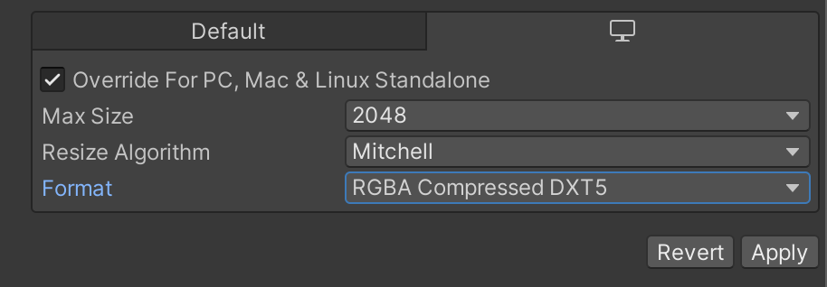

以下では、UI 用という観点から代表的なフォーマットを見ていくことにする。

### 無圧縮 32 bit

無圧縮 32 bit フォーマットは、一切圧縮しなかった場合のテクスチャフォーマットである。`RGBA32` と `ARGB32` の 2 つのフォーマットが存在するが、基本的には（一部の GPU で効率の良い）`RGBA32` が使われる。1 ピクセルあたり 32 bit = 4 byte 使うので、1024 x 1024 サイズのテクスチャであれば 1024 x 1024 x 4 = 4 MB のメモリを消費する。

気をつけて欲しいのは、ファイルサイズと消費メモリ量は一致しないということである。jpeg のようなファイルサイズの小さいフォーマットであっても、メモリ上のフォーマットが True Color 32bit であれば、1024 x 1024 サイズで 4MB のメモリを消費してしまう。また、PNG ファイルも圧縮によってファイルサイズが小さくなることがある。

実際に使われているテクスチャフォーマットを確認するには、**Frame Debugger** で該当テクスチャの上にマウスカーソルを載せるのが手っ取り早い。ポップアップの **Format** にテクスチャフォーマットが表示される。

`RGBA32` のテクスチャフォーマットの場合は以下のように表示される。

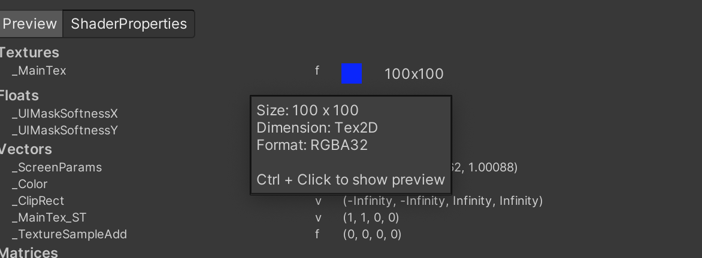

基本的に実際のゲームで無圧縮 32 bit フォーマットを使う機会は少ない。例外としては、タイトル画面などのキービジュアルや、重要なイベントの CG（スチル）である。このような画像はデザイナーやイラストレーターが意図したピクセルを全て完璧に再現する必要がある。また、この画像は雑誌や Web メディアにそのまま掲載されることが多いため、できるだけ劣化がないように表示したい。この場合には無圧縮 32bit フォーマットが最適である。

### 無圧縮 16bit

無圧縮 16bit フォーマットは、32 bit から 16 bit に減色して使用メモリ量を減らしたテクスチャフォーマットである。アルファ有りであれば `RGB4444` となり、アルファ無しであれば `RGB565` とするのが一般的である。

Unity のインポート設定で 16 bit テクスチャにすると単純に下位ビットを落として減色するため、汚いグラデーションが表示されてしまう。これを解決するツールとして Optpix などのような減色ツールが存在する。他にも、インポート時に誤差拡散法を適用することで画像の劣化を防ぐ方法が知られている。

- keijiro 氏の `RGBA444` 用変換ツール

    <https://github.com/keijiro/unity-dither4444>

- 上記を改良した `RGB565` 用変換ツール

    <https://blog.jp.uwa4d.com/2019/11/04/unity%E7%94%BB%E5%83%8F%E6%9C%80%E9%81%A9%E5%8C%96%E3%83%84%E3%83%BC%E3%83%AB/>

UI 用テクスチャとしては 16 bit テクスチャを使うことが多いかもしれないが、PVRTC/ETC/ASTC/DXT などの圧縮フォーマット（とアルファ専用テクスチャの組み合わせ）でも十分な品質が得られることもある。どのフォーマットを採用するかについてはエンジニアの独断で決めるのではなく、必ずデザイナーやイラストレーターやアートディレクターと相談すること。大切なことなのでもう一度書くが、どのフォーマットを採用するかについてはエンジニアの独断で決めるのではなく、必ずデザイナーやイラストレーターやアートディレクターと相談すること。

### PVRTC

PVRTC は、主に iOS 用のテクスチャフォーマットである。1 ピクセル当たりの bit 数とアルファの有無によって 4 種類のフォーマットが存在する。

| フォーマット | 1 ピクセル当たりの bit 数 | アルファの有無 |
| -- | -- | -- |
| PVRTC_RGBA4 | 4 | 有 |
| PVRTC_RGB4 | 4 | 無 |
| PVRTC_RGBA2 | 2 | 有 |
| PVRTC_RGB2  | 2 | 無 |

`PVRTC_RGBA4` や `PVRTC_RGBA2` は PowerVR を搭載した Android 端末でも対応しているが、PVRTC は実質的に iOS 専用のテクスチャフォーマットだと思ってよい。

変化が少ないテクスチャであれば `PVRTC_RGBA2` でも表現できるかもしれないが、実際のところは `PVRTC_RGBA4` でもかなり粗が目立つ。アルファ成分を含めるとかなり表現力が落ちるので、RGB のみとアルファのみの 2 つのファイルに分けて使った方が良いだろう。それでもピクセルあたり 8 bit となり、32 bit フォーマットに比べても 4 分の 1 のメモリ節約となる。

以下は、keijiro 氏による PVRTC や ETC1 でアルファテクスチャを別に持つ手法（<https://github.com/keijiro/unity-alphamask>）で使うことができる uGUI 用シェーダーである。実装内容としては、アルファマスク用として用意したテクスチャの R 成分のみを使って最終的なアルファ値を生成しているだけであるので、PVRTC や ETC1 以外でも利用可能である。

*Unity 2020.1 以降の UI デフォルトシェーダーを元にしたアルファマスクを使用するシェーダー*
```
Shader "UI/AlphaMask"
{
    Properties
    {
        [PerRendererData] _MainTex("Sprite Texture", 2D) = "white" {}

        // アルファマスク用テクスチャ（R 成分のみ使用する）
        _AlphaTex("Alpha", 2D) = "white" {}

        _Color("Tint", Color) = (1,1,1,1)

        _StencilComp("Stencil Comparison", Float) = 8
        _Stencil("Stencil ID", Float) = 0
        _StencilOp("Stencil Operation", Float) = 0
        _StencilWriteMask("Stencil Write Mask", Float) = 255
        _StencilReadMask("Stencil Read Mask", Float) = 255

        _ColorMask("Color Mask", Float) = 15

        [Toggle(UNITY_UI_ALPHACLIP)] _UseUIAlphaClip("Use Alpha Clip", Float) = 0
    }

        SubShader
    {
        Tags
        {
            "Queue" = "Transparent"
            "IgnoreProjector" = "True"
            "RenderType" = "Transparent"
            "PreviewType" = "Plane"
            "CanUseSpriteAtlas" = "True"
        }

        Stencil
        {
            Ref[_Stencil]
            Comp[_StencilComp]
            Pass[_StencilOp]
            ReadMask[_StencilReadMask]
            WriteMask[_StencilWriteMask]
        }

        Cull Off
        Lighting Off
        ZWrite Off
        ZTest[unity_GUIZTestMode]
        Blend One OneMinusSrcAlpha
        ColorMask[_ColorMask]

        Pass
        {
            Name "Default"
        CGPROGRAM
            #pragma vertex vert
            #pragma fragment frag
            #pragma target 2.0

            #include "UnityCG.cginc"
            #include "UnityUI.cginc"

            #pragma multi_compile_local _ UNITY_UI_CLIP_RECT
            #pragma multi_compile_local _ UNITY_UI_ALPHACLIP

            struct appdata_t
            {
                float4 vertex   : POSITION;
                float4 color    : COLOR;
                float2 texcoord : TEXCOORD0;
                UNITY_VERTEX_INPUT_INSTANCE_ID
            };

            struct v2f
            {
                float4 vertex   : SV_POSITION;
                fixed4 color : COLOR;
                float2 texcoord  : TEXCOORD0;

                // アルファマスク用 UV
                float2 alphacoord : TEXCOORD1;

                float4 worldPosition : TEXCOORD2;
                half4  mask : TEXCOORD3;
                UNITY_VERTEX_OUTPUT_STEREO
            };

            sampler2D _MainTex;

            // アルファマスク用テクスチャをプロパティから受け取る
            sampler2D _AlphaTex;

            fixed4 _Color;
            fixed4 _TextureSampleAdd;
            float4 _ClipRect;
            float4 _MainTex_ST;

            // アルファマスク用テクスチャの Tiling と Offset
            float4 _AlphaTex_ST;

            float _MaskSoftnessX;
            float _MaskSoftnessY;

            v2f vert(appdata_t v)
            {
                v2f OUT;
                UNITY_SETUP_INSTANCE_ID(v);
                UNITY_INITIALIZE_VERTEX_OUTPUT_STEREO(OUT);
                float4 vPosition = UnityObjectToClipPos(v.vertex);
                OUT.worldPosition = v.vertex;
                OUT.vertex = vPosition;

                float2 pixelSize = vPosition.w;
                pixelSize /= float2(1, 1) * abs(mul((float2x2)UNITY_MATRIX_P, _ScreenParams.xy));

                float4 clampedRect = clamp(_ClipRect, -2e10, 2e10);
                float2 maskUV = (v.vertex.xy - clampedRect.xy) / (clampedRect.zw - clampedRect.xy);
                OUT.texcoord = float4(v.texcoord.x, v.texcoord.y, maskUV.x, maskUV.y);

                // アルファマスク用 UV 設定
                OUT.alphacoord = TRANSFORM_TEX(v.texcoord.xy, _AlphaTex);

                OUT.mask = half4(v.vertex.xy * 2 - clampedRect.xy - clampedRect.zw, 0.25 / (0.25 * half2(_MaskSoftnessX, _MaskSoftnessY) + abs(pixelSize.xy)));

                OUT.color = v.color * _Color;
                return OUT;
            }

            fixed4 frag(v2f IN) : SV_Target
            {
                half4 color = (tex2D(_MainTex, IN.texcoord) + _TextureSampleAdd) * IN.color;

                // アルファマスクの色を受け取る
                half4 alphamask = tex2D(_AlphaTex, IN.alphacoord);

                // アルファマスクの R 成分をアルファに適用する
                color.a *= alphamask.r * alphamask.r * alphamask.r;

                #ifdef UNITY_UI_CLIP_RECT
                half2 m = saturate((_ClipRect.zw - _ClipRect.xy - abs(IN.mask.xy)) * IN.mask.zw);
                color.a *= m.x * m.y;
                #endif

                #ifdef UNITY_UI_ALPHACLIP
                clip(color.a - 0.001);
                #endif

                color.rgb *= color.a;

                return color;
            }
        ENDCG
        }
    }
}

```

*Unity 2019.4 以前の UI デフォルトシェーダーを元にしたアルファマスクを使用するシェーダー*
```
Shader "UI/LegacyAlphaMask"
{
    Properties
    {
        [PerRendererData] _MainTex("Base", 2D) = "white" {}

        // アルファマスク用テクスチャ（R 成分のみ使用する）
        _AlphaTex("Alpha", 2D) = "white" {}

        _Color("Tint", Color) = (1,1,1,1)

        _StencilComp("Stencil Comparison", Float) = 8
        _Stencil("Stencil ID", Float) = 0
        _StencilOp("Stencil Operation", Float) = 0
        _StencilWriteMask("Stencil Write Mask", Float) = 255
        _StencilReadMask("Stencil Read Mask", Float) = 255

        _ColorMask("Color Mask", Float) = 15

        [Toggle(UNITY_UI_ALPHACLIP)] _UseUIAlphaClip("Use Alpha Clip", Float) = 0
    }

    SubShader
    {
        Tags
        {
            "Queue" = "Transparent"
            "IgnoreProjector" = "True"
            "RenderType" = "Transparent"
            "PreviewType" = "Plane"
            "CanUseSpriteAtlas" = "True"
        }

        Stencil
        {
            Ref[_Stencil]
            Comp[_StencilComp]
            Pass[_StencilOp]
            ReadMask[_StencilReadMask]
            WriteMask[_StencilWriteMask]
        }

        Cull Off
        Lighting Off
        ZWrite Off
        ZTest[unity_GUIZTestMode]
        Blend SrcAlpha OneMinusSrcAlpha
        ColorMask[_ColorMask]

        Pass
        {
            Name "Default"
        CGPROGRAM
            #pragma vertex vert
            #pragma fragment frag
            #pragma target 2.0

            #include "UnityCG.cginc"
            #include "UnityUI.cginc"

            #pragma multi_compile_local _ UNITY_UI_CLIP_RECT
            #pragma multi_compile_local _ UNITY_UI_ALPHACLIP

            struct appdata_t
            {
                float4 vertex   : POSITION;
                float4 color    : COLOR;
                float2 texcoord : TEXCOORD0;
                UNITY_VERTEX_INPUT_INSTANCE_ID
            };

            struct v2f
            {
                float4 vertex   : SV_POSITION;
                fixed4 color : COLOR;
                float2 texcoord  : TEXCOORD0;

                // アルファマスク用 UV
                float2 alphacoord : TEXCOORD1;

                float4 worldPosition : TEXCOORD2;
                half4  mask : TEXCOORD3;
                UNITY_VERTEX_OUTPUT_STEREO
            };

            sampler2D _MainTex;

            // アルファマスク用テクスチャをプロパティから受け取る
            sampler2D _AlphaTex;

            fixed4 _Color;
            fixed4 _TextureSampleAdd;
            float4 _ClipRect;
            float4 _MainTex_ST;

            // アルファマスク用テクスチャの Tiling と Offset
            float4 _AlphaTex_ST;

            float _UIMaskSoftnessX;
            float _UIMaskSoftnessY;

            v2f vert(appdata_t v)
            {
                v2f OUT;
                UNITY_SETUP_INSTANCE_ID(v);
                UNITY_INITIALIZE_VERTEX_OUTPUT_STEREO(OUT);
                float4 vPosition = UnityObjectToClipPos(v.vertex);
                OUT.worldPosition = v.vertex;
                OUT.vertex = vPosition;

                float2 pixelSize = vPosition.w;
                pixelSize /= float2(1, 1) * abs(mul((float2x2)UNITY_MATRIX_P, _ScreenParams.xy));

                float4 clampedRect = clamp(_ClipRect, -2e10, 2e10);
                float2 maskUV = (v.vertex.xy - clampedRect.xy) / (clampedRect.zw - clampedRect.xy);
                OUT.texcoord = TRANSFORM_TEX(v.texcoord.xy, _MainTex);

                // アルファマスク用 UV 設定
                OUT.alphacoord = TRANSFORM_TEX(v.texcoord.xy, _AlphaTex);
                
                OUT.mask = half4(v.vertex.xy * 2 - clampedRect.xy - clampedRect.zw, 0.25 / (0.25 * half2(_UIMaskSoftnessX, _UIMaskSoftnessY) + abs(pixelSize.xy)));

                OUT.color = v.color * _Color;
                return OUT;
            }

            fixed4 frag(v2f IN) : SV_Target
            {
                half4 color = IN.color * tex2D(_MainTex, IN.texcoord);

                // アルファマスクの色を受け取る
                half4 alphamask = tex2D(_AlphaTex, IN.alphacoord);

                // アルファマスクの R 成分をアルファに適用する
                color.a *= alphamask.r * alphamask.r * alphamask.r;

                #ifdef UNITY_UI_CLIP_RECT
                half2 m = saturate((_ClipRect.zw - _ClipRect.xy - abs(IN.mask.xy)) * IN.mask.zw);
                color.a *= m.x * m.y;
                #endif

                #ifdef UNITY_UI_ALPHACLIP
                clip(color.a - 0.001);
                #endif

                return color;
            }
        ENDCG
        }
    }
}
```

なお、A8 プロセッサ（iPhone 6）以降の iOS 端末では ASTC フォーマットを利用することができるので、古い端末をサポートしないのであれば PVRTC の代わりに ASTC を利用することをおすすめする。

### ETC1
 
ETC1 は、OpenGLES 2.0 以上に対応した Android 端末で利用することができるテクスチャフォーマットである。iOS でも Unity 2017.3 以降であれば A7 チップ（iPhone5S）以降の端末の OpenGLES 2.0 以上または Metal で利用可能となっている。ただし、品質と使い勝手の観点から ETC1 が iOS で使われる機会はあまりない。ただし、プラットフォームごとのアセットの管理の手間を減らしたいのであれば iOS での利用価値もゼロではないが、実績の少ない環境は未知の不具合へ繋がる可能性があるのでおすすめはしない。

`TextureFormat` 列挙型としては `ETC_RGB4` と `ETC_RGB4Crunched` が定義されており、名前の通り 1 ピクセル当たり 4 bit を使用する。一番大きな特徴はアルファ成分が存在しないことである。つまり、PVRTC で言えば PVRTC_RGB4 と同様である。新しめの Android 端末であれば ETC2 や ASTC が使えるので、古い端末のサポートを切るのであれば ETC1 を積極的に使う理由は存在しない（が、実際にはまだ使われている）。

| フォーマット | 1 ピクセル当たりの bit 数 | アルファの有無 | 注釈 |
| -- | -- | -- | -- |
| ETC_RGB4 | 4 | 無し |  |
| ETC_RGB4Crunched | 4 | 無し | ETC_RGB4 の Crunch 圧縮 |

アルファ成分を持たないという ETC1 の欠点を解消するため、Unity の組み込みシェーダーには ETC1 専用の UI デフォルトシェーダーが用意されている。

*ETC1 専用 UI デフォルトシェーダー*
```
Shader "UI/DefaultETC1"
{
    Properties
    {
        [PerRendererData] _MainTex ("Sprite Texture", 2D) = "white" {}
        // アルファ用テクスチャ
        [PerRendererData] _AlphaTex("Sprite Alpha Texture", 2D) = "white" {}
        _Color ("Tint", Color) = (1,1,1,1)

        _StencilComp ("Stencil Comparison", Float) = 8
        _Stencil ("Stencil ID", Float) = 0
        _StencilOp ("Stencil Operation", Float) = 0
        _StencilWriteMask ("Stencil Write Mask", Float) = 255
        _StencilReadMask ("Stencil Read Mask", Float) = 255

        _ColorMask ("Color Mask", Float) = 15

        [Toggle(UNITY_UI_ALPHACLIP)] _UseUIAlphaClip ("Use Alpha Clip", Float) = 0
    }

    SubShader
    {
        Tags
        {
            "Queue"="Transparent"
            "IgnoreProjector"="True"
            "RenderType"="Transparent"
            "PreviewType"="Plane"
            "CanUseSpriteAtlas"="True"
        }

        Stencil
        {
            Ref [_Stencil]
            Comp [_StencilComp]
            Pass [_StencilOp]
            ReadMask [_StencilReadMask]
            WriteMask [_StencilWriteMask]
        }

        Cull Off
        Lighting Off
        ZWrite Off
        ZTest [unity_GUIZTestMode]
        Blend One OneMinusSrcAlpha
        ColorMask [_ColorMask]

        Pass
        {
            Name "Default"
        CGPROGRAM
            #pragma vertex vert
            #pragma fragment frag
            #pragma target 2.0

            #include "UnityCG.cginc"
            #include "UnityUI.cginc"

            #pragma multi_compile_local _ UNITY_UI_CLIP_RECT
            #pragma multi_compile_local _ UNITY_UI_ALPHACLIP

            struct appdata_t
            {
                float4 vertex   : POSITION;
                float4 color    : COLOR;
                float2 texcoord : TEXCOORD0;
            };

            struct v2f
            {
                float4 vertex   : SV_POSITION;
                fixed4 color    : COLOR;
                // アルファ用の UV はメインテクスチャの UV をそのまま使う
                float2 texcoord  : TEXCOORD0;
                float4 worldPosition : TEXCOORD1;
                half4  mask : TEXCOORD2;
            };

            sampler2D _MainTex;
            fixed4 _Color;
            fixed4 _TextureSampleAdd;
            float4 _ClipRect;
            // アルファ用の tiling と Offset はメインテクスチャのものを流用する
            float4 _MainTex_ST;
            float _MaskSoftnessX;
            float _MaskSoftnessY;

            v2f vert(appdata_t IN)
            {
                v2f OUT;
                float4 vPosition = UnityObjectToClipPos(IN.vertex);
                OUT.worldPosition = IN.vertex;
                OUT.vertex = vPosition;

                OUT.texcoord = TRANSFORM_TEX(IN.texcoord, _MainTex);

                #ifdef UNITY_HALF_TEXEL_OFFSET
                OUT.vertex.xy += (_ScreenParams.zw-1.0) * float2(-1,1) * OUT.vertex.w;
                #endif

                float2 pixelSize = vPosition.w;
                pixelSize /= float2(1, 1) * abs(mul((float2x2)UNITY_MATRIX_P, _ScreenParams.xy));

                float4 clampedRect = clamp(_ClipRect, -2e10, 2e10);
                float2 maskUV = (IN.vertex.xy - clampedRect.xy) / (clampedRect.zw - clampedRect.xy);
                OUT.texcoord = float4(IN.texcoord.x, IN.texcoord.y, maskUV.x, maskUV.y);
                OUT.mask = half4(IN.vertex.xy * 2 - clampedRect.xy - clampedRect.zw, 0.25 / (0.25 * half2(_MaskSoftnessX, _MaskSoftnessY) + abs(pixelSize.xy)));

                OUT.color = IN.color * _Color;
                return OUT;
            }

            sampler2D _AlphaTex;

            fixed4 frag(v2f IN) : SV_Target
            {
                fixed4 color = UnityGetUIDiffuseColor(IN.texcoord, _MainTex, _AlphaTex, _TextureSampleAdd) * IN.color;

                #ifdef UNITY_UI_CLIP_RECT
                    half2 m = saturate((_ClipRect.zw - _ClipRect.xy - abs(IN.mask.xy)) * IN.mask.zw);
                    color.a *= m.x * m.y;
                #endif

                #ifdef UNITY_UI_ALPHACLIP
                clip (color.a - 0.001);
                #endif

                color.rgb *= color.a;
                return color;
            }
        ENDCG
        }
    }
}
```

**ProjectSettings** の **Graphic** の中の **Always Included Shaders** に `UI/DefaultETC1` シェーダーを追加しておくと、ETC1 使用時に `Image` コンポーネントがこのシェーダーを UI デフォルトシェーダーとして使うようになる。

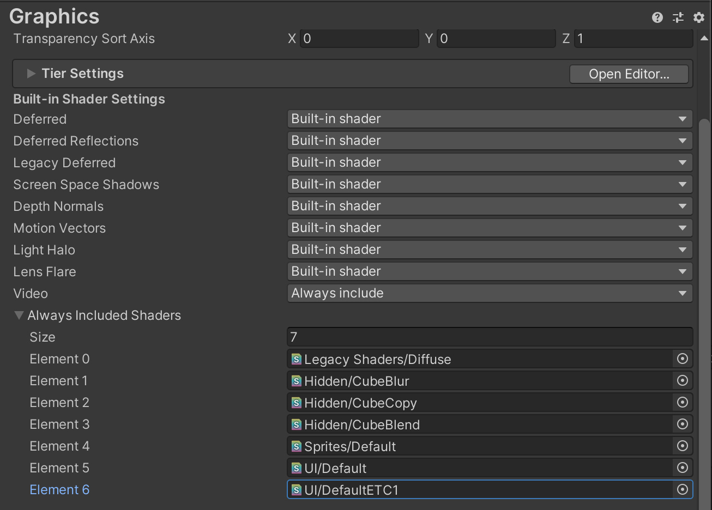

具体的には `Canvas.GetETC1SupportedCanvasMaterial()` が `UI/DefaultETC1` を使ったマテリアルを返すようになるので、`Image` クラスがマテリアルとしてそれを利用する形になっている。

*Packages/com.unity.ugui/Runtime/UI/Core/Image.cs*
```c#
        /// <summary>
        /// ETC1 とアルファテクスチャを使ったデフォルトのマテリアルのキャッシュ。
        /// </summary>
        /// <remarks>
        /// GetETC1SupportedCanvasMaterial() から得られた ETC1 をサポートしている Canvas のマテリアルを格納する。
        /// 注：ETC1 とアルファテクスチャのマテリアルを使うためには
        /// Always Included Shaders のリストに必ず UI/DefaultETC1 シェーダーを指定しておくこと
        /// </remarks>
        static public Material defaultETC1GraphicMaterial
        {
            get
            {
                if (s_ETC1DefaultUI == null)
                    s_ETC1DefaultUI = Canvas.GetETC1SupportedCanvasMaterial();
                return s_ETC1DefaultUI;
            }
        }

        /// <summary>
        /// この Image が使うマテリアル。
        /// マテリアルが何も指定されていない場合にはデフォルトマテリアルが使われる。
        /// </summary>
        public override Material material
        {
            get
            {
                if (m_Material != null)
                    return m_Material;
#if UNITY_EDITOR
                if (Application.isPlaying && activeSprite && activeSprite.associatedAlphaSplitTexture != null)
                    return defaultETC1GraphicMaterial;
#else

                if (activeSprite && activeSprite.associatedAlphaSplitTexture != null)
                    return defaultETC1GraphicMaterial;
#endif

                return defaultMaterial;
            }

            set
            {
                base.material = value;
            }
        }
```

ETC1 を使ってアルファ有りの描画を行いたいのであれば、PVRTC の項で説明したアルファマスクを使ったシェーダーを使っても実現できる。もっとも、`UI/DefaultETC1` シェーダーはアルファ用の UV を別個に用意しない分、PVRTC の項で説明したアルファマスクを使ったシェーダーよりも軽量であるので、特に凝ったことをしないのであれば `UI/DefaultETC1` シェーダーでも十分かもしれない。

また、Unity 2017.3 以降では Crunch 圧縮した ETC1 である `ETC_RGB4Crunched` フォーマットが利用可能である。**Inspector** の **Import Settings** で **Use crunch compression** のチェックボックスをオンにすると、不可逆圧縮である Crunch 圧縮が有効となり、テクスチャファイルサイズが小さくなる。

`ETC_RGB4Crunched` フォーマットを利用すると、画像にも依存するが 1 ピクセルあたり 1.3 bit 程度に圧縮される。これによって容量を削減したり、テクスチャファイルの読み込み時間を短くすることができる。実行時には `ETC_RGB4` に変換されてメモリ上へ展開されるが、その際のメモリ展開速度の劣化はほぼ見られない。ただし、画質がかなり劣化するため、プロダクトに耐えうる品質なのかは必ず目視で確認すること。

### ETC2

OpenGLES 3.0 以上に対応した Android 端末で利用することができるテクスチャフォーマットである。iOS でも Unity 2017.3 以降であれば A7 チップ（iPhone 5S）以降の端末の OpenGLES 3.0 以上または Metal で利用可能となっている。ETC1 と同様に iOS で使われる機会はあまりない。また、ETC1 と同様に Unity 2017.3 以降では Crunch 圧縮が利用可能となっている。

UI に使用するテクスチャフォーマットとしては、1 ピクセル 4 bit アルファ無しの `ETC2_RGB` か、1 ピクセル 8 bit アルファ有りの `ETC2_RGBA8` か、`ETC2_RGBA8` を Crunch 圧縮した `ETC2_RGBA8Crunched` の 3 つが選択肢となるだろう。他に `ETC2_RGBA1`、`EAC_R`、`EAC_R_SIGNED`、`EAC_RG`、`EAC_RG_SIGNED` などが存在しているが UI 用として使われることは稀である。

| フォーマット | 1 ピクセル当たりの bit 数 | アルファの有無 | 注釈 |
| -- | -- | -- | -- |
| ETC2_RGB | 4 | 無し |  |
| ETC2_RGBA8 | 8 | 有り |  |
| ETC2_RGBA8Crunched | 8 | 有り | ETC2_RGBA8 の Crunch 圧縮 |
| ETC2_RGBA1 | 4 | 有り | アルファは 1 bit |
| EAC_R | 4 | 無し | 符号無し R のみ |
| EAC_R_SIGNED | 4 | 無し | 符号有り R のみ |
| EAC_RG | 8 | 無し | 符号無し RG のみ |
| EAC_RG_SIGNED | 8 | 無し | 符号有り RG のみ |

画質とファイルサイズのバランス次第ではあるが、Android で ASTC を使えない場合には UI 用テクスチャには `ETC2_RGBA8Crunched` を使うことを検討し、もし Crunch 圧縮の画質に問題が見られるなら `ETC2_RGBA8` を代わりに使用するのが良いだろう。

### ASTC

新しめの iOS および Android 端末で利用することができるテクスチャフォーマットである。iOS であれば A8 チップ（iPhone 6）以降の端末の OpenGLES3.0 以上または Metal で利用可能なので、新規タイトルであれば採用しない理由は無い。Android であれば OpenGLES 3.2 と OpenGL ES 3.1+AEP GPU と一部の OpenGL ES 3.0 で利用可能であり、2016 年以降発売の端末であればほぼサポートしているであろう。

なお、Google が 2020 年 9 月に集計した Google Play デバイスでのテクスチャフォーマットのサポートの状況は以下の通りである。

<https://developer.android.com/guide/app-bundle/asset-delivery/texture-compression?hl=ja>

| テクスチャフォーマット | サポートしている Google Play デバイスの割合 |
| -- | -- |
| ETC1 | 99% |
| ETC2 | 87% |
| ASTC | 77% |
| ATC | 35% |
| PVRTC | 11% |
| DXT1 | 0.7% |

このように、ASTC をサポートしている端末が 77% となっている。この数字を使ってなんとか意思決定者を説得できるよう頑張ってほしい。

ASTC での 1 ピクセルあたりの bit 数はピクセルブロック次第で変わる。最も綺麗な 4x4 ピクセルブロックであれば 1 ピクセルあたり 8 bitだが、最も圧縮した 12x12 ピクセルブロックであれば 1 ピクセルあたり 0.89 bit となり、かなりデータを圧縮することができる。

| フォーマット | 1 ピクセル当たりの bit 数 | アルファの有無 |
| -- | -- | -- |
| ASTC_RGB_4x4 | 8 | 無し |
| ASTC_RGB_5x5 | 5.12 | 無し |
| ASTC_RGB_6x6 | 3.56 | 無し |
| ASTC_RGB_8x8 | 2 | 無し |
| ASTC_RGB_10x10 | 1.28 | 無し |
| ASTC_RGB_12x12 | 0.89 | 無し |
| ASTC_RGBA_4x4 | 8 | 有り |
| ASTC_RGBA_5x5 | 5.12 | 有り |
| ASTC_RGBA_6x6 | 3.56 | 有り |
| ASTC_RGBA_8x8 | 2 | 有り |
| ASTC_RGBA_10x10 | 1.28 | 有り |
| ASTC_RGBA_12x12 | 0.89 | 有り |

どのピクセルブロックを採用するかについては、アーティストの意見を踏まえて決定してほしいが、一般的には UI 用は `ASTC_RGBA_4x4`、3D の法線マップは `ASTC_RGB_8x8`、アルベドは `ASTC_RGB_10x10` くらいで良いだろう。

### DXT / BC

DirectX 用フォーマットである。UI 用としては `BC7` を採用するのが現実的だろう。

| フォーマット | 1 ピクセル当たりの bit 数 | アルファの有無 | 注釈 |
| -- | -- | -- | -- |
| DXT1 | 4 | 無し |  |
| DXT5 | 8 | 有り |  |
| DXT1Crunched | 4 | 無し | DXT1 の Crunch 圧縮 |
| DXT5Crunched | 8 | 無し | DXT5 の Crunsh 圧縮 |
| BC4 | 4 | 無し | R のみ |
| BC5 | 8 | 無し | R と G のみ |
| BC6H | 8 | 無し | HDR |
| BC7 | 8 | 有り |  |

`DXT5` は激しい色変化に弱いため、境界線をはっきり表示したい UI 関連に使うのは厳しいかもしれない。一方、`BC7` は圧縮に時間がかかるという欠点もあることには注意しておきたい。

## テクスチャのインポート設定

前述のように、テクスチャファイルのテクスチャフォーマットは **Inspector** の **Import Settings** から設定することが出来るが、Editor スクリプトから設定することも出来る。具体的には `UnityEditor.AssetPostprocessor` を継承したクラス内の `OnPreprocessTexture()` で `TextureImporter` を取得して各種設定を行っていけばよい。以下に独自のテクスチャインポート設定のサンプルを示す。

```c#
using UnityEngine;
using UnityEditor; // Editor スクリプトであることに注意

public class MyAssetImportProcessor : AssetPostprocessor
{
    private void OnPreprocessTexture()
    {
        // 各アセットのパスが assetPath として渡されてくるので、
        // それをつかって特定のフォルダだけ ImportSettings を一括設定したい
        if (assetPath.Contains("CompTextures"))
        {
            // 各アセットの AssetImporter（インポート設定）が assetImporter として渡されてくる
            TextureImporter textureImporter = (TextureImporter)assetImporter;

            // 各プラットフォームごとに設定値を入れる
            textureImporter.SetPlatformTextureSettings(new TextureImporterPlatformSettings
            {
                overridden = true,
                name = "Android",
                maxTextureSize = 4096,
                format = TextureImporterFormat.ETC2_RGBA8,
                allowsAlphaSplitting = false
            });
            textureImporter.SetPlatformTextureSettings(new TextureImporterPlatformSettings
            {
                overridden = true,
                name = "iPhone",
                maxTextureSize = 4096,
                format = TextureImporterFormat.PVRTC_RGBA4,
                allowsAlphaSplitting = false
            });
        }
    }
}
```

このスクリプトファイルを Editor フォルダなどの適切な場所に置くと、**ImportSettings** が設定されるので **Inspector** で確認できる。もし、設定されないようであれば、対象のフォルダやファイルを右クリックして **Reimport** を選択すると、このインポートスクリプトが実行されるはずである。

## RenderTexture

3D カメラでレンダリングした結果を画像として表示したいことはよくある。その際に使われるのが `RenderTexture` クラスである。

```c#
public RenderTexture(int width, int height, int depth, RenderTextureFormat format= RenderTextureFormat.Default, RenderTextureReadWrite readWrite= RenderTextureReadWrite.Default);
public RenderTexture(RenderTexture textureToCopy);
public RenderTexture(RenderTextureDescriptor desc); 
```

`RenderTexture` を新規に作成する場合、コンストラクタの引数として幅 / 高さ / デプスバッファの bit 数 / フォーマット / 色空間変換モードを渡す。幅と高さは 2 のべき乗であったり正方形である必要は無い。フォーマットは一般的な `RenderTextureFormat.ARGB32` を指定することが多い。

デプスバッファの bit 数は 0 / 16 / 24 を指定することができるが、特に理由が無ければ 24 を指定することをおすすめする。16 bit では `Mask` などで使用するステンシルバッファが作成されない。また、一部の Android 端末では 16 bit デプスがサポートされていないことがある。色空間変換モードは `RenderTextureReadWrite.Default` を指定しておけば、プロジェクトの設定に基づく色空間の変換（ガンマかリニアか）がそのまま適用される。更に細かく設定を指定したい場合は引数として `RenderTextureDescriptor` を渡すコンストラクタを呼ぶ方法もある。

`RenderTexture` を作成する際に注意すべき事項が 3 つある。

1. 事前に `SystemInfo.SupportsRenderTextureFormat()` を呼んで、サポートされているフォーマットなのか確認しよう。`RenderTextureFormat.ARGB32` はほぼ全てのプラットフォームでサポートされているが、16 bit テクスチャである `RenderTextureFormat.RGB565` をサポートしていない端末も存在する。作成前に確認して、サポートされていなければ `RenderTextureFormat.ARGB32` で作成するなどのフォールバックを用意して欲しい。

2. `RenderTexture` を `new` した直後はメモリ上のテクスチャは実際には作成されていない。作成されるタイミングは、自身がアクティブになったタイミング（`RenderTexture.active` がその `RenderTexture` を指したタイミング）である。確実にメモリ上にテクスチャを確保したいのであれば `Create()` を呼ぶ必要がある。基本的には　`new` で作成した直後に `Create()` を呼ぶことをおすすめする。

3. 自身で作成した `RenderTexture` は必ず `Release()` を呼んで解放しなければならない。`Release()` を呼ばないとメモリ上のテクスチャは解放されない。`RenderTexture` をメンバ変数として持っておいて `OnDestroy()` などで解放すると良いだろう。

これらをふまえて、カメラでレンダリングした結果を `RawImage` として表示するコードを以下に記載する。

```c#
using UnityEngine;
using UnityEngine.UI;

// カメラで描画した結果を RawImage として表示する
public class DrawRawImageFromCamera : MonoBehaviour
{
    private RenderTexture renderTexture;

    private void OnDestroy()
    {
        // RenderTexture は必ず Release する
        if (renderTexture != null)
        {
            renderTexture.Release();
        }
    }

    public void Draw(RawImage rawImage, Camera targetCamera, int width, int height, int depth = 24, RenderTextureFormat renderTextureFormat = RenderTextureFormat.ARGB32)
    {
        if (!SystemInfo.SupportsRenderTextureFormat(renderTextureFormat))
        {
            Debug.LogErrorFormat("サポートされていないフォーマットです {0}。ARGB32 を使います。", renderTextureFormat);
            return;
        }

        // RenderTexture を適切なサイズで作成する
        // 2 のべき乗サイズである必要は無い
        if (renderTexture == null)
        {
            renderTexture = new RenderTexture(width, height, depth, renderTextureFormat);
        }

        // new の直後は実際のレンダーターゲットが作成されていないので Create() を読んでおく
        renderTexture.Create();

        // カメラのレンダリング先を RenderTexture にする
        targetCamera.targetTexture = renderTexture;

        // RawImage で表示する画像を RenderTexture にする
        rawImage.texture = renderTexture;
    }
}
```

カメラが 1 回でも `RenderTexture` にレンダリングしたら、それ以降はカメラのレンダリングを無効にして負荷を減らす、といった最適化を行いたいと思うかもしれない。ただし、`RenderTexture` の中身が（スクリーンセーバーなどの外部的要因で）失われることもあることには注意したい。毎フレーム `RenderTexture` の `IsCreated()` メソッドを呼んで中身が失われていないかをチェックし、失われていたなら `Create()` を呼び、再度カメラのレンダリング結果を `RenderTexture` にレンダリングするようにしよう。

なお、カメラが 1 回レンダリングするまで待つ最も単純な方法は、1 フレーム待つことである。もし、厳密に待ちたいのであれば、`Camera.onPostRender` にコールバックを設定して、その中で目的のカメラかどうかを判定すれば良い。以下はそれを実現するための疑似コードである。

```c#
    {
        ...
        // コールバックを設定して、レンダリング後にフラグを
        Camera.onPostRender += OnCameraPostRender;

        yield return new WaitUntil(() => isRenderDone);
        ...
        // 不調になったコールバックは削除する
        Camera.onPostRender -= OnCameraPostRender;
    }

    public static void OnCameraPostRender(Camera cam)
    {
        // cam が目的のカメラかどうかなら
        isRenderDone = true;
    }    
```

## 画面解像度

### 画面解像度の取得/設定

現在実行中の画面解像度は `Screen.width` と `Screen.height` で取得することができる。画面解像度で一番気を付けたいのは、意図せず高い解像度になっていないかという点である。最近の PC やモバイルデバイスのハードウェア解像度は非常に高く、そのままの解像度でフルスクリーンにしてしまうと、レンダリング負荷が非常に高くなってしまう。これを防ぐため `Screen.SetResolution()` 呼んで、あまりにも高い解像度にならないように設定しておくことを強くおすすめする。

```c#
public static void SetResolution(int width, int height, bool fullscreen);
public static void SetResolution(int width, int height, bool fullscreen, int preferredRefreshRate= 0);
public static void SetResolution(int width, int height, FullScreenMode fullscreenMode, int preferredRefreshRate= 0); 
```

もしデバイスが `width` と `height` 一致する解像度をサポートしていない場合には最も近い解像度が選択される。フルスクリーンでサポートしている解像度の一覧は `Screen.resolutions` から取得することが出来るので、その中から解像度を選択するのが安全である。

*解像度一覧を出力するサンプルコード*
```c#
Resolution[] resolutions = Screen.resolutions;
foreach (var res in resolutions)
{
    Debug.LogFormat("{0} x {1} : {2}", res.width, res.height, res.refreshRate);
}
```

Android 端末では `Screen.resolutions` は空の配列あるいは現在の解像度のみを返したりするが、任意の解像度を設定することができる（はずである）。

リフレッシュレートを指定する `preferredRefreshRate` に `0` が指定されると（これがデフォルトの挙動だが）最も高いリフレッシュレートが選択される。もし `preferredRefreshRate` に `0` 以外が指定されたものの、そのリフレッシュレートをサポートしていない場合には最も高いリフレッシュレートが選択される。

解像度の切り替えは現在のフレーム完了後に行われる。基本的には起動時に呼ぶのが良いだろう。また、Editor 上では `Screen.SetResolution()` の効果を見ることは出来ないので、必ず実機で確認してほしい。

### Editor での画面解像度の取得

Editor では `Screen.width` および `Screen.height` が **Game View** の正確な解像度を返さないことがある。Editor 上で実行中の場合、一番信頼できるのは `UnityEditor.UnityStats.screenRes` から返されてくる文字列である。`UnityEditor.UnityStats.screenRes` は `"640x1136"` のような文字列を返してくるので、これを利用すれば良い。

```c#
int screenWidth = Screen.width;
int screenHeight = Screen.height;

#if UNITY_EDITOR
string[] editorScreenRes = UnityEditor.UnityStats.screenRes.Split('x');
if (editorScreenRes.Length >= 2)
{
    if (int.TryParse(editorScreenRes[0], out int editorScreenResWidth))
    {
        if (int.TryParse(editorScreenRes[1], out int editorScreenResHeight))
        {
            screenWidth = editorScreenResWidth;
            screenHeight = editorScreenResHeight;
        }
    }
}
#endif
```

# Chapter 4 Graphic 

## Graphic コンポーネント

```c#
[DisallowMultipleComponent]
[RequireComponent(typeof(RectTransform))]
[ExecuteAlways]
public abstract class Graphic : UIBehaviour, ICanvasElement
```

`Graphic` クラスは、目に見える UI コンポーネント全ての基底クラスである。目に見える UI コンポーネントを独自に作成する場合はこのクラスを継承するのが一番楽だろう。例として `RectTransform` の領域いっぱいに矩形を表示するコンポーネントを以下に示す。

```c#
using UnityEngine;
using UnityEngine.UI;

// Editor モードでの Scene ビューでも表示したいので ExecuteAlways を指定する
[ExecuteAlways]
// CanvasRenderer がアタッチされていないと描画されない
[RequireComponent(typeof(CanvasRenderer))]
// RectTransform いっぱいに色の付いた矩形を表示する
public class SimpleImage : Graphic
{
    protected override void OnPopulateMesh(VertexHelper vh)
    {
        // 左下の頂点
        Vector2 vertexLeftBottom = Vector2.zero;

        // 右上の頂点
        Vector2 vertexRightTop = Vector2.zero;

        float width = rectTransform.rect.width;
        float height = rectTransform.rect.height;

        // 左下と右上の頂点位置を RectTransform の領域いっぱいにする
        vertexLeftBottom.x = (0 - rectTransform.pivot.x) * width;
        vertexLeftBottom.y = (0 - rectTransform.pivot.y) * height;        
        vertexRightTop.x = (1 - rectTransform.pivot.x) * width;
        vertexRightTop.y = (1 - rectTransform.pivot.y) * height;

        // このメッシュの頂点をクリア
        vh.Clear();

        // 追加していく各頂点
        UIVertex vert = UIVertex.simpleVert;

        // 位置と色を設定して VertexHelper に渡していく
        vert.position = new Vector2(vertexLeftBottom.x, vertexLeftBottom.y);
        vert.color = color;
        vh.AddVert(vert);

        vert.position = new Vector2(vertexLeftBottom.x, vertexRightTop.y);
        vert.color = color;
        vh.AddVert(vert);

        vert.position = new Vector2(vertexRightTop.x, vertexRightTop.y);
        vert.color = color;
        vh.AddVert(vert);

        vert.position = new Vector2(vertexRightTop.x, vertexLeftBottom.y);
        vert.color = color;
        vh.AddVert(vert);

        // VertexHelper に渡した 4 つの頂点を使って 2 つの三角形を設定する
        vh.AddTriangle(0, 1, 2);
        vh.AddTriangle(2, 3, 0);
    }
}
```

`VertexHelper` クラスは UI のメッシュ生成を支援するためのユーティリティクラスである。`Graphic` クラスは `VertexHelper` を static 変数として保持している。

```c#
[NonSerialized] private static readonly VertexHelper s_VertexHelper = new VertexHelper();
```

`Graphic` クラスは、この static な `VertexHelper` を使って自身のメッシュの頂点を生成する。`VertexHelper` の詳細については後述する。

### Graphic の static プロパティ

#### defaultGraphicMaterial

```c#
public static Material defaultGraphicMaterial { get; }
```

マテリアルが指定されていない場合に使われるマテリアルを取得する。実際には `Canvas.GetDefaultCanvasMaterial()` で返ってきたマテリアルを `static` 変数としてキャッシュして保持している。

### Graphic クラスのプロパティ

#### canvas

```c#
public Canvas canvas { get; }
```

このコンポーネントが属している `Canvas` を取得する。

`Canvas` がネストしている場合には最も近いものを返す。

このプロパティに初回アクセスした際に `GetComponentsInParent()` が呼ばれて親の `Canvas` がキャッシュされ、それが返される。`GetComponentsInParent()` のオーバーヘッドを避けたいのであればこのプロパティではなく、（**Inspector** で設定するなどして）自前で `Canvas` への参照を保持したほうが良い。

#### canvasRenderer

```c#
public CanvasRenderer canvasRenderer { get; }
```

このコンポーネントが利用している `CanvasRenderer` を取得する。

`CanvasRenderer` が `null` でなかったなら、その値はキャッシュされる。

#### color

```c#
public virtual Color color { get; set; }
```

頂点カラーとして使われる色を取得/設定する。

以前のものと異なる色が設定された場合には `SetVerticesDirty()` が呼ばれてジオメトリがダーティとなり、後に Graphic リビルドが発生する。

#### defaultMaterial

```c#
public virtual Material defaultMaterial { get; }
```

`defaultGraphicMaterial` をそのまま取得する。

#### depth

```c#
public int depth { get; }
```

`Canvas` 内での順番を取得する。

`Canvas` 直下で一番上の要素を `0` として、その子あるいはその下が `1` といった形になる。実態としては `CanvasRenderer.absoluteDepth` が返されている。

初回フレームが完了する前、あるいは `GameObject` が非アクティブだったりして `Canvas` のレンダリング対象から外れている場合には `-1` という値が得られる。

この値は `GraphicRaycaster` のレイキャストの結果を並び替える際に使われている。

#### mainTexture

```c#
public virtual Texture mainTexture { get; }
```

この `Graphic` で使われるメインのテクスチャを取得する。

`Graphic` クラスの `mainTexture` は `Texture2D.whiteTexture` を返すだけなので、派生したクラスそれぞれで `override` して実装する前提である。

#### material

```c#
public virtual Material material { get; set; }
```

マテリアルを取得/設定する。

マテリアルが設定されていなければ `defaultMaterial` が返される。以前のものと異なるマテリアルが設定された場合には `SetMaterialDirty()` が呼ばれてマテリアルがダーティとなり、後に Graphic リビルドが発生する。

#### materialForRendering

```c#
public virtual Material materialForRendering { get; }
```

`CanvasRenderer` がレンダリングのために実際に使うマテリアルを取得する。

通常のマテリアルであれば `material` そのものが返されるが、`MaskableGraphic` や `Mask` などの `IMaterialModifier` インターフェースを実装したコンポーネントがアタッチされているのであれば `IMaterialModifier.GetModifiedMaterial()` を通して変換したマテリアルが返されることになる。このような実装により、元のマテリアルに影響を与えることなくレンダリングに使うマテリアルを変更するということが実現できている。
 
#### raycastPadding

```c#
public Vector4 raycastPadding { get; set; }
```

レイキャストの領域を広げるためのパディングを取得/設定する。

このプロパティは Unity 2020.1 から導入された。小さいボタンが押しにくい場合にタッチ可能な領域を拡大したり、逆に縮小したりする場合に使うことができる。`Vector4` の `x` が左、`y` が下、`z` が右、`w` が上となっている。負の値であれば領域が大きくなり、正の値であれば領域が小さくなる。

#### raycastTarget

```c#
public virtual bool raycastTarget { get; set; }
```

このオブジェクトがレイキャストのターゲットであるか（つまりタッチ判定が有効か）を取得/設定する。

設定を変更する度に `GraphicRegistry.RegisterRaycastGraphicForCanvas()` あるいは `GraphicRegistry.UnregisterRaycastGraphicForCanvas()` が呼ばれ、レイキャスト対象としての登録/解除が行われる。

#### rectTransform

```c#
public RectTransform rectTransform { get; }
```

`RectTransform` を取得する。

`GetComponent()` で取得してキャッシュしたものを返しているので、2 回目以降の呼び出し時のオーバーヘッドは無い。

### Graphic の public メソッド

#### CrossFadeAlpha

```c#
public virtual void CrossFadeAlpha(float alpha, float duration, bool ignoreTimeScale);
```

`CanvasRenderer` の色のアルファ値を時間経過とともに徐々に変化させる。

uGUI 内部専用のトゥイーニング機能（`UnityEngine.UI.CoroutineTween`）によって実装されているが、実態は `Coroutine` である。

`ignoreTimeScale` が `true` であれば、`Time.timeScaleの` の影響を受けない `Time.unscaledDeltaTime` が経過時間の計測に使われる。逆に `ignoreTimeScale` が `false` であれば、`Time.deltaTime` が経過時間の計測に使われる。

#### CrossFadeColor

```c#
public virtual void CrossFadeColor(Color targetColor, float duration, bool ignoreTimeScale, bool useAlpha);
public virtual void CrossFadeColor(Color targetColor, float duration, bool ignoreTimeScale, bool useAlpha, bool useRGB);
```

`CrossFadeAlpha()` と同様に `CanvasRenderer` の色を時間経過とともに徐々に変化させる。`useAlpha` が `true` であればアルファ値が変化し、`useRGB` が `true` であれば RGB 成分が変化する。当然ながら `useAlpha` も `useRGB` も `false` であれば何も発生しない。

#### GetPixelAdjustedRect

```c#
public Rect GetPixelAdjustedRect();
```

現在の `RectTransform` の `rect` をピクセルパーフェクトに変換した（つまり、座標を最も近い整数に丸めた）`Rect` を返す。

ただし、`Canvas` の `renderMode` が `WorldSpace` であったり、`pixelPerfect` が `false` であったりした場合には `rect` そのものが返される。

#### GraphicUpdateComplete

```c#
public virtual void GraphicUpdateComplete();
```

このメソッドは Graphic リビルドが完了した際に（`ICanvasElement` インターフェースを通じて）`CanvasUpdateRegistry` から呼ばれる。

#### LayoutComplete

```c#
public virtual void LayoutComplete();
```

このメソッドは Layout リビルドが完了した際に（`ICanvasElement` インターフェースを通じて）`CanvasUpdateRegistry` から呼ばれる。

#### OnCullingChanged

```c#
public virtual void OnCullingChanged();
```

このメソッドは `CanvasRenderer` の `cull` が変更された際に呼ばれる。

`cull` が `false` になった際（つまり、通常通りにレンダリングされるようになった際）に頂点あるいはマテリアルがダーティであれば `CanvasUpdateRegistry.RegisterCanvasElementForGraphicRebuild()` に自身を登録する。

#### OnRebuildRequested

```c#
public virtual void OnRebuildRequested();
```

アセットが再インポートされるなどして Graphic リビルドが要求された場合に呼ばれる。

Editor Mode でのみ呼ばれる。

#### PixelAdjustPoint

```c#
public Vector2 PixelAdjustPoint(Vector2 point);
```

引数で与えられたピクセルのローカル位置をピクセルパーフェクトに変換して返す。

ただし、`Canvas` の `renderMode` が WorldSpace であったり、`pixelPerfect` が `false` であったりした場合には変換せずに返す。

#### Raycast

```c#
public virtual bool Raycast(Vector2 sp, Camera eventCamera);
```

`sp` で指定された点がレイキャストの有効な位置であれば `true` を返す。

通常は `Canvas` にアタッチされた `GraphicRaycaster` コンポーネントの `Raycast()` メソッドから呼ばれる。

このメソッドが呼ばれる前に `GraphicRaycaster.Raycast()` 内で `RectTransform` の `rect` を元にしてレイキャスト判定が行われる。`rect` 範囲外であれば `Graphic.Raycast()` は呼ばれない。

このメソッドは、同一 `GameObject` にアタッチされている `ICanvasRaycastFilter` インターフェースを実装したコンポーネント（例：`Image`、`Mask`、`RectMask2D`）を探し、それらのうちのいずれかの `IsRaycastLocationValid()` が `false` なら `false` を返す。`IsRaycastLocationValid()` が `false` を返すコンポーネントが見つからなければ、親の階層に上がって判定を繰り返す。

`Text` などの `ICanvasRaycastFilter` インターフェースを実装していないコンポーネントの場合には `true` が返される。つまり、`Text` では `RectTransform` の `rect` 内外の判定そのままがレイキャスト判定に使われる。

#### SetLayoutDirty

```c#
public virtual void SetLayoutDirty();
```

Layout がダーティであるとマークする。

もし、`RegisterDirtyLayoutCallback()` によってコールバックが設定されていたなら、それを呼び出す。レイアウトがダーティであるとマークされると、`CanvasUpdateRegistry.PerformUpdate()` 経由で Layout リビルドが行われる。このレイアウトリビルド時の負荷は **Profiler** の UI エリアの **Layout** として計測される。

#### SetMaterialDirty

```c#
public virtual void SetMaterialDirty();
```

マテリアルがダーティであるとマークする。

もし、`RegisterDirtyMaterialCallback()` によってコールバックが設定されていたなら、それを呼び出す。マテリアルがダーティであるとマークされると、`CanvasUpdateRegistry.PerformUpdate()` 経由で Graphic リビルドが行われる。この時の負荷は **Profiler** の UI エリアの **Render** として計測される。

#### SetVerticesDirty

```c#
public virtual void SetVerticesDirty();
```

頂点がダーティであるとマークする。

もし、`RegisterDirtyMaterialCallback()` でコールバックが設定されていたなら、それを呼び出す。頂点がダーティであるとマークされると、マテリアルがダーティであった場合と同様に `CanvasUpdateRegistry.PerformUpdate()` 経由で Graphic リビルドが行われる。この時の負荷は Profiler の UI エリアの **Render** として計測される。

#### SetAllDirty

```c#
public virtual void SetAllDirty();
```

Layout とマテリアルと頂点がダーティでであるとマークする。

通常は `SetLayoutDirty()` と `SetMaterialDirty()` と `SetVerticesDirty()` の 3 つのメソッドが呼ばれるが、スプライトシートアニメーションなどでレイアウトとマテリアルに変更がないことが分かっている場合には前者 2 つはスキップされる。このスキップ処理は `m_SkipLayoutUpdate` と `m_SkipMaterialUpdate` 変数を使って行われている。

*Graphic での m_SkipLayoutUpdate と m_SkipMaterialUpdate の定義*
```c#
[NonSerialized] protected bool m_SkipLayoutUpdate;
[NonSerialized] protected bool m_SkipMaterialUpdate;
```

*Image の sprite プロパティ内部の実装*
```c#
public Sprite sprite
{
    ...
    set
    {
        m_SkipLayoutUpdate = m_Sprite.rect.size.Equals(value ? value.rect.size : Vector2.zero);
        m_SkipMaterialUpdate = m_Sprite.texture == (value ? value.texture : null);
        m_Sprite = value;

        SetAllDirty();
        ...
    }
    ...
```

これらは `protected` 変数なので、`Graphic` を継承したクラス内で適宜 `true` にすることで冗長なレイアウトおよびマテリアルの更新処理をスキップすることができる。

#### Rebuild

```c#
public virtual void Rebuild(CanvasUpdate update);
```

Canvas リビルドの `PreRender` ステージにおいてジオメトリとマテリアルのリビルドを行う。

頂点がダーティであれば `UpdateGeometry()` を呼び、マテリアルがダーティであれば `UpdateMaterial()` を呼び出す。

#### RegisterDirtyLayoutCallback

```c#
public void RegisterDirtyLayoutCallback(UnityAction action);
```

`SetLayoutDirty()` が呼ばれた後に追加で行いたい処理を設定する。

*TextGenerator を使ってはみ出た文字を ellipsis（…）で省略する* の項のサンプルコードの `ApplyTextEllipsis` コンポーネントで使用している。

#### RegisterDirtyMaterialCallback

```c#
public void RegisterDirtyMaterialCallback(UnityAction action);
```

（マテリアルがダーティであるとマークするために）`SetMaterialDirty()` が呼ばれた後に追加で行いたい処理を設定する。

#### RegisterDirtyVerticesCallback

```c#
public void RegisterDirtyVerticesCallback(UnityAction action);
```

（頂点がダーティであるとマークするために）`SetVerticesDirty()` が呼ばれた後に追加で行いたい処理を設定する。

#### UnregisterDirtyLayoutCallback

```c#
public void UnregisterDirtyLayoutCallback(UnityAction action);
```

`RegisterDirtyLayoutCallback` で登録したコールバックを解除する。

#### UnregisterDirtyMaterialCallback

```c#
public void UnregisterDirtyMaterialCallback(UnityAction action);
```

`RegisterDirtyMaterialCallback` で登録したコールバックを解除する。

#### UnregisterDirtyVerticesCallback

```c#
public void UnregisterDirtyVerticesCallback(UnityAction action);
```

`RegisterDirtyVerticesCallback` で登録したコールバックを解除する。

#### SetNativeSize

```c#
public virtual void SetNativeSize();
```

サイズをピクセルパーフェクトなサイズに調整する。

`Graphic` クラスでの実装は空なので、必要があれば子クラスで実装しなければならない。

`Image` の `sprite` が設定されている場合に **Inspector** に表示される **Set Native Size** ボタンを押された時に呼ばれる。**Set Native Size** が押されると、`RectTransform` のサイズは `Sprite` の大きさと同一になる。もし、`Sprite` の `pixelsPerUnit` がデフォルトの `100` ではなく `200` だったとすると、`RectTransform` のサイズはスプライトの半分になる（正確には `CanvasScaler` の `referencePixelsPerUnit` を `Sprite` の `pixelsPerUnit` で割った数が掛けられる）。

### Graphic クラスの protected メソッド

本書では基本的には `protected` メソッドの解説は行っていないが、`Graphic` クラスについては継承して独自のクラスを作成する機会も多いので解説する。

#### OnPopulateMesh

```c#
protected virtual void OnPopulateMesh(VertexHelper vh);
```

UI 要素が頂点を生成する際に呼ばれる。

`Graphic` クラスを継承して独自の頂点で描画を実現したい場合、このメソッドを `override` することになる。

引数として渡された `VertexHelper` に頂点を足しておくと、後にその頂点が描画される。実際に `Graphic.OnPopulateMesh()` の実装を見るのが分かりやすいだろう。

*Graphic.OnPopulateMesh() の実装*
```c#
protected virtual void OnPopulateMesh(VertexHelper vh)
{
    // ピクセルパーフェクトな Rect を取得する
    var r = GetPixelAdjustedRect();

    // 矩形の頂点の位置を表す Vector4 を生成
    var v = new Vector4(r.x, r.y, r.x + r.width, r.y + r.height);

    // 頂点カラーはメンバ変数に設定されているものを使う
    Color32 color32 = color;

    // VertexHelper に既に設定済みの頂点は削除
    vh.Clear();

    // 矩形の頂点情報を足していく。第 3 引数は UV。
    vh.AddVert(new Vector3(v.x, v.y), color32, new Vector2(0, 0));
    vh.AddVert(new Vector3(v.x, v.w), color32, new Vector2(0, 1));
    vh.AddVert(new Vector3(v.z, v.w), color32, new Vector2(1, 1));
    vh.AddVert(new Vector3(v.z, v.y), color32, new Vector2(1, 0));

    // 設定した頂点を使って 2 つの三角形を設定
    vh.AddTriangle(0, 1, 2);
    vh.AddTriangle(2, 3, 0);
}
```

#### UpdateGeometry

```c#
protected virtual void UpdateGeometry();
```

頂点がダーティであった場合に Canvas リビルドの `PreRender` ステージで呼ばれる。

`OnPopulateMesh()` で頂点を生成し、その頂点を使ってメッシュを生成し、描画したい頂点データを `CanvasRenderer` に渡す。

#### UpdateMaterial

```c#
protected virtual void UpdateMaterial();
```

マテリアルがダーティであった場合に Canvas リビルドの `PreRender` ステージで呼ばれる。

描画したいマテリアルとテクスチャを `CanvasRenderer` にマテリアルとテクスチャを渡す。

## VertexHelper クラス

```c#
public class VertexHelper : IDisposable
```

`VertexHelper` は `CanvasRenderer` に渡すメッシュを生成する際に役立つヘルパークラスである。`Graphic` コンポーネントが `VertexHelper` を利用している。`Graphic` が描画したいメッシュを `CanvasRenderer` に渡す流れは以下の通りである。

1. `OnPopulateMesh()` で `VertexHelper` に頂点を設定し、その頂点から三角形を指定する。

2. `VertexHelper` に設定された三角形からメッシュを生成する。

3. 生成したメッシュを `CanvasRenderer` に渡す。

最終的に `CanvasRenderer` にメッシュを渡せば UI の描画は実現できるので、`VertexHelper` は必須のクラスではない。`VertexHelper` はあくまでメッシュを生成するための便利なクラスである。

### VertexHelper のプロパティ

#### currentIndexCount

```c#
public int currentIndexCount { get; }
```

`VertexHelper` に設定されているインデックスの数を取得する。

後述する `currentVertCount()` でサンプルを示す。

#### currentVertCount

`VertexHelper` に設定されている頂点の数を取得する。

以下のサンプルコードでは `currentVertCount` として（`AddVert()` で設定した頂点の数である）`4` が返り、`currentIndexCount` として（2 つの三角形分の）`6` が返ってくる。

```c#
public class VertexHelperSample1 : Graphic
{
    protected override void OnPopulateMesh(VertexHelper vh)
    {
        var r = GetPixelAdjustedRect();
        var v = new Vector4(r.x, r.y, r.x + r.width, r.y + r.height);
        Color32 color32 = color;

        vh.Clear();

        vh.AddVert(new Vector3(v.x, v.y), color32, new Vector2(0, 0));
        vh.AddVert(new Vector3(v.x, v.w), color32, new Vector2(0, 1));
        vh.AddVert(new Vector3(v.z, v.w), color32, new Vector2(1, 1));
        vh.AddVert(new Vector3(v.z, v.y), color32, new Vector2(1, 0));

        vh.AddTriangle(0, 1, 2);
        vh.AddTriangle(2, 3, 0);

        Debug.Log(vh.currentVertCount); // 4 を出力
        Debug.Log(vh.currentIndexCount); // 6 を出力
    }
}
```

### VertexHelper の public メソッド

#### Clear

```c#
public void Clear();
```

既に設定済みの頂点/インデックス/色/UV などのデータを `VertexHelper` から削除する。

#### AddVert

```c#
public void AddVert(UIVertex v);
public void AddVert(Vector3 position, Color32 color, Vector4 uv0);
public void AddVert(Vector3 position, Color32 color, Vector4 uv0, Vector4 uv1, Vector3 normal, Vector4 tangent);
public void AddVert(Vector3 position, Color32 color, Vector4 uv0, Vector4 uv1, Vector4 uv2, Vector4 uv3, Vector3 normal, Vector4 tangent);
```

`VertexHelper` に頂点を 1 つ設定する。

このメソッドで行っているのはあくまで頂点の追加でしかないので、三角形を生成するためには頂点を指定して `AddTriangle()` を呼ぶ必要がある。

#### AddTriangle

```c#
public void AddTriangle(int idx0, int idx1, int idx2);
```

`AddVert()` で追加した頂点を 3 つ指定して、`VertexHelper` に三角形を 1 つ設定する。

実際にはインデックスのリストにこれらの 3 つのインデックスが追加される。

#### AddUIVertexStream

```c#
public void AddUIVertexStream(List<UIVertex> verts, List<int> indices);
```

`UIVertex` およびインデックスのリストを渡して、メッシュに必要なデータを設定する。

`AddVert()` および `AddTriangle()` の代わりに `AddUIVertexStream()` を使って矩形を描画するサンプルコードは以下の通りである。

```c#
public class VertexHelperSample2 : Graphic
{
    protected override void OnPopulateMesh(VertexHelper vh)
    {
        var r = GetPixelAdjustedRect();
        var v = new Vector4(r.x, r.y, r.x + r.width, r.y + r.height);
        Color32 color32 = color;

        vh.Clear();

        List<UIVertex> verts = new List<UIVertex>();
        List<int> indices = new List<int>();

        verts.Add(new UIVertex()
        {
            position = new Vector3(v.x, v.y),
            color = color32,
            uv0 = new Vector2(0, 0),
        });
        verts.Add(new UIVertex()
        {
            position = new Vector3(v.x, v.w),
            color = color32,
            uv0 = new Vector2(0, 1),
        });
        verts.Add(new UIVertex()
        {
            position = new Vector3(v.z, v.w),
            color = color32,
            uv0 = new Vector2(1, 1),
        });
        verts.Add(new UIVertex()
        {
            position = new Vector3(v.z, v.y),
            color = color32,
            uv0 = new Vector2(1, 0),
        });

        indices.Add(0);
        indices.Add(1);
        indices.Add(2);

        indices.Add(2);
        indices.Add(3);
        indices.Add(0);

        vh.AddUIVertexStream(verts, indices);
    }
}
```

#### AddUIVertexTriangleStream

```c#
public void AddUIVertexTriangleStream(List<UIVertex> verts);
```

複数の三角形を構成する `UIVertex` のリストを渡して、メッシュに必要なデータを設定する。

インデックスのリストは渡さなくても構わないが、その代わりに渡す頂点の数は 3 の倍数でなければならない。矩形を描画する場合は渡す頂点が重複することになるので効率は悪い。

`AddVert()` および `AddTriangle()` の代わりに `AddUIVertexStream()` を使って矩形を描画するサンプルを以下に示す。

```c#
public class VertexHelperSample3 : Graphic
{
    protected override void OnPopulateMesh(VertexHelper vh)
    {
        var r = GetPixelAdjustedRect();
        var v = new Vector4(r.x, r.y, r.x + r.width, r.y + r.height);
        Color32 color32 = color;

        vh.Clear();

        List<UIVertex> verts = new List<UIVertex>();

        // 1 つ目の三角形の頂点
        verts.Add(new UIVertex()
        {
            position = new Vector3(v.x, v.y),
            color = color32,
            uv0 = new Vector2(0, 0),
        });
        verts.Add(new UIVertex()
        {
            position = new Vector3(v.x, v.w),
            color = color32,
            uv0 = new Vector2(0, 1),
        });
        verts.Add(new UIVertex()
        {
            position = new Vector3(v.z, v.w),
            color = color32,
            uv0 = new Vector2(1, 1),
        });

        // 2 つ目の三角形の頂点
        verts.Add(new UIVertex()
        {
            position = new Vector3(v.z, v.w),
            color = color32,
            uv0 = new Vector2(1, 1),
        });
        verts.Add(new UIVertex()
        {
            position = new Vector3(v.z, v.y),
            color = color32,
            uv0 = new Vector2(1, 0),
        });
        verts.Add(new UIVertex()
        {
            position = new Vector3(v.x, v.y),
            color = color32,
            uv0 = new Vector2(0, 0),
        });

        vh.AddUIVertexTriangleStream(verts);
    }
}
```

#### AddUIVertexQuad

```c#
public void AddUIVertexQuad(UIVertex[] verts);
```

1 つの矩形を構成する `UIVertex` の配列を渡して、メッシュに必要なデータを設定する。

単に 1 つの矩形を描画したいだけであればこのメソッドを使うのがお手軽である。以下にサンプルコードを示す。

```c#
public class VertexHelperSample4 : Graphic
{
    protected override void OnPopulateMesh(VertexHelper vh)
    {
        var r = GetPixelAdjustedRect();
        var v = new Vector4(r.x, r.y, r.x + r.width, r.y + r.height);
        Color32 color32 = color;

        vh.Clear();

        UIVertex[] verts = new UIVertex[4];

        // 矩形の頂点 4 つ
        verts[0] = new UIVertex()
        {
            position = new Vector3(v.x, v.y),
            color = color32,
            uv0 = new Vector2(0, 0),
        };

        verts[1] = new UIVertex()
        {
            position = new Vector3(v.z, v.y),
            color = color32,
            uv0 = new Vector2(1, 0),
        };

        verts[2] = new UIVertex()
        {
            position = new Vector3(v.z, v.w),
            color = color32,
            uv0 = new Vector2(1, 1),
        };

        verts[3] = new UIVertex()
        {
            position = new Vector3(v.x, v.w),
            color = color32,
            uv0 = new Vector2(0, 1),
        };

        vh.AddUIVertexQuad(verts);
    }
}
```

#### Dispose

```c#
public void Dispose();
```

割り当てられたメモリを解放する。

`VertexHelper` は static クラスである `UnityEngine.UI.ListPool` を使って頂点などのオブジェクトのプールを利用しているので、`IDisposable` インターフェースを実装して `Dispose()` 内で明示的にメモリの解放を行う必要がある。

#### FillMesh

```c#
public void FillMesh(Mesh mesh);
```

引数として与えられたメッシュに自分のデータを詰める。

描画するために `CanvasRenderer` に渡さないといけないデータは `VertexHelper` ではなく `Mesh` である。このメソッドを呼ぶことで `VertexHelper` のデータを `Mesh` に詰め込み、その `Mesh` を `CanvasRenderer` に渡すことになる。

実際の使い方は、`Graphic` クラスの `UpdateGeometry()` から呼ばれる `DoMeshGeneration()` の実装を見てみるのがわかりやすいだろう。`DoMeshGeneration()` では、この UI 要素に必要な頂点を生成し、その頂点を `Mesh` に詰め込み、最終的に `CanvasRenderer` に渡すことでレンダリングを実現している。

*Graphic の UpdateGeometry() および DoMeshGeneration()*
```c#
/// <summary>
/// この UI 要素のジオメトリを更新して CanvasRenderer に渡す
/// </summary>
protected virtual void UpdateGeometry()
{
    // デフォルトは true だが Image/RawImage/Text では false
    if (useLegacyMeshGeneration)
    {
        DoLegacyMeshGeneration();
    }
    else
    {        
        // なので基本的にこっちを見ればよい
        DoMeshGeneration();
    }
}

private void DoMeshGeneration()
{
    // 描画すべき状態である場合のみ頂点を生成する
    if (rectTransform != null && rectTransform.rect.width >= 0 && rectTransform.rect.height >= 0)
    {
        OnPopulateMesh(s_VertexHelper);
    }
    else
    {
        // 異常な状態なら頂点をクリアして何も描画しない
        s_VertexHelper.Clear(); 
    }

    // コンポーネントのリストをプールから借りてくる
    // （リストを new すると重いのでプールから借りるほうが効率的）
    var components = ListPool<Component>.Get();

    // IMeshModifier を実装してるコンポーネント（Shadow など）がアタッチされていたら探す
    GetComponents(typeof(IMeshModifier), components);

    // 影を適用したりなどの処理を行う
    for (var i = 0; i < components.Count; i++)
        ((IMeshModifier)components[i]).ModifyMesh(s_VertexHelper);

    // 借りたリストを解放
    ListPool<Component>.Release(components);

    // 生成した頂点は VertexHelper に格納されているので、それをメッシュに詰め込む
    s_VertexHelper.FillMesh(workerMesh);

    // 描画したいメッシュを CanvasRenderer に渡す
    canvasRenderer.SetMesh(workerMesh);
}
```

#### GetUIVertexStream

```c#
public void GetUIVertexStream(List<UIVertex> stream);
```

既に設定されている `UIVertex` を取得する。

`Shadow` コンポーネントの `ModifyMesh()` がまさに分かりやすい使い方をしているのでコードを見てみよう。

```c#
public class Shadow : BaseMeshEffect
{
    ...
    public override void ModifyMesh(VertexHelper vh)
    {
        if (!IsActive())
            return;

        // UIVertex のリストを（new すると重いので）プールから借りる
        var output = ListPool<UIVertex>.Get();

        // 既に VertexHelper に設定されているデータを取得する
        vh.GetUIVertexStream(output);

        // 影の分の頂点を追加する
        ApplyShadow(output, effectColor, 0, output.Count, effectDistance.x, effectDistance.y);

        // 既に VertexHelper に設定されているデータは一旦消して
        vh.Clear();

        // 影の分を追加したデータを VertexHelper に設定する
        vh.AddUIVertexTriangleStream(output);

        // 借りてきたリストは解放する
        ListPool<UIVertex>.Release(output);
    }
...
```

#### PopulateUIVertex

```c#
public void PopulateUIVertex(ref UIVertex vertex, int i);
```

既に設定されている i 番目の `UIVertex` を `vertex` にコピーして返す。

あまり使い道はないが、`PositionAsUV1` の例が参考になるかもしれない。

```c#
public class PositionAsUV1 : BaseMeshEffect
{
    ...
    public override void ModifyMesh(VertexHelper vh)
    {
        // 頂点データを入れる一時的なインスタンス
        UIVertex vert = new UIVertex();
        for (int i = 0; i < vh.currentVertCount; i++)
        {
            // i 番目の頂点を取得
            vh.PopulateUIVertex(ref vert, i);

            // UV1 に頂点位置を詰め込む
            vert.uv1 =  new Vector2(vert.position.x, vert.position.y);

            // i 番目の頂点を設定
            vh.SetUIVertex(vert, i);
        }
    }
}
```

#### SetUIVertex

```c#
public void SetUIVertex(UIVertex vertex, int i);
```

i 番目の `UIVertex` に指定した `UIVertex` を設定する。

上記の `PositionAsUV1` の例を参考にしてほしい。

## MaskableGraphic コンポーネント

```c#
public abstract class MaskableGraphic : Graphic, IClippable, IMaskable, IMaterialModifier;
```

`MaskableGraphic` コンポーネントはマスクの対象となることができる `Graphic` コンポーネントである。`Image`、`RawImage`、`Text`、TextMesh Pro の `TextMeshProUGUI` は `MaskableGraphic` を継承している。

このクラスが実装している `IClippable` インターフェースは、`IClipper` インターフェースを実装したオブジェクトによってクリッピングされる対象のオブジェクトを示す。`IClipper` インターフェースを実装したオブジェクトは `RectMask2D` のみである。つまり、`MaskableGraphic` は `RectMask2D` のクリッピングの対象となる。

また、このクラスが実装している `IMaskable` インターフェースは、ステンシルマスクによるマスクの対象のオブジェクトであることを示す。`MaskableGraphic` は `Mask` によるマスクの対象となる。

そして、`IMaterialModifier` は元のマテリアルに影響を与えることなくレンダリングに使うマテリアルを変更するためのインターフェースである。これは `Mask` によるステンシルマスクのために必要である。

### MaskableGraphic のプロパティ

#### isMaskingGraphic

```c#
public bool isMaskingGraphic { get; set; }
```

同一 `GameObject` にアタッチされている `Mask` コンポーネントが `enabled` かどうかを取得/設定する。

Unity 2020.2 で導入された。このメソッドが実装されたことによって、`GetComponent<Mask>()` で `Mask` コンポーネントを取得して `enabled` をチェックする必要がなくなる。

もし、このプロパティの値を変更したいのであれば、必ず変更時に `MaskUtilities.NotifyStencilStateChanged(this)` を呼ぶこと。

#### maskable

```c#
public bool maskable { get; set; }
```

このコンポーネントがマスク可能がどうかを取得/設定する。

この設定はステンシルマスク（`Mask`）とクリッピング（`RectMask2D`）の両方に影響する。このプロパティを変更するとマテリアルがダーティとなり、Graphic リビルドが発生する。

#### onCullStateChanged

```c#
public MaskableGraphic.CullStateChangedEvent onCullStateChanged { get; set; }
```

カリングの状態が変更された際（つまり、`RectMask2D` の影響で全部見えなくなったか、あるいは一部でも見えるようになったかが変わった際）のコールバックを取得/設定する。サンプルコードを下に示す。

```c#
using UnityEngine;
using UnityEngine.UI;

// RectMask2D の影響で全部見えなくなった/一部でも見えるようになった際にコールバックを受ける
[RequireComponent(typeof(MaskableGraphic))]
public class OnCullStateChangedSample : MonoBehaviour
{
    private MaskableGraphic maskableGraphic;

    private void Start()
    {
        maskableGraphic = GetComponent<MaskableGraphic>();
        maskableGraphic.onCullStateChanged.AddListener(OnCullStateChanged);
    }

    private void OnDestroy()
    {
        maskableGraphic.onCullStateChanged.RemoveListener(OnCullStateChanged);
    }

    public void OnCullStateChanged(bool culled)
    {
        if (culled)
        {
            Debug.LogFormat("RectMask2D の影響で全部見えなくなった");
        }
        else
        {
            Debug.LogFormat("一部でも見えるようになった");
        }
    }
}
```

クリッピングされて全部見えなくなった際になんらかの処理を止めたい場合に役立つだろう。

### MaskableGraphic の public メソッド

#### Cull

```c#
public virtual void Cull(Rect clipRect, bool validRect);
```

`clipRect` として与えられたクリッピング領域で自身がクリッピングされるかどうかを判定し、その結果を `canvasRenderer.cull` に格納して最終的にレンダリングする/しないを決定する。`validRect` が `false` の場合はクリッピングされる。

このメソッドは `IClippable` インターフェースを実装したメソッドである。

#### GetModifiedMaterial

```c#
public virtual Material GetModifiedMaterial(Material baseMaterial);
```

`CanvasRenderer` がレンダリングのために実際に使うマテリアルを取得する。

このメソッドは `IMaterialModifier` インターフェースを実装したメソッドである。

元のマテリアルに影響を与えることなくレンダリングに使うマテリアルを変更するために用意されたメソッドである。元のマテリアルに `Mask` によるステンシルの影響を与えた結果のマテリアルが返される。

#### RecalculateClipping

```c#
public virtual void RecalculateClipping();
```

クリッピング領域を再計算する。

このメソッドは `IClippable` インターフェースを実装したメソッドである。

#### RecalculateMasking

```c#
public virtual void RecalculateMasking();
```

ステンシルマスクを再計算する。

このメソッドは `IMaskable` インターフェースを実装したメソッドである。

このメソッドを呼ぶとマテリアルがダーティとなり、Graphic リビルトが発生する。

#### SetClipRect

```c#
public virtual void SetClipRect(Rect clipRect, bool validRect);
```

クリッピング領域を設定する。

このメソッドは `IClippable` インターフェースを実装したメソッドである。

`validRect` が `true` であれば、`clipRect` をクリッピング領域として設定する。`validRect` が `false` であれば、クリッピング自体を無効にする。

#### SetClipSoftness

```c#
public virtual void SetClipSoftness(Vector2 clipSoftness);
```

Unity 2020.1 から導入されたソフトマスク（端をぼかす機能）の範囲を設定する。

`canvasRenderer.clippingSoftness` にこの値が設定され、最終的に UI シェーダーの `_MaskSoftnessX` および `_MaskSoftnessY` に渡される。

## タッチイベントを吸収する透明なレイヤーを作成する

一部の領域にタッチイベントを発生させたくないといった状況がよくある。単純に考えると、（`raycastTarget` を `true` に設定した）透明な `RawImage` や `Image` を上に被せてタッチイベントを吸収するというやり方が思い浮かぶが、その方法だと無駄な描画が発生してしまう。

これを解決するために、`MaskableGraphic` を拡張し、頂点データをクリアしてタッチ判定だけを生かしておくという方法がある。以下にコードを示す。

```c#
using UnityEngine.UI;
#if UNITY_EDITOR
using UnityEditor;
#endif

// タッチを吸収するための透明なレイヤー
public class TransparentLayer : MaskableGraphic
{
    protected override void OnPopulateMesh(VertexHelper toFill)
    {
        toFill.Clear();
    }
}

// Inspector には何も表示させない
#if UNITY_EDITOR
[CustomEditor(typeof(TransparentLayer))]
public class TransparentLayerEditor : Editor
{
    public override void OnInspectorGUI()
    {
    }
}
#endif
```

この `TransparentLayer` コンポーネントの `RectTransform` の位置やサイズを調整して、タッチ判定を発生させたくない領域に被せておけば良いだろう。

# Chapter 5 画像とエフェクト

## RawImage と Image の使い分け

画像を表示するコンポーネントとしては `RawImage` と `Image` の 2 種類がある。これらの特徴と、どのように使い分けるのかについて説明する。

- `RawImage` の特徴
  - `Texture` を表示する前提のコンポーネントである。
  - **Inspector** およびスクリプトから UV 座標の数値の変更が可能である。
  - アトラス化されていない一枚絵や `RenderTexture` の表示に適している。
  - 公式ドキュメントには余計なドローコールが増えると書いてあるがそんなことはない（きちんとバッチングされる）。

- `Image` の特徴
  - `Sprite` を表示する前提のコンポーネントである。
  - UV 座標は `Sprite` のものが使われる（手動での UV 座標変更は想定していない）。
  - 円形などの表示も可能。
  - アトラス化されている画像の表示に適している。

`Sprite` に関して注意したいのは `Sprite` の作成のために呼ばれる `Sprite.Create()` の処理が CPU 的にもメモリ的にも重いということである。なので、実行時の `Sprite.Create()` の呼び出しは極力避けるべきである。たとえば、実行時に多数の `Image` を生成する場合、それに伴って多数の `Sprite.Create()` 呼び出しが発生するので、パフォーマンスの問題が発生する可能性がある。その場合は `RawImage` を使ったほうが良いだろう。

## RawImage コンポーネント

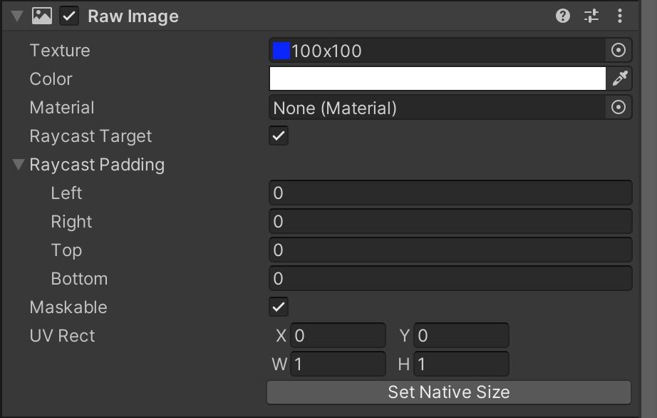

```c#
[RequireComponent(typeof(CanvasRenderer))]
[AddComponentMenu("UI/Raw Image", 12)]
public class RawImage : MaskableGraphic, ICanvasElement, IClippable, IMaskable, IMaterialModifier
```

`RawImage` は `Texture` を表示するためのコンポーネントである。単純な一枚画像や `RenderTexture` の表示に適している。

### RawImage のプロパティ

#### mainTexture

```c#
public override Texture mainTexture { get; }
```

この `RawImage` で使われるメインのテクスチャを取得する。

テクスチャが設定されていればそのテクスチャを返し、設定されていなければ `material` の `mainTexture` を返し、それも設定されていなければデフォルトの白色のテクスチャ（`Texture2D.whiteTexture`）を返す。

#### texture

```c#
public Texture texture { get; set; }
```

この `RawImage` で使われるメインのテクスチャを取得/設定する。

 `mainTexture` と異なるのは、何も設定されていなければ `null` が返されるという点である。また、以前と異なるテクスチャが設定された際には `SetVerticesDirty()` と `SetMaterialDirty()` が呼ばれて Graphic リビルドが発生する。

#### uvRect

```c#
public Rect uvRect { get; set; }
```

UV 座標を取得/設定する。

デフォルトは `(x, y, width, height)` が `(0, 0, 1, 1)` である。以前と異なる値が設定された際には `SetVerticesDirty()` が呼ばれて Graphic リビルドが発生する。

### RawImage の public メソッド

#### SetNativeSize

```c#
public override void SetNativeSize();
```

サイズをピクセルパーフェクトなサイズに調整する。

`Graphic` クラスでの実装は空であったため、実際の実装はここで行われている。

`mainTexture` の幅および高さそれぞれに `uvRect` の幅と高さを掛けた結果を `int` にした値が `rectTransform.sizeDelta` に代入される。

## Image コンポーネント

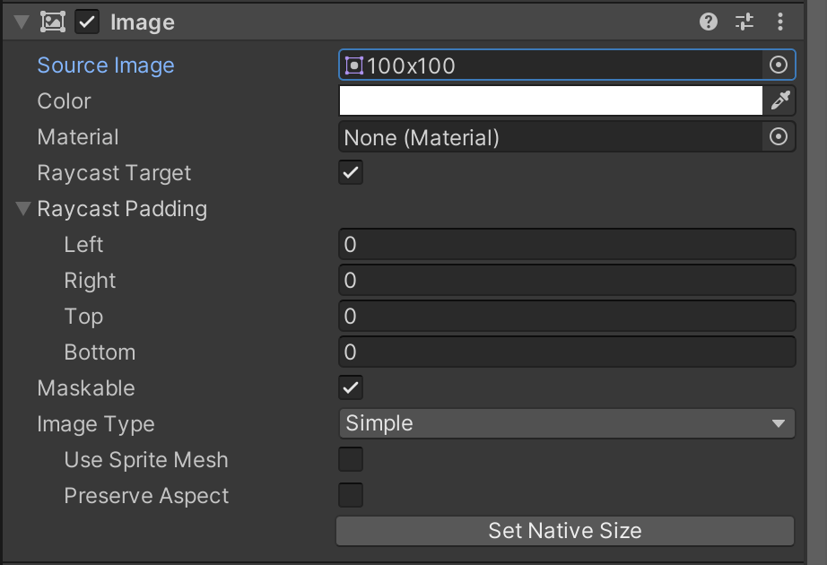

```c#
[RequireComponent(typeof(CanvasRenderer))]
[AddComponentMenu("UI/Image", 11)]
public class Image : MaskableGraphic, ISerializationCallbackReceiver, ILayoutElement, ICanvasRaycastFilter
```

前述の通り、`Image` は `Sprite` を表示する前提のコンポーネントである。アトラス化した画像を表示するのに適している。

### Image の static 変数

#### s_ETC1DefaultUI

```c#
protected static Material s_ETC1DefaultUI;
```

Android で使われる ETC1 フォーマット専用のデフォルトマテリアルを返す。

実際には `Canvas.GetETC1SupportedCanvasMaterial()` のキャッシュとなっている。

### Image の プロパティ

#### sprite

```c#
public Sprite sprite { get; set; }
```

この `Image` をレンダリングするためのスプライトを取得/設定する。

以前のものとは異なる `Sprite` が設定された場合、`SetAllDirty()` が呼ばれて Graphic リビルドが発生する。

#### overrideSprite

```c#
public Sprite overrideSprite { get; set; }
```

レンダリングに使用するスプライトを上書きするためのスプライトを取得/設定する。

`overrideSprite` が `null` であれば通常の `sprite` を使ってレンダリングが行われるが、そうでないなら `overrideSprite` がレンダリングに使われる。このレンダリングに使われる `Sprite` を「アクティブな `Sprite`」と呼ぶ。

`overrideSprite` は `Button` などで一時的に表示するスプライトを変更したい場合に使われる。

*overrideSprite のサンプルコード*
```c#
[RequireComponent(typeof(Image))]
public class OverrideSpriteSample : MonoBehaviour
{
    public Sprite baseSprite;
    public Sprite overrideSprite;

    private Image image;

    public void Start()
    {
        image = GetComponent<Image>();
        image.sprite = baseSprite;
    }

    // image のスプライトを一時的に変更する
    public void DoOverrideSprite()
    {
        image.overrideSprite = overrideSprite;
    }

    // 一時的に変更した sprite を元に戻す
    public void UndoOverrideSprite()
    {
        image.overrideSprite = null;
    }

    public void Update()
    {
        // 30 フレームごとに override スプライトを設定/解除する
        if (Time.frameCount % 60 == 0)
        {
            DoOverrideSprite();
        }
        else if (Time.frameCount % 60 == 30)
        {
            UndoOverrideSprite();
        }
    }
}
```

`overrideSprite` を使わずに `sprite` を一時的に直接差し替える場合、外部のコンポーネントが元の `sprite` を保持しておく必要がある。この手間（と余分なメモリ確保の可能性）を省くのが `overrideSprite` の目的の一つである。

しかしながら、Unity 2019.1 からは `sprite` が変更された際にサイズが変更されていなければレイアウトリビルドをスキップし、テクスチャが変更されていなければマテリアルの更新処理がスキップするような最適化が実装された。一方、`overrideSprite` にはこのような処理は行われていないため、同一サイズや同一テクスチャ内でのスプライトの差し替えであれば `sprite` を直接変更したほうが実はパフォーマンスが良い。

#### hasBorder

```c#
public bool hasBorder { get; }
```

アクティブな `Sprite` の `border` のサイズが `0` よりも大きい場合に `true` を返す。

後述するが、この `Image` コンポーネントの `type` が `Sliced` あるいは `Tiled` の場合にはこのプロパティが `true` でないと望ましい結果が得られない。

#### type

```c#
public Image.Type type { get; set; }
```

画像の表示方法を取得/設定する。以下の 4 種類が定義されている。

- `Simple`：4 頂点で画像全体を表示する。表示サイズは `RectTransform` の大きさによって決まる。

- `Sliced`：9 スライスで表示する。9 スライスを利用すると、四隅のピクセルはそのままで中心部分だけを引き伸ばすことができる。ダイアログの背景やボタンの画像に有効だろう。なお、`sprite` に `border` が設定されている必要がある。`border` を設定するには、テクスチャの **Import Settings** から **Sprite Editor** を起動して設定する。描画に使われる矩形は 9 個であり、頂点数は重複分も含めて 36 個である。

- `Tiled`：内部を繰り返して表示する。`Sliced` では中心部分が引き伸ばされたが、`Tiled` では中心部分が繰り返される。どこが中心部分なのかの判定には `Sliced` と同様に `Image.sprite` の `border` が利用される。ただし、繰り返しが多くなればなるほど、メッシュ内部で分割した矩形の数（および頂点数）が増えてしまう。メッシュ内部の矩形は `16250` 個以下に制限されている（実際には頂点数が `65000` を超えていないかチェックが行われている）ので、それ以上の繰り返しを行うことはできない。それ以上の繰り返しを行おうとするとエラーログが出力される。もし四隅を必要としないのであれば、パフォーマンスを追及するために、`border` を持っておらずパッキングもされていない `Sprite` の `texture` の `wrapMode` を `TextureWrapMode.Repeat` に設定することでジオメトリを追加することなく繰り返しを行うことができる。

- `Filled`：画像の一部のみを表示する。表示方法には `Horizontal`、`Vertical`、`Radial90`、`Radial180`、`Radial360` の 5 種類があり、詳細については下記で説明する。プログレスバーや円形ゲージに利用することが考えられる。`Horizontal`、`Vertical` では頂点を移動することで一部のみの描画を実現し、`Radial90`、`Radial180`、`Radial360` ではメッシュを複数の矩形に分割して頂点位置を調整することで一部のみ描画を実現している。

#### fillMethod

```c#
public Image.FillMethod fillMethod { get; set; }
```

`Type` が `Filled` の場合の表示方法を取得/設定する。

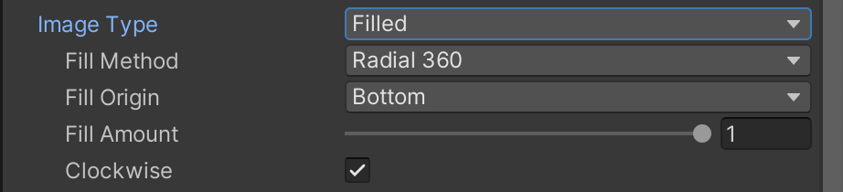

いずれの場合も `FillOrigin`（および `Clockwise`）の値によって詰める方向が変わる。

- `fillMethod` が `Horizontal` の場合、表示領域を水平方向に詰める。
  - `FillOrigin` が `Left` であれば `FillAmount` が `1` に近づくほど右側が表示される。
  - `FiillOrigin` が `Right` であれば `FillAmount` が `1` に近づくほど右側が表示される。

- `fillMethod` が `Vertical` の場合、表示領域を垂直方向に詰める。
  - `FillOrigin` が `Bottom` であれば `FillAmount` が `1` に近づくほど上側が表示される。
  - `FillOrigin` が `Top` であれば `FillAmount` が `1` に近づくほど下側が表示される。

- `fillMethod` が `Radial90` の場合、表示領域を `90` 度の扇型の範囲で詰める。
  - `FillOrigin` が `BottomLeft` であれば `FillAmount` が `1` に近づくほど右下から左上に表示される。
  - `FillOrigin` が `TopLeft` であれば `FillAmount` が `1` に近づくほど左下から右上に表示される。
  - `FillOrigin` が `TopRight` であれば `FillAmount` が `1` に近づくほど左上から右下に表示される。
  - `FillOrigin` が `BottomRight` であれば `FillAmount` が `1` に近づくほど右上から左下に表示される。

- `fillMethod` が `Radial180` の場合、表示領域を `180` 度の扇型の範囲で詰める。
  - `FillOrigin` が `Bottom` の場合
    - `Clockwise` が `true` であれば `FillAmount` が `1` に近づくほど下中央を中心に右下から左下に表示される。
    - `Clockwise` が `false` であれば `FillAmount` が `1` に近づくほど下中央を中心に左下から右下に表示される。
  - `FillOrigin` が `Left` の場合
    - `Clockwise` が `true` であれば `FillAmount` が `1` に近づくほど左中央を中心に左下から左上に表示される。
    - `Clockwise` が `false` であれば `FillAmount` が `1` に近づくほど左中央を中心に左上から左下に表示される。
  - `FillOrigin` が `Top` の場合
    - `Clockwise` が `true` であれば `FillAmount` が `1` に近づくほど上中央を中心に左上から右上に表示される。
    - `Clockwise` が `false` であれば `FillAmount` が `1` に近��くほ��上中央を中心に右上から左上に表示される。
  - `FillOrigin` が `Right` ��場合
    - `Clockwise` が `true` であれば `FillAmount` が `1` に近づくほど右中央を中心に右上から右下に表示される。
    - `Clockwise` が `false` であれば `FillAmount` �� `1` に近づくほど右中央を中心に右下から右上に表示される。

- `fillMethod` が `Radial360` の場合、表示領域を `360` 度の扇型の範囲で詰める。
  - `Clockwise` が `true` であれば `FillAmount` が `1` に近づくほど下中央から時計回りに表示領域が増える。
  - `Clockwise` が `false` であれば `FillAmount` が `1` に近づくほど下中央から反時計回りに表示領域が増える。

#### fillAmount

```c#
public float fillAmount { get; set; }
```

`type` が `Image.Type.Filled` に設定されている場合の表示量を取得/設定する。

`0` なら表示されず、`1` なら全部表示される。

#### fillCenter

```c#
public bool fillCenter { get; set; }
```

`Tiled` または `Sliced` の場合に真ん中部分を描画するかどうかを取得/設定する。

これを有効にするためには **Sprite Editor** などで `sprite` に border を設定する必要がある。`fillCenter` をうまく使うとフィルレートを節約することができる。

#### fillClockwise

```c#
public bool fillClockwise { get; set; }
```

`type` が `Type.Filled` かつ `Image.fillMethod` が `Radial90`、`Radial180`、`Radial360` の場合に、表示方向を時計回りにするかどうかを取得/設定する。

#### fillOrigin

```c#
public int fillOrigin { get; set; }
```

`type` が `Type.Filled` の場合の表示方向の開始位置を取得/設定する。

#### useSpriteMesh

```c#
public bool useSpriteMesh { get; set; }
```

`TextureImporter` によって生成されたメッシュを使って描画するか、シンプルな矩形のメッシュを描画するのかを取得/設定する。`type` が `Simple` の場合にのみ有効である。

デフォルト値は `false` であり、つまり、シンプルな矩形のメッシュが使われる。このプロパティを `true` に設定すると、`TextureImporter` で **MeshType** が `Tight` に設定されていた場合に透明部分を排除して生成されるメッシュを使って描画が行われる。`TextureImporter` で **MeshType** が `FullRect` であれば生成されるメッシュは常にシンプルな矩形となり、このプロパティに関係なくシンプルな矩形で描画が行われる。

#### preserveAspect

```c#
public bool preserveAspect { get; set; }
```

`sprite` のアスペクト比をそのまま使うかどうかを取得/設定する。`type` が `Simple` の場合にのみ有効である。

デフォルト値は `false` であり、`RectTransform` のサイズに応じて画像が引き伸ばされる。このプロパティを `true` に設定すると、`RectTransform` の `width` と `height` の小さいほうのサイズをベースにして表示サイズが決定される。 

#### flexibleHeight

```c#
public virtual float flexibleHeight { get; }
```

Auto Layout の際に用いられる flexible の高さを取得する。

常に `-1` を返す。詳細は *Chapter 9 Auto Layout* で説明する。

#### flexibleWidth

```c#
public virtual float flexibleWidth { get; }
```

Auto Layout の際に用いられる flexible の幅を取得する。

常に `-1` を返す。詳細は *Chapter 9 Auto Layout* で説明する。

#### layoutPriority

```c#
public virtual int layoutPriority { get; }
```

Auto Layout の際に用いられる優先度を取得する。

常に `0` を返す。詳細は *Chapter 9 Auto Layout* で説明する。

#### mainTexture

```c#
public override Texture mainTexture { get; }
```

この `Image` のレンダリングに使われるテクスチャを取得する。

アクティブな `Sprite` が `null` でないなら、その `Sprite` の `texture` を返す。`Sprite` が `null` であれば `material` の `mainTexture` をを返す。スプライトもマテリアルも設定されていないのであれば、デフォルトの白いテクスチャ（`Texture2D.whiteTexture`）を返す。

#### material

```c#
public override Material material { get; set; }
```

この `Image` のレンダリングに使われるテクスチャを取得/設定する。

マテリアルが設定されていないのであれば `defaultMaterial`（または ETC1 用の `Sprite` を使うのであれば `defaultETC1GraphicMaterial`）が返される。

#### minHeight

```c#
public virtual float minHeight { get; }
```

Auto Layout の際に用いられる最小の高さを取得する。

常に `0` を返す。詳細は *Chapter 9 Auto Layout* で説明する。

#### minWidth

```c#
public virtual float minWidth { get; }
```

Auto Layout の際に用いられる最小の幅を取得する。

常に `0` を返す。詳細は *Chapter 9 Auto Layout* で説明する。

#### pixelsPerUnit

```c#
public float pixelsPerUnit { get; }
```

1 単位あたりのピクセル数を取得する。

現在アクティブな `Sprite` の `pixelsPerUnit`（デフォルト値は `100`）を、`canvas` の `referencePixelsPerUnit` で割った値が返る。通常は `1` が返る。

`SetNativeSize()` が押された際の `RectTransform` のサイズ計算に用いられたり、`preferredWidth` や `preferredWidth` の計算の際に用いられる。

#### pixelsPerUnitMultiplier

```c#
public float pixelsPerUnitMultiplier { get; set; }
```

`pixelsPerUnit` に掛ける係数を取得する。

`type` が `Sliced` あるいは `Tiled` の場合、スライスの周囲のサイズが `1.0f / pixelsPerUnitMultiplier` のサイズとなり、`Tiled` の場合はさらに繰り返しの回数が `pixelsPerUnitMultiplier` 倍になる。デフォルト値は `1` であり、最小値は `0.01f` である。

#### preferredHeight

```c#
public virtual float preferredHeight { get; }
```

アクティブな `Sprite` が存在している場合に、その高さ（を `pixelsPerUnit` で割った値）を返す。

`type` が `Sliced` あるいは `Tiled` の場合、最小の高さ（を `pixelsPerUnit` で割った値）を返す。アクティブな `Sprite` が存在していないなら `0` が返される。詳細は *Chapter 9 Auto Layout* で説明する。

#### preferredWidth

```c#
public virtual float preferredWidth { get; }
```

アクティブな `Sprite` が存在しているなら、その幅（を `pixelsPerUnit` で割った値）を返す。

`type` が `Sliced` あるいは `Tiled` の場合、最小の幅（を `pixelsPerUnit` で割った値）を返す。アクティブな `Sprite` が存在していないなら `0` が返される。詳細は *Chapter 9 Auto Layout* で説明する。

#### alphaHitTestMinimumThreshold

```c#
public float alphaHitTestMinimumThreshold { get; set; }
```

レイキャストヒットするのに必要なアルファ値の最小値を取得/設定する。

デフォルト値は `0` であり、つまり、透明部分もレイキャストヒットする。

このプロパティを `1` に設定すると、アルファ値が `0` のピクセルはレイキャストヒットしなくなる。ここでチェックされるアルファ値は `Sprite` のアルファ値であり、`color` プロパティのアルファ値は無視される。

ボタンのタッチが画像の透明部分に反応しないようにしたいのであれば、この値を `1` にすれば良いが、
`0` 以外の値に設定するためには、`Texture` のインポート設定で `Read/Write enabled` を有効にし、アトラス化を無効にする必要があることに注意しよう。`Read/Write enabled` を有効にすると使用されるテクスチャメモリが 2 倍になるため、実際のプロダクトでは使うのは難しいかもしれない。この問題の解決方法については、この章の *Image の透明な部分のタッチに反応しないようにする* の項で説明する。

#### defaultETC1GraphicMaterial

```c#
public static Material defaultETC1GraphicMaterial { get; }
```

Android で使われる ETC1 フォーマット専用のデフォルトマテリアルを返す。

### Image の public メソッド

#### CalculateLayoutInputHorizontal

```c#
public virtual void CalculateLayoutInputHorizontal();
```

`ILayoutElement` インターフェースの `CalculateLayoutInputHorizontal()` を実装したメソッドだが、中身は空である。

このメソッドが呼ばれた後であれば、レイアウトの水平方向の入力のプロパティが最新の値を返すようになる。また、このメソッドが呼ばれた時点で、子は常に最新のレイアウトの水平方向の入力を持っている（ということになっている）。

#### CalculateLayoutInputVertical

```c#
public virtual void CalculateLayoutInputVertical();
```

`ILayoutElement` インターフェースの `CalculateLayoutInputVertical()` を実装したメソッドだが、中身は空である。

このメソッドが呼ばれた後であれば、レイアウトの垂直方向の入力のプロパティが最新の値を返すようになる。また、このメソッドが呼ばれた時点で、子は常に最新のレイアウトの垂直方向の入力を持っているはずである。

#### DisableSpriteOptimizations

```c#
public void DisableSpriteOptimizations();
```

不要な Layout リビルドやマテリアル更新をスキップするフラグをオフにする。

つまり、このメソッドを呼ぶと Canvas リビルドのタイミングで Layout リビルドと Graphic リビルドが行われるようになる。Unity 2019.1 におけるパフォーマンス最適化で導入されたメソッドだが、通常、我々が呼び出すことはない。

#### IsRaycastLocationValid

```c#
public virtual bool IsRaycastLocationValid(Vector2 screenPoint, Camera eventCamera);
```

レイキャスト判定を行う。

引数で与えられた `screenPoint` の位置の画像のアルファ値が `alphaHitTestMinimumThreshold` 以上であれば `true` を返す。

前述の通り、`alphaHitTestMinimumThreshold` を `0` より大きい値に設定し、`Texture` のインポート設定で `Read/Write enabled` を有効にし、さらにアトラス化を無効にすれば、アルファ値で判定する際に `Texture.GetPixelBilinear()` が呼ばれるようになる。

実際のレイキャスト判定処理の流れは以下の通りである。

1. `alphaHitTestMinimumThreshold` が `0` 以下であれば `true` を返す。

2. `alphaHitTestMinimumThreshold` が `1` より多きければ `false` を返す。

3. アクティブな `Sprite` が `null` であれば `true` を返す。

4. ワールド空間内の `RectTransform` の平面内に `screenPoint` が無ければ `false` を返す（`RectTransform` の矩形内にあるかどうかは判断しない）。

5. アクティブな `Sprite` の `Texture.GetPixelBilinear()` を呼んで `screenPoint` の位置の画像のアルファ値を取得する。そのアルファ値が `alphaHitTestMinimumThreshold` 以上であれば `true` を返し、そうでなければ `false` を返す。

6. テクスチャのピクセルを読み込めなかったり、アクティブな `Sprite` がパッキングされていた場合には `Texture.GetPixelBilinear()` が例外を投げて、このメソッドは `true` を返す。

#### OnAfterDeserialize

```c#
public virtual void OnAfterDeserialize();
```

このオブジェクトが Unity によってデシリアライズされる前に呼ばれる。

このメソッドは `ISerializationCallbackReceiver` インターフェースの実装である。

`fillOrigin` が適切でない値なら `0` に変更し、`fillAmount` が `0` から `1` の範囲に収まるように変更する。なお、Unity のシリアライズ処理はメインスレッドとは別のスレッドで動作するので、このコールバックを実装する際には複数のスレッドからデータを書き換えて壊したりしないように注意が必要である。

#### OnBeforeSerialize

```c#
public virtual void OnBeforeSerialize();
```

このオブジェクトが Unity によってシリアライズされた後に呼ばれる。

このメソッドは `ISerializationCallbackReceiver` インターフェースの実装である。

なお、`Image` コンポーネントでの実装は空である。

#### SetNativeSize

```c#
public override void SetNativeSize();
```

ピクセルパーフェクトになるように `RectTransform` のサイズをアクティブな `Sprite` のサイズに合わせる。

`type` が `Simple` の場合にのみ **Inspector** に **Set Native Size** のボタンが表示され、ボタンを押すとこのメソッドが呼ばれる。

ただし、**Anchor** が **stretch** である場合（つまり、`anchorMin = (0, 0), anchorMax = (1, 1)` の場合）にこのメソッドを呼ぶと、**stretch** が解除されて左下基準になる（`anchorMin = (0, 0), anchorMax = (0, 0)`）ことに注意しよう。

## Shadow コンポーネント

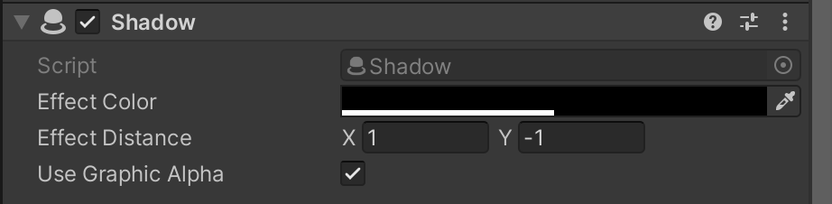

```c#
[AddComponentMenu("UI/Effects/Shadow", 14)]
public class Shadow : BaseMeshEffect
```

`Shadow` コンポーネントは `Image` や `Text` などの `Graphic` コンポーネントに影を付けるためのコンポーネントである。`Shadow` コンポーネントは `BaseMeshEffect` クラスを継承している。

`Shadow` の描画は以下の流れで行われる。

1. ジオメトリがダーティな場合に Graphic リビルドのタイミングで `ApplyShadow()` が呼ばれる。
2. `VertexHelper` から元の `Graphic` の頂点を複製する。
3. 複製した頂点を `VertexHelper` のバッファの後方に追加する。
4. バッファの前半分の頂点を影の頂点として色と位置を変更する。これにより影の頂点が先に描画される。
5. `VertexHelper` からメッシュの頂点を生成し、`CanvasRenderer` に渡す。

このように、影を含めて 1 つのメッシュで効率的にレンダリングするようになっている。

### Shadow のプロパティ

#### effectColor

```c#
public Color effectColor { get; set; }
```

影の色を取得/設定する。

元の `Graphic` の色にこの色をかけた値が影の色になる。デフォルト値は `(0, 0, 0, 0.5f)` なので黒の半透明になるが、`(1, 1, 1, 0.5f)` などにすれば元のテクスチャ色を保ったまま半透明になるのを確認できるだろう。


#### effectDistance

```c#
public Vector2 effectDistance { get; set; }
```

元の `Graphic` と影の距離（ピクセル単位）を取得/設定する。

数値が大きければ大きいほど右上に影が表示される。デフォルト値は `(1, -1)` なので右下に影が表示される。

#### useGraphicAlpha

```c#
public bool useGraphicAlpha { get; set; }
```

元の `Graphic` のアルファ値を使うかどうかを取得/設定する。

デフォルト値は `true` である。

このプロパティが `true` なら、元の `Graphic` の（頂点カラーの）アルファ値に `effectColor` のアルファ値を掛けたものをアルファ値とする。

### Shadow の Public メソッド

#### ModifyMesh

```c#
public override void ModifyMesh(VertexHelper vh);
```

`Graphic.Rebuid()` 経由などでメッシュをリビルドする際に呼ばれる。

`Shadow` の場合、ここから `ApplyShadow()` が呼ばれる。実際のコードを以下に示す。

```c#
public class Shadow : BaseMeshEffect
{
    ...
    public override void ModifyMesh(VertexHelper vh)
    {
        if (!IsActive())
            return;

        // UIVertex のリストを（new すると重いので）プールから借りる
        var output = ListPool<UIVertex>.Get();

        // 既に VertexHelper に設定されているデータを取得する
        vh.GetUIVertexStream(output);

        // 影の分の頂点を追加する
        ApplyShadow(output, effectColor, 0, output.Count, effectDistance.x, effectDistance.y);

        // 既に VertexHelper に設定されているデータは一旦消して
        vh.Clear();

        // 影の分を追加したデータを VertexHelper に設定する
        vh.AddUIVertexTriangleStream(output);

        // 借りてきたリストは解放する
        ListPool<UIVertex>.Release(output);
    }
...
```

### Shadow の Protected メソッド

#### ApplyShadow

```c#
protected void ApplyShadow(List<UIVertex> verts, Color32 color, int start, int end, float x, float y);
```

元のメッシュの `VertexHelper` に影の頂点を挿入する処理が行われる。

実際の処理は既に説明した通りである。

## Outline

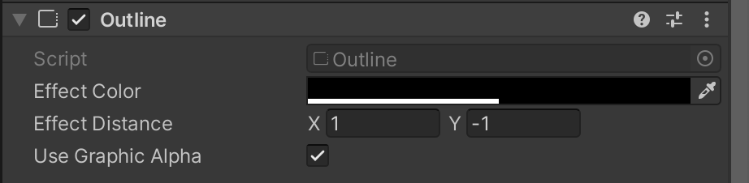

```c#
[AddComponentMenu("UI/Effects/Outline", 15)]
public class Outline : Shadow, IMeshModifier
```

`Shadow` コンポーネントは `Image` や `Text` などの `Graphic` コンポーネントにアウトライン（輪郭線）を付けるためのコンポーネントである。`Outline` コンポーネントは `BaseMeshEffect` クラスを継承している。

簡単に言えば、`Shadow` を上下左右に描くことでアウトラインの描画を実現している。言い換えると、`Shadow` の `effectDistance` に `(x, y)` と `(-x, -y)` と `(-x, y)` と `(x, -y)` を指定して 4 つ分の影を描画することで輪郭線としている。

実際の `Outline` のコードを以下に示す。

```c#
/// <summary>
/// IVertexModifier の機能を使って Graphic にアウトラインを追加する
/// </summary>
public class Outline : Shadow
{
    protected Outline()
    {}

    public override void ModifyMesh(VertexHelper vh)
    {
        if (!IsActive())
            return;

        var verts = ListPool<UIVertex>.Get();
        vh.GetUIVertexStream(verts);

        var neededCpacity = verts.Count * 5;
        if (verts.Capacity < neededCpacity)
            verts.Capacity = neededCpacity;

        var start = 0;
        var end = verts.Count;
        ApplyShadowZeroAlloc(verts, effectColor, start, verts.Count, effectDistance.x, effectDistance.y);

        start = end;
        end = verts.Count;
        ApplyShadowZeroAlloc(verts, effectColor, start, verts.Count, effectDistance.x, -effectDistance.y);

        start = end;
        end = verts.Count;
        ApplyShadowZeroAlloc(verts, effectColor, start, verts.Count, -effectDistance.x, effectDistance.y);

        start = end;
        end = verts.Count;
        ApplyShadowZeroAlloc(verts, effectColor, start, verts.Count, -effectDistance.x, -effectDistance.y);

        vh.Clear();
        vh.AddUIVertexTriangleStream(verts);
        ListPool<UIVertex>.Release(verts);
    }
}
```

非常にシンプルな方法ではあるが、この方法ではアウトラインはそれほど滑らかに表示されない。単純に上下左右に 1 回ずつずらしただけでは滑らかに表示されないためである。修正案として、上下左右に 4 回ではなく任意の回数分だけ影を描画する方法が考えられる。下にサンプルコードを示した。

```c#
public class CircleOutline : Shadow
{
    // 描画の回数。デフォルトは Outline と同じになる 4 とする。
    [SerializeField]
    private int m_EdgeCount = 4;

    public override void ModifyMesh(VertexHelper vh)
    {
        if (!IsActive())
        {
            return;
        }

        var verts = new List<UIVertex>();
        vh.GetUIVertexStream(verts);

        // 元の Graphic + 描画回数分の頂点を確保
        int neededCpacity = verts.Count * (1 + m_EdgeCount);
        if (verts.Capacity < neededCpacity)
        {
            verts.Capacity = neededCpacity;
        }

        int start = 0;
        int end = verts.Count;

        // 半径は x から取る
        float radius = Mathf.Abs(effectDistance.x);

        // 円形に影を描画していく
        for (int i = 0; i < m_EdgeCount; i++)
        {
            // 円周上の点の角度を求めて
            float theta = (float)(i * Mathf.PI * 2) / m_EdgeCount;
            
            // まっすぐではなく傾けたほうが綺麗に見える
            theta += (Mathf.PI / m_EdgeCount);

            // m_EffectDistance に相当する位置を得る
            float x = radius * Mathf.Cos(theta);
            float y = radius * Mathf.Sin(theta);

            ApplyShadowZeroAlloc(verts, effectColor, start, verts.Count, x, y);
            start = end;
            end = verts.Count;
        }

        vh.Clear();
        vh.AddUIVertexTriangleStream(verts);
    }
}
```

`m_EdgeCount` を 8 くらいに設定すれば、かなり綺麗な輪郭線が得られるだろう。

### Outline の public メソッド

```c#
public override void ModifyMesh(VertexHelper vh)
```

`Graphic.Rebuid()` 経由などでメッシュをリビルドする際に呼ばれる。

### 輪郭線を Outline ではなくシェーダーで描画する

上記に任意の回数分だけ影を描画するコンポーネント `CircleOutline` のサンプルコードを示したが、ドローコールが 1 回といえオーバードローによるフィルレートを消費してしまう。なので、別の方法として、シェーダーでアウトラインを描画する方法が考えられる。以下にアウトラインを描画するためのシェーダーを示す。

*Unity 2019.4 以前の UI デフォルトシェーダーを元にしたアウトラインシェーダー*
```
Shader "UI/LegacyOutline"
{
    Properties
    {
        [PerRendererData] _MainTex("Sprite Texture", 2D) = "white" {}
        _Color("Tint", Color) = (1,1,1,1)

        // アウトラインの色
        _EffectColor("Effect Color", Color) = (0, 0, 0, 0.5)

        // アウトラインの距離
        _EffectDistance("Effect Distance", Float) = 1

        _StencilComp("Stencil Comparison", Float) = 8
        _Stencil("Stencil ID", Float) = 0
        _StencilOp("Stencil Operation", Float) = 0
        _StencilWriteMask("Stencil Write Mask", Float) = 255
        _StencilReadMask("Stencil Read Mask", Float) = 255

        _ColorMask("Color Mask", Float) = 15

        [Toggle(UNITY_UI_ALPHACLIP)] _UseUIAlphaClip("Use Alpha Clip", Float) = 0
    }

    SubShader
    {
        Tags
        {
            "Queue" = "Transparent"
            "IgnoreProjector" = "True"
            "RenderType" = "Transparent"
            "PreviewType" = "Plane"
            "CanUseSpriteAtlas" = "True"
        }

        Stencil
        {
            Ref[_Stencil]
            Comp[_StencilComp]
            Pass[_StencilOp]
            ReadMask[_StencilReadMask]
            WriteMask[_StencilWriteMask]
        }

        Cull Off
        Lighting Off
        ZWrite Off
        ZTest[unity_GUIZTestMode]
        Blend SrcAlpha OneMinusSrcAlpha
        ColorMask[_ColorMask]

        Pass
        {
            Name "Default"
        CGPROGRAM
            #pragma vertex vert
            #pragma fragment frag
            #pragma target 2.0

            #include "UnityCG.cginc"
            #include "UnityUI.cginc"

            #pragma multi_compile_local _ UNITY_UI_CLIP_RECT
            #pragma multi_compile_local _ UNITY_UI_ALPHACLIP

            struct appdata_t
            {
                float4 vertex   : POSITION;
                float4 color    : COLOR;
                float2 texcoord : TEXCOORD0;
                UNITY_VERTEX_INPUT_INSTANCE_ID
            };

            struct v2f
            {
                float4 vertex   : SV_POSITION;
                fixed4 color : COLOR;
                float2 texcoord  : TEXCOORD0;
                float4 worldPosition : TEXCOORD1;
                half4  mask : TEXCOORD2;
                UNITY_VERTEX_OUTPUT_STEREO
            };

            sampler2D _MainTex;
            fixed4 _Color;
            fixed4 _TextureSampleAdd;
            float4 _ClipRect;
            float4 _MainTex_ST;
            float _UIMaskSoftnessX;
            float _UIMaskSoftnessY;

            // 色と距離をプロパティから受け取る
            half4  _EffectColor;
            half   _EffectDistance;

            // テクスチャサイズ
            // x : 1 / width
            // y : 1 / height
            // z : width
            // w : height
            float4 _MainTex_TexelSize;

            // 頂点シェーダーはそのまま
            v2f vert(appdata_t v)
            {
                v2f OUT;
                UNITY_SETUP_INSTANCE_ID(v);
                UNITY_INITIALIZE_VERTEX_OUTPUT_STEREO(OUT);
                float4 vPosition = UnityObjectToClipPos(v.vertex);
                OUT.worldPosition = v.vertex;
                OUT.vertex = vPosition;

                float2 pixelSize = vPosition.w;
                pixelSize /= float2(1, 1) * abs(mul((float2x2)UNITY_MATRIX_P, _ScreenParams.xy));

                float4 clampedRect = clamp(_ClipRect, -2e10, 2e10);
                float2 maskUV = (v.vertex.xy - clampedRect.xy) / (clampedRect.zw - clampedRect.xy);
                OUT.texcoord = TRANSFORM_TEX(v.texcoord.xy, _MainTex);
                OUT.mask = half4(v.vertex.xy * 2 - clampedRect.xy - clampedRect.zw, 0.25 / (0.25 * half2(_UIMaskSoftnessX, _UIMaskSoftnessY) + abs(pixelSize.xy)));

                OUT.color = v.color * _Color;
                return OUT;
            }
            
            // フラグメントシェーダーでのアウトラインの処理
            half4 frag_outline(v2f IN, half4 color)
            {
                // 元のアルファ
                half original_a = color.a;

                // 元のアルファが 1 なら元の色にして、元のアルファが 0 なら一旦アウトラインの色にする
                color = lerp(_EffectColor, color, original_a);

                float delta_x = _MainTex_TexelSize.x * _EffectDistance;
                float delta_y = _MainTex_TexelSize.y * _EffectDistance;

                // 上下左右のピクセルの色を得る
                half4 color_top = tex2D(_MainTex, IN.texcoord + float2(0, delta_y));
                half4 color_bottom = tex2D(_MainTex, IN.texcoord - float2(0, delta_y));
                half4 color_left = tex2D(_MainTex, IN.texcoord - float2(delta_x, 0));
                half4 color_right = tex2D(_MainTex, IN.texcoord + float2(delta_x, 0));

                // 斜めの点の距離は √2 / 2 倍
                delta_x *= 0.707;
                delta_y *= 0.707;

                // 左上、左下、右上、右下のピクセルの色を得る
                half4 color_left_top = tex2D(_MainTex, IN.texcoord - float2(delta_x, -delta_y));
                half4 color_left_bottom = tex2D(_MainTex, IN.texcoord - float2(delta_x, delta_y));
                half4 color_right_top = tex2D(_MainTex, IN.texcoord + float2(delta_x, delta_y));
                half4 color_right_bottom = tex2D(_MainTex, IN.texcoord + float2(delta_x, -delta_y));

                // 元のピクセルおよび周囲のピクセルの中でで一番アルファが濃いピクセルのアルファを使う
                color.a = max(original_a, max(max(max(color_top.a, color_bottom.a), max(color_left.a, color_right.a)),
                    max(max(color_left_top.a, color_left_bottom.a), max(color_right_top.a, color_right_bottom.a))));

                return color;
            }

            fixed4 frag(v2f IN) : SV_Target
            {
                half4 color = IN.color * (tex2D(_MainTex, IN.texcoord) + _TextureSampleAdd);

                #ifdef UNITY_UI_CLIP_RECT
                half2 m = saturate((_ClipRect.zw - _ClipRect.xy - abs(IN.mask.xy)) * IN.mask.zw);
                color.a *= m.x * m.y;
                #endif

                // アウトラインの適用
                color = frag_outline(IN, color);

#ifdef UNITY_UI_ALPHACLIP
                clip(color.a - 0.001);
#endif
                color.rgb *= color.a;

                return color;
            }
        ENDCG
        }
    }
}
```

*Unity 2020.1 以降の UI デフォルトシェーダーを元にしたアウトラインシェーダー*
```
Shader "UI/Outline"
{
    Properties
    {
        [PerRendererData] _MainTex("Sprite Texture", 2D) = "white" {}
        _Color("Tint", Color) = (1,1,1,1)

        // アウトラインの色
        _EffectColor("Effect Color", Color) = (0, 0, 0, 0.5)

        // アウトラインの距離
        _EffectDistance("Effect Distance", Float) = 1

        _StencilComp("Stencil Comparison", Float) = 8
        _Stencil("Stencil ID", Float) = 0
        _StencilOp("Stencil Operation", Float) = 0
        _StencilWriteMask("Stencil Write Mask", Float) = 255
        _StencilReadMask("Stencil Read Mask", Float) = 255

        _ColorMask("Color Mask", Float) = 15

        [Toggle(UNITY_UI_ALPHACLIP)] _UseUIAlphaClip("Use Alpha Clip", Float) = 0
    }

    SubShader
    {
        Tags
        {
            "Queue" = "Transparent"
            "IgnoreProjector" = "True"
            "RenderType" = "Transparent"
            "PreviewType" = "Plane"
            "CanUseSpriteAtlas" = "True"
        }

        Stencil
        {
            Ref[_Stencil]
            Comp[_StencilComp]
            Pass[_StencilOp]
            ReadMask[_StencilReadMask]
            WriteMask[_StencilWriteMask]
        }

        Cull Off
        Lighting Off
        ZWrite Off
        ZTest[unity_GUIZTestMode]
        Blend One OneMinusSrcAlpha
        ColorMask[_ColorMask]

        Pass
        {
            Name "Default"
            CGPROGRAM
            #pragma vertex vert
            #pragma fragment frag
            #pragma target 2.0

            #include "UnityCG.cginc"
            #include "UnityUI.cginc"

            #pragma multi_compile_local _ UNITY_UI_CLIP_RECT
            #pragma multi_compile_local _ UNITY_UI_ALPHACLIP

            struct appdata_t
            {
                float4 vertex   : POSITION;
                float4 color    : COLOR;
                float2 texcoord : TEXCOORD0;
                UNITY_VERTEX_INPUT_INSTANCE_ID
            };

            struct v2f
            {
                float4 vertex   : SV_POSITION;
                fixed4 color : COLOR;
                float2 texcoord  : TEXCOORD0;
                float4 worldPosition : TEXCOORD1;
                half4  mask : TEXCOORD2;
                UNITY_VERTEX_OUTPUT_STEREO
            };

            sampler2D _MainTex;
            fixed4 _Color;
            fixed4 _TextureSampleAdd;
            float4 _ClipRect;
            float4 _MainTex_ST;
            float _MaskSoftnessX;
            float _MaskSoftnessY;

            // 色と距離をプロパティから受け取る
            half4  _EffectColor;
            half   _EffectDistance;

            // テクスチャサイズ
            // x : 1 / width
            // y : 1 / height
            // z : width
            // w : height
            float4 _MainTex_TexelSize;

            // 頂点シェーダーはそのまま
            v2f vert(appdata_t v)
            {
                v2f OUT;
                UNITY_SETUP_INSTANCE_ID(v);
                UNITY_INITIALIZE_VERTEX_OUTPUT_STEREO(OUT);
                float4 vPosition = UnityObjectToClipPos(v.vertex);
                OUT.worldPosition = v.vertex;
                OUT.vertex = vPosition;

                float2 pixelSize = vPosition.w;
                pixelSize /= float2(1, 1) * abs(mul((float2x2)UNITY_MATRIX_P, _ScreenParams.xy));

                float4 clampedRect = clamp(_ClipRect, -2e10, 2e10);
                float2 maskUV = (v.vertex.xy - clampedRect.xy) / (clampedRect.zw - clampedRect.xy);
                OUT.texcoord = float4(v.texcoord.x, v.texcoord.y, maskUV.x, maskUV.y);
                OUT.mask = half4(v.vertex.xy * 2 - clampedRect.xy - clampedRect.zw, 0.25 / (0.25 * half2(_MaskSoftnessX, _MaskSoftnessY) + abs(pixelSize.xy)));

                OUT.color = v.color * _Color;
                return OUT;
            }

            // フラグメントシェーダーでのアウトラインの処理
            half4 frag_outline(v2f IN, half4 color)
            {
                // 元のアルファ
                half original_a = color.a;

                // 元のアルファが 1 なら元の色にして、元のアルファが 0 なら一旦アウトラインの色にする
                color = lerp(_EffectColor, color, original_a);

                float delta_x = _MainTex_TexelSize.x * _EffectDistance;
                float delta_y = _MainTex_TexelSize.y * _EffectDistance;

                // 上下左右のピクセルの色を得る
                half4 color_top = tex2D(_MainTex, IN.texcoord + float2(0, delta_y));
                half4 color_bottom = tex2D(_MainTex, IN.texcoord - float2(0, delta_y));
                half4 color_left = tex2D(_MainTex, IN.texcoord - float2(delta_x, 0));
                half4 color_right = tex2D(_MainTex, IN.texcoord + float2(delta_x, 0));

                // 斜めの点の距離は √2 / 2 倍
                delta_x *= 0.707;
                delta_y *= 0.707;

                // 左上、左下、右上、右下のピクセルの色を得る
                half4 color_left_top = tex2D(_MainTex, IN.texcoord - float2(delta_x, -delta_y));
                half4 color_left_bottom = tex2D(_MainTex, IN.texcoord - float2(delta_x, delta_y));
                half4 color_right_top = tex2D(_MainTex, IN.texcoord + float2(delta_x, delta_y));
                half4 color_right_bottom = tex2D(_MainTex, IN.texcoord + float2(delta_x, -delta_y));

                // 元のピクセルおよび周囲のピクセルの中でで一番アルファが濃いピクセルのアルファを使う
                color.a = max(original_a, max(max(max(color_top.a, color_bottom.a), max(color_left.a, color_right.a)),
                    max(max(color_left_top.a, color_left_bottom.a), max(color_right_top.a, color_right_bottom.a))));

                return color;
            }

            fixed4 frag(v2f IN) : SV_Target
            {
                half4 color = (tex2D(_MainTex, IN.texcoord) + _TextureSampleAdd) * IN.color;

                #ifdef UNITY_UI_CLIP_RECT
                half2 m = saturate((_ClipRect.zw - _ClipRect.xy - abs(IN.mask.xy)) * IN.mask.zw);
                color.a *= m.x * m.y;
                #endif

                // アウトラインの適用
                color = frag_outline(IN, color);

                #ifdef UNITY_UI_ALPHACLIP
                clip(color.a - 0.001);
                #endif

                color.rgb *= color.a;

                return color;
            }
        ENDCG
        }
    }
}
```

## PositionAsUV1

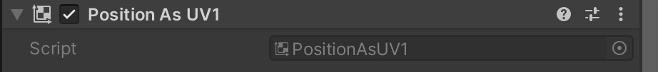

```c#
[AddComponentMenu("UI/Effects/Position As UV1", 16)]
public class PositionAsUV1 : BaseMeshEffect
```

メッシュの頂点の `uv1` に頂点位置を設定するためのコンポーネントである。

```c#
        public override void ModifyMesh(VertexHelper vh)
        {
            UIVertex vert = new UIVertex();
            for (int i = 0; i < vh.currentVertCount; i++)
            {
                vh.PopulateUIVertex(ref vert, i);
                vert.uv1 =  new Vector2(vert.position.x, vert.position.y);
                vh.SetUIVertex(vert, i);
            }
        }
```

`uv1` を利用するためには `Canvas` の `additionalShaderChannels` の `TexCoord1` のビットを有効にする必要がある。

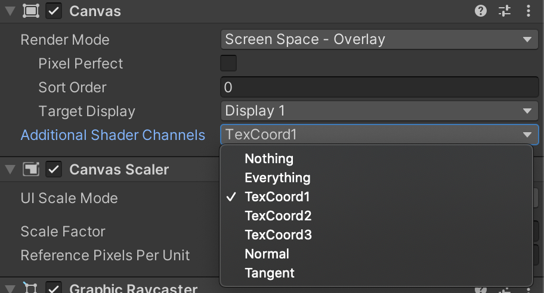

頂点シェーダーで受け取った `uv1` をフラグメントシェーダーに渡すことで、オブジェクト内での頂点の位置に応じてピクセルの色を変えたりすることができる。

*Unity 2019.4 以前の UI デフォルトシェーダーを元にした UV1 を利用したシェーダー*
```
Shader "UI/LegacyUseUV1"
{
    Properties
    {
        [PerRendererData] _MainTex("Sprite Texture", 2D) = "white" {}
        _Color("Tint", Color) = (1,1,1,1)

        _StencilComp("Stencil Comparison", Float) = 8
        _Stencil("Stencil ID", Float) = 0
        _StencilOp("Stencil Operation", Float) = 0
        _StencilWriteMask("Stencil Write Mask", Float) = 255
        _StencilReadMask("Stencil Read Mask", Float) = 255

        _ColorMask("Color Mask", Float) = 15

        [Toggle(UNITY_UI_ALPHACLIP)] _UseUIAlphaClip("Use Alpha Clip", Float) = 0
    }

    SubShader
    {
        Tags
        {
            "Queue" = "Transparent"
            "IgnoreProjector" = "True"
            "RenderType" = "Transparent"
            "PreviewType" = "Plane"
            "CanUseSpriteAtlas" = "True"
        }

        Stencil
        {
            Ref[_Stencil]
            Comp[_StencilComp]
            Pass[_StencilOp]
            ReadMask[_StencilReadMask]
            WriteMask[_StencilWriteMask]
        }

        Cull Off
        Lighting Off
        ZWrite Off
        ZTest[unity_GUIZTestMode]
        Blend SrcAlpha OneMinusSrcAlpha
        ColorMask[_ColorMask]

        Pass
        {
            Name "Default"
        CGPROGRAM
            #pragma vertex vert
            #pragma fragment frag
            #pragma target 2.0

            #include "UnityCG.cginc"
            #include "UnityUI.cginc"

            #pragma multi_compile_local _ UNITY_UI_CLIP_RECT
            #pragma multi_compile_local _ UNITY_UI_ALPHACLIP

            struct appdata_t
            {
                float4 vertex   : POSITION;
                float4 color    : COLOR;
                float2 texcoord : TEXCOORD0;

                // PositionAsUV1 で UV1 として渡したモデル空間内での頂点の位置
                float4 positionInObject : TEXCOORD1;

                UNITY_VERTEX_INPUT_INSTANCE_ID
            };

            struct v2f
            {
                float4 vertex   : SV_POSITION;
                fixed4 color : COLOR;
                float2 texcoord  : TEXCOORD0;
                float4 worldPosition : TEXCOORD1;
                half4  mask : TEXCOORD2;

                // モデル空間内でのピクセルの位置
                float4 positionInObject : TEXCOORD3;

                UNITY_VERTEX_OUTPUT_STEREO
            };

            sampler2D _MainTex;
            fixed4 _Color;
            fixed4 _TextureSampleAdd;
            float4 _ClipRect;
            float4 _MainTex_ST;
            float _UIMaskSoftnessX;
            float _UIMaskSoftnessY;

            v2f vert(appdata_t v)
            {
                v2f OUT;
                UNITY_SETUP_INSTANCE_ID(v);
                UNITY_INITIALIZE_VERTEX_OUTPUT_STEREO(OUT);
                float4 vPosition = UnityObjectToClipPos(v.vertex);
                OUT.worldPosition = v.vertex;
                OUT.vertex = vPosition;

                float2 pixelSize = vPosition.w;
                pixelSize /= float2(1, 1) * abs(mul((float2x2)UNITY_MATRIX_P, _ScreenParams.xy));

                float4 clampedRect = clamp(_ClipRect, -2e10, 2e10);
                float2 maskUV = (v.vertex.xy - clampedRect.xy) / (clampedRect.zw - clampedRect.xy);
                OUT.texcoord = TRANSFORM_TEX(v.texcoord.xy, _MainTex);
                OUT.mask = half4(v.vertex.xy * 2 - clampedRect.xy - clampedRect.zw, 0.25 / (0.25 * half2(_UIMaskSoftnessX, _UIMaskSoftnessY) + abs(pixelSize.xy)));

                // モデル空間内での頂点の位置を渡す
                OUT.positionInObject = v.positionInObject;

                OUT.color = v.color * _Color;
                return OUT;
            }

            fixed4 frag(v2f IN) : SV_Target
            {
                half4 color = IN.color * (tex2D(_MainTex, IN.texcoord) + _TextureSampleAdd);

                #ifdef UNITY_UI_CLIP_RECT
                half2 m = saturate((_ClipRect.zw - _ClipRect.xy - abs(IN.mask.xy)) * IN.mask.zw);
                color.a *= m.x * m.y;
                #endif

                #ifdef UNITY_UI_ALPHACLIP
                clip(color.a - 0.001);
                #endif

                // 中心から円形にアルファ値が 0 になるようにする
                color.a = 1 - clamp(length(IN.positionInObject) / 100, 0, 1);

                return color;
            }
        ENDCG
        }
    }
}
```

*Unity 2020.1 以降の UI デフォルトシェーダーを元にした UV1 を利用したシェーダー*
```
Shader "UI/UseUV1"
{
    Properties
    {
        [PerRendererData] _MainTex("Sprite Texture", 2D) = "white" {}
        _Color("Tint", Color) = (1,1,1,1)

        _StencilComp("Stencil Comparison", Float) = 8
        _Stencil("Stencil ID", Float) = 0
        _StencilOp("Stencil Operation", Float) = 0
        _StencilWriteMask("Stencil Write Mask", Float) = 255
        _StencilReadMask("Stencil Read Mask", Float) = 255

        _ColorMask("Color Mask", Float) = 15

        [Toggle(UNITY_UI_ALPHACLIP)] _UseUIAlphaClip("Use Alpha Clip", Float) = 0
    }

    SubShader
    {
        Tags
        {
            "Queue" = "Transparent"
            "IgnoreProjector" = "True"
            "RenderType" = "Transparent"
            "PreviewType" = "Plane"
            "CanUseSpriteAtlas" = "True"
        }

        Stencil
        {
            Ref[_Stencil]
            Comp[_StencilComp]
            Pass[_StencilOp]
            ReadMask[_StencilReadMask]
            WriteMask[_StencilWriteMask]
        }

        Cull Off
        Lighting Off
        ZWrite Off
        ZTest[unity_GUIZTestMode]
        Blend SrcAlpha OneMinusSrcAlpha
        ColorMask[_ColorMask]

        Pass
        {
            Name "Default"
        CGPROGRAM
            #pragma vertex vert
            #pragma fragment frag
            #pragma target 2.0

            #include "UnityCG.cginc"
            #include "UnityUI.cginc"

            #pragma multi_compile_local _ UNITY_UI_CLIP_RECT
            #pragma multi_compile_local _ UNITY_UI_ALPHACLIP

            struct appdata_t
            {
                float4 vertex   : POSITION;
                float4 color    : COLOR;
                float2 texcoord : TEXCOORD0;

                // PositionAsUV1 で UV1 として渡したモデル空間内での頂点の位置
                float4 positionInObject : TEXCOORD1; 

                UNITY_VERTEX_INPUT_INSTANCE_ID
            };

            struct v2f
            {
                float4 vertex   : SV_POSITION;
                fixed4 color : COLOR;
                float2 texcoord  : TEXCOORD0;
                float4 worldPosition : TEXCOORD1;
                half4  mask : TEXCOORD2;

                // モデル空間内でのピクセルの位置
                float4 positionInObject : TEXCOORD3;

                UNITY_VERTEX_OUTPUT_STEREO
            };

            sampler2D _MainTex;
            fixed4 _Color;
            fixed4 _TextureSampleAdd;
            float4 _ClipRect;
            float4 _MainTex_ST;
            float _UIMaskSoftnessX;
            float _UIMaskSoftnessY;

            v2f vert(appdata_t v)
            {
                v2f OUT;
                UNITY_SETUP_INSTANCE_ID(v);
                UNITY_INITIALIZE_VERTEX_OUTPUT_STEREO(OUT);
                float4 vPosition = UnityObjectToClipPos(v.vertex);
                OUT.worldPosition = v.vertex;
                OUT.vertex = vPosition;

                float2 pixelSize = vPosition.w;
                pixelSize /= float2(1, 1) * abs(mul((float2x2)UNITY_MATRIX_P, _ScreenParams.xy));

                float4 clampedRect = clamp(_ClipRect, -2e10, 2e10);
                float2 maskUV = (v.vertex.xy - clampedRect.xy) / (clampedRect.zw - clampedRect.xy);
                OUT.texcoord = TRANSFORM_TEX(v.texcoord.xy, _MainTex);
                OUT.mask = half4(v.vertex.xy * 2 - clampedRect.xy - clampedRect.zw, 0.25 / (0.25 * half2(_UIMaskSoftnessX, _UIMaskSoftnessY) + abs(pixelSize.xy)));

                // モデル空間内での頂点の位置を渡す
                OUT.positionInObject = v.positionInObject;

                OUT.color = v.color * _Color;
                return OUT;
            }

            fixed4 frag(v2f IN) : SV_Target
            {
                half4 color = IN.color * (tex2D(_MainTex, IN.texcoord) + _TextureSampleAdd);

                #ifdef UNITY_UI_CLIP_RECT
                half2 m = saturate((_ClipRect.zw - _ClipRect.xy - abs(IN.mask.xy)) * IN.mask.zw);
                color.a *= m.x * m.y;
                #endif

                #ifdef UNITY_UI_ALPHACLIP
                clip(color.a - 0.001);
                #endif

                // 中心から円形にアルファ値が 0 になるようにする
                color.a = 1 - clamp(length(IN.positionInObject) / 100, 0, 1);

                return color;
            }
        ENDCG
        }
    }
}

```

`PositionAsUV1` コンポーネント自体を利用することは稀かもしれないが、`uv1` などに任意のデータを入れる方法についてはこのコンポーネントを参考にすると良いだろう。

## Mask

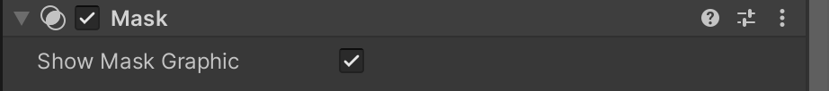

```c#
[AddComponentMenu("UI/Mask", 13)]
[ExecuteAlways]
[RequireComponent(typeof(RectTransform))]
[DisallowMultipleComponent]
public class Mask : UIBehaviour, ICanvasRaycastFilter, IMaterialModifier
```

`Mask` コンポーネントはステンシルテストを利用して配下の UI 要素をマスクするためのコンポーネントである。これにより、任意の形で画像をくり抜いて表示することができる。

なお、*UI -> ScrollView* で作成したスクロールビューの Viewport では `Mask` が使われているが、単純に矩形でマスクするのであれば `RectMask2D` コンポーネントに差し替えたほうがパフォーマンスが良い可能性がある。パフォーマンスについてはプラットフォームや UI の構成によって異なるので、必ず計測して選択すること。

以下ではステンシルテストの基礎知識および挙動について述べる。

### ステンシルテスト

ステンシルテストは、フラグメントシェーダーの後にフラグメントごとに行われる処理である。フラグメントごとに（通常は）8 ビットのバッファが用意されており、これをステンシルバッファと呼ぶ。

ステンシルテストの際には、現在処理中のフラグメントのステンシルの値とステンシルバッファの値の比較テストを行い、そのテストに失敗した場合にそのフラグメントを破棄する。たとえば、現在処理中のフラグメントのステンシルの値が `1` で、現在のフラグメントに対応したステンシルバッファの値が `0` で、比較関数が `Equal` であれば、ステンシルテストは失敗となりこのフラグメントは破棄される。

> 本来はステンシルテストはフラグメントシェーダの後に実行するのが自然な流れである（OpenGL のレンダリングパイプラインでは、ステンシルテストはフラグメントシェーダーの後に実行することになっている）が、フラグメントシェーダーを実行する前にステンシルテストの結果が確定しているのであれば、ステンシルテストを先に行うことでパフォーマンスを向上させることができる。このような処理が行われるかどうかについては GPU およびドライバに依存する。

> ステンシルというのは、同じ形を描くために穴が空いた文房具のことである。

ステンシルテストの挙動はシェーダーの `SubShader` または `Pass` セクションの中の `Stencil` セクションに記述する。何もステンシルテストを行わない場合の `Stencil` セクションは以下のようになる。

```
SubShader
{
    ...
    Stencil
    {
        // ステンシルテストの基準値
        Ref 0

        // 比較関数は、常にステンシルテストが成功 （破棄しない）
        Comp Always

        // ステンシルテスト成功時の挙動は Keep（何もしない）
        Pass Keep

        // バッファ読み込み時ビットマスク。0xFF なのでバッファの内容そのまま使う。
        ReadMask 255

        // バッファ書き込み時ビットマスク。0xFF なのでバッファの内容そのまま使う。
        WriteMask 255
    }
    ...
```

なお、デフォルトの UI シェーダーでは `Ref`、`Comp`、`ReadMask`、`WriteMask` などの（上記では即値で指定した）ステンシルテストのパラメータをプロパティ経由で指定できるようになっている。

```
Shader "UI/Default"
{
    Properties
    {   ...
        // ステンシル比較関数
        // UnityEngine.Rendering.CompareFunction で定義されている
        // https://docs.unity3d.com/ja/current/ScriptReference/Rendering.CompareFunction.html
        // 8 は Always であり、常にステンシルテストが成功する
        _StencilComp ("Stencil Comparison", Float) = 8

        // ステンシルテストの基準値（0 ～ 255）
        _Stencil ("Stencil ID", Float) = 0

        // ステンシルテスト成功時の挙動
        // UnityEngine.Rendering.StencilOp で定義されている
        // https://docs.unity3d.com/ja/current/ScriptReference/Rendering.StencilOp.html
        // 0 は Keep であり、変更を行わない
        _StencilOp ("Stencil Operation", Float) = 0

        // ステンシルテストを行った後にバッファに基準値を書き込むビットを指定するマスク
        // 0xFF なので基準値もバッファの内容もそのまま比較する
        _StencilWriteMask ("Stencil Write Mask", Float) = 255

        // ステンシルテストを行う前に基準値とバッファの内容の両方にかける論理和マスク
        // 0xFF なので基準値もバッファの内容もそのまま比較する
        _StencilReadMask ("Stencil Read Mask", Float) = 255
        ...
    }

    SubShader
    {
        ...
        // プロパティで指定されたステンシルの設定値を実際に設定する
        // https://docs.unity3d.com/ja/current/Manual/SL-Stencil.html
        Stencil
        {
            // ステンシルテストの基準値
            Ref [_Stencil]

            // 比較関数
            Comp [_StencilComp]

            // ステンシルテスト成功時の挙動
            Pass [_StencilOp]

            // バッファ読み込み時ビットマスク
            ReadMask [_StencilReadMask]

            // バッファ書き込み時ビットマスク
            WriteMask [_StencilWriteMask]
        }
        ...
```

ステンシル比較関数は `CompareFunctionUnityEngine.Rendering` として定義されており、ステンシルテスト成功時の挙動は `UnityEngine.Rendering.StencilOp` として定義されている。

```c#
namespace UnityEngine.Rendering
{
    public enum CompareFunction
    {
        // ステンシルテストは無効
        Disabled = 0,

        // ステンシルテストは常に失敗する
        Never = 1,

        // 新しい値がバッファから読み込んだ値よりも小さければステンシルテスト成功
        Less = 2,

        // 新しい値とバッファから読み込んだ値が等しければステンシルテスト成功
        Equal = 3,

        // 新しい値がバッファから読み込んだ値よりも小さいまたは等しければステンシルテスト成功
        LessEqual = 4,

        // 新しい値がバッファから読み込んだ値よりも大きければステンシルテスト成功
        Greater = 5,

        // 新しい値とバッファから読み込んだ値が異なればステンシルテスト成功
        NotEqual = 6,

        // 新しい値がバッファから読み込んだ値よりも大きいか等しければステンシルテスト成功
        GreaterEqual = 7,

        // ステンシルテストは常に成功する
        Always = 8
    }
}
```

```c#
namespace UnityEngine.Rendering
{
    public enum StencilOp
    {
        // 現在の値を維持する
        Keep = 0,

        // ステンシルバッファの値を 0 にする
        Zero = 1,

        // ステンシルバッファの値を基準値で置き換える
        Replace = 2,

        // ステンシルバッファの値をインクリメントする。
        // 最大値は unsigned で表現可能な値（ステンシルバッファが 8 ビットなら 255）
        IncrementSaturate = 3,

        // ステンシルバッファの値をデクリメントする。
        // 最小値は 0。
        DecrementSaturate = 4,

        // 現在のステンシルバッファの値をビット反転する。
        Invert = 5,

        // ステンシルバッファの値をインクリメントする。
        // 最大値をインクリメントしたなら 0 にする。        
        IncrementWrap = 6,

        // ステンシルバッファの値をデクリメントする。
        // 0 をデクリメントしたなら最大値にする。        
        DecrementWrap = 7
    }
}
```

外部からプロパティの値を設定することで、`Mask` コンポーネントおよびその子のシェーダーの挙動を変更してマスクを実現している。`Mask` コンポーネントおよびその子のステンシルテストのためのシェーダープロパティの値は `IMaterialModifier` を実装した `GetModifiedMaterial()` の内部で `UnityEngine.UI.StencilMaterial` クラスを利用して作成される。

`Mask` コンポーネントが使うマテリアルは `Mask.GetModifiedMaterial()` から得られる。以下のコードは `Mask.GetModifiedMaterial()` から一部抜粋して簡略化したものである。

*Packages/com.unity.ugui/Runtime/UI/Core/Mask.cs*
```c#
public virtual Material GetModifiedMaterial(Material baseMaterial)
{
    // ステンシルの基準値は Hierarchy 内での深さを元に計算する
    var stencilDepth = MaskUtilities.GetStencilDepth(transform, rootSortCanvas);
    
    // 基準値は、Hierarchy 内での深さが浅い Mask から順に 0x1, 0x3, 0x7, ... となっていく
    int desiredStencilBit = 1 << stencilDepth;
    
    if (desiredStencilBit == 1) // 一番浅い Mask
    {
        // ステンシルテストを行うためのマテリアルを作成する。
        // シェーダープロパティは
        // 　基準値：上で計算した desiredStencilBit
        // 　成功時：Always
        // 　比較関数：Equal
        // 　ColorMask：Mask コンポーネントの showMaskGraphic が true なら Mask 画像を表示するので 0xFF。false なら画像は表示しないので 0 にする。
        // 　ReadMask：省略されているが 0xFF
        // 　WriteMask：省略されているが 0xFF 
        var maskMaterial = StencilMaterial.Add(baseMaterial, 1, StencilOp.Replace, CompareFunction.Always, m_ShowMaskGraphic ? ColorWriteMask.All : 0);

        // StencilMaterial.Add() を呼ぶと static な List に Add されてしまうが不要なので削除
        StencilMaterial.Remove(m_MaskMaterial);

        // このマテリアルを使う
        m_MaskMaterial = maskMaterial;
    }    
    else // 二番目以降の深さにある Mask
    {
        // ステンシルテストを行うためのマテリアルを作成する。
        // シェーダープロパティは
        // 　基準値：上で計算した desiredStencilBit
        // 　成功時：Replace
        // 　比較関数：Equal
        // 　ColorMask：Mask コンポーネントの showMaskGraphic が true なら 0xF（=RGBA 全てを出力する）。false なら画像は表示しないので 0 にする。
        // 　ReadMask：自分の基準値だけが落とせるビットマスク
        // 　WriteMask：自分の基準値だけのビットとそれ以外のビットの論理和
        var maskMaterial2 = StencilMaterial.Add(baseMaterial, desiredStencilBit | (desiredStencilBit - 1), StencilOp.Replace, CompareFunction.Equal, m_ShowMaskGraphic ? ColorWriteMask.All : 0, desiredStencilBit - 1, desiredStencilBit | (desiredStencilBit - 1));

        // StencilMaterial.Add() を呼ぶと static な List に Add されてしまうが不要なので削除
        StencilMaterial.Remove(m_MaskMaterial);

        // このマテリアルを使う
        m_MaskMaterial = maskMaterial;
    }
```

一方、`Mask` コンポーネントの子（や孫、ひ孫など）が使うマテリアルは `MaskableGraphic.GetModifiedMaterial()` から得られる。

*Packages/com.unity.ugui/Runtime/UI/Core/MaskableGraphic.cs*
```c#
// レンダリングに使うマテリアルを返す
public virtual Material GetModifiedMaterial(Material baseMaterial)
{
    ...
    // ステンシルの基準値は Hierarchy 内での深さを元に計算する
    m_StencilValue = maskable ? MaskUtilities.GetStencilDepth(transform, rootCanvas) : 0;
    
    ...
    // ステンシルテストを行うためのマテリアルを作成する。
    // シェーダープロパティは
    // 　基準値：上で計算した深さ
    // 　成功時：Keep
    // 　比較関数：Equal
    // 　ColorMask：0xF（=RGBA 全てを出力する）
    // 　ReadMask：基準値が読み込めるビット
    // 　WriteMask：0
    var maskMat = StencilMaterial.Add(toUse, (1 << m_StencilValue) - 1, StencilOp.Keep, CompareFunction.Equal, ColorWriteMask.All, (1 << m_StencilValue) - 1, 0);
```

疑似的に即値でのシェーダーコードを示すと、一番浅い Hierarhy にある `Mask` コンポーネントの `Stencil` セクションは以下のようになる。

```
SubShader
{
    ...
    Stencil
    {
        // ステンシルテストの基準値
        Ref 1

        // 比較関数は、常にステンシルテストが成功 （破棄しない）
        Comp Always

        // ステンシルテスト成功時の挙動は Replace（基準値で置き換える）
        Pass Replace

        // バッファ読み込み時ビットマスク。0xFF なのでバッファの内容そのまま使う。
        ReadMask 255

        // バッファ書き込み時ビットマスク。0xFF なのでバッファの内容そのまま使う。
        WriteMask 255
    }
    ...
```

一方、`Mask` の子の UI 要素の `Stencil` セクションは以下のようになる。

```
SubShader
{
    ...
    Stencil
    {
        // ステンシルテストの基準値
        Ref 1

        // 比較関数は、値が一致したときに成功する
        Comp Equal

        // ステンシルテスト成功時の挙動は Keep（何もしない）
        Pass Keep

        // バッファ読み込み時ビットマスク。1 なのでバッファの内容の下位 1 bit だけを使う。
        ReadMask 1

        // バッファ書き込み時ビットマスク。0 なのでバッファの内容は一切使わない。
        WriteMask 0
    }
    ...
```

それでは、`Mask` コンポーネントを利用した際の実際のステンシルテストの様子を見ていこう。uGUI ではヒエラルキーの浅いほうから処理が行われるので、先に `Mask` コンポーネント側のステンシルテストが以下のように行われる。

1. フラグメントシェーダーが実行される。

2. このフラグメントに対応したステンシルバッファの値をそのまま読み込む（`ReadMask` が `0xFF`）。

3. ステンシルテストが常に成功（`Always`）する。

4. ステンシルテストが成功したので、ステンシルバッファの `0` （デフォルト値）が `1` に置き換えられる（`Replace`）。

5. 置き換えられた `1` の値はそのまま書き込まれる（`WriteMask` が `0xFF`）。

その後の `Mask` コンポーネントの子（や孫やひ孫などの下にあるコンポーネント）の UI 要素の処理は以下のようになる。

1. フラグメントシェーダーが実行される。

2. このフラグメントに対応したステンシルバッファの値を読み込むと、`Mask` のピクセルが存在している場合は `1` が得られ、そうでなければ `0` が得られる（ReadMask が `0x1`）。

3. ステンシルテストの基準値 `1` と、上記で得られた値が等しければステンシルテストが成功となり、UI 要素のピクセルがレンダリングされる。そうでなけれればステンシルテストは失敗となり、UI 要素のピクセルはレンダリングされない。

4. WriteMask は `0x0` なので、ステンシルバッファへは何も書き込まれない。

### ステンシルテストの使用可否

Unity が現在サポートしている全てのプラットフォームではステンシルテストがサポートされている。ステンシルテストのサポート可否を返す `SystemInfo.supportsStencil` は常に `true` を返すことからも明らかである。しかし、残念ながらいくつかの条件の下ではステンシルテストは動作しない。その条件をいくつか示す。

- `RenderTexture` を 16 bit の depth で作成した場合、ステンシルバッファが作成されないのでステンシルテストは動作しない。なお、Editor 上で実行した場合には勝手にステンシルバッファが作成されてしまうので、実機でないと確認できないことがあるので注意しよう。

- Android の **Player Settings** で **Disable Depth and Stencil** を有効にしている場合、ステンシルは無効となる。これはパフォーマンス向上のために Oculus のドキュメントで有効にすることが推奨されているという罠である。

- ごく一部の Android 端末ではステンシルが正常に動作しないことがある。Google Play Store などの不特定多数の Android 端末での動作が予想されるプラットフォームでステンシルを利用する場合は、このことを考慮しておく必要がある。そういった端末はサポート対象外とする必要があるかもしれない。

PC やコンソールではステンシルテストはおそらく問題なく動作し、パフォーマンスもそれほど悪くないので普通に使って構わないだろう。`RenderTexture` にレンダリングしている場合には、`RenderTexture.SupportsStencil()` を呼んで、ステンシルバッファがサポートされているかチェックすべきである。

### Mask のプロパティ

#### graphic

```c#
public Graphic graphic { get; }
```

このコンポーネントにアタッチされている `Graphic` コンポーネントを取得する。

通常、マスクとしてくり抜きたい画像が `Image` あるいは `RawImage` としてアタッチされているはずなので、それを取得する目的で使われる。

#### rectTransform

```c#
public RectTransform rectTransform { get; }
```

`RectTransform` のキャッシュを取得する。

#### showMaskGraphic

```c#
public bool showMaskGraphic { get; set; }
```

マスクとして使う画像を表示するかどうかを取得/設定する。

デフォルト値は `true` であり、つまり、シェーダーの `ColorMask` は `0xF`（= RGBA 全てを出力する）となる。この場合、マスク用の画像もレンダリングされることになる。

このプロパティが `false` であれば、シェーダーの `ColorMask` は `0` になり、マスク用の画像は表示されなくなる。

### Mask の public メソッド

#### GetModifiedMaterial()

```c#
public virtual Material GetModifiedMaterial(Material baseMaterial);
```

`CanvasRenderer` に渡すマテリアルを取得する。

このメソッドは `IMaterialModifier` インターフェースの実装である。

引数として渡されたマテリアルを元にして、ステンシルテスト用のマテリアルを生成し、それを返す。マスクが無効であれば渡されたマテリアルをそのまま返す。

#### IsRaycastLocationValid()

```c#
public virtual bool IsRaycastLocationValid(Vector2 sp, Camera eventCamera);
```

レイキャスト判定を行う。引数で与えられた `screenPoint` の位置でレイキャストヒットしたなら `true` を返す。

このメソッドは `ICanvasRaycastFilter` インターフェースの実装である。

`GameObject` がアクティブ、かつ、コンポーネントが `enabled` であれば、`RectTransformUtility.RectangleContainsScreenPoint()` を呼んで、与えられた位置が `RectTransform` 内に収まっているかを返す。

#### MaskEnabled()

```c#
public virtual bool MaskEnabled();
```

マスク機能が有効かどうかを返す。

`GameObject` がアクティブかつコンポーネントが `enabled` かつ `graphic` が `null` でないなら `true` を返す。そうでなければ `false` を返す。

## RectMask2D

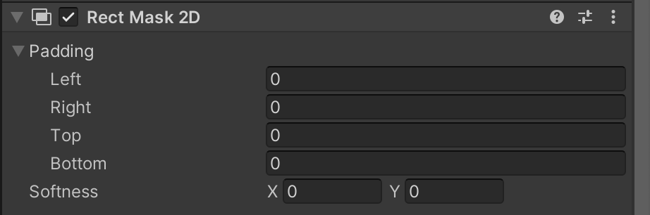

```c#
[AddComponentMenu("UI/Rect Mask 2D", 13)]
[ExecuteAlways]
[DisallowMultipleComponent]
[RequireComponent(typeof(RectTransform))]
public class RectMask2D : UIBehaviour, IClipper, ICanvasRaycastFilter
```

`RectMask2D` は `RectTransform` の矩形でクリッピング（マスク）を実現するためのコンポーネントである。`RectMask2D` は `Mask` コンポーネントと似ているが、以下の点で異なる。

- `Mask` と比べた場合の `RectMask2D` のメリット

  - ステンシルバッファを必要としない。
  - ドローコールを増加させないため特にモバイルプラットフォームでパフォーマンスが良い。
  - レンダリングのためにマテリアルを変更したりしない。

- `Mask` と比べた場合の `RectMask2D` のデメリット
  - `Mask` とは異なり、任意の形でクリッピングすることはできない。
  - マスク対象が同一平面でなければならない（Z 座標が同一でないといけない）。もっとも、`Canvas` を普通に使っている限り、これは問題とはならないだろう。

このように、矩形でしかクリッピングできないという点を除けば、`RectMask2D` はパフォーマンスの良いコンポーネントである。デフォルトの `ScrollView` は `Mask` を使っているが、`RectMask2D` に置き換えたほうが良いケースも多い。

`RectMask2D` のクリッピング処理はフラグメントシェーダーで行われるが、クリッピング領域の計算は Graphic リビルドの最初に行われる。そこでは `ClipperRegistry` に登録された `IClipper` の `PerformClipping()` が呼ばれて、子のクリッピング領域が計算される。

では、フラグメントシェーダー内でのクリッピング処理を見ていこう。デフォルト UI シェーダーの `UNITY_UI_CLIP_RECT` キーワードが有効なら、フラグメントシェーダーでアルファ値が計算される。クリッピング領域の外であればアルファ値が `0` となり、ピクセルは表示されない。

*UI デフォルトシェーダーから抜粋*
```
// MaskableGraphic.SetClipRect() 等から CanvasRenderer.EnableRectClipping() で設定
float4 _ClipRect;

...

// フラグメントシェーダー
fixed4 frag(v2f IN) : SV_Target
{
    // テクスチャから色のサンプリング
    half4 color = (tex2D(_MainTex, IN.texcoord) + _TextureSampleAdd) * IN.color;

    #ifdef UNITY_UI_CLIP_RECT
    // ソフトマスクを考慮したクリッピング
    half2 m = saturate((_ClipRect.zw - _ClipRect.xy - abs(IN.mask.xy)) * IN.mask.zw);
    color.a *= m.x * m.y;
    #endif
```

Unity 2020.1 からはソフトマスクと呼ばれるクリッピング領域の端をぼかす機能が実装され、簡単に利用することができる。

### RectMask2D のプロパティ

#### rectTransform

```c#
public RectTransform rectTransform { get; }
```

`RectTransform` のキャッシュを取得する。

#### canvasRect

```c#
public Rect canvasRect { get; }
```

`Canvas` 内の座標に変換した `RectTransform` を取得する。

#### padding

```c#
public Vector4 padding { get; set; }
```

クリッピング領域のパディングを取得/設定する。

このプロパティは Unity 2020.1 から導入された。

`Vector4` の `x` が左、`y` が下、`z` が右、`w` が上となっている。負の値であれば領域が大きくなり、正の値であれば領域が小さくなる。このパディングはレイキャスト判定にも影響する。

#### softness

```c#
public Vector2Int softness { get; set; }
```

水平方向および垂直方向のソフトマスクの大きさを取得/設定する。

このプロパティは Unity 2020.1 から導入された。

この値を大きくすればするほど、クリッピング領域の端が徐々に透明になる。

### RectMask2D の public メソッド

#### AddClippable()

```c#
public void AddClippable(IClippable clippable);
```

この `RectMask2D` でクリッピング対象の子の UI 要素を登録する。

このメソッドは対象の UI 要素の `OnEnable()` などから呼び出される。

クリッピング対象の UI 要素は `IClippable` インターフェースを実装したオブジェクトまたは `MaskableGraphic` である。`MaskableGraphic` も `IClippable` インターフェースを実装しているが、`RectMask2D` はそれらを区別して管理している（`Canvas` が移動したかどうかを `Graphic.canvasRenderer.hasMoved` で判定し、移動していたならクリッピング領域を再計算するため）。

#### RemoveClippable()

```c#
public void RemoveClippable(IClippable clippable);
```

`AddClippable()` で登録したクリッピング対象の子の UI 要素を削除する。

#### IsRaycastLocationValid()

```c#
public virtual bool IsRaycastLocationValid(Vector2 sp, Camera eventCamera);
```

レイキャスト判定を行う。

引数で与えられた `sp` の位置でレイキャストヒットしたなら `true` を返す。

このメソッドは `ICanvasRaycastFilter` インターフェースの実装である。

`GameObject` がアクティブかつコンポーネントが `enabled` であれば `RectTransformUtility.RectangleContainsScreenPoint()` を呼んで、与えられた位置が `RectTransform` 内に収まっているかを返す。この判定には `padding` が影響しており、パディングによってクリッピング領域が大きくあるいは小さくなった場合には、このレイキャスト判定の領域も変化する。

#### PerformClipping()

```c#
public virtual void PerformClipping();
```

クリッピング対象の子の UI 要素のクリッピング領域を計算する。

このメソッドは、`CanvasUpdateRegistry.PerformUpdate()` の Layout リビルドが完了した直後の、Graphic リビルドの最初に呼ばれる。ここでは、`AddClippable()` で登録された `MaskableGraphic` および `IClippable` のクリッピング領域を計算して（ソフトマスクのサイズとともに）シェーダーに渡し、`Canvas` のリビルドが要求される。

#### UpdateClipSoftness()

```c#
public virtual void UpdateClipSoftness();
```

ソフトマスクのパラメータを適用する。

`MaskableGraphic` の場合、`CanvasRenderer.clippingSoftness` にパラメータを設定し、そのパラメータが最終的にシェーダーに渡される。

## Image の透明な部分のタッチに反応しないようにする

`Image` のレイキャスト判定はデフォルトでは透明部分に対しても有効である。つまり、透明部分をタッチしても反応してしまう。

`Image` の `alphaHitTestMinimumThreshold` の項で説明した通り、`alphaHitTestMinimumThreshold` を `1` に設定して `Texture` の `Read/Write enabled` を有効にし、アトラス化を無効すれば透明部分に反応しなくなるが、テクスチャメモリ使用量が 2 倍になってしまう。

ここでは透明な部分のタッチに反応しないようにするために, `Sprite` の **Custom Physics Shape** を利用してみよう。Custom Physics Shape によって `Sprite` のメッシュの形状を画像でくりぬいた形にすることができる。このメッシュを使ってレイキャストを判定を行えば、透明部分のタッチに反応しなくなる。

まずは Physics Shape を作成する。Texture の **Import Settings** で **Texture Type** が **Sprite(2D and UI)** になっていることを確認し、**Sprite Editor** ボタンを押す。

> もし、**Sprite Editor** がインストールされていないなら **Package Manager** から **2D Sprite** パッケージをインストールする。

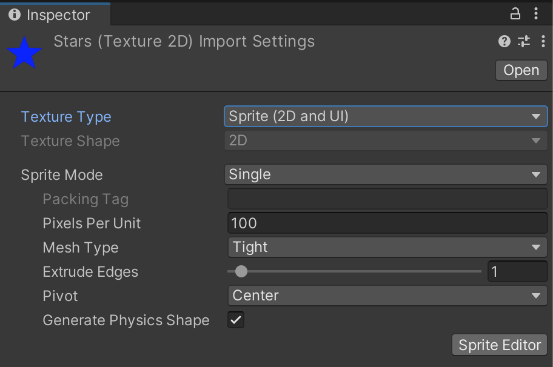

左上の **Sprite Editor** となっているドロップダウンメニューを開いて **Custom Physics Shape** を選択する。

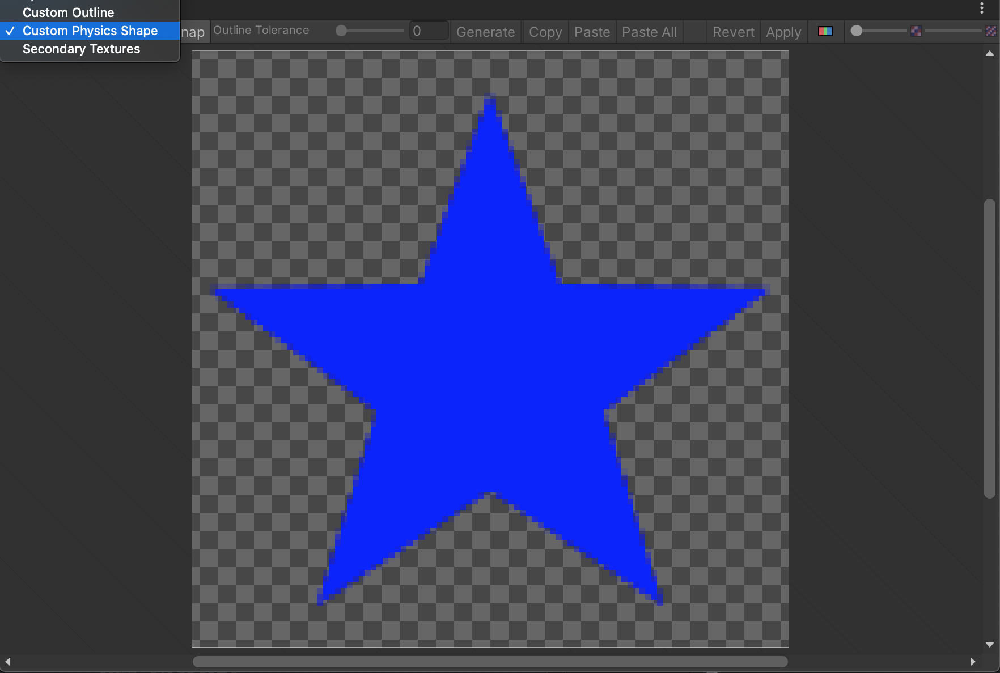

**Outline Tolerance** を微調整して **Generate** ボタンを押す。

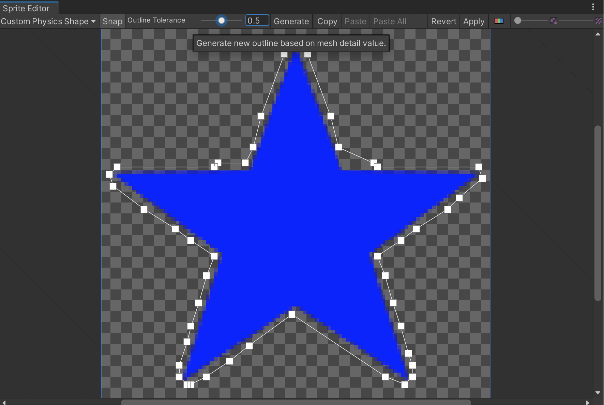

最後に右上の **Apply** ボタンを押す。これで Physics Shape が作成された。

次に、この Physics Shape を使ってレイキャスト判定を行う。タッチされた点が Physics Shape の内側なら `IsRaycastLocationValid()` が `true` を返すようにすればよい。Physics Shape の内側かどうかの判定には `PolygonCollider2D` を使うと便利だろう。

これらを踏まえて、`Image` を拡張して Physics Shape を使ってレイキャスト判定を行うコンポーネントを以下に示す。`Sprite` に Custom Physics Shape が設定されていれば、透明部分のタッチに反応しなくなるだろう。

```c#
using System.Collections.Generic;
using UnityEngine;
using UnityEngine.UI;

// Sprite の Custom Physics Shaper の形で Raycast 判定を行う Image
[RequireComponent(typeof(PolygonCollider2D))]
public class ShapeRaycastImage : Image
{
    private PolygonCollider2D collider2d;

    protected override void OnEnable()
    {
        base.OnEnable();

        AdjustCollider();

        RegisterDirtyVerticesCallback(AdjustCollider);
    }

    protected override void OnDisable()
    {
        UnregisterDirtyVerticesCallback(AdjustCollider);
        base.OnDisable();
    }

    public void AdjustCollider()
    {
        if (overrideSprite == null)
        {
            return;
        }

        // Sprite の Custom Physics Shaper から PolygonCollider2D を生成する
        collider2d = GetComponent<PolygonCollider2D>();
        if (collider2d == null)
        {
            collider2d = gameObject.AddComponent<PolygonCollider2D>();
        }

        collider2d.isTrigger = true;
        collider2d.pathCount = overrideSprite.GetPhysicsShapeCount();

        for (int i = 0; i < collider2d.pathCount; i++)
        {
            List<Vector2> physicsShape = new List<Vector2>();
            int pointCount = overrideSprite.GetPhysicsShape(i, physicsShape);

            Vector2[] points = new Vector2[pointCount];
            for (int j = 0; j < points.Length; j++)
            {
                float x = (physicsShape[j].x / overrideSprite.rect.width * overrideSprite.pixelsPerUnit + 0.5f - rectTransform.pivot.x) * rectTransform.rect.width;
                float y = (physicsShape[j].y / overrideSprite.rect.height * overrideSprite.pixelsPerUnit + 0.5f - rectTransform.pivot.y) * rectTransform.rect.height;

                points[j] = new Vector2(x, y);
            }

            collider2d.SetPath(i, points);
        }
    }

    // RectTransform の座標が PolygonCollider2D に重なっているなら true を返す
    public bool IsRectTransformPointOverLapped(Vector2 local)
    {
        Vector2 point = new Vector2(transform.position.x + local.x * rectTransform.lossyScale.x, transform.position.y + local.y * rectTransform.lossyScale.y);

        return collider2d.OverlapPoint(point);
    }

    public override bool IsRaycastLocationValid(Vector2 screenPoint, Camera eventCamera)
    {
        if (overrideSprite == null)
        {
            return true;
        }

        Vector2 local;
        if (!RectTransformUtility.ScreenPointToLocalPointInRectangle(rectTransform, screenPoint, eventCamera, out local))
        {
            return false;
        }

        // PolygonCollider2D での判定
        if (IsRectTransformPointOverLapped(local))
        {
            return true;
        }

        return false;
    }
}

```

# Chapter 6 Text とフォント

uGUI で文字を表示する場合、`Text` コンポーネントを利用するのが最もシンプルである。ただし、`Text` だけでは文字間の間隔を調整したり装飾を表現するのが面倒でもある。TextMesh Pro (TMP) の多彩な機能を利用することで豪華な文字表現を実現することができる。

ただし、TextMesh Pro が常に万能なソリューションというわけではなく、時と場合によっては `Text` コンポーネントを利用したほうが良いこともある。この章では `Text` コンポーネント、フォントアセット、TextMesh Pro について調べていく。

## Text コンポーネント

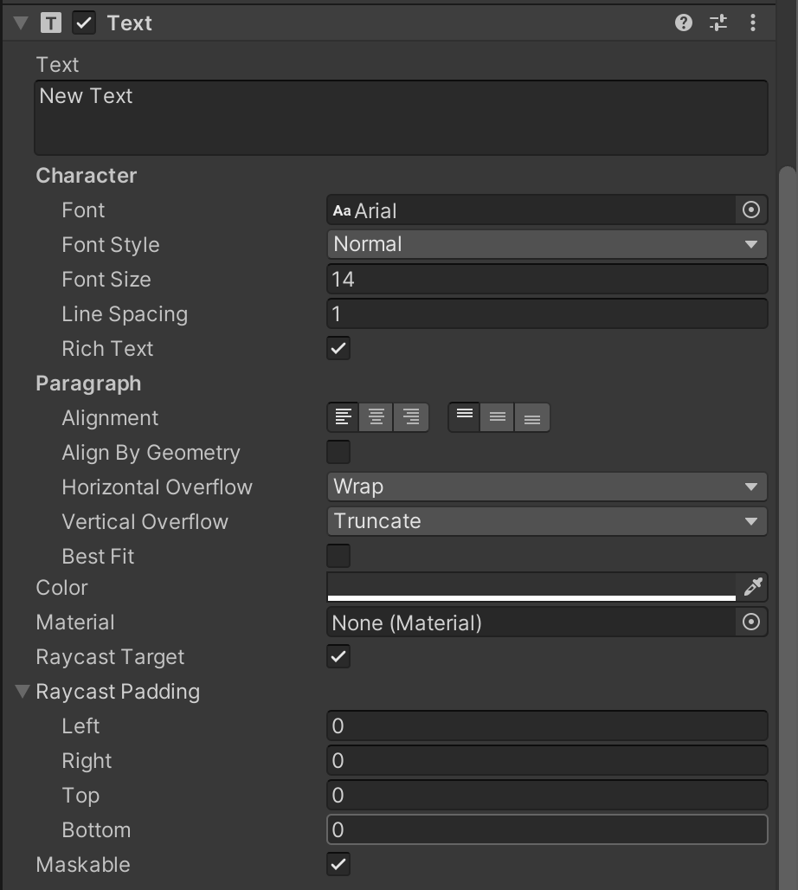

```c#
namespace UnityEngine.UI
{
    [RequireComponent(typeof(CanvasRenderer))]
    [AddComponentMenu("UI/Text", 10)]
    public class Text : MaskableGraphic, ILayoutElement
```

`Text` コンポーネントは、ラスタライズされた字形（字体）を UI で表示するためのコンポーネントである。`Text` は `Image` などと同様に `MaskableGraphic` クラス経由で `Graphic` クラスを継承している。

`Text` は uGUI で文字を表示する場合に真っ先に使われるコンポーネントだが、パフォーマンスの観点からは非常に罠が多いコンポーネントである。`Text` では各文字ごとに一つの矩形が割り当てられてレンダリングされるが、これらの矩形は透明部分が非常に多いため、意図せず Canvas のバッチを中断させてしまうことがある。

また、テキスト用のメッシュのリビルドも大きな問題となる。`Text` コンポーネントが変更された際には、テキストを表示するのに使われているポリゴンを再計算する必要があり、Graphic リビルドが発生する。他の UI コンポーネントと同様に Graphic リビルドの頻度を減らすことが重要である。

### Text のプロパティ

#### text

```c#
public virtual string text { get; set; }
```

表示する文字列の値を取得/設定する。

定義を以下に示す。

*UnityEngine.UI/UI/Core/Text.cs*
```c#
public virtual string text
{
    get
    {
        return m_Text;
    }
    set
    {
        if (String.IsNullOrEmpty(value))
        {
            if (String.IsNullOrEmpty(m_Text))
                return;
            m_Text = "";
            SetVerticesDirty();
        }
        else if (m_Text != value)
        {
            m_Text = value;
            SetVerticesDirty();
            SetLayoutDirty();
        }
    }
}
```

文字列が変更されると `Graphic.SetLayoutDirty()` と `Graphic.SetVerticesDirty()` が呼ばれるため Layout リビルドと Graphic リビルドが発生する。これは回避不能である。文字列を空にしようとする際には通常 `SetVerticesDirty()` が呼ばれるが、単に文字列を表示したくないのであれば `localScale` を `(0, 0, 0)` にするなどしたほうが若干パフォーマンスが良い。

#### font

```c#
public Font font { get; set; }
```

テキストに使用されるフォントアセットを取得/設定する。フォントアセットについては後述する。

#### fontStyle

```c#
public FontStyle fontStyle { get; set; }
```

テキストで使用されるフォントスタイルを取得/設定する。`FontStyle` は以下のように定義されている。

```c#
public enum FontStyle
{
    // 特にスタイル指定無し
    Normal,

    // 太字
    Bold,
    
    // 斜体
    Italic,
    
    // 太字かつ斜体
    BoldAndItalic
}
```

Bold や Italic 用のフォントが関連するフォント（フォントアセットの **Import Settings** の **References to other fonts in project**）の中にあれば、それらが使われる。もし無ければ、Unity が（OS の機能を通して）太字にしたり斜体にしたりした字体が使われる。Unity 側で処理した太字や斜体の品質が気に食わないのであれば、別個にフォントを用意したほうが良い。

#### fontSize

```c#
public int fontSize { get; set; }
```

テキストで使用されるフォントのサイズを取得/設定する。

単位は pt（ポイント）である。フォントサイズが `Text` の `RectTransform` より大きい場合にはテキストは表示されない（実際には `horizontalOverflow` や `verticalOverflow` が `Overflow` であれば常に表示される）。厄介なことに `Text` のレンダリングに必要な領域の大きさは `Canvas` の `scaleFactor` に依存する。Screen Space の Canvas の `scaleFactor` は解像度から計算されるので、Editor 上でちょうどのサイズだったとしても実機では `RectTransform` のサイズがわずかに足りなくて文字が表示されない、という現象が起こりうる。

フォントサイズを元にした適切な `RectTransform` の大きさは `preferredWidth` および `preferredHeight` で得られる。もし、`RectTransform` のサイズを自動的に調整したいのであれば `ContentSizeFitter` コンポーネントをアタッチして、**Horizontail Fit** と **Vertical Fit** に **Preferred Size** を設定するのが一番お手軽である。

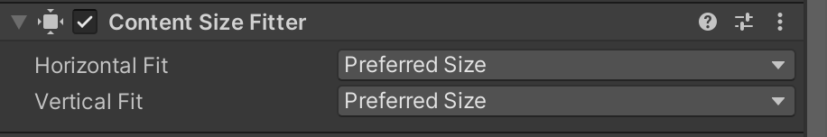

この `fontSize` はフォントテクスチャの文字のサイズである。よって、このサイズを想定サイズの 2 倍にした上で `RectTransform` の `scale` を `(0.5f, 0.5f, 1.0f)` に設定することで滑らかな文字を表示させることができる。逆に、フォントサイズを半分にして `scale` を `(2, 2, 1)` に設定すれば、文字はボケるもののフォントテクスチャを節約することもできるまた、フォントテクスチャの文字のサイズを一種類に統一し、表示上の文字サイズは `scale` で制御することでフォントテクスチャを節約するという小技も実現できる。このテクニックは、見た目とテクスチャメモリの使用量のバランスを考えた上で使ってほしい。

#### lineSpacing

```c#
public float lineSpacing { get; set; }
```

行間の幅を取得/設定する。

実際にどのくらいの行間のピクセルが空くのかについてはフォントに依存する。

#### supportRichText

```c#
public bool supportRichText { get; set; }
```

リッチテキストをサポートする場合に有効にする。リッチテキストそのものについての説明については公式ドキュメントを読んで欲しい。

<https://docs.unity3d.com/ja/current/Manual/StyledText.html>

注意してほしいのは、このプロパティはデフォルトで有効であるということである。もしプレイヤーが任意に入力できる文字列の `Text`（たとえば、プレイヤー名やチャットのテキスト）でリッチテキストが有効になっていると、色を変えたりサイズを変えたりなどの意図しない挙動が発生してしまう。パフォーマンスの観点からも、このプロパティを有効にして得られるメリットは無いので基本的には無効にすること。**Preset Manager** でプリセットを作成しておくことをおすすめする。

*Unity ユーザーマニュアルのプリセットの説明*
<https://docs.unity3d.com/ja/current/Manual/Presets.html>

#### alignment

```c#
public TextAnchor alignment { get; set; }
```

`RectTransform` に対してのテキストの相対的な配置を取得設定する。

上下の上/中/下と、左右の左/中/右を指定できる。`TextAnchor` の定義は以下の通りである。

```c#
namespace UnityEngine
{
    public enum TextAnchor
    {
        UpperLeft,
        UpperCenter,
        UpperRight,
        MiddleLeft,
        MiddleCenter,
        MiddleRight,
        LowerLeft,
        LowerCenter,
        LowerRight
    }
}
```

#### alignByGeometry

```c#
public bool alignByGeometry { get; set; }
```

フォントのメトリクス情報（ベースラインや高さなど）ではなく、テキスト用メッシュのジオメトリを使って上下左右揃えを行う。

このプロパティを `true` に設定すると `RectTransform` の境界と文字のメッシュが一致するようになる。

#### horizontalOverflow

```c#
public HorizontalWrapMode horizontalOverflow { get; set; }
```

テキストの幅が `RectTransform` の幅よりも大きかった場合の挙動を取得/設定する。

`HorizontalWrapMode` の定義は以下の通りである。

```c#
namespace UnityEngine
{
    // 水平方向の境界に達した場合の挙動
    public enum HorizontalWrapMode
    {
        // 折り返す
        Wrap,

        // 溢れさせる
        Overflow
    }
}
```

デフォルト値は `Overflow` なのでそのままはみ出る。`Wrap` の場合は行末で改行して折り返す。

#### verticalOverflow

```c#
public VerticalWrapMode verticalOverflow { get; set; }
```

テキストの高さが `RectTransform` の高さよりも大きかった場合の挙動を取得/設定する。

```c#
namespace UnityEngine
{
    // 垂直方向の境界に達した場合の挙動
    public enum VerticalWrapMode
    {
        // 切り捨て
        Truncate,
        // 溢れさせる
        Overflow
    }
}
```

デフォルトは `Truncate` なので切り捨てられる。`Overflow` の場合は溢れる。

#### resizeTextForBestFit

```c#
public bool resizeTextForBestFit { get; set; }
```

このプロパティを `true` にすると、テキストが `RectTransform` の領域に収まるようフォントのサイズが自動的にぎりぎり最大の整数値に変更される。**Inspector** では **Best Fit** として表示されている。

デフォルト値は `false` である。

一般的にはこの Best Fit の設定は使うべきではない。理由としては、フォントテクスチャのメモリ使用量が増加する可能性があるためである。フォントテクスチャはフォントサイズごとの文字を格納しているため、違うサイズのフォントを使用すると新しい文字がフォントテクスチャに格納されるようになる。これによってフォントテクスチャのサイズが大きくなり、メモリ使用量が増加する。それだけではなくメモリの断片化も発生する可能性がある。また、最適なフォントサイズを計算するために繰り返し計算が行われるため、CPU 時間を消費することになる。

この設定が効果的である数少ない状況は、多言語対応したゲームでテキストを特定の領域に収めたい場合であろう。通常は事前に適切なフォントサイズを指定するべきであるが、対応する言語数やテキスト量が多い場合にはそれが難しい場合がある。そういった特殊な場合の対処方法として Best Fit の機能を覚えておくのは損ではない。

#### mainTexture

```c#
public override Texture mainTexture { get; }
```

この `Text` で使っているフォントテクスチャを取得する。

たとえば、このフォントテクスチャを `RawImage` の `texture` に設定すれば、現在使用中のフォントテクスチャを目視で確認することができるようになる。同様の内容はフォントアセットの **Font Material** のプレビューでも確認することができる。

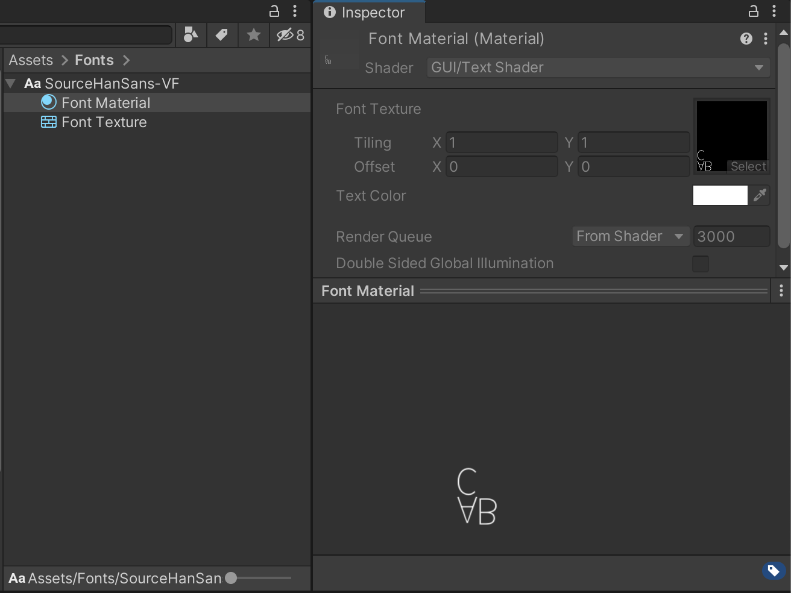

#### resizeTextMinSize

```c#
public int resizeTextMinSize { get; set; }
```

Best Fit が有効な場合の最小フォントサイズを取得/設定する。

デフォルト値は `0` である。

**Inspetor** には **Min Size** として表示される。

この値のフォントサイズで領域に収まらない場合、文字列の一部が非表示となる。

#### resizeTextMaxSize

```c#
public int resizeTextMaxSize { get; set; }
```

Best Fit が有効な場合の最大フォントサイズを取得/設定する。

デフォルト値は `100` である。

**Inspetor** には **Max Size** として表示される。

このプロパティを `1` に設定した場合には `fontSize` そのものの値が設定される。`fontSize` よりも小さい値を設定した場合には `fontSize` の値に設定される。

#### pixelsPerUnit

```c#
public float pixelsPerUnit { get; }
```

スクリーンに対して何ポイントでフォントを表示させるのかの倍率を取得する。

実際に定義を見てもらうのがわかりやすいだろう。

*Packages/com.unity.ugui/Runtime/UI/Core/Text.cs*
```c#
/// <summary>
/// スクリーンに対するフォントのスケール情報を提供する
/// </summary>
/// <remarks>
/// ダイナミックフォントの場合、この値は Canvas の scale factor と同一となる。そうでない場合、テキストのサイズとフォントのサイズから計算される。
/// </remarks>
public float pixelsPerUnit
{
    get
    {
        var localCanvas = canvas;
        if (!localCanvas)
            return 1;
        // ダイナミックフォントの場合、スクリーンでは 1 ピクセルに対して 1 ピクセルであることを保障する。
        if (!font || font.dynamic)
            return localCanvas.scaleFactor;
        // 非ダイナミックフォントの場合、フォントオブジェクトのフォントサイズに対する指定されたフォントサイズの比率を元に単位当たりのピクセルを計算する。
        if (m_FontData.fontSize <= 0 || font.fontSize <= 0)
            return 1;
        return font.fontSize / (float)m_FontData.fontSize;
    }
}
```

#### cachedTextGenerator

```c#
public TextGenerator cachedTextGenerator { get; }
```

文字をレンダリングする際に使用される `TextGenerator` のキャッシュを取得する。

`TextGenerator` クラスについては後述する。

#### cachedTextGeneratorForLayout

```c#
public TextGenerator cachedTextGeneratorForLayout { get; }
```

Layout を決定する際に使用される `TextGenerator` のキャッシュを取得する。

#### minWidth

```c#
public virtual float minWidth { get; }
```

Auto Layout の際に用いられる最小の幅を取得する。

常に `0` を返す。詳細は *Chapter 9 Auto Layout* で説明する。

### minHeight

```c#
public virtual float minHeight { get; }
```

Auto Layout の際に用いられる最小の高さを取得する。

常に `0` を返す。詳細は *Chapter 9 Auto Layout* で説明する。

### flexibleWidth

```c#
public virtual float flexibleWidth { get; }
```

Auto Layout の際に用いられる flexible の幅を取得する。

常に `-1` を返すので、flexible の幅は無視される。詳細は *Chapter 9 Auto Layout* で説明する。

### flexibleHeight

```c#
public virtual float flexibleHeight { get; }
```

Auto Layout の際に用いられる flexible の高さを取得する。

常に `-1` を返すので、を返すので、flexible の高さは無視される。詳細は *Chapter 9 Auto Layout* で説明する。

#### preferredWidth

```c#
public virtual float preferredWidth { get; }
```

Auto Layout の際に用いられる、`text` を全て表示するのに十分な幅を取得する。

具体的には `cachedTextGeneratorForLayout.GetPreferredWidth()` を `pixelsPerUnit` で割った結果を返す。

`preferredWidth` がどのように使われるのかについての詳細は *Chapter 9 Auto Layout* で説明する。

#### preferredHeight

```c#
public virtual float preferredHeight { get; }
```

Auto Layout の際に用いられる、`text` を全て表示するのに十分な高さを取得する。

具体的には `cachedTextGeneratorForLayout.GetPreferredHeight()`  を `pixelsPerUnit` で割った結果を返す。

`preferredWidth` がどのように使われるのかについての詳細は *Chapter 9 Auto Layout* で説明する。

### Text の static メソッド

#### GetTextAnchorPivot

```c#
public static Vector2 GetTextAnchorPivot(TextAnchor anchor);
```

`TextAnchor` を渡すと、それに対応した `Vector2` を返す。

これは実際にコードを見るのが分かりやすいだろう。

*Packages/com.unity.ugui/Runtime/UI/Core/Text.cs*
```c#
static public Vector2 GetTextAnchorPivot(TextAnchor anchor)
{
    switch (anchor)
    {
        case TextAnchor.LowerLeft:    return new Vector2(0, 0);
        case TextAnchor.LowerCenter:  return new Vector2(0.5f, 0);
        case TextAnchor.LowerRight:   return new Vector2(1, 0);
        case TextAnchor.MiddleLeft:   return new Vector2(0, 0.5f);
        case TextAnchor.MiddleCenter: return new Vector2(0.5f, 0.5f);
        case TextAnchor.MiddleRight:  return new Vector2(1, 0.5f);
        case TextAnchor.UpperLeft:    return new Vector2(0, 1);
        case TextAnchor.UpperCenter:  return new Vector2(0.5f, 1);
        case TextAnchor.UpperRight:   return new Vector2(1, 1);
        default: return Vector2.zero;
    }
}
```

### Text の public メソッド

#### FontTextureChanged

```c#
public void FontTextureChanged();
```

フォントテクスチャが変更された際に呼び出される。

実際には `FontUpdateTracker` クラスが `Font.textureRebuilt` に自身をコールバックとして設定し、コールバックが呼ばれたら全ての `Text` コンポーネントの `FontTextureChanged()` を呼び出している。

`FontTextureChanged()` では `cachedTextGenerator` がリセットされ、`SetAllDirty()` が呼び出された結果 Graphic リビルドと Layout リビルドが行われる。

#### GetGenerationSettings

```c#
public TextGenerationSettings GetGenerationSettings(Vector2 extents);
```

現在の `Text` の設定を含んだ `TextGenerationSettings` クラスのインスタンスを返す。

このメソッドは、テキスト生成設定を書き込むために便利である。ここで得られた `TextGenerationSettings` は `TextGenerator` に渡すことができる。

#### CalculateLayoutInputHorizontal

```c#
public virtual void CalculateLayoutInputHorizontal();
```

`ILayoutElement` インターフェースの `CalculateLayoutInputHorizontal()` を実装したメソッドだが、中身は空である。

#### CalculateLayoutInputVertical

```c#
public virtual void CalculateLayoutInputVertical();
```

`ILayoutElement` インターフェースの `CalculateLayoutInputVertical()` を実装したメソッドだが、中身は空である。

## TextGenerator クラス

```c#
[StructLayout (LayoutKind.Sequential)]
[UsedByNativeCode]
[NativeHeader ("Modules/TextRendering/TextGenerator.h")]
public sealed class TextGenerator : IDisposable
```

`TextGenerator` は、`Text` がテキストをレンダリングするために使用するクラスである。

`TextGenerator` を使って文字列に対応した頂点データなどを生成し、その結果を用いて `Text.OnPopulateMesh()` から `VertexHelper` 経由で描画する頂点に流し込まれる。

`TextGenerator` は `UnityEngine` 名前空間に属するクラスであるが、一部の C# コードは公開されているので理解の助けになるだろう。

<https://github.com/Unity-Technologies/UnityCsReference/blob/master/Modules/TextRendering/TextGenerator.cs>

実際に `TextGenerator` を使ってテキストのレンダリング情報を得るコードは以下のようになる。

```c#
public void TextGeneratorSample()
{
    // デフォルトフォントを読み込む
    Font font = Resources.GetBuiltinResource<Font>("Arial.ttf");

    // レンダリングしようとする文字列
    string targetString = "A" + System.Environment.NewLine + "BC";

    // TextGenerator に渡すための設定
    TextGenerationSettings settings = new TextGenerationSettings();
    
    // 表示領域
    settings.generationExtents = new Vector2(100.0f, 100.0f);

    // horizontalOverflow と verticalOverflow が Overflow の場合に表示領域を縮小/拡大する
    settings.updateBounds = true;

    // 生成する頂点のピボット
    settings.pivot = new Vector2(0.5f, 0.5f);

    // 通常は canvasScaler の scaleFactor を渡す
    settings.scaleFactor = 1; 
    
    // 以下は Text コンポーネントの設定と同様
    settings.font = font;
    settings.fontStyle = FontStyle.Normal;
    settings.fontSize = 20;
    settings.lineSpacing = 1;
    settings.richText = false;
    settings.textAnchor = TextAnchor.MiddleCenter;
    settings.alignByGeometry = false;
    settings.horizontalOverflow = HorizontalWrapMode.Overflow;
    settings.verticalOverflow = VerticalWrapMode.Overflow;
    settings.resizeTextForBestFit = true;
    settings.resizeTextMinSize = 1;
    settings.resizeTextMaxSize = 100;
    settings.color = Color.white;

    // 文字列と設定を受け取ってレンダリング用のデータを生成する。
    // 文字列の長さをコンストラクタに渡すと無駄なメモリ確保が無い（デフォルトは 50 文字分確保）
    TextGenerator generator = new TextGenerator(targetString.Length);
    
    bool result = generator.PopulateWithErrors(targetString, settings, this.gameObject);
    Debug.LogFormat("レンダリングが成功したか {0}", result);
    Debug.LogFormat("生成されたテキスト領域サイズ {0}", generator.rectExtents);
    Debug.LogFormat("生成された文字数 {0}", generator.characterCount);
    Debug.LogFormat("生成された表示文字数 {0}", generator.characterCountVisible);
    Debug.LogFormat("BestFit の場合のフォントサイズ {0}", generator.fontSizeUsedForBestFit);
    Debug.LogFormat("生成された行数 {0}", generator.lineCount);
    Debug.LogFormat("生成された頂点数 {0}", generator.vertexCount);

    Debug.Log("生成された文字配列");
    for (int i = 0; i < generator.characters.Count; i++)
    {
        Debug.LogFormat("    {0} 番目の文字のカーソル位置 {1}", i + 1, generator.characters[i].cursorPos);
        Debug.LogFormat("    {0} 番目の文字の幅 {1}", i + 1, generator.characters[i].charWidth);
    }

    Debug.Log("生成された各行の情報");
    for (int i = 0; i < generator.lines.Count; i++)
    {
        Debug.LogFormat("    {0} 行目の最初の文字のインデックス {1} ", i + 1, generator.lines[i].startCharIdx);
        Debug.LogFormat("    {0} 行目の高さ {1} ", i + 1, generator.lines[i].height);
        Debug.LogFormat("    {0} 行目の上の Y 位置 {1}", i + 1, generator.lines[i].topY);
        Debug.LogFormat("    {0} 行目と次の行の間のピクセル数 {1}", i + 1, generator.lines[i].leading);
    }

    Debug.LogFormat("生成された頂点配列 {0}", generator.verts);
    for (int i = 0; i < generator.verts.Count; i++)
    {
        Debug.LogFormat("    {0} 番目の頂点の位置 {1} ", i + 1, generator.verts[i].position);
        Debug.LogFormat("    {0} 番目の頂点の UV0 {1} ", i + 1, generator.verts[i].uv0);
    }
}
```

### TextGenerator のプロパティ

#### characterCount

```c#
public int characterCount { get; }
```

`Populate()` や `PopulateWithErrors()` を呼んだ結果として生成された文字数を取得する。

改行などの表示されない文字の分を含んでいることに注意。

#### characterCountVisible

```c#
public int characterCountVisible => characterCount - 1;
```

`Populate()` や `PopulateWithErrors()` を呼んだ結果として生成された文字数のうち表示可能な数。

`characterCount - 1` が返される。

#### characters

```c#
public IList<UICharInfo> characters { get; }
```

`Populate()` や `PopulateWithErrors()` を呼んだ結果として生成された文字の情報（`UICharInfo` 構造体）のリストを取得する。改行などの表示されない文字の分を含んでいることに注意。

`UICharInfo` 構造体の定義は以下の通りである。

```c#
using UnityEngine.Scripting;

namespace UnityEngine
{
    // レンダリング可能な文字の情報
    [UsedByNativeCode]
    public struct UICharInfo
    {
        // （テキストが生成される）ローカル空間における各文字カーソルの位置
        public Vector2 cursorPos;

        // 文字の幅
        public float charWidth;
    }
}
```

#### fontSizeUsedForBestFit

```c#
public int fontSizeUsedForBestFit { get; }
```

`Populate()` や `PopulateWithErrors()` を呼んだ結果として生成されたテキストにおいて Best Fit が有効だった場合に調整されたフォントサイズを取得する。

フォントサイズに変更が無い場合には設定で渡したフォントサイズそのままの値が返ってくる。

#### lineCount

```c#
public int lineCount { get; }
```

`Populate()` や `PopulateWithErrors()` を呼んだ結果として生成されたテキストの行数を取得する。

#### lines

```c#
public IList<UILineInfo> lines { get; }
```

`Populate()` や `PopulateWithErrors()` を呼んだ結果として生成されたテキストの各行の情報（`UILineInfo` 構造体）のリストを取得する。

`UILineInfo` 構造体の定義は以下の通りである。

```c#
using UnityEngine.Scripting;

namespace UnityEngine
{
    // 生成されたテキストの各行の情報
    [UsedByNativeCode]
    public struct UILineInfo
    {
        // 行の最初の文字のインデックス
        public int startCharIdx;

        // 行の高さ
        public int height;

        // 行の上の Y 座標ピクセル
        // InputField のキャレットやセレクションボックスなどのアノテーションに使われる。
        public float topY;

        // この行と次の行の間のスペースのピクセル数
        public float leading;
    }
}
```

#### rectExtents

```c#
public Rect rectExtents { get; }
```

`Populate()` や `PopulateWithErrors()` を呼んだ結果として生成されたテキスト領域を取得する。

#### vertexCount

```c#
public int vertexCount { get; }
```

`Populate()` や `PopulateWithErrors()` を呼んだ結果として生成された頂点の数を取得する。

#### verts

```c#
public IList<UIVertex> verts { get; }
```

`Populate()` や `PopulateWithErrors()` を呼んだ結果として生成された頂点（`UIVertex`）の配列。

### TextGenerator の public メソッド

#### Populate

```c#
public bool Populate(string str, TextGenerationSettings settings);
```

与えられた文字列と設定に基づいて、頂点などのデータを生成する。

生成したデータはキャッシュされており、前回と同じ文字列かつ同じ設定で呼び出しが行われた場合には、そのキャッシュを返す。

#### PopulateWithErrors

```c#
public bool PopulateWithErrors(string str, TextGenerationSettings settings, GameObject context);
```

`Populate()` と同様だが、データを生成できなかった場合に `false` を返し、引数で与えられた GameObject のコンテキストでエラーメッセージを出力する。

エラーの種類は `TextGenerationError` として定義されている。

```c#
enum TextGenerationError
{
    // エラー無し（デフォルト）
    None = 0,

    // 非ダイナミックフォントで元とは違うサイズが要求された
    CustomSizeOnNonDynamicFont = 1,

    // 非ダイナミックフォントでカスタムスタイルが要求された
    CustomStyleOnNonDynamicFont = 2,

    // フォントが存在していない
    NoFont = 4
}
```

「`GameObject` のコンテキスト」とはどういうことかというと、Debug.Log() 系のエラー出力メソッドには `GameObject` を渡すオーバーロードが存在している。

```c#
public static void Log(object message);
public static void Log(object message, Object context);
```

コンテキストとして `GameObject` を渡した場合、**Console** に表示されたエラーメッセージをクリックすると、**Hierarchy** 内でそのオブジェクトがハイライト表示されるようになる。

#### Invalidate

```c#
public void Invalidate();
```

`Populate()` や `PopulateWithErrors()` を呼んだ結果として生成されたデータを無効とマークする（が、キャッシュしているデータは破棄されない）。

次回呼び出し時には、前回と同じ文字列かつ同じ設定であってもデータの生成が行われる。

#### GetCharacters

```c#
public void GetCharacters(List<UICharInfo> characters);
```

渡されたリストに　`Populate()` や `PopulateWithErrors()` を呼んだ結果として生成された `UICharInfo` リストを格納して返す。

`TextGenerator` 内部のキャッシュが有効であっても生成処理が行われる。また、`characters` を取得しようとした際にキャッシュが無効ならこのメソッドが呼ばれる。

#### GetCharactersArray

```c#
public UICharInfo[] GetCharactersArray();
```

`Populate()` や `PopulateWithErrors()` を呼んだ結果として生成された `UICharInfo` の配列を返す。

中身のデータは `GetCharacters()` で返されるものと同一であるが、このメソッドを呼ぶと *GC Alloc* が発生するので注意すること。

#### GetLines

```c#
public void GetLines(List<UILineInfo> lines);
```

`List<UILineInfo>` を渡して各行の情報を生成し、渡されたリストに結果を格納する。

`TextGenerator` 内部のキャッシュが有効であっても生成処理が行われる。`lines` を取得しようとした際にキャッシュが無効ならこのメソッドが呼ばれる。

#### GetLinesArray

```c#
public UILineInfo[] GetLinesArray();
```

各行の情報を生成し、その結果として `UILineInfo` の配列を返す。

中身のデータは `GetLines()` で返されるものと同一である。`GetCharactersArray()` と同様に、このメソッドを呼び出すと *GC Alloc** が発生するので注意すること。

#### GetPreferredWidth

```c#
public float GetPreferredWidth(string str, TextGenerationSettings settings);
```

渡された文字列と設定を元に、表示領域の幅を計算して返す。

実際には `horizontalOverflow` と `verticalOverflow` に `Overflow` を設定し、`updateBounds` に `true` を上書き設定した上で `Populate()` を呼び、得られた `rectExtents` の `width` を `pixelsPerUnit` で割った結果を返す。`Text` コンポーネントの `preferredWidth()` 内で使われている。

#### GetPreferredHeight

```c#
public float GetPreferredHeight(string str, TextGenerationSettings settings);
```

渡された文字列と設定を元に、表示領域の高さを計算して返す。

実際には、`verticalOverflow` に `Overflow`、`updateBounds` に `true` を上書き設定した上で `Populate()` を呼び、得られた `rectExtents` の `height`  を `pixelsPerUnit` で割った結果を返す。`Text` コンポーネントの `preferredHeight()` 内で使われている。

#### GetVertices

```c#
public void GetVertices(List<UIVertex> vertices);
```

`List<UIVertex>` を渡して頂点情報を生成し、渡されたリストに結果を格納する。

`TextGenerator` 内部のキャッシュが有効であっても生成処理が行われる。`verts` を取得しようとした際にキャッシュが無効ならこのメソッドが呼ばれる。

#### GetVerticesArray

```c#
public UIVertex[] GetVerticesArray();
```

頂点情報を生成し、その結果として `UIVertex` の配列を返す。

中身のデータは `GetVertices()` で返されるものと同一である。このメソッドを呼び出すと *GC Alloc** が発生するので注意すること。

### TextGenerator を使ってはみ出た文字を ellipsis（…）で省略する

特定のサイズに文字列を収めたいものの、はみ出した場合に残りを「…」のような *ellipsis* で表現したい場合に `TextGenerator` は有用である。その処理を行うコードを以下に示す。

```c#
using UnityEngine;
using UnityEngine.UI;

[RequireComponent(typeof(Text))]
public class ApplyTextEllipsis : MonoBehaviour
{
    private RectTransform rectTransformCache;
    
    private Text textCache;

    private readonly string ellipsisString = "…";

    private void Start()
    {
        // パフォーマンスのため、RectTransform と Text はメンバ変数としてキャッシュしておく
        rectTransformCache = transform as RectTransform>;
        textCache = GetComponent<Text>();

        // Layout が変わった時にコールバックを受けるようにする
        textCache.RegisterDirtyLayoutCallback(Apply);

        // スクリプト実行順次第ではコールバック設定前に Text の Layout が変更されてしまう
        // 場合があるので一回呼んでおく
        Apply();
    }

    private void OnDestroy()
    {
        // コールバックの解除も忘れずに
        textCache.UnregisterDirtyLayoutCallback(Apply);
    }

    public void Apply()
    {
        string str = textCache.text;

        // TextGenerator と TextGenerationSettings は Text のレイアウト用のものを流用する
        TextGenerator generator = textCache.cachedTextGeneratorForLayout;
        TextGenerationSettings settings = textCache.GetGenerationSettings(rectTransformCache.rect.size);

        // サイズが収まるまで文字列を削っていく
        while (str.Length - ellipsisString.Length > 0)
        {
            // RectTransform の高さに収まったら終了
            if (generator.GetPreferredHeight(str, settings) <= rectTransformCache.rect.height)
            {
                break;
            }

            // ellipsis を加えた上で、後ろから 1 文字削る
            str = str.Substring(0, str.Length - 1 - ellipsisString.Length) + ellipsisString;
        }

        // 最終的な文字列を Text に再設定
        textCache.text = str;
    }
}
```

### 文字の間隔を制御する

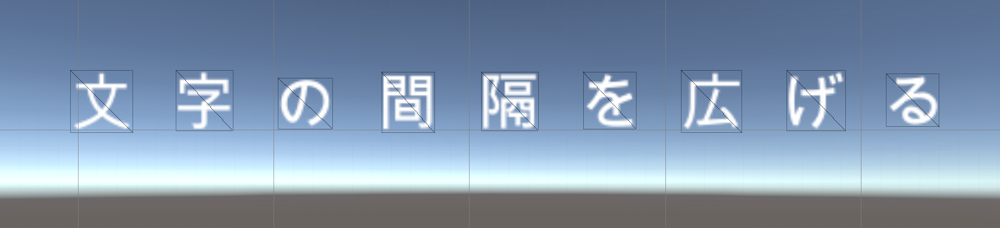

`Text` コンポーネントでは水平方向の文字の間隔を制御することができない。それが理由で TextMesh Pro を使うことも多いかもしれない。

簡単に言ってしまうと、各文字を表すメッシュの位置を調整すれば文字間の間隔を調整することができる。実際にやらなきゃいけないことは以下の通りである。

- `OnPopulateMesh()` で各文字のメッシュ位置を調整する。
- 適切な `preferredWidth` を返すようにする。
- 適切に水平方向のアラインメントを処理する。
- 適切に `horizontalOverflow` と `verticalOverflow` を処理する。

これらを考慮して `Text` コンポーネントを拡張するとこのようになる。

```c#
using System.Collections.Generic;
using UnityEngine;
using UnityEngine.UI;
#if UNITY_EDITOR
using UnityEditor;
#endif

// 文字間の幅を調整できる Text
public class CustomWidthPaddingText : Text
{
    // 文字間の padding 値
    public float paddingWidth = 0.0f;

    private readonly UIVertex[] m_TempVerts = new UIVertex[4];

    protected override void OnPopulateMesh(VertexHelper toFill)
    {
        if (font == null) return;

        m_DisableFontTextureRebuiltCallback = true;

        Vector2 extents = rectTransform.rect.size;
        string targetText = text;

        var settings = GetGenerationSettings(extents);
        int charCount;
        int lineCount;

        if (horizontalOverflow == HorizontalWrapMode.Overflow)
        {
            // 普通に Populate して、後で水平方向の頂点位置を調整すればよい
            cachedTextGenerator.PopulateWithErrors(targetText, settings, gameObject);
            charCount = cachedTextGenerator.characterCount;
            lineCount = cachedTextGenerator.lineCount;
        }
        else // horizontalOverflow が HorizontalWrapMode.Wrap の場合
        {
            // 文字の幅を得るために１回 Populate する
            // 自前で改行するので Overflow の設定はどちらも Overflow にする
            settings.horizontalOverflow = HorizontalWrapMode.Overflow;
            settings.verticalOverflow = VerticalWrapMode.Overflow;
            cachedTextGenerator.PopulateWithErrors(targetText, settings, gameObject);
            charCount = cachedTextGenerator.characterCount;

            // パフォーマンスのため StringBuilder を用いる
            var targetStringBuilder = new System.Text.StringBuilder(text.Length);

            // 現在の文字の X 座標
            float xpos = 0;

            // 水平方向にはみ出したら改行を入れる
            for (int i = 0; i < charCount - 1; i++)
            {
                // この文字を入れてもまだこの行に収まる？
                if (xpos + cachedTextGenerator.characters[i].charWidth <= rectTransform.rect.width)
                {
                    targetStringBuilder.Append(text[i]);
                    xpos += cachedTextGenerator.characters[i].charWidth;
                }
                else
                {
                    // この文字を入れると行に収まらないので改行してから入れる
                    targetStringBuilder.Append('\n');
                    targetStringBuilder.Append(text[i]);
                    xpos = cachedTextGenerator.characters[i].charWidth;
                }

                if (text[i] == '\n')
                {
                    // 改行なら X 座標は先頭へ
                    xpos = 0;
                }
                else
                {
                    // さらに padding を入れてもまだこの行に収まる？
                    if (xpos + paddingWidth <= rectTransform.rect.width)
                    {
                        xpos += paddingWidth;
                    }
                    else
                    {
                        // padding を入れるとこの行に収まらないのでこの時点で改行を入れる
                        if (i < charCount - 2 && text[i + 1] != '\n')
                        {
                            targetStringBuilder.Append('\n');
                        }
                        xpos = 0;
                    }
                }
            }

            // 改行を入れた文字列が確定
            targetText = targetStringBuilder.ToString();

            // もう一度 Populate して頂点を得る
            settings.verticalOverflow = verticalOverflow;
            cachedTextGenerator.PopulateWithErrors(targetText, settings, gameObject);
            charCount = cachedTextGenerator.characterCount;
            lineCount = cachedTextGenerator.lineCount;
        }
 
        IList<UIVertex> verts = cachedTextGenerator.verts;
        float unitsPerPixel = 1 / pixelsPerUnit;
        int vertCount = verts.Count;

        if (vertCount <= 0)
        {
            toFill.Clear();
            return;
        }

        Vector2 roundingOffset = new Vector2(verts[0].position.x, verts[0].position.y) * unitsPerPixel;
        roundingOffset = PixelAdjustPoint(roundingOffset) - roundingOffset;
        toFill.Clear();

        // 各文字に追加する padding
        float[] charPaddingX = new float[charCount];

        // 水平方向のアラインメント次第で padding の入れ方が変わる
        if (alignment == TextAnchor.UpperLeft || alignment == TextAnchor.MiddleLeft || alignment == TextAnchor.LowerLeft)
        {
            int currentLine = 0;
            int paddingCount = 0;
            int paddingIndex = 0;

            // 左から順に padding を足していくだけ
            for (int i = 0; i < charCount; i++)
            {
                // 改行されたか
                if (currentLine + 1 < lineCount && i == cachedTextGenerator.lines[currentLine + 1].startCharIdx)
                {
                    paddingCount = 0;
                    currentLine++;
                }

                // 文字幅が 0 なら次の文字へ
                if (Mathf.Approximately(0, cachedTextGenerator.characters[i].charWidth))
                {
                    continue;
                }

                charPaddingX[paddingIndex] = paddingCount * paddingWidth;
                paddingIndex++;
                paddingCount++;
            }
        }
        else if (alignment == TextAnchor.UpperCenter || alignment == TextAnchor.MiddleCenter || alignment == TextAnchor.LowerCenter)
        {
            int currentLine = 0;
            int paddingIndex = 0;
            int charCountInCurrLine = 0;
            int firstIndexInCurrLine = 0;
            int firstIndexInNextLine = 0;

            for (int i = 0; i < charCount; i++)
            {
                // 改行されたか、あるいは最後の文字か
                if ((currentLine + 1 < lineCount && i == cachedTextGenerator.lines[currentLine + 1].startCharIdx) ||
                    i == charCount - 1)
                {
                    // 左側にある文字への padding の追加
                    if (charCountInCurrLine % 2 == 0)
                    {
                        for (int j = 0; j < charCountInCurrLine / 2; j++)
                        {
                            charPaddingX[firstIndexInCurrLine + charCountInCurrLine / 2 - 1 - j] = -(0.5f + j) * paddingWidth;
                        }

                        for (int j = 0; j < charCountInCurrLine / 2; j++)
                        {
                            charPaddingX[firstIndexInCurrLine + charCountInCurrLine / 2 + j] = (0.5f + j) * paddingWidth;
                        }
                    }
                    else // 右側にある文字への padding の追加
                    {
                        for (int j = 0; j < charCountInCurrLine / 2; j++)
                        {
                            charPaddingX[firstIndexInCurrLine + charCountInCurrLine / 2 - 1 - j] = -(1 + j) * paddingWidth;
                        }

                        for (int j = 0; j < charCountInCurrLine / 2; j++)
                        {
                            charPaddingX[firstIndexInCurrLine + j + charCountInCurrLine / 2 + 1] = (1 + j) * paddingWidth;
                        }
                    }

                    firstIndexInCurrLine = firstIndexInNextLine;
                    charCountInCurrLine = 0;
                    currentLine++;
                }

                // 文字幅が 0 なら次の文字へ
                if (Mathf.Approximately(0, cachedTextGenerator.characters[i].charWidth))
                {
                    continue;
                }

                paddingIndex++;
                charCountInCurrLine++;
                firstIndexInNextLine = paddingIndex;
            }
        }
        else
        {
            int currentLine = 0;
            int paddingIndex = 0;
            int firstIndexInCurrLine = 0;

            for (int i = 0; i < charCount; i++)
            {
                // 改行されたか、あるいは最後の文字か
                if ((currentLine + 1 < lineCount && i == cachedTextGenerator.lines[currentLine + 1].startCharIdx) ||
                    i == charCount - 1)
                {
                    for (int j = firstIndexInCurrLine; j < paddingIndex; j++)
                    {
                        charPaddingX[j] = -(paddingIndex - j - 1) * paddingWidth;
                    }

                    currentLine++;
                    firstIndexInCurrLine = paddingIndex;
                }

                // 文字幅が 0 なら次の文字へ
                if (Mathf.Approximately(0, cachedTextGenerator.characters[i].charWidth))
                {
                    continue;
                }

                paddingIndex++;
            }
        }

        if (roundingOffset != Vector2.zero)
        {
            int paddingIndex = -1;
            bool addPadding = false;

            for (int i = 0; i < vertCount; ++i)
            {                
                int tempVertsIndex = i & 3;
                m_TempVerts[tempVertsIndex] = verts[i];
                m_TempVerts[tempVertsIndex].position *= unitsPerPixel;
                m_TempVerts[tempVertsIndex].position.x += roundingOffset.x;
                m_TempVerts[tempVertsIndex].position.y += roundingOffset.y;

                // 縮退ポリゴンなら padding を追加しない
                if (i % 4 == 0)
                {
                    if (verts[i + 1].position.x - verts[i].position.x > 0)
                    {
                        paddingIndex++;
                        addPadding = true;
                    }
                    else
                    {
                        addPadding = false;
                    }
                }

                // padding の追加
                if (addPadding)
                {
                    m_TempVerts[tempVertsIndex].position.x += charPaddingX[paddingIndex];
                }

                if (tempVertsIndex == 3)
                    toFill.AddUIVertexQuad(m_TempVerts);
            }
        }
        else
        {
            int paddingIndex = -1;
            bool addPadding = false;

            for (int i = 0; i < vertCount; ++i)
            {
                int tempVertsIndex = i & 3;
                m_TempVerts[tempVertsIndex] = verts[i];
                m_TempVerts[tempVertsIndex].position *= unitsPerPixel;

                // 縮退ポリゴンなら padding を追加しない
                if (i % 4 == 0)
                {
                    if (verts[i + 1].position.x - verts[i].position.x > 0)
                    {
                        paddingIndex++;
                        addPadding = true;
                    }
                    else
                    {
                        addPadding = false;
                    }
                }

                // padding の追加
                if (addPadding)
                {
                    m_TempVerts[tempVertsIndex].position.x += charPaddingX[paddingIndex];
                }

                if (tempVertsIndex == 3)
                    toFill.AddUIVertexQuad(m_TempVerts);
            }
        }

        m_DisableFontTextureRebuiltCallback = false;
    }

    // ContentSizeFitter などの Auto Layout 機能で使われる領域幅
    public override float preferredWidth
    {
        get
        {
            // 自前で文字列を改行させて高さを計算する
            Rect rect = GetPixelAdjustedRect();
            var settings = GetGenerationSettings(new Vector2(rect.size.x, rect.size.y));
            settings.horizontalOverflow = HorizontalWrapMode.Overflow;

            // cachedTextGenerator ではなく cachedTextGeneratorForLayout を用いる
            cachedTextGeneratorForLayout.PopulateWithErrors(text, settings, gameObject);
            int charCount = cachedTextGeneratorForLayout.characterCount;

            // 全ての行の中で一番大きい幅を preferredWidth にすればよい
            float maxWidth = 0;
            float xpos = 0;

            for (int i = 0; i < text.Length && i < charCount; i++)
            {
                if (text[i] == '\n')
                {
                    xpos = 0;
                    continue;
                }

                xpos += cachedTextGeneratorForLayout.characters[i].charWidth;

                if (i < text.Length - 1 && text[i + 1] != '\n')
                {
                    xpos += paddingWidth;
                }

                maxWidth = Mathf.Max(maxWidth, xpos);
            }

            return maxWidth;
        }
    }
}

// Editor で paddingWidth を表示する
#if UNITY_EDITOR
[CustomEditor(typeof(CustomWidthPaddingText), true)]
public class CustomWidthPaddingTextEditor : UnityEditor.UI.TextEditor
{
    private SerializedProperty paddingWidthProp;

    protected override void OnEnable()
    {
        base.OnEnable();
        paddingWidthProp = serializedObject.FindProperty("paddingWidth");
    }

    public override void OnInspectorGUI()
    {
        base.OnInspectorGUI();
        serializedObject.Update();
        EditorGUILayout.PropertyField(paddingWidthProp);
        serializedObject.ApplyModifiedProperties();
    }
}
#endif
```

## フォントアセット

### Font クラス

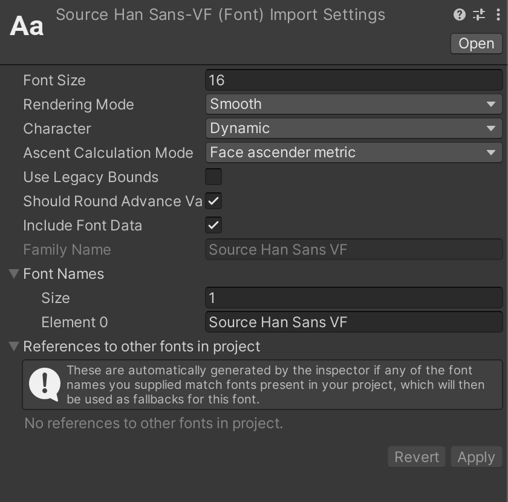

```c#
[NativeClass ("TextRendering::Font")]
[NativeHeader ("Modules/TextRendering/Public/Font.h")]
[NativeHeader ("Modules/TextRendering/Public/FontImpl.h")]
[StaticAccessor ("TextRenderingPrivate", StaticAccessorType.DoubleColon)]
public sealed class Font : UnityEngine.Object
```

`Font` クラスはフォントアセットを表現するクラスである。

`Font` クラスのオブジェクトを `Text` コンポーネントの `font` プロパティに設定することでレンダリングするフォントを指定することができる。まずは `Font` クラスのプロパティやメソッドを見ていこう。

### Font クラスのプロパティ

#### dynamic

```c#
public bool dynamic { get; } 
```

フォントがダイナミックフォントか否かを取得する。

読み取り専用なので変更することはできない。ダイナミックフォントか否かを決定するのはインポート時である。詳細は *フォントアセットのインポート設定* で後述する。

#### fontSize

```c#
public int fontSize { get; } 
```

フォントのデフォルトサイズを取得する。

読み取り専用なので変更することはできない。

#### material

```c#
public Material material { get; set; }
```

フォントの描画に使われるマテリアルを取得/設定する。

マテリアルの `texture` プロパティ経由でフォントテクスチャにアクセスすることができる。フォントテクスチャについては *フォントテクスチャ* で詳しく説明する。なお、このマテリアルの `color` などを変更しても `Text` のレンダリング結果には影響しない。

#### characterInfo

```c#
public CharacterInfo[] characterInfo { get; set; }
```

このフォントのフォントテクスチャに含まれる文字の情報の配列を取得する。

`CharacterInfo` 構造体の定義は以下のようになっている。

```c#
// フォントテクスチャからどのように文字をレンダリングするのかについての情報を格納する
public struct CharacterInfo
{
    // 文字の Unicode 値
    public int index;

    // テクスチャ内での文字の UV 座標
    // Deprecated となっているので、代わりに uvBottomLeft/uvBottomRight/uvTopRight/uvTopLeft を使うこと
    public Rect uv;

    // 生成されたテキストメッシュでの文字のスクリーン座標
    // Deprecated となっているので、代わりに minX, maxX, minY, maxY を使うこと。
    // minX == vert.xMin, maxX == vert.xMax, 
    // minY == vert.yMax, maxY == vert.yMin （※ Y の min と max が逆になっているのは間違いではない）
    public Rect vert;

    // この文字と次の文字の間の距離。
    // Deprecated となっているので、代わりに advance を使うこと。
    public float width;

    // この文字のサイズ。デフォルトサイズなら 0。
    public int size;

    // この文字のスタイル
    public FontStyle style;

    // この文字がフォントテクスチャ内で回転しているか否か。
    // このプロパティは画面の向きが変わると正しく判定できないため Deprectedとなっている。
    // 代わりの判定方法については後述する。
    public bool flipped;

    // 水平方向の距離を最も近い整数に丸めたもの。
    // これはこの文字の原点から次の文字への原点の間の距離である。
    public int advance;

    // 字形画像の幅
    public int glyphWidth;

    // 字形画像の高さ
    public int glyphHeight;

    // この字形の原点から字形画像の開始地点までの水平方向の隙間の距離（ベアリング値）
    public int bearing;
    
    // 字形画像の Y 座標の最小値
    public int minY;

    // 字形画像の Y 座標の最大値
    public int maxY;

    // 字形画像の X 座標の最小値
    public int minX;

    // 字形画像の X 座標の最大値
    public int maxX;
        
    // フォントテクスチャ内での uv 座標の左下
    public Vector2 uvBottomLeft;

    // フォントテクスチャ内での uv 座標の右下
    public Vector2 uvBottomRight;

    // フォントテクスチャ内での uv 座標の右上
    public Vector2 uvTopRight;

    // フォントテクスチャ内での uv 座標の左上
    public Vector2 uvTopLeft;
}
```

`CharacterInfo.flipped` が *Depecated* となっているため、字形がフォントアトラステクスチャ内で回転しているかを判定するには別の方法を使う必要がある。以下にそのためのコードを示す。

```c#
// （Deprecated な flipped の代わりに）字形がフォントテクスチャ内で回転しているかを判定する
public bool AlternativeFlipped(CharacterInfo characterInfo, Font font)
{
    // 幅と高さが一致するならそもそも回転しない
    if (characterInfo.glyphHeight == characterInfo.glyphWidth)
    {
        return false;
    }

    // テクスチャ内での幅と字形の高さが一致しているなら回転している
    float widthInTexture = Mathf.Abs(characterInfo.uvTopRight.x - characterInfo.uvBottomLeft.x) * font.material.mainTexture.width;
    if (widthInTexture == characterInfo.glyphHeight)
    {
        return true;
    }

    // それ以外の場合は回転していない
    return false;
}
```

#### ascent

```c#
public int ascent { get; }  
```

フォントのアセント値（フォントのベースラインからトップラインの間の距離である）を取得する。

#### lineHeight

```c#
public int lineHeight { get; }  
```

フォントの行の高さを取得する。

### Font の public メソッド

#### GetCharacterInfo

```c#
public bool GetCharacterInfo(char ch, out characterInfo info, int size = 0, FontStyle style = FontStyle.Normal); 
```

特定の文字の `CharacterInfo` を得る。

`size` が `0` ならフォントのデフォルトサイズが使われる。`size` を指定する場合には、`Text` コンポーネントの `fontSize` そのものを渡すのではなく、それに `Canvas` の `scaleFactor` を掛けたものを渡す必要があることに注意。

もし引数で指定された文字がフォントテクスチャ内に存在していれば戻り値として `true` が返って適切な `CharacterInfo` が得られるが、文字がフォントテクスチャ内に存在していなければ `false` が返ってくるだけである。

#### HasCharacter

```c#
public bool HasCharacter(char c); 
```

特定の文字がフォントに含まれているか否かを返す。

#### RequestCharactersInTexture

```c#
public void RequestCharactersInTexture(string characters, int size = 0, FontStyle style = FontStyle.Normal); 
```

フォントがダイナミックフォントの場合に文字列をフォントテクスチャに追加する。

ただし、ここで文字列を追加してもフォントテクスチャのサイズ変更の際には消えてしまう可能性があるので注意が必要である。対処方法については後述する。

### Font の static メソッド

#### GetOSInstalledFontNames

```c#
public static string[] GetOSInstalledFontNames(); 
```

実行環境にインストールされているフォント名の配列を取得する。

得られた配列のいずれか、あるいは配列そのものを `CreateDynamicFontFromOSFont()` に渡すことで `Font` オブジェクトを得ることができる。

#### CreateDynamicFontFromOSFont

```c#
public static Font CreateDynamicFontFromOSFont(string fontname, int size);
public static Font CreateDynamicFontFromOSFont(string[] fontnames, int size); 
```

実行環境にインストールされているフォントを取得する。

基本的には `GetOSInstalledFontNames()` で得られたフォント名（の配列）を渡すことになる。

#### GetPathsToOSFonts

```c#
public static string[] GetPathsToOSFonts(); 
```

OS にインストールされているフォントのパスを取得する。

このパスを `Font` クラスのコンストラクタに渡すことで `Font` オブジェクトを生成することができる。たとえば、インストールされている MS ゴシックの `Font` オブジェクトを生成するには以下のコードのようになるだろう。

```c#
// インストールされている MS ゴシックの Font を作成する
public Font CreateMSGothicFont()
{
    // インストールされている全てのフォントのパスを取得
    string[] fontPaths = Font.GetPathsToOSFonts();

    foreach (var path in fontPaths)
    {
        // 拡張子無しのファイル名を取得
        string fontFileName = System.IO.Path.GetFileNameWithoutExtension(path).ToLower();

        // 名前が一致したら Font を作成して返す
        if (fontFileName == "msgothic")
        {
            return new Font(fontFileName);
        }
    }

    return null;
}
```

#### GetMaxVertsForString

```c#
public static int GetMaxVertsForString(string str); 
```

与えられた文字列に対して `TextGenerator` が返すであろう頂点の最大数を返す。

実際には（文字列の長さ + 1）に 4（= 四隅の頂点）を掛けた数字を返す。

```c#
public static int GetMaxVertsForString(string str)
{
    return str.Length * 4 + 4;
}
```

### Font のイベント

#### textureRebuilt

```c#
public static event Action<Font> textureRebuilt;
```

フォントアトラステクスチャのリビルド時にサイズが変更される際に呼ばれる。

任意の文字列を事前にフォントアトラステクスチャに含めておきたい場合に `Font.RequestCharactersInTexture()` と組み合わせて使うことができる。このコールバックは Canvas リビルド時の `Canvas.SendWillRenderCanvases` から呼ばれる。フォントアトラステクスチャのリビルドの詳細は *フォントアトラステクスチャ* で説明する。

### フォントアセットのファイル形式

Unity が標準でサポートしているフォントアセットの形式は **TrueType (.ttf)** と **OpenType (.otf)** である。デフォルトではダイナミックフォントとして *Arial* が使われる。スクリプトから *Arial* を読み込むためには `Resources.GetBuiltinResource()` 経由で読み込めばよい。

```c#
// デフォルトフォントを読み込む
Font font = Resources.GetBuiltinResource<Font>("Arial.ttf");
```

*Arial* フォントがコンピューター内に見つからない場合 (フォントがインストールされていない場合など) は、 Unity にバンドルされている *Liberation Sans* というフォントがフォールバックとして使用される。

### ダイナミックフォント

ダイナミックフォントは（日本語や中国語などのように）文字の種類が非常に多かったり、実行前に使用する字形を確定できない場合によく使われる。`Text` コンポーネントで表示しようとしている文字に基づいて字形のフォントアトラステクスチャが生成される。生成されたフォントアトラステクスチャは**Project** ビューでフォントアセットの **Font Material** を選択すると **Inspector** のプレビューに表示される（**Font Texture** ではなく **Font Material** を選択すること。**Font Texture** のほうには非ダイナミックフォントの事前生成したテクスチャが表示される）。


スクリプトからフォントアトラステクスチャをにアクセスするには `Font` オブジェクトの `material` から `mainTexture` にアクセスすれば良い。

```c#
Font font = Resources.GetBuiltinResource<Font>("Arial.ttf");

// フォントアトラステクスチャを取得する
Texture texture = font.material.mainTexture;
```

**Characters** で **Dynamic** を設定すると、フォントアトラステクスチャは事前に生成されず、FreeType（ライブラリ）のフォントレンダリングエンジンを使用して実行時に生成するようになる。逆に、**Dynamic** 以外を指定すると、**Custom Charas** で指定された文字のみを使ってフォントアトラステクスチャを事前に生成する。

### フォントアトラステクスチャ

読み込まれたフォントアセットはそれぞれ独自のフォントアトラステクスチャを保持している。同じフォントファミリーであっても別のフォントアセットであれば別々のフォントアトラスが割り当てる。たとえば、ある `Text` コンポーネントで `FontStyle` が `Bold` な *Arial* （`arial.ttf`）を使っていて、別の `Text` コンポーネントでは *Arial Bold* (`arialbd.ttf`)を使っていたとしたら、見た目は同じ出力にはなるが、2 つのフォントアトラスが生成されることになる。

2 つの `Text` コンポーネントが存在し、どちらも同じフォントで「A」という文字を表示している場合、以下のような状況となる。

- 2 つの `Text` コンポーネントのフォントサイズが同じならフォントアトラステクスチャには 1 つの字形だけが含まれる。

- 2 つの `Text` コンポーネントのフォントサイズが異なるなら（片方は 16 ポイントで、もう片方が 24 ポイント）、フォントアトラステクスチャには「A」という文字の 16 ポイントと 24 ポイントの合計 2 つの字形が含まれる。

- 1 つの `Text` コンポーネントが太字で、もう片方が太字でないなら、フォントアトラステクスチャには太字の「A」と通常の「A」の合計 2 つの字形が含まれる。

`Text` オブジェクトがダイナミックフォントを使っていて、まだフォントアトラステクスチャにラスタライズされていない字形を描画しようとすると、フォントアトラステクスチャがリビルドされる。リビルドの処理としてまず最初にフォントアトラステクスチャが現在のサイズでリビルドされる。このリビルドの際に使われる字形は、アクティブな `Text` コンポーネントの `text` に設定されている文字列のものである。現在使われている全ての字形が新しいフォントアトラステクスチャに収まらなかった場合、現在のフォントアトラステクスチャの小さいほうの長さが 2 倍になる。たとえば、`512 x 512` のフォントアトラステクスチャは大きくなると `512 x 1024` のアトラスになり、`512 x 1024` のフォントアトラステクスチャは大きくなると `1024 x  1024` となる。

このように、ダイナミックフォントのフォントアトラステクスチャはどんどん大きくなっていく。日本語の場合、字形の数が多いためフォントアトラステクスチャの最大サイズである `4096 x 4096` まで大きくなることも珍しくはない。フォントアトラステクスチャのリビルドのコストを考えると、リビルドを最小限にするのは必須であると言えるだろう。ゲーム中のフォントアトラステクスチャのリビルドが発生するとフレームレートに影響が及ぶので、ゲーム開始時に `Font.RequestCharactersInTexture()` を呼んで、必要な字形を含んだフォントアトラステクスチャを事前に生成しておくと良いだろう。

ただし、次回のフォントアトラステクスチャのリビルドでのサイズ変更の際には、現在アクティブな `Text` コンポーネントに含まれない字形は新しいフォントアトラステクスチャには含まれない。よって `Font.RequestCharactersInTexture()` で設定した字形が消えてしまう可能性がある。そのためには `Font.textureRebuilt` イベントを購読し、再度 `Font.RequestCharactersInTexture()` を呼び出す必要がある。以下に、フォントアトラステクスチャに任意の文字を追加するためのスクリプトのコードを示す。

```c#
using UnityEngine;

public class FontTextureInjection : MonoBehaviour
{
    // フォントアトラステクスチャを管理したいフォント
    public Font font;

    // 目的のフォントサイズ
    public int fontSize;

    // フォントテクスチャにあらかじめ用意しておきたい文字列
    public string targetString = "";

    // scaleFactor が必要なので Canvas を設定する
    public Canvas canvas;

    private void Start()
    {
        Debug.Assert(font != null, "フォントが設定されていません");
        Debug.Assert(fontSize > 0, "フォントサイズが設定されていません");
        Debug.Assert(canvas != null, "Canvas が設定されていません");

        Texture texture = font.material.mainTexture;
        Debug.LogFormat("フォントアトラステクスチャのサイズ {0} {1}", texture.width, texture.height);

        // フォントアトラステクスチャに文字を追加する
        // size は Text の Font Size に Canvas の scaleFactor を掛けたものを設定する
        font.RequestCharactersInTexture(targetString, size: (int)(fontSize * canvas.scaleFactor), style: FontStyle.Normal);

        // （サイズが変更される可能性がある）リビルドの際のコールバックを登録
        Font.textureRebuilt += OnTextureRebuilt;
    }

    private void OnDestroy()
    {
        // コールバック解除を忘れない
        Font.textureRebuilt -= OnTextureRebuilt;
    }

    public void OnTextureRebuilt(Font font)
    {
        // 目的のフォント以外は処理しない
        if (this.font != font)
        {
            return;
        }

        Texture texture = font.material.mainTexture;
        Debug.LogFormat("変更後のフォントアトラステクスチャのサイズ {0} {1}", texture.width, texture.height);

        // フォントアトラステクスチャに文字を追加する
        font.RequestCharactersInTexture(targetString, size: (int)(16 * canvas.scaleFactor), style: FontStyle.Normal);
    }
}
```

なお、フォントアトラスの最大サイズの `4096 x 4096` に収まらなくなった場合には **Console** にエラーが出力される。

### フォントのフォールバック

フォントアセットのインポート設定の **Font Name** にリストされたフォントは、字形が見つからなかった場合にフォールバック（代替）として使われる。フォールバックする順番は、**Font Names** のリストの上から順である。

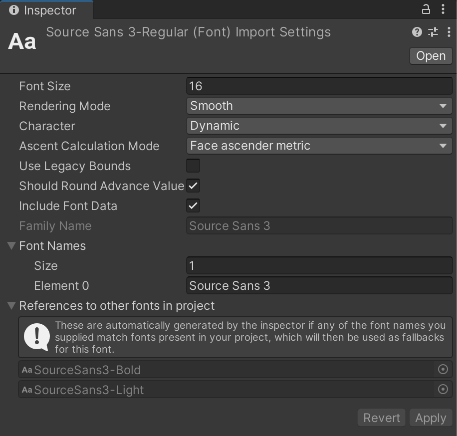

ダイナミックフォントでテキストを描画する際に、フォントが見つからなかった場合 (**Include Font Data** が設定されていなかったり、フォントがインストールされていない) や、要求された字形がフォントデータに含まれていない場合 (ラテン文字のフォントを使って日本語テキストを描画しようとしたり、太字/斜体のテキストを使用したりした)、**Font Names** フィールドのリストのフォントを上から順に確認し、プロジェクトのフォント名に一致するフォントがあるか、必要な字形を持つフォントがインストールされているかがチェックされる。フォールバックとして設定されている代替フォントのいずれも存在せず、要求された字形がインストールされていないなら、Unity は内部にハードコードされたフォントリストからフォールバックのフォントを探す。このフォールバックフォントリストには、現在の実行環境に通常インストールされている様々な国際的なフォントが含まれている。

一部のプラットフォーム（WebGL や一部のコンソール）では、Unity が テキストの描画で使用する OS のデフォルトフォントを指定することができない。そういったプラットフォームの場合、**Include Font Data** の設定は無視され、フォントデータが常にプロジェクトに含まれるようにし、フォールバックとして使用したいフォントをすべてプロジェクトに含めておく必要がある。よって、多言語化を目的としたフォントや太字/斜体で描画する必要がある場合は、必要な文字だけを持つフォントをプロジェクト内に用意し、そのフォントを **Font Names** に設定する必要がある。フォントが正しく設定されている場合、フォントのインポート設定の **Inspector** にフォールバックフォントが **References to other fonts in project** として表示される。

## TrueTypeFontImporter クラス

Unity にインポートした（つまり *Assets* フォルダ以下に置いた）フォントアセットを **Project** ビューで選択すると、**Inspector** の **Import Setting** に各種インポート設定が表示される。このインポーターは `UnityEditor.AssetImporter` を継承した `TrueTypeFontImporter` として定義されている。なお、`TrueTypeFontImporter` という名前だが、*TrueType*(.ttf) だけでなく *OpenType*(.otf) もサポートしている。

### TrueTypeFontImporter の プロパティ

```c#
[NativeHeader ("Modules/TextRenderingEditor/TrueTypeFontImporter.h")]
public sealed class TrueTypeFontImporter : AssetImporter
```

#### fontSize

```c#
public int fontSize { get; set; }
```

非ダイナミックフォントの場合のフォントテクスチャの個々の文字のサイズを取得/設定する。

最小値は `1` で、最大値は `500` である。`Text` コンポーネントのフォントサイズとは別である。ダイナミックフォントの場合には影響しない。

#### fontRenderingMode

```c#
public FontRenderingMode fontRenderingMode { get; set; }
```

フォントのレンダリングモードを取得/設定する。

このプロパティは字形の滑らかさを設定する。**Inspector** では **Rendering Mode** として表示される。`FontRenderingMode` の定義は以下の通りである。

```c#
public enum FontRenderingMode
{
    /// <summary>
    ///   <para>アンチエイリアスを使ってフォントをレンダリングする。ダイナミックフォントではフォントテクスチャをレンダリングする最速のモードである。</para>
    /// </summary>
    Smooth,

    /// <summary>
    ///   <para>アンチエイリアスとフォントヒンティングを使ってフォントをレンダリングする。フォントヒンティングによって文字の線がピクセルの境界に沿うようになり、低解像度でもはっきり見えるようになる。</para>
    /// </summary>
    HintedSmooth,

    /// <summary>
    ///   <para>アンチエイリアスは使わずにフォントヒンティングのみを使ってフォントをレンダリングする。最も境界がくっきりするので小さいフォントサイズに向いているが、日本語では文字が潰れることが多い。</para>
    /// </summary>
    HintedRaster,

    /// <summary>
    ///   <para>OS のデフォルト設定を使う。ダイナミックフォントのみで有効。</para>
    /// </summary>
    OSDefault
}
```

#### fontTextureCase

```c#
public FontTextureCase fontTextureCase { get; set; }
```

フォントテクスチャにインポートするフォントの文字セットを取得/設定する。

**Inspector** では **Character** として表示される。

`FontTextureCase` の定義は以下の通りである。

```c#
public enum FontTextureCase
{
    /// <summary>
    ///   <para>ダイナミックフォント。実行時にフォント字形を描画する。</para>
    /// </summary>
    Dynamic = -2,

    /// <summary>
    ///   <para>ラテン文字の Unicode 文字セット。</para>
    /// </summary>
    Unicode,

    /// <summary>
    ///   <para>ASCII 文字。</para>
    /// </summary>
    [InspectorName ("ASCII default set")]
    ASCII,

    /// <summary>
    ///   <para>ASCII 文字の大文字。</para>
    /// </summary>
    ASCIIUpperCase,

    /// <summary>
    ///   <para>ASCII 文字の小文字。</para>
    /// </summary>
    ASCIILowerCase,

    /// <summary>
    ///   <para>独自の文字セット。これを選択すると Inspector で Custom Chars を指定できるようになるので、そこに文字セットを指定する。</para>
    /// </summary>
    CustomSet
}
```

#### ascentCalculationMode

```c#
public AscentCalculationMode ascentCalculationMode { get; set; }
```  

フォントのアセントの計算方法を取得/指定する。

フォントのアセントとはフォントのベースラインからトップラインの間の距離である。フォントごとにアセントの計算方法は異なる。あるフォントではバウンディングボックスの高さを使用し、別のフォントではキャップの高さを使用したり、あるフォントではアクセントマークなどの発音記号を考慮したりする。これらの違いによって、テキストの垂直方向のアラインメントに影響が及ぶため、Unity ではアセントを決めるための方法を複数用意している。

```c#
public enum AscentCalculationMode
{
    /// <summary>
    ///   <para>以前使われていた、バウンディングボックスを用いる方法。この方法では、フォントのキャラクターセット内の字形のバウンディングボックスのトップの値のうち最も高いものを使ってアセントを計算する。このため、ダイナミックフォントでない場合には（全ての字形を計算しないので）アセントが小さくなる可能性がある。このモードは互換性のため残されているので、基本的には使用しないようにする。</para>
    /// </summary>
    [InspectorName ("Legacy version 2 mode (glyph bounding boxes)")]
    Legacy2x,
    
    /// <summary>
    ///   <para>フォント内で定義されているアセンダーの値を使用する。</para>
    /// </summary>
    [InspectorName ("Face ascender metric")]
    FaceAscender,
    
    /// <summary>
    ///   <para>Bフォント内で定義されているバウンディングボックスのトップを使用する。</para>
    /// </summary>
    [InspectorName ("Face bounding box metric")]
    FaceBoundingBox
}
```

#### shouldRoundAdvanceValue

```c#
public bool shouldRoundAdvanceValue { get; set; }
```

フォントの内部の繰り上げ幅を最も近い整数に丸めるかどうかを取得/設定する。

文字の配置の際、丸められた繰り上げ幅によって生じる累積誤差によって文字間の間隔が不揃いに見えることがある。ただし、文字間の水平方向の距離（`Font` クラスの `characterInfo` の `advance`）は、この設定とは関係なく常に最も近い整数に丸められる。

#### includeFontData

```c#
public bool includeFontData { get; set; }
```

フォントファイルがビルドに含まれるかどうかを取得/設定する。

ダイナミックフォントの場合のみ **Inspector** に表示される。このプロパティを `true` に設定すると、フォントファイル（.ttf や .otf）がビルドに含まれ、実行時にそのフォントが使われる。このプロパティを `false` に設定した場合は、実行環境に同じフォントがインストールされている前提となる。特に日本語フォントではフォントファイルの埋め込みが許可されていない場合があるので注意すること。

#### fontNames

```c#
public string[] fontNames { get; set; }
```

`includeFontData` が `false` の場合にフォントを探すために使われるフォント名の配列を取得/設定する。

このフォントで利用できない字形をレンダリングしようとした際、その字形を持っている別のフォントを `fontReferences` の中からこのリストのそれぞれのフォント名に一致したものを探す。それでも見つからなかった場合は OS にインストールされたフォントの中から探す。

#### fontReferences

```c#
public Font[] fontReferences { get; set; }
```

フォントや文字が使用できない場合に使用するフォールバック（＝代替）フォントのリストを取得/設定する。

**Inspector** では **References to other fonts in project** として表示される。Unity が自動的にプロジェクト内のフォントを探して設定する。

#### customCharacters

```c#
public string customCharacters { get; set; }
```

`fontTextureCase` に `CustomSet` が指定されている場合にフォントテクスチャ化される文字列を取得/設定する。

#### characterPadding

```c#
public int characterPadding { get; set; }
```

パディングのために文字の境界に足すピクセル数を取得/設定する。

文字のアウトラインを描画するシェーダーを使う場合に使うことがある。この値を `0` より大きくすると、フォントテクスチャの字形の周囲および `Text` の各文字の矩形が大きくなる。

このプロパティは **Inspector** には表示されないので、変更したいのであればカスタムインポーターを書く必要がある。

```c#
using UnityEditor;

public class CustomAssetPostprocessor : AssetPostprocessor
{
    // OnPreprocessFont というメソッドは無いので OnPreprocessAsset で処理する
    private void OnPreprocessAsset()
    {
        TrueTypeFontImporter fontImporter = assetImporter as TrueTypeFontImporter;
        if (fontImporter != null)
        {
            // フォントファイル名を取得して
            string fontFileName = System.IO.Path.GetFileNameWithoutExtension(fontImporter.assetPath);

            // 目的のフォントなら（今回は源ノ角ゴシック Normal を使う）
            if (fontFileName == "SourceHanSans-Normal")
            {
                // Padding を 2 にする
                fontImporter.characterPadding = 2;
            }
        }
    }
}
```

手っ取り早い方法としてフォントの meta ファイルをテキストエディタで開いて `characterPadding` の値を直接編集するという方法もあるが、あまりおすすめはしない。

#### characterSpacing

```c#
public int characterSpacing { get; set; }
```

フォントテクスチャの字形の周囲の領域のスペースを取得/設定する。

`characterPadding` と同様にこのプロパティは **Inspector** には表示されない。この値を `0` より大きくすると、フォントテクスチャの字形の周囲の領域が大きくなる。`characterPadding` とは違って `Text` の各文字の矩形には影響を与えない。アウトラインシェーダーなどを使いたい場合であっても `characterPadding` が設定されているのであればこの値は `0` のままで問題ないだろう。

#### Use Legacy Bounds

**Inspector** に表示されている詳細不明のプロパティである。このプロパティについてはドキュメントもソースコードも存在しなかったため、どういった挙動をするのかは確認できなかった。オフのままにしておくのが良いだろう。

## カスタムフォント

カスタムフォントを作成するには、まずはフォントテクスチャを用意する。今回は、以下のように数字の `0`（ASCII コードで 48）から `9`（ASCII コードで 57）までの数字と、アルファベット小文字の `a`（ASCII コードで 97）から `f`（ASCII コードで 102）までの合計 16 文字が入った 256x256 サイズのテクスチャを用意した。つまり、各字形のサイズは 64x64 である。

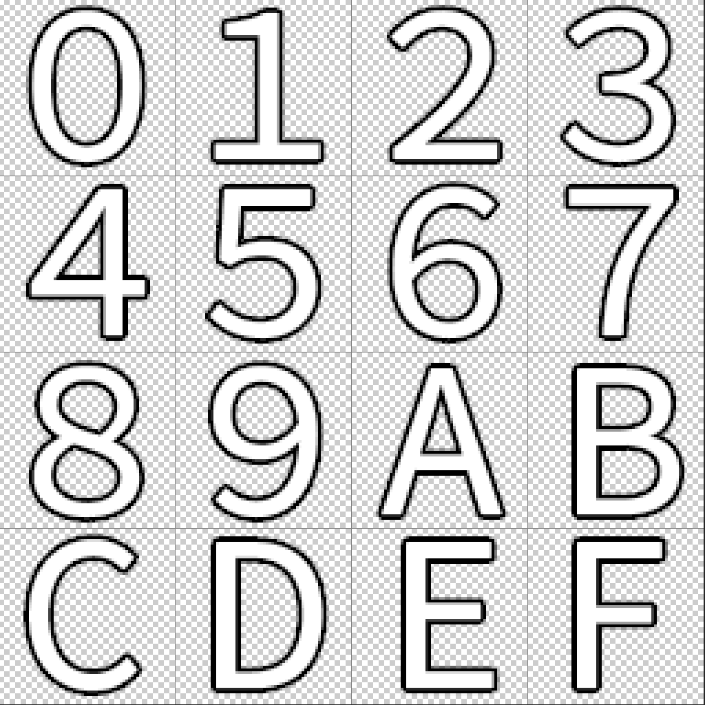

フォントテクスチャのインポート設定は **Texture Type** は *Default* にしておく。ミップマップは必要ないので **Generate Mip Maps** はオフにしておく。

次に、このフォントテクスチャを持つマテリアルを作成する。**Inspector** からテクスチャを設定できるようにしておいたシェーダーを用意して、このマテリアルに設定しよう。シェーダーの中身としては `UI/Default` と同じで構わない。なお、プロパティ以外が他のシェーダーと同一の別シェーダーを作る場合には、`FallBack` でそのシェーダーを指定するだけにしておくと楽である。

```
Shader "UI/CustomFont" 
{
    Properties
    {
        // Inspector から設定したいので [PerRendererData] は外す
        _MainTex("Font Texture", 2D) = "white" {}
        _Color("Tint", Color) = (1,1,1,1)

        _StencilComp("Stencil Comparison", Float) = 8
        _Stencil("Stencil ID", Float) = 0
        _StencilOp("Stencil Operation", Float) = 0
        _StencilWriteMask("Stencil Write Mask", Float) = 255
        _StencilReadMask("Stencil Read Mask", Float) = 255

        _ColorMask("Color Mask", Float) = 15

        [Toggle(UNITY_UI_ALPHACLIP)] _UseUIAlphaClip("Use Alpha Clip", Float) = 0
    }

    FallBack "UI/Default"
}

```

今度はカスタムフォントアセットの作成に移る。カスタムフォントアセットを作成するには、メニューの *Assets-> Create-> Custom Font* を選択する。

カスタムフォントアセットの **Inspector** から各種設定値を埋めていこう。

- **Line Spacing** は行と行の間隔である。今回は字形の高さと同じ `64` ピクセルに設定する。この値と `Text` コンポーネントの **Line Spacing** を掛けた数が実際の行間のピクセル数になる。

- **Default Material** には先ほど作成したフォントテクスチャが設定されたマテリアルを設定する。

- **Ascii Start Offset** は **Character Rects** で指定するインデックスがいくつから始まるのかを指定する。たとえば、**Ascii Start Offset** が `0` であれば、字形 '0' のインデックスは `48` となる。**Ascii Start Offset** が `48` であれば字形 '0' のインデックスは `0` となる。今回は **Ascii Start Offset** に `0` を設定するとする。

- **Tracking** は同じ行の中で隣り合う文字の間隔を設定する。普通に隙間が無いようにするのであれば `1` を設定し、隙間を広げたいのであれば `1.2` などを入力すると文字間が広がる。

- **Convert Case** が `1` の場合は小文字が大文字になる（例：ASCII コード `97` の 'a' が `65` の 'A' になる）。

- **Character Spacing** と **Character Padding** と **Font Rendering Mode** についてはドキュメントに記載が無く、数値を変更してもレンダリングに影響は無いようである。

- **Character Rects** セクションでは、フォントの各文字の設定を行う。

- **Size** にはフォントに含まれる文字の数を設定する。今回は `16` 文字なので `16` を設定する。そうすると **Element 0** から **Element 15** までの要素が作成されるので、それぞれに各文字の情報を入力していく。**Element 0** には左上の字形 `0` の情報を入力することにする。

- **Index** には Unicode（UTF-16）の値（ASCII コードの範囲であれば ASCII コードの値）を入力する。字形 `0` の ASCII コードは `48` なので `48` を入力する。

- **Uv** にはフォントテクスチャ内の UV 座標（`0` から `1` の間）を入力する。**X** と **Y** は左下からの距離を入力する。**X** は `0` で、Y は下から `3/4` なので `0.75` となる。**W** と **H** は幅と高さであり、どちらも **0.25** となる。

- **Vert** は表示する頂点の座標と大きさ（どちらもピクセル単位）であり、表示位置をずらさないのであれば **X** と **Y** は `0` で構わない。**W** には幅そのままの `64` を入力するが、**H** には高さに `-1` を掛けた `-64` を入力する。

- **Advance** は次の文字との間隔（ピクセル単位）であり、隙間を空けたりしないのであれば字形の幅の `64` そのままで構わない。**Advance** と **Tracking** を掛けた数値が実際の文字間の間隔となる。

- **Flipped** が `true` の場合、字形がフォントテクスチャ内で垂直反転して反時計回り `90` 度回転しているとされる。

このようにして、各字形に対して数値を入力していくことを繰り返していく。しかしながら、手作業で全てこれを入力するのはかなり骨の折れる作業である。もちろん通常であれば、カスタムフォントを作成する際には便利なアセットを探して使うことが多いであろう。しかし、この本の読者であれば当然ながら自前でツールを作ると思われるので、以下に今回のテクスチャを元にパラメータを設定するためのサンプルコードを載せる。

```c#
public static void UpdateCustomFontSetting()
{
    // 設定対象のカスタムフォントのパス名
    string path = "Assets/Runtime/Fonts/MyCustomFont.fontsettings";

    // フォントアセットを読み込む
    Font font = AssetDatabase.LoadMainAssetAtPath(path) as Font;
    if (font == null)
    {
        Debug.LogErrorFormat("フォントファイルが見つかりません {0}");
        return;
    }

    // Custom Font の中身をシリアライズして値を設定していく
    SerializedObject serializedObject = new SerializedObject(font);        
    serializedObject.Update();

    // プロパティ名はファイルをテキストエディタで開くと確認できる
    serializedObject.FindProperty("m_LineSpacing").floatValue = 64.0f;
    serializedObject.FindProperty("m_AsciiStartOffset").intValue = 0;
    serializedObject.FindProperty("m_Tracking").intValue = 1;
    serializedObject.FindProperty("m_ConvertCase").intValue = 0;

    // m_CharacterRects 配列の中身を設定していく
    SerializedProperty characterRectArray = serializedObject.FindProperty("m_CharacterRects");
    int arraySize = characterRectArray.arraySize;

    for (int i = 0; i < arraySize; i++)
    {
        // 各要素
        SerializedProperty characterRect = characterRectArray.GetArrayElementAtIndex(i);

        if (i < 10)
        {
            // 0 から 9 までの字形
            characterRect.FindPropertyRelative("index").intValue = 48 + i;
        }
        else
        {
            // a, b, c, d, e, f の字形
            characterRect.FindPropertyRelative("index").intValue = 97 + (i - 10);
        }

        SerializedProperty uv = characterRect.FindPropertyRelative("uv");
        uv.FindPropertyRelative("x").floatValue = (i % 4) * 0.25f;
        uv.FindPropertyRelative("y").floatValue = (3 - (i / 4)) * 0.25f;
        uv.FindPropertyRelative("width").floatValue = 0.25f;
        uv.FindPropertyRelative("height").floatValue = 0.25f;

        SerializedProperty vert = characterRect.FindPropertyRelative("vert");
        vert.FindPropertyRelative("x").floatValue = 0;
        vert.FindPropertyRelative("y").floatValue = 0;
        vert.FindPropertyRelative("width").floatValue = 64;
        vert.FindPropertyRelative("height").floatValue = -64;

        characterRect.FindPropertyRelative("advance").floatValue = 64;
        characterRect.FindPropertyRelative("flipped").intValue = 0;
    }

    // 設定を保存
    serializedObject.ApplyModifiedProperties();
    serializedObject.SetIsDifferentCacheDirty();
    AssetDatabase.SaveAssets();
}
```

## TextMesh Pro

TextMesh Pro（TMP）は `Text` コンポーネントの代わりに使うことができるテキストレンダリングのための強力な仕組みである。TextMesh Pro は主なレンダリングパイプラインとして *Signed Distance Field（SDF）* を使っており、どんなポイントサイズやどんな解像度でも綺麗にテキストをレンダリングすることが可能である。また、標準の `Text` では出来ないカーニングの調整を行うこともできる。他にも、TextMesh Pro 用のカスタムシェーダーを利用することで、アウトラインやソフトシャドウやベベルなどの効果を得ることもできる。

TextMesh Pro は、Unity 2018.1 より前は Asset Store のパッケージとしてあるプロジェクトに含まれていたが、Unity 2018.1 以降は Package Manager のパッケージとして利用可能となっている。また、Unity 2018.3 から利用できる TextMesh Pro 1.4 ではフォールバックと Dynamic フォントの利用が可能になり、文字数の多い日本語でも利用しやすくなった。本書では Unity 2020.1 から利用可能な Text Mesh Pro 3.0 をベースについて説明する。

TextMesh Pro のコンポーネントは、`MeshRenderer` で3D 空間に描画する `TextMeshPro` コンポーネントと、`Canvas` 内に描画する `TextMeshProUGUI` コンポーネントの 2 種類が存在する。ワールド空間に表示されるテキストについては `TextMeshProUGUI` コンポーネントではなく `TextMeshPro` コンポーネントを使ったほうが効率的である。

Unity の組み込み `Text` コンポーネントと同様、TextMesh Pro によって表示されているテキストを変更すると Canvas リビルドが発生してしまう。なので、`Text` コンポーネントと同様に `TextMeshProUGUI` コンポーネントへの実行時の変更は最小限にするようにしよう。

### TextMesh Pro のインストール

Unity 2018.1 以降ではメニューから *Window -> TextMeshPro -> Import TMP Essential Resources* を選択すると **TMP Importer** のダイアログが表示され、TextMesh Pro の基本的なリソースをパッケージとしてインストールすることができる。

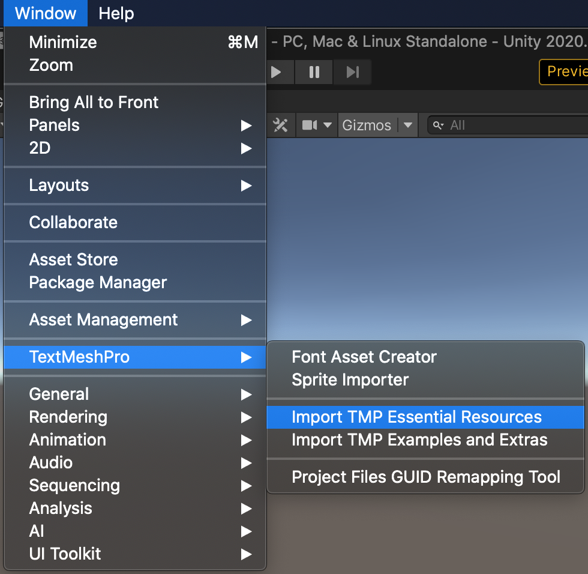

あるいは、**Hierarchy** 内で右クリックして *UI -> Text - TextMeshPro* などを選択しても同様に **TMP Importer** のダイアログが表示される。

**Import TMP Essential Resources** を選択して基本的なリソースをインストールした後に **Import TMP Example & Extras** を選択すると TextMesh Pro の Examples & Extras フォルダの下にサンプルのシーンやフォントや素材がインストールされる。とりあえずは一通りサンプルシーンを眺めておくのが良いだろう。

### TMP Settings

各種のデフォルト設定が *Assets/TextMesh Pro/Resources/TMP Settings* ファイルに記述されている。たとえば、**Enable Raycast Target** のチェックを外しておくと便利だろう。

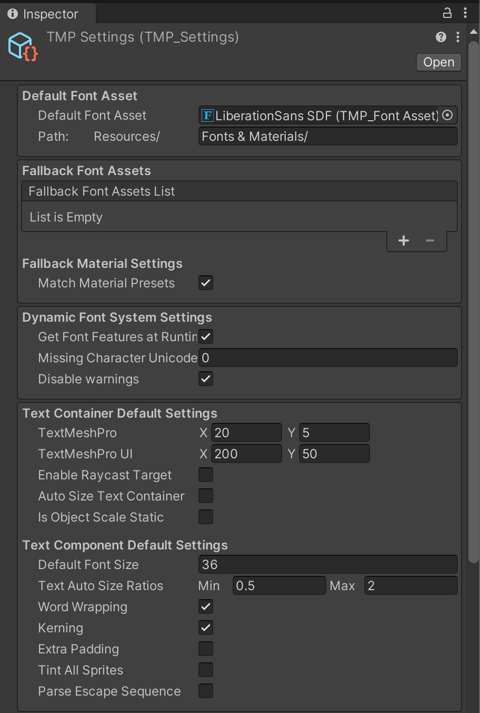

### Font Asset Creator の設定

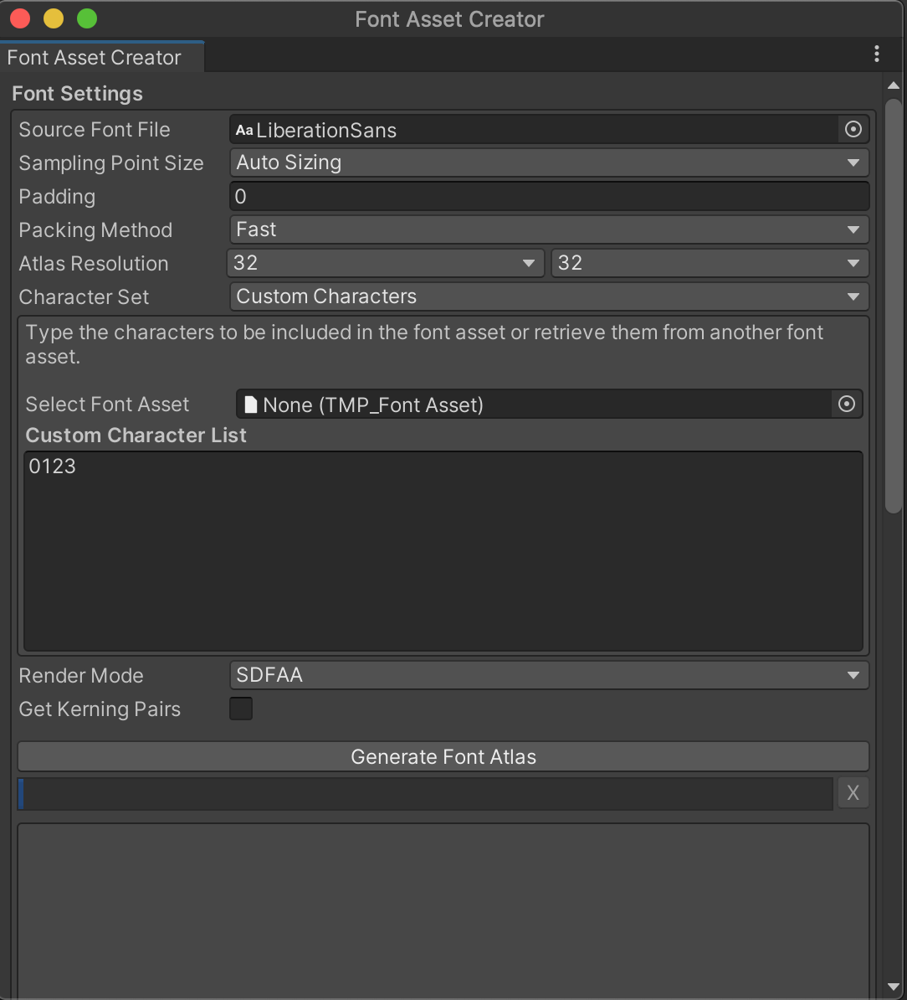

TextMesh Pro は独自のフォントアセットのフォーマットを持っており、**Font Asset Creator** を使って TrueType (.ttf) や OpenType (.otf) ファイルから生成する必要がある。**Font Asset Creator** を実行するためには Editor の *Window -> TextMeshPro -> Font Asset Creator* を選択する。

#### Source Font File

TextMesh Pro のフォントアセットの生成元のフォントファイル（.ttf または .otf）を設定する。ここで設定した生成元フォントファイルはビルドに含める必要は無い。

#### Sampling Point Size

フォントテクスチャ内の字形のサイズを指定する。**Auto Sizing** で自動設定した場合、テクスチャぎりぎりいっぱいになるように字形のサイズが設定される。**Custom Size** では自前でサイズを指定する。指定するサイズの目安としては `Canvas` で表示する `TextMeshProUGUI` コンポーネントの **Font Size** の等倍から 1.5 倍くらいで十分だろう。等倍だと若干字形のエッジが丸くなるので注意が必要である。2 倍だとオーバークオリティかもしれない。

**Auto Sizing** を指定した場合の字形のサイズは、生成後にフォントアセットのインポート設定の **Generation Settings** の **Sampling Point Size** を見ると確認できる。このサイズが表示サイズと比べてあまりにも小さ過ぎたり大き過ぎたりした場合には、**Atlas Resolution** でフォントテクスチャサイズを調整することを検討しよう。

#### Padding

フォントテクスチャ内での字形間の隙間をピクセル単位で指定する。Signed Distance Field（SDF）の仕組み的に、このパディングが大きいと滑らかになり、アウトラインなどの効果の質も上がる。目安としては `512 x 512` サイズのテクスチャに対して `5` ピクセルぐらいで十分である。特殊効果を乗せないのであれば `2` ピクセル程度でも良い。

#### Packing Method

字形をフォントテクスチャに詰める方法を指定する。**Optimum**（最適）を指定するとテクスチャにできるだけ大きなフォントサイズになるように自動調整する。**Fast**（高速）を指定するとフォントテクスチャ生成時間は若干短くなり、ざっくり調整したフォントサイズになる。調整時は **Fast** を指定して、最終的なパラメータ調整を終えた場合に **Optimum** を指定すると良いだろう。

#### Atlas Resolution

フォントテクスチャが大きければ大きいほど、字形のレンダリングのクオリティは高くなる。たいていのフォントの場合、ASCII キャラクターのみであれば `512 x 512` サイズもあれば十分なクオリティが得られる。日本語フォントの場合はもっと大きいテクスチャが必要になるだろうが、Android では最大テクスチャサイズが `4096 x 4096` に制限されている端末がそれなりに存在するということに注意してほしい。テクスチャサイズが `4096 x 4096` であっても消費するメモリは 16MB （1 ピクセルあたり 1 byte なので `4096 x 4096 x 1`）となり、スマートフォンアプリとしてはかなりの割合のメモリを消費されてしまう。後述するフォールバックフォントを上手く利用するなどして、メモリ使用量を削減するように心がけよう。

#### Character Set

フォントテクスチャに含める字形の Unicode（UTF16）を（先頭の 0x 無しの）16 進数のコンマ区切りで指定する。プリセットとして以下の項目が用意されている。

- ASCII、Extended ASCII（ISO 8859）
- ASCII Lowercase（小文字のみ）
- ASCII Uppercase（大文字のみ）
- Numbers + Symbols（数字および ASCII の記号）
- Custom Range（Unicode を 10 進数で 20-40 のような範囲あるいはコンマ区切りで指定）
- Unicode Range（Hex）（先頭の 0x 無しの 16 進数で - を使った範囲あるいはコンマ区切り）
- Custom Characters（文字そのものを入力）
- Characters from File（使用する文字が描かれた UTF8 の Text Asset を設定）

日本語であれば、ひらがな、カタカナに加えて JIS 第１水準の漢字（2956 文字）を設定することを考えるかもしれないが、それでも十分に多く、かつ、あまり使わない漢字も含まれている。常用漢字に絞っても 2136 文字になる。最も効果的なのは、ゲーム中で使うことが分かっている字形を全て洗いだして **Character Set** に設定し、それ以外の文字は **Dynamic** として実行時に生成するか TextMesh Pro ではなく `Text` コンポーネントを使うことである。何も考えずに 2000 文字以上の（使わない可能性の高い文字を多数含んだ）フォントテクスチャを作成するようなことはしないようにしよう。

#### Render Mode

ディスタンスフィールドのレンダリング方式を指定する。`SDFAA` が最もバランスが良いので、特に指定がない限りは `SDFAA` を指定すること。

- `SMOOTH_HINTED`：ヒンティング有りの 8 ビットのビットマップフォント

- `SMOOTH`：8 ビットのビットマップフォント

- `RASTER_HINTED`：ヒンティング有りの 1 ビットのビットマップフォント

- `RASTER`：1 ビットのビットマップフォント

- `SDF`：1 ビットの Signed Distance Field

- `SDF8`：1 ビットの Signed Distance Field を 8 倍にアップスケール
 
- `SDF16`：1 ビットの Signed Distance Field を 16 倍にアップスケール

- `SDF32`：1 ビットの Signed Distance Field を 32 倍にアップスケール

- `SDFAA_HINTED`：ヒンティング有りの 8 ビットの Signed Distance Field

- `SDFAA`：8 ビットの Signed Distance Field

#### Get Kerning Pairs

これをチェックすると、フォントに設定されているカーニング情報を利用することができる。この情報は特定の文字の組み合わせの場合の文字間のスペースを調整するのに使われ、結果として見た目が良くなる。もっとも、多くのフォントはカーニングペアの情報を持っていない。

### TextMesh Pro の Generation Setttings

**Project** ビューで **Font Asset Creator** で作成した TextMesh Pro フォントアセットファイル（.asset）を選択すると、**Inspector** に情報が表示される。

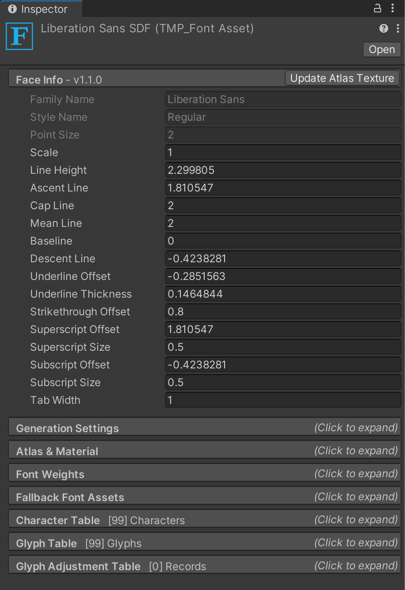

右上の **Update Atlas Texture** ボタンを押すと、選択中の TextMesh Pro フォントアセットの設定を元にした **Font Asset Creator** ウィンドウが開かれる。

この **Inspector** で表示される情報のほとんどは **Font Asset Creator** の設定を元にして計算されたものだが、ここで設定すべき重要な項目が 2 つ存在する。1 つは **Atlas Population Mode** であり、もう 1 つは **Fallback Font Assets** である。

#### Atlas Population Mode

ダイナミックフォント（Dynamic）か非ダイナミックフォント（Static）かを指定することができる。Dynamic であれば実行時にフォントテクスチャに存在していない字形があった場合にフォントテクスチャに字形を追加して使うことができる。Static であればフォントテクスチャに作成済みの字形以外を使うことはできない。

一見 Static を選択する理由が無いようにも見えるが、Dynamic を選択した場合の挙動にはいくつかの罠がある。

1. 実行時のフォントテクスチャへの字形追加はパフォーマンス上の影響が大きい。特に SDF の場合には字形の追加はかなりの時間がかかる。

2. 追加した字形は未使用になっても削除されない。標準の `Text` コンポーネントであれば使わない字形はフォントテクスチャから削除されるが、TextMesh Pro の場合は削除されない。もし字形を削除したいのであれば `TMP_FontAsset.ClearFontAssetData()` を呼んでフォントテクスチャ内の字形を全てクリアしなければならない。しかし、そうなると再びフォントテクスチャに字形を追加する必要があり、前述のようにフォントテクスチャ字形の追加時にパフォーマンスのペナルティを受けてしまう。さらに悪いことに `TMP_FontAsset.ClearFontAssetData()` は将来的に外部から呼べなくなる可能性が示唆されている。

以上により、TextMesh Pro においては、標準の `Text` コンポーネントのように気軽にダイナミックフォントを使うことはできない。上記の問題を解決するためにはフォールバックフォントをうまく設定する必要がある。

#### Multi Atlas Texture

マルチアトラステクスチャ機能は、フォントアセットがメインアトラスに字形を追加できなくなった際に必要に応じて新しいアトラステクスチャを作成することを可能にする機能である。これらの追加されたアトラステクスチャはフォントアセットの **Generation Settings** で定義されたメインのアトラステクスチャの設定を引き継ぐ。メインのアトラステクスチャを含む全てのアトラステクスチャは `Texture2D` の配列に含まれ、メインは常に index `0` となる。

マルチアトラステクスチャ機能は、**Atlas Population Mode** が **Dynamic** の場合にのみ有効にすることができる。

新しいアトラステクスチャの追加を含むフォントアセットへの変更は Editor では永続的だが、実行時にはそうではない。たとえば、マルチアトラステクスチャが有効になっている Dynamic フォントアセットはプレイ中に字形のカバレッジを処理するために必要に応じてアトラステクスチャが大きくなったり追加されたりするが、次回プレイ時には元に戻ってしまう。

Editor でのフォントアセットへの変更は永続的であるが、Context Menu オプションの Reset でフォントアセットをリセットすることが可能である。これによって、**Glyph** と **Charater** と **Glyph Adjustment Tables** がクリアされる。また全てのアトラステクスチャがクリアされる。

Editor でアトラステクスチャサイズなどの **Gereration Settings** の変更を行うと、自動的に既存の字形を再生して再パックし、新しい設定に基づいて必要に応じてアトラステクスチャの枚数を調整する。これによって、フォントアセットとアトラスを後で最適化することが簡単で便利になる。マルチアトラステクスチャ機能は全ての Dyanmic フォントアセットに適用される。

前述の通り、これらのアトラステクスチャは配列に含まれ、この最初の実装ではそれぞれのアトラステクスチャに対してドローコールが発生する。しかし、将来的にシェーダーにテクスチャ配列をサポートする機能が追加される予定である（テクスチャ配列は最近のモバイルデバイスでもサポートされている）。これによって、1 回のドローコールで描画することが可能となるだろう。

#### Fallback Font Assets

フォールバックフォントの使い方をきちんと理解することが TextMesh Pro を使う場合のパフォーマンス最適化のために必要である。

TextMesh Pro での字形の検索は再帰的に行われる。ある字形が TextMesh Pro のフォントアセットの中に見つからなかった場合、フォールバックのアセットのリストを順に調べていく。それでも字形が見つからなかった場合、同じテキストに割り当てられているフォントアセットと、そのフォントアセットに割り当てられているフォールバックフォントを調べる。それでも見つからなかった場合は **Project Settings** の TextMesh Pro -> Settings の **Fallback Font Assets** に設定されているフォールバックフォントを調べる。それでも見つからない場合には **Project Settings** の TextMesh Pro -> Settings の **Default Sprite Asset** を調べる。最終手段として **Project Settings** の TextMesh Pro -> Settings の **Missing Character Unicode** の文字を表示する。

注意すべきなのは、フォールバックフォントは元のフォントを含んだ `TextMeshProUGUI` コンポーネントがアクティブになった際に再帰的に読み込まれるということである。多くのフォントが存在する場合、そのフォールバックフォントもメモリに読み込まれるということになる。なので、多言語対応するプロジェクトは余計なフォールバックフォントが読み込まれないように注意すべきである。言語ごとにアセットバンドルを作成することが（フォントに限らず）効率的なアセット管理の方法である。

## TextMeshProUGUI コンポーネント

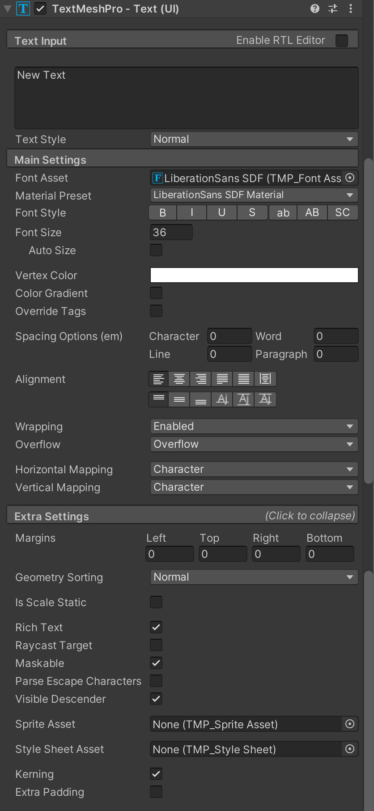

```c#
[DisallowMultipleComponent]
[RequireComponent(typeof(RectTransform))]
[RequireComponent(typeof(CanvasRenderer))]
[AddComponentMenu("UI/TextMeshPro - Text (UI)", 11)]
[ExecuteAlways]
[HelpURL("https://docs.unity3d.com/Packages/com.unity.textmeshpro@3.0")]
public partial class TextMeshProUGUI : TMP_Text, ILayoutElement
```

```c#
public abstract class TMP_Text : MaskableGraphic
```

`TextMeshProUGUI` コンポーネントは `TMP_Text` コンポーネント経由で `MaskableGraphic` コンポーネントを継承している。よって、基本的なパフォーマンスの注意点は `Text` などの `Graphic` コンポーネントと同様である。

`TMP_Text` コンポーネントは `MeshRenderer` で 3D 空間に文字を描画する `TextMeshPro` コンポーネントの親にもなっている。

`MonoBehaviour`
    ← `UIBehaviour`
        ← `Graphic`
            ← `MaskableGraphic`
                ← `TMP_Text`
                    ← `TextMeshPro`
                        ← `TextMeshProUGUI`

なお、`TextMeshProUGUI` はテキストメッシュ生成時に `Canvas` の `additionalShaderChannels` に `TexCoord1` と `Normal` と `Tangent` を追加する。なので、自分で `Canvas` の `additionalShaderChannels` になんらかの変更を行っている場合は注意してほしい。

`TMP_Text` のプロパティおよび public メソッドは非常に多いので本書で全て解説するのは難しい。よって、以下では *TextMeshProUGUI.cs* ファイル内で定義されているプロパティおよび public メソッド、そして **Inspector** に表示されるプロパティについてのみ説明する。

### TextMeshProUGUI のプロパティ

#### text

```c#
public virtual string text { get; set; }
```

表示するテキストの値を取得/設定する。

`Text` コンポーネントの `text` と同様に、文字列が変更されると Layout リビルドと Graphic リビルドが発生する。

#### isRightToLeftText

```c#
public bool isRightToLeftText { get; set; }
```

テキストを左から右へではなく右から左へ表示するかどうかを取得/設定する。

デフォルト値は `false` である。

このプロパティが変更されると Layout リビルドと Graphic リビルドが発生する。

#### textStyle

```c#
public TMP_Style textStyle { get; set; }
```

テキストの表示スタイルを取得/設定する。

スタイルはリッチテキストのようなタグで定義される。利用可能なスタイルはスタイルシートとして保存されている。デフォルトのスタイルシートを確認するには、*TMP Settings* に設定されているスタイルシート（**Assets/TextMesh Pro/Resources/Style Sheets/Default Style Sheet*）の中身を見れば良い。

利用可能なタグの一覧は TextMesh Pro の旧公式サイトに記載されている。
<http://digitalnativestudios.com/textmeshpro/docs/rich-text/>

#### font

```c#
public TMP_FontAsset font { get; set; }
```

テキストの描画に用いるフォントアセットを取得/設定する。

`TMP_FontAsset` は `ScriptableObject` である。デフォルトでは *Assets/TextMesh Pro/Resources/Fonts & Materials/LiberationSans SDF.asset* が設定されている。

このプロパティが変更されると Layout リビルドと Graphic リビルドが発生する。

```c#
public virtual Material fontSharedMaterial { get; set; }
```

テキストの描画に用いるマテリアルを取得/設定する。

Editor ではいくつかのマテリアルがドロップダウンメニューに表示されている。このメニューに表示されているマテリアルは、`font` に設定されているフォントアセットに設定されているマテリアルと、`AssetDataBase` から `font` の名前（をスペースで区切った最初の部分文字列）で検索したマテリアルである。

このプロパティが変更されると Graphic リビルドが発生する。

#### fontStyle

```c#
public FontStyles fontStyle { get; set; }
```

フォントスタイルを取得/設定する。`FontStyles` は以下のように定義されている。

```c#
public enum FontStyles
{ 
    Normal = 0x0, 
    Bold = 0x1, 
    Italic = 0x2, 
    Underline = 0x4, // 下線
    LowerCase = 0x8, // 小文字
    UpperCase = 0x10, // 大文字
    SmallCaps = 0x20,  // 大文字かつ単語の先頭以外は小文字サイズ
    Strikethrough = 0x40, // 取消線
    Superscript = 0x80, // 上付き文字。Inspector には表示されない。<sup> タグで使われる。
    Subscript = 0x100, // 下付き文字。Inspector には表示されない。<sub> タグで使われる。
    Highlight = 0x200 // ハイライト。Inspector には表示されない。<mark> タグで使われる。
};
```


`FontStyles` はビットフラグになっているので複数適用することができる。
このプロパティが変更されると Layout リビルドと Graphic リビルドが発生する。

#### fontSize

```c#
public float fontSize { get; set; }
```

フォントサイズを取得/設定する。

`enableAutoSizing` が有効でない場合（デフォルト）のデフォルトのフォントサイズは `36` である。このプロパティが変更されると Layout リビルドと Graphic リビルドが発生する。

#### enableAutoSizing

```c#
public bool enableAutoSizing { get; set; }
```

（アセンダーなども考慮した）テキストの表示領域いっぱいになるようにフォントサイズを自動で変更するかどうかを取得/設定する。

デフォルト値は `false` である。

`Text` コンポーネントの Best Fit の設定と同様の挙動だが、`0.05` ポイント単位での調整が行われるので、有効にした場合には Best Fit よりもさらに負荷が高くなる。よって、あくまで事前に最適なフォントサイズを算出するために使うべきであり、`true` にしたまま Play モードで使うべきではない。

このプロパティが変更されると Layout リビルドと Graphic リビルドが発生する。

#### fontSizeMin / fontSizeMax

```c#
public float fontSizeMin { get; set; }
public float fontSizeMax { get; set; }
```

`enableAutoSizing` が `true` の場合にフォントサイズの最小値/最大値を取得/設定する。

`fontSizeMin` のデフォルト値はフォントサイズに `TMP_Settings.defaultTextAutoSizingMinRatio`  を掛けた値であり、`fontSizeMax` のデフォルト値は `TMP_Settings.defaultTextAutoSizingMinRatio` を掛けた値である。

`TMP_Setting` の値は *Assets/TextMesh Pro/Resources/TMP Settings* の `ScriptableObject` で定義されており、デフォルトでは `defaultTextAutoSizingMinRatio` は `0.5` で、`defaultTextAutoSizingMinRatio` は `2` となっている。

このプロパティが変更されると Layout リビルドと Graphic リビルドが発生する。

#### characterWidthAdjustment

```c#
public float characterWidthAdjustment { get; set; }
```

`enableAutoSizing` が `true` の場合にテキストの表示領域に治らなかった場合に文字の幅を縮める割合を取得/設定する。

デフォルト値は `0` で、最大値は `50` となっている。

このプロパティが変更されると Layout リビルドと Graphic リビルドが発生する。

#### lineSpacingAdjustment

```c#
public float lineSpacingAdjustment { get; set; }
```

`enableAutoSizing` が `true` の場合に自動サイズ変更が行われる前に減らす行間を取得/設定する。`0` または負の値を取る。デフォルト値は `0` で、最大値は `0` である。

このプロパティが変更されると Layout リビルドと Graphic リビルドが発生する。

#### color

```c#
public override Color color { get; set; }
```

テキストのベースの色（である頂点カラー）を取得/設定する。

もし `overrideColorTags` が `true` なら `<color>` タグは無視されて、テキストはこの色で描画される。逆に `overrideColorTags` が `false` なら（これがデフォルト）、`<color>` タグでこの色を上書きすることができる。

このプロパティが変更されると Graphic リビルドが発生する。

#### enableVertexGradient

```c#
public bool enableVertexGradient { get; set; }
```

頂点カラーをグラデーションを有効にするかどうかを取得/設定する。

このプロパティを `true` に設定すると、**Inspector** に **Color Preset** と **Color Mode** と **Colors** が表示されるようになる。

#### colorGradientPreset

```c#
public TMP_ColorGradient colorGradientPreset { get; set; }
```

頂点カラーグラデーションのプリセットを取得/設定する。

プリセットには後述の `ColorMode` と四隅の頂点カラーが定義されている。

TextMesh Pro のインポート時に **Import TMP Example & Extras** を選択するか、手動で *TMP Examples & Extras* パッケージをインストールしていれば、*Assets/TextMesh Pro/Examples & Extras/Resources/Color Gradient Presets* 以下にいくつかプリセットが用意されている。

このプロパティが変更されると Graphic リビルドが発生する。

#### m_colorMode

```c#
protected ColorMode m_colorMode = ColorMode.FourCornersGradient;
```

グラデーションのタイプを示す。

プロパティではないが **Inspector** に表示されている変数なのでここで説明する。なお、スクリプトから変更することはできない。`ColorMode` は以下のように定義されている。

```c#
public enum ColorMode
{
    Single, // 単一色
    HorizontalGradient, // 水平方向のグラデーション
    VerticalGradient, // 垂直方向のグラデーション
    FourCornersGradient // 四隅のグラデーション
}
```

#### colorGradient

```c#
public VertexGradient colorGradient { get; set; }
```

グラデーションの四隅の頂点を取得/設定する。

`VertexGradient` の定義は以下の通りである。

```c#
[Serializable]
public struct VertexGradient
{
    public Color topLeft;
    public Color topRight;
    public Color bottomLeft;
    public Color bottomRight;
    ...
```

このプロパティが変更されると Graphic リビルドが発生する。

#### overrideColorTags

```c#
public bool overrideColorTags { get; set; }
```

ベースの色が `<color>` タグの色を上書きするかどうかを取得/設定する。

デフォルト値は `false` であり、`<color>` タグでベースの色を上書きすることができる。逆に、このプロパティが `true` なら `<color>` タグは無視されて、テキストはベース色で描画される。

#### characterSpacing / wordSpacing / lineSpacing / paragraphSpacing

```c#
public float characterSpacing { get; set; }
public float wordSpacing { get; set; }
public float lineSpacing { get; set; }
public float paragraphSpacing { get; set; }
```

追加のスペースの量を取得/設定する。

フォントのサイズを `100` とする。つまり、`100` を設定すると 1 文字分空くことになる。負の数を指定することも可能である。全てデフォルト値は `0` である。

`characterSpacing` は文字間、`wordSpacing` は単語間、`lineSpacing` は行間、`paragraphSpacing` はパラグラフ間のスペースとなる。パラグラフは、改行または Unicode の段落区切り記号（`0x2029`）で切り替わる。

これらのプロパティが変更されると Layout リビルドと Graphic リビルドが発生する。

#### horizontalAlignment / verticalAlignment

```c#
public HorizontalAlignmentOptions horizontalAlignment { get; set; }
public VerticalAlignmentOptions verticalAlignment { get; set; }
```

水平方向/垂直方向のアラインメントを取得/設定する。

`HorizontalAlignmentOptions` と `VerticalAlignmentOptions` の定義は以下の通りである。

```c#
public enum HorizontalAlignmentOptions
{
    Left = 0x1, // 左揃え
    Center = 0x2, // 中心揃え
    Right = 0x4,  // 右揃え
    Justified = 0x8, // 両端揃え（幅が表示領域より狭いなら何もしない）
    Flush = 0x10, // 均等割り付け（幅が表示領域より狭いなら文字間を広げる）
    Geometry = 0x20 // ジオメトリによる中央揃え（Text コンポーネントの alignByGeometry で中央揃えにした場合と同様の挙動）
}

public enum VerticalAlignmentOptions
{
    Top = 0x100, // 上揃え
    Middle = 0x200, // 中央揃え
    Bottom = 0x400, // 下揃え
    Baseline = 0x800, // フォントのベースライン揃え
    Geometry = 0x1000, // ジオメトリの高さ揃え。Inspector では Midline と表示。
    Capline = 0x2000, // 大文字の高さ揃え
}
```

`HorizontalAlignmentOptions` と `VerticalAlignmentOptions` はビットフラグになっているが、それぞれ 1 つずつ選択することが前提となっている。

`HorizontalAlignmentOptions` の `Justified`、`Flush` や `VerticalAlignmentOptions` の `Baseline`、`Geometry`、`Capline` はアルファベット前提のアラインメントなので、日本語フォントを使用する際に使うことは稀だろう。

これらのプロパティが変更されると Graphic リビルドが発生する。

#### enableWordWrapping

```c#
public bool enableWordWrapping { get; set; }
```

テキストが幅いっぱいに達した場合に折り返すかどうかを取得/設定する。

デフォルト値は `TMP_Settings.enableWordWrapping` に設定されている値（デフォルト設定では `true`）となる。

これらのプロパティが変更されると Layout リビルドと Graphic リビルドが発生する。

#### overflowMode

```c#
public TextOverflowModes overflowMode { get; set; }
```

テキストが高さいっぱいに達した場合の挙動を取得/設定する。

`TextOverflowModes` の定義は以下の通りである。

```c#
 public enum TextOverflowModes 
 { 
     Overflow = 0, // はみ出す
     Ellipsis = 1, // はみ出た分を「…」で表す
     Masking = 2, // 現時点では Overflow と同じ挙動
     Truncate = 3, // はみ出た分を切り捨て
     ScrollRect = 4,  // 現時点では Overflow と同じ挙動
     Page = 5, // ページで区切る。ページ番号は pageToDisplay で指定できるが、先頭ページは 0 ではなく 1 であることに注意。
     Linked = 6 // はみ出た分のテキストを linkedTextComponent に設定されたオブジェクトに渡す
};
```

これらのプロパティが変更されると Layout リビルドと Graphic リビルドが発生する。

#### horizontalMapping

```c#
public TextureMappingOptions horizontalMapping { get; set; }
```

**Face** や **Outline** のテクスチャの水平方向の適用具合（つまり UV2 の座標の設定方法）を取得/設定する。Face や Outline にテクスチャを使っていないのであれば影響しない。

`TextureMappingOptions` の定義は以下の通りである。

```c#
public enum TextureMappingOptions
{
    Character = 0, // 各文字の幅と高さを元に個々の文字にテクスチャが適用される。
    Line = 1, // 各行の長さ/幅に基づいてテクスチャが適用される。
    Paragraph = 2, // 各パラグラフの長さ/幅に基づいてテクスチャが適用される。
    MatchAspect = 3 // テクスチャはhorizontalMapping/verticalMapping のアスペクト比にマッチしたテキストに適用される。
};
```

デフォルト値は `TextureMappingOptions.Character` である。

このプロパティが変更されると Graphic リビルドが発生する。

#### verticalMapping

```c#
public TextureMappingOptions verticalMapping { get; set; }
```

Face や Outline テクスチャ垂直方向の適用具合（つまり UV2 の座標の設定方法）を取得/設定する。

Face や Outline にテクスチャを使っていないのであれば影響しない。

デフォルト値は `TextureMappingOptions.Character` である。

このプロパティが変更されると Graphic リビルドが発生する。

#### mappingUvLineOffset

```c#
public float mappingUvLineOffset { get; set; }
```

`horizontalMapping` や `verticalMapping` が `Line`、`Paragraph`、`MatchAspect` の場合のテクスチャのオフセットを指定する。

デフォルト値は `0` である。

このプロパティが変更されると Graphic リビルドが発生する。

#### margin

```c#
public virtual Vector4 margin { get; set; }
```

テキスト領域のマージンを取得/設定する。

値が負数ならその分だけテキストの表示領域が広がり、正数ならテキストの表示領域が狭まる。`enableAutoSizing` が `true` であればテキストの表示領域に応じてフォントサイズが変わるのでこのプロパティの影響がわかりやすいだろう。

デフォルト値は `(0, 0, 0, 0)` である。

このプロパティが変更されると Graphic リビルドが発生する。

#### geometrySortingOrder

```c#
public VertexSortingOrder geometrySortingOrder { get; set; }
```

テキストのジオメトリのソート方法を取得/設定する。

文字が重なった場合の表示方法を調整するのに使われる。

`VertexSortingOrder` の定義は以下の通りである。

```c#
public enum VertexSortingOrder 
{ 
    Normal, 
    Reverse 
};
```

このプロパティが `Normal` であれば、文字列の先頭側の文字（左側の文字）が先に描かれるので、文字が重なった場合は先頭側が下になる。このプロパティが `Reverse` であれば、文字列の後ろ側の文字（右側の文字）が先に描かれるので、文字が重なった場合は後ろ側が下になる。デフォルト値は `Normal` である。

このプロパティが変更されると Graphic リビルドが発生する。

#### isTextObjectScaleStatic

```c#
public bool isTextObjectScaleStatic { get; set; }
```

このテキストオブジェクトまたは親のスケールが変更された際のコールバックを受け取らないかどうかを取得/設定する。

デフォルト値は `false` であるが、*TMP Settings* でデフォルトの設定値を指定することができる。

このプロパティを `true` にすると、スケールが変更された際に各オブジェクトへ通知がされなくなり、SDF による適切な拡大縮小が行われなくなるが、パフォーマンスは向上する。モバイル環境において、スケールが頻繁に変わったり多数のテキストオブジェクトが存在するのであれば、このプロパティを `true` にしておくと良いだろう。

#### raycastTarget

```c#
public virtual bool raycastTarget { get; set; }
```

レイキャストのターゲットであるか（つまり、タッチ判定を有効にするか）を取得/設定する。`Graphic` コンポーネントの `raycastTarget` そのままだが、*TMP Settings* ファイルでデフォルトの設定値を指定することができる。

#### richText

```c#
public bool richText { get; set; }
```

リッチテキストを利用するかどうかを取得/設定する。

デフォルト値は `true` である。

リッチテキストを利用するつもりがないのであればパフォーマンスのためにも `false` に設定しておくのが良いだろう。このプロパティが変更されると Layout リビルドと Graphic リビルドが発生する。

#### parseCtrlCharacters

```c#
public bool parseCtrlCharacters { get; set; }
```

エスケープシーケンスを処理するかどうかを取得/設定する。

デフォルト値は `true` であるが、*TMP Settings* でデフォルトの設定値を指定することができる。

以下のように `"1\\n2"` という文字列が `text` に渡された場合を想定しよう。

```c#
var tmp = GetComponent<TextMeshProUGUI>();
tmp.text = "1\\n2";
```

このプロパティが `true` であれば、1 行目に `1` が表示され、2 行目に `2` が表示される。

このプロパティが `false` であれば、1 行目に `1\n2` が表示される。

このプロパティが変更されると Layout リビルドと Graphic リビルドが発生する。

#### useMaxVisibleDescender

```c#
public bool useMaxVisibleDescender { get; set; }
```

テキストの垂直方向のアライメントをフォントの descender に合わせるかどうかを取得/設定する。

デフォルト値は `true` である。

*Assets/TextMesh Pro/Examples & Extras/Scenes* の
*17 - Old Computer Terminal* シーンで使われているが、あまり使い道はない。

このプロパティが変更されると Graphic リビルドが発生する。

#### spriteAsset

```c#
public TMP_SpriteAsset spriteAsset { get; set; }
```

（`<sprite>` タグでスプライトアセットが指定されてない場合に使われる）スプライトアセットを取得/設定する。

たとえば `<sprite index=0>` のようなタグを使うと、このプロパティのスプライトアセットの 0 番目のスプライトが表示される。このプロパティが変更されると Layout リビルドと Graphic リビルドが発生する。

#### styleSheet

```c#
public TMP_StyleSheet styleSheet { get; set; }
```

このテキストで使うことができるスタイルを定義しているスタイルシートを取得/設定する。

このプロパティが設定されていない場合、*TMP Settings* に設定されているスタイルシートが使われる。スタイルシートの中からスタイルを選択して `textStyle` で設定することができる。

このプロパティが変更されると Layout リビルドと Graphic リビルドが発生する。

#### enableKerning

```c#
public bool enableKerning { get; set; }
```

フォントアセットに含まれているカーニングペアの情報を利用するかどうかを設定する。

デフォルト値は *TMP Settings* で `true` に設定されている。しかしながら、多くのフォントファイルにはカーニングペアの情報は含まれていない。

このプロパティが変更されると Layout リビルドと Graphic リビルドが発生する。

#### extraPadding

```c#
public bool extraPadding { get; set; }
```

各文字のメッシュにパディングを追加するかどうかを取得/設定する。

デフォルト値は *TMP Settings* で `false` に設定されている。このプロパティを `true` に設定すると各文字のメッシュがやや大きくなる。これにより、フォントサイズが非常に小さい場合に全く表示されなくなってしまうのを防ぐことができる。基本的には `false` のままで構わない。このプロパティが変更されると Graphic リビルドが発生する。

#### autoSizeTextContainer

```c#
public override bool autoSizeTextContainer { get; set; }
```

リビルド時に `RectTransform` のサイズをテキスト表示領域のサイズに合わせるかどうかを取得/設定する。

このプロパティを `true` に設定すると、`ContentSizeFitter` コンポーネントをアタッチして、**Horizontail Fit** と **Vertical Fit** に **Preferred Size** を設定した場合と同様の挙動になる。このプロパティが変更されると Layout リビルドが発生する。

#### canvasRenderer

```c#
public CanvasRenderer canvasRenderer { get; }
```

このコンポーネントが利用している `CanvasRenderer` を取得する。

`null` でなかった場合、その値はキャッシュされる。

#### maskOffset

```c#
public Vector4 maskOffset { get; set; }
```

マスクのオフセットを取得/設定する…はずだが、ここで設定した値は実際には使われない。

値を設定した際に独自の計算でマスク領域が決定される。

#### materialForRendering

```c#
public override Material materialForRendering { get; }
```

実際に `CanvasRenderer` がレンダリングのために使うマテリアルを取得する。

`Graphic` コンポーネントの `materialForRendering` と基本的な挙動は同じである。

#### mesh

```c#
public override Mesh mesh { get; }
```

テキストのメッシュを取得する。

### TextMeshProUGUI の public メソッド

#### CalculateLayoutInputHorizontal

```c#
public void CalculateLayoutInputHorizontal();
```

`ILayoutElement` インターフェースの `CalculateLayoutInputHorizontal()` を実装したメソッドだが、中身は空である。

#### CalculateLayoutInputVertical

```c#
public void CalculateLayoutInputVertical();
```

`ILayoutElement` インターフェースの `CalculateLayoutInputVertical()` を実装したメソッドだが、中身は空である。

#### ClearMesh

```c#
public override void ClearMesh();
```

`canvasRenderer` のメッシュに `null` を設定する。

#### ComputeMarginSize

```c#
public override void ComputeMarginSize();
```

マージンのサイズを計算する。

#### Cull

```c#
public override void Cull(Rect clipRect, bool validRect);
```

クリッピング領域を元に、この `canvasRenderer` の `cull` にカリングするかどうかの設定を渡す。

このメソッドは `MaskableGraphic` の `Cull()` の override である。

#### ForceMeshUpdate

```c#
public override void ForceMeshUpdate(bool ignoreActiveState = false, bool forceTextReparsing = false);
```

テキストメッシュを再作成する。

#### GetModifiedMaterial

```c#
public override Material GetModifiedMaterial(Material baseMaterial);
```

レンダリングに使うマテリアルを返す。

このメソッドは `IMaterialModifier` を実装したメソッドである。

#### GetTextInfo

```c#
public override TMP_TextInfo GetTextInfo(string text);
```

引数で与えられた文字列に対する `TMP_TextInfo` を取得する。

`TMP_TextInfo` には文字列のレンダリングに必要なほぼ全ての情報が格納されている。

#### Rebuild

```c#
public override void Rebuild(CanvasUpdate update);
```

Canvas リビルドを実行する。

`Prelayout` ステージでは、`autoSizeTextContainer` が `true` である場合に `RectTransform` のサイズ調整が行われる。

`PreRender` ステージでは、テキストのパースやジオメトリの再作成といった重要な（かつ負荷の高い）処理が行われ、マテリアルがダーティであればマテリアルの更新処理を行う。

#### RecalculateClipping

```c#
public override void RecalculateClipping();
```

クリッピング領域を再計算する。

このメソッドは `IClippable ` インターフェースを実装したメソッドである。

実際には親クラスの `MaskableGraphic` の `RecalculateClipping` をそのまま呼び出している。

#### SetAllDirty

```c#
public override void SetAllDirty();
```

`SetLayoutDirty()` と `SetMaterialDirty()` と `SetVerticesDirty()` を呼んで、後に Layout リビルドと Graphic リビルドを発生させる。

#### SetLayoutDirty

```c#
public override void SetLayoutDirty();
```

Layout がダーティであるとマークする。

もし、`RegisterDirtyLayoutCallback()` でコールバックが設定されていたなら、それを呼び出す。レイアウトがダーティであるとマークされると、`CanvasUpdateRegistry.PerformUpdate()` 経由で Layout リビルドが行われる。このレイアウトリビルド時の負荷は **Profiler** の UI エリアの **Layout** として計測される。

#### SetMaterialDirty

```c#
public override void SetMaterialDirty();
```

マテリアルがダーティであるとマークする。

もし、`RegisterDirtyMaterialCallback()` でコールバックが設定されていたなら、それを呼び出す。マテリアルがダーティであるとマークされると、`CanvasUpdateRegistry.PerformUpdate()` 経由で `Rebuild()` が呼ばれてマテリアルの再設定が行われる。これが Graphic リビルドである。このグラフィックリビルド時の負荷は **Profiler** の UI エリアの **Render** として計測される。

#### SetVerticesDirty

```c#
public override void SetVerticesDirty();
```

頂点がダーティであるとマークする。

もし、`RegisterDirtyMaterialCallback()` でコールバックが設定されていたなら、それを呼び出す。頂点がダーティであるとマークされると、マテリアルがダーティであった場合と同様に `CanvasUpdateRegistry.PerformUpdate()` 経由で Graphic リビルドが行われ、この時の負荷は Profiler の UI エリアの **Render** として計測される。

#### UpdateFontAsset

```c#
public void UpdateFontAsset();
```

設定済みのフォントアセットを読み込む。

設定済みのフォントアセットが `null` であればデフォルトのフォントアセットを読み込む。デフォルトフォントアセットは *TMP Settings* に定義されているが、それも `null` であれば *Fonts & Materials/LiberationSans SDF* を読み込む。このメソッドが呼び出されるとマテリアルがダーティとみなされる。

#### UpdateGeometry

```c#
public override void UpdateGeometry(Mesh mesh, int index);
```

テキストメッシュを設定する。

`index` が `0` であれば、`CanvasRenderer` に `SetMesh()` で `mesh` が渡される。`index` が `0` より大きければ、サブテキストオブジェクトの `CanvasRenderer` に `SetMesh()` で `mesh` が渡される。このメソッドは、`Graphic` クラスの引数無しの `UpdateGeometry()` メソッドとは別物である。

#### UpdateMeshPadding

```c#
public override void UpdateMeshPadding();
```

パディングを再計算する。

このメソッドはシェーダーやマテリアルがスクリプトから変更された際に呼ばれる。

#### UpdateVertexData

```c#
public override void UpdateVertexData();
public override void UpdateVertexData(TMP_VertexDataUpdateFlags flags);
```

内部で持っている頂点データを `CanvasRenderer` に `SetMesh()` で渡す。

`TMP_VertexDataUpdateFlags` が指定された場合、そのフラグに応じてメッシュにデータが設定される。

`TMP_VertexDataUpdateFlags` の定義は以下の通りである。

```c#
public enum TMP_VertexDataUpdateFlags
{
    None = 0x0,
    Vertices = 0x1,
    Uv0 = 0x2,
    Uv2 = 0x4,
    Uv4 = 0x8,
    Colors32 = 0x10,
    All = 0xFF
};
```

### TextMeshProUGUI のイベント

#### OnPreRenderText

```c#
public override event Action<TMP_TextInfo> OnPreRenderText;
```

Canvas リビルドの `PreRender` ステージで呼ばれるコールバックを設定することができる。

以下にサンプルコードを示す。

```c#
using UnityEngine;
using TMPro;

// Canvas リビルドの PreRender ステージが実行された際にコールバックを受ける
[RequireComponent(typeof(TextMeshProUGUI))]
public class TMPOnPreRenderTextSample : MonoBehaviour
{
    private TextMeshProUGUI tmpUGUI;

    private void Start()
    {
        tmpUGUI = GetComponent<TextMeshProUGUI>();
        tmpUGUI.OnPreRenderText += OnPreRenderText;
    }

    private void OnDestroy()
    {
        if (tmpUGUI != null)
        {
            tmpUGUI.OnPreRenderText -= OnPreRenderText;
        }
    }

    public void OnPreRenderText(TMP_TextInfo textInfo)
    {
        Debug.Log("Canvas リビルドの PreRender ステージが実行された");
        Debug.Log("オブジェクト " + textInfo.textComponent.name);
        Debug.Log("テキスト　　 " + textInfo.textComponent.text);
        Debug.Log("フォント　　 " + textInfo.textComponent.font.name);
    }
}
```

### Text と TextMesh Pro の比較

一般に、TextMesh Pro を採用する理由は以下のようなものだろう。

- 見た目を重視したい（特に文字の間隔の調整とアウトライン）
- 使用する字形の種類が少なく、ビルド時にほぼ確定している。
- 日本語のみの対応。
- 標準の `Text` を自前で拡張するエンジニアリングリソースが不要。

一方、標準の `Text` コンポーネントを採用する理由は以下のようなものが挙げられる。

- 見た目のクオリティよりもレンダリング速度が重要。
- 多言語対応かつ、使用される字形をビルド時に確定できない。
- 使用できるメモリがシビアである。

カジュアルゲームや個人開発規模のゲームであれば、TextMesh Pro を採用するのが良いだろう。一方、テキストリソース量が多くワークフローな複雑な多言語展開の大規模モバイルソーシャルゲームや、パフォーマンスが重要な VR アプリケーションであれば、標準の `Text` コンポーネント（と `Text` の独自拡張）を軸にして検討して、パフォーマンスやワークフローに余裕があれば TextMesh Pro を採用していくのが良いかもしれない。

# Chapter 7 Selectable

## Selectable

```c#
[AddComponentMenu("UI/Selectable", 70)]
[ExecuteAlways]
[SelectionBase]
[DisallowMultipleComponent]
public class Selectable : UIBehaviour, IMoveHandler, IPointerDownHandler, IPointerUpHandler, IPointerEnterHandler, IPointerExitHandler, ISelectHandler, IDeselectHandler, IEventSystemHandler
```

`Selectable` は選択可能な UI 要素を表すコンポーネントである。

`Selectable` を継承したコンポーネントは `Button`、`Toggle`、`Slider`、`Dropdown`、`InputField`、`Scrollbar` と多岐に渡る。それらのコンポーネントを見ていく前にまずは `Selectable` について詳しく見ていこう。

### Selectable の選択状態

`Selectable` には `Normal`、`Highlighted`、`Pressed`、`Selected`、`Disabled` という 5 つの選択状態があり、それらは `Selectable.SelectionState` という列挙型で定義されている。

```c#
/// <summary>
/// オブジェクトの選択状態の列挙型
/// </summary>
protected enum SelectionState
{
    /// <summary>
    /// UI オブジェクトが選択可能である
    /// </summary>
    Normal,

    /// <summary>
    /// UI オブジェクトがハイライトされている
    /// </summary>
    Highlighted,

    /// <summary>
    /// UI オブジェクトが押されている
    /// </summary>
    Pressed,

    /// <summary>
    /// UI オブジェクトが選択されている
    /// </summary>
    Selected,

    /// <summary>
    /// UI オブジェクトが選択不可能である
    /// </summary>
    Disabled,
}
```c

### Selectable の static 変数

#### allSelectableCount

```c#
public static int allSelectableCount { get; }
```

現在アクティブな `Selectable` コンポーネントの数を取得する。

#### allSelectablesArray

```c#
public static Selectable[] allSelectablesArray { get; }
```

現在アクティブな `Selectable` の配列をコピーして返す。

内部で `new` が実行されるので *GC Alloc* が発生することに注意。後述する static メソッドの `AllSelectablesNoAlloc()` であれば既に確保済みの配列を引数として渡すので `new` は実行されない。

### Selectable のプロパティ

#### transition

```c#
public Selectable.Transition transition { get; set; }
```

状態が変わった際に `targetGraphic` に適用されるトランジションの種類を取得/設定する。トランジションの種類は `None`、`ColorTint`、`SpriteSwap`、`Animation` の 4 種類があり、デフォルトは `ColorTint` である。

*Runtime/UI/Core/Selectable.cs*
```c#
/// <summary>
/// Selectable のトランジションのモード
/// </summary>
public enum Transition
{
    /// <summary>
    /// トランジション無し
    /// </summary>
    None,

    /// <summary>
    /// 色によるトランジション
    /// </summary>
    ColorTint,

    /// <summary>
    /// Sprite 差し替えによるトランジション
    /// </summary>
    SpriteSwap,

    /// <summary>
    /// Animator を使ったアニメーションによるトランジション
    /// </summary>
    Animation
}
```

`Transition` が `ColorTint` の場合の各状態の色は `ColorBlock` 構造体で定義され、`colors` プロパティで取得/設定できる。`ColorTint` の場合、遷移時に約 600 KB の *GC Alloc* が発生してしまうことに注意してほしい。

トランジションが `SpriteSwap` の場合の各状態の `Sprite` は `SpriteState` 構造体で定義され、`spriteState` プロパティで取得/設定できる。

トランジションが `Animation` の場合の各状態のアニメーショントリガーは `AnimationTriggers` クラスで定義され、`animationTriggers` プロパティで取得/設定できる。

#### colors

```c#
public ColorBlock colors { get; set; }
```

`ColorBlock` を取得/設定する。

`ColorBlock` は色による遷移の状態を保存しておく構造体である。`ColorBlock` は、**Normal**、**Highlight**、**Pressed（Selected）**、**Disabled** の各状態を表す色、色の係数（大きくなるほど明るくなる。1 から 5 の範囲）、フェードアニメーションの時間を持っている。それらのデフォルト値は以下のように定義されている。

```c#
public struct ColorBlock : IEquatable<ColorBlock>
{
    ...
    public static ColorBlock defaultColorBlock
    {
        get
        {
            var c = new ColorBlock
            {
                m_NormalColor      = new Color32(255, 255, 255, 255),
                m_HighlightedColor = new Color32(245, 245, 245, 255),
                m_PressedColor     = new Color32(200, 200, 200, 255),
                m_SelectedColor    = new Color32(245, 245, 245, 255),
                m_DisabledColor    = new Color32(200, 200, 200, 128),
                colorMultiplier    = 1.0f,
                fadeDuration       = 0.1f
            };
            return c;
        }
    }
    ...
}
```

たとえば、スクリプトから **Pressed** の際の色を変えたい場合は以下のようになるだろう。

```c#
using UnityEngine;
using UnityEngine.UI;

public class SetButtonPressedColorSample : MonoBehaviour
{
    public Button button;

    // Button が Pressed 状態になった際の色を変更する
    public void SetButtonPressedColor(Color pressedColor)
    {
        ColorBlock colorBlock = button.colors;
        colorBlock.pressedColor = pressedColor;
        
        // ColorBlock はクラスではなく構造体なので丸ごと差し替える必要がある
        button.colors = colorBlock;
    }
    ...
```

#### spriteState

```c#
public SpriteState spriteState { get; set; }
```

`SpriteState` を取得/設定する。

`SpriteState` はスプライト差し替えによるトランジションの状態を保存しておく構造体であり、**Normal**、**Highlight**、**Pressed（Selected）**、**Disabled** の各状態に対応した `Sprite` を保持している。

#### animationTriggers

```c#
public AnimationTriggers animationTriggers { get; set; }
```

`AnimationTriggers` を取得/設定する。

`AnimationTriggers` はアニメーションによる遷移の状態（の名前）を保持しておくクラスである。`Selectable` では `Normal`、`Highlighted`、`Pressed`、`Selected`、`Disabled` というアニメーショントリガーが存在しており、`AnimationTriggers` はそれらの名前を保持している。

たとえば、スクリプトから `Selectable` の `Animator` の状態を `Pressed` にしたいのであれば、`animationTriggers` から `Pressed` に該当するトリガーの名前を取得して、`Animator.SetTrigger()` に渡してあげればよい。

```c#
using UnityEngine;
using UnityEngine.UI;

public class AnimationTriggersSample : MonoBehaviour
{
    public Animator buttonAnimator;
    public Button button;

    public void MakeButtonStatePressed()
    {
        // ボタンの状態を Pressed 状態に遷移させる
        //（これは チュートリアルを作るときに有効かもしれない）
        buttonAnimator.SetTrigger(button.animationTriggers.pressedTrigger);
    }
}
```

#### animator

```c#
public Animator animator { get ;}
```

この `GameObject` にアタッチされている `Animator` を取得する。

内部では `GetComponent<Animator>()` を呼んでいるだけであり、得られた値はキャッシュされないのでパフォーマンスに注意すること。

#### interactable

```c#
public bool interactable { get; set; }
```

UI 要素の選択が可能かどうかを取得/設定する。

たとえば、`Button` の `interactable` を `false` にすると、`Button` は **Disabled** 状態となって押すことができなくなる。

`interactable` が変更されると、それに伴って現在の選択状態も変わる。`interactable` が `false` であれば現在の選択状態は **Disabled** となり、`true` であればその他の各種条件によって **Pressed**、**Selected**、**Highlighted**、**Normal** のいずれかの状態となる。次に、現在の選択状態によって遷移が開始され、`transition` の種類によって `ColorTint` か `SpriteSwap` か `Animation` のいずれかのトランジションが行われる。

また、もし　`EventSystem` の `currentSelectedGameObject` がこのオブジェクトであった場合には `currentSelectedGameObject` には `null` が設定される。

#### navigation

```c#
public Navigation navigation { get; set; }
```

この `Selectable` のナビゲーションの挙動を指定/取得する。

ナビゲーションとは、タッチ操作ではなくキー操作で上下左右キーを押した際にフォーカスする UI 要素を変更させることである。各 `Selectable` ごとに、上下左右キーを押した際にどの `Selectable` にフォーカスが移動するかを指定されており、その情報を元にナビゲーションが行われる。

以下のように `Button` を配置して、**Inspector** から `EventSystem` の **First Selected** に `ButtonCenter` を設定してみよう。

この状態で **Play** モードにすると、初期状態では `ButtonCenter` が選択されているが、キーボードの上下左右キーで `ButtonUp`、`ButtonDown`、`ButtonLeft`、`ButtonRight` を選択できるようになる。

`navigation` の値の型は `Navigation` 構造体であり、*UI/Core/Navigation.cs* で定義されている。また、`Navigation` には 5 種類のモードがあり、`Navigation.Mode` 列挙型として定義されている。

```c#
public struct Navigation : IEquatable<Navigation>
{
    /// <summary>
    /// ナビゲーションモードの列挙型
    /// </summary>
    /// <remarks>
    /// 以下の値は（ビットの）フラグじゃないように見えるが実際にはフラグである。なぜなら、Automatic は Horizontal モードと Vertical モードの両方だからである。
    /// </remarks>    
    public enum Mode
    {
        /// <summary>
        /// このオブジェクトのナビゲーションは許可されていない
        /// </summary>
        None        = 0,

        /// <summary>
        /// 水平方向のナビゲーション
        /// </summary>
        /// <remarks>
        /// 左右の移動イベントが発生した場合のみナビゲーションが許可される
        /// </remarks>
        Horizontal  = 1,

        /// <summary>
        /// 垂直方向のナビゲーション
        /// </summary>
        /// <remarks>
        /// 上下の移動イベントが発生した場合のみナビゲーションが許可される
        /// </remarks>
        Vertical    = 2,

        /// <summary>
        /// 自動ナビゲーション
        /// </summary>
        /// <remarks>
        /// ”最適”な次のオブジェクトを見つけようと試みる。これは感覚的な経験則に基づくものとなるだろう。
        /// </remarks>
        Automatic   = 3,

        /// <summary>
        /// 明示的なナビゲーション
        /// </summary>
        /// <remarks>
        /// ユーザーはそれぞれの移動イベントで何が選択されるかを明示的に指定するべきである
        /// </remarks>
        Explicit    = 4,
    }
```

モードが `Horizontal`、`Vertical`、`Automatic` のいずれかの場合、次に選択されるオブジェクトは `FindSelectable` メソッドで決定される。`Explicit` の場合は明示的に指定された上下左右それぞれに対応した次のフォーカスオブジェクトが選ばれる。

#### targetGraphic

```c#
public Graphic targetGraphic { get; set; }
```

この `Selectable` で使われる `Graphic` を取得/設定する。

この `Graphic` にトランジションが適用される。通常は同じ `GameObject` にアタッチされている `Graphic` が使われる。

#### image

```c#
public Image image { get; set; }
```

この `Selectable` で使う `Image` を取得/設定する。

実体は `targetGraphic` を `Image` にキャストしたものである。

### Selectable の static メソッド

```c#
public static int AllSelectablesNoAlloc(Selectable[] selectables);
```

`allSelectablesArray` と同様に全ての `Selectable` を取得する。

ただし、このメソッドは内部でメモリを割り当てない。もし、引数の配列のサイズが全ての `Selectable` の数よりも小さかった場合、配列の長さ分だけ `Selectable` がコピーされる。そうでなければ全ての `Selectable` 分だけコピーされる。このメソッドの戻り値は、実際に配列にコピーされた数である。

### Selectable の public メソッド

#### FindSelectable

```c#
public Selectable FindSelectable(Vector3 dir);
```

ナビゲーションのために、特定の方向にある隣接した `Selectable` オブジェクトを探して返す。

内部実装としては、（`navigation` が `Navigation.Mode.None` ではない）全ての `Selectable` オブジェクトを走査してそれぞれとの距離と内積を元に最も近いオブジェクトを探すようになっている。

#### FindSelectableOnDown

```c#
public virtual Selectable FindSelectableOnDown();
```

ナビゲーションのために、下にある `Selectable` オブジェクトを探して返す。

`navigation` が `Navigation.Mode.Explicit` であれば下として設定されている `Selectable` を返し、`Navigation.Mode.Vertical` のフラグを含んでいれば `FindSelectable()` で下方向の `Selectable` を返し、そうでなければ `null` を返す。

#### FindSelectableOnLeft

```c#
public virtual Selectable FindSelectableOnLeft();
```

ナビゲーションのために、左にある `Selectable` オブジェクトを探して返す。

`navigation` が `Navigation.Mode.Explicit` であれば左として設定されている `Selectable` を返し、`Navigation.Mode.Horizontal` のフラグを含んでいれば `FindSelectable()` で左方向の `Selectable` を返し、そうでなければ `null` を返す。

#### FindSelectableOnRight

```c#
public virtual Selectable FindSelectableOnRight();
```

ナビゲーションのために、右にある `Selectable` オブジェクトを探して返す。

`navigation` が `Navigation.Mode.Explicit` であれば右として設定されている `Selectable` を返し、`Navigation.Mode.Horizontal` のフラグを含んでいれば `FindSelectable()` で右方向の `Selectable` を返し、そうでなければ `null` を返す。

#### FindSelectableOnUp

```c#
public virtual Selectable FindSelectableOnUp();
```

ナビゲーションのために、上にある `Selectable` オブジェクトを探して返す。

`navigation` が `Navigation.Mode.Explicit` であれば上として設定されている `Selectable` を返し、`Navigation.Mode.Vertical` のフラグを含んでいれば `FindSelectable()` で上方向の `Selectable` を返し、そうでなければ `null` を返す。

#### IsInteractable

```c#
public virtual bool IsInteractable();
```

UI 要素の選択が可能かどうかを返す。

自身の `interactable` プロパティだけではなく、（もし `CanvasGroup` の影響下にあれば）`CanvasGroup` の `interactable` もチェックして、両方が `true` だった場合のみ `true` を返す。それ以外の場合は `false` を返す。

#### OnSelect

```c#
public virtual void OnSelect(BaseEventData eventData);
```

このオブジェクトが選択された際に `StandAloneInputModule` などから呼ばれる。
`StandAloneInputModule` については *Chapter 10 EventySystem* で詳細に説明する。

このメソッドは `ISelectHandler` インターフェースを実装したメソッドである。
現在の選択状態 `currentSelectionState` を（`SelectionState.Selected` に）変えて、その後トランジションを行う。

#### OnDeselect

```c#
public virtual void OnDeselect(BaseEventData eventData);
```

このオブジェクトの選択が解除された際に `StandAloneInputModule` などから呼ばれる。

このメソッドは `IDeselectHandler` インターフェースを実装したメソッドである。
現在の選択状態 `currentSelectionState` を（`SelectionState.Selected` を解除するように）変えて、その後トランジションを行う。

#### OnMove

```c#
public virtual void OnMove(AxisEventData eventData);
```

キー入力による上下左右移動の際に `StandAloneInputModule` などから呼ばれる。

このメソッドは `IMoveHandler` インターフェースを実装したメソッドである。
`AxisEventData` を元に `Selectable` オブジェクトを探す方向を決定し、次の `Seletable` へのナビゲーションが行われる。

#### OnPointerDown

```c#
public virtual void OnPointerDown(PointerEventData eventData);
```

タッチパネルで指がタッチされたりマウスが押されたりした際に `StandAloneInputModule` などから呼ばれる。

このメソッドは `IPointerDownHandler` インターフェースを実装したメソッドである。

このメソッドが呼ばれると、現在選択されているオブジェクトとして　自分自身を `EventSystem` に登録し、現在の選択状態 `currentSelectionState` を（`SelectionState.Pressed` に）変え、その後トランジションを行う。

#### OnPointerUp

```c#
public virtual void OnPointerUp(PointerEventData eventData);
```

タッチパネルから指が離されたりマウスが離されたりした際に `StandAloneInputModule` などから呼ばれる。

このメソッドは `IPointerUpHandler` インターフェースを実装したメソッドである。

現在の選択状態 `currentSelectionState` を（`SelectionState.Pressed` を解除するように）変更し、その後トランジションを行う。

#### OnPointerEnter

```c#
public virtual void OnPointerEnter(PointerEventData eventData);
```

タッチパネルの指やマウスが UI 要素の領域に入った際に `StandAloneInputModule` などから呼ばれる。

このメソッドは `IPointerEnterHandler` インターフェースを実装したメソッドである。

現在の選択状態 `currentSelectionState` を（`SelectionState.Selected` などに）変え、その後トランジションを行う。

「UI 要素の領域に入ったかどうか」の判定にはレイキャストが使われる。よくある処理の流れは以下の通りである。

1. タッチパネルがタッチされる。

2. タッチされた場所を元に `StandAloneInputModule` が `EventSystem` にレイキャストを投げるように依頼する。

3. `EventSystem` は `Canvas` と同一の `GameObject` にアタッチされている `GraphicRaycaster` コンポーネントにレイキャストを投げるよう依頼する。

4. `GraphicRaycaster` が配下にある全ての `Graphic` の `Raycast()` を呼び、該当の場所が自身の UI 領域内かどうかを判定する。たいていの場合は `RectTransform` の矩形で判定が行われる。

#### OnPointerExit

```c#
public virtual void OnPointerExit(PointerEventData eventData);
```

タッチパネルの指やマウスが UI 要素の領域から出た際に `StandAloneInputModule` などから呼ばれる。

このメソッドは `IPointerExitHandler` インターフェースを実装したメソッドである。

現在の選択状態 `currentSelectionState` を（`SelectionState.Highlighted` を解除するように）変更し、その後トランジションを行う。

#### Select

```c#
public virtual void Select();
```

現在選択されているオブジェクトとして自身を `EventSystem` に登録する。

`DropDown` コンポーネントの内部で使われている。このメソッドを明示的に呼ぶことは稀である。

### Animation の設定

`transition` が `Transition.Animation` で、`Anitmator` がアタッチされていないか、`animator.runtimeAnimatorController` が null の場合に **Inspector** に
**"Auto Generate Animation"** というボタンが表示される。

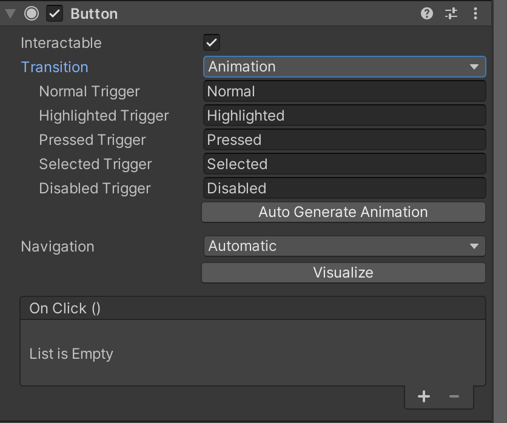

このボタンを押すと、プロジェクト内に `AnimationController` が作成され、その `AnimationController` が `runtimeAnimatorController` に設定された `Animator` がアタッチされる。

ここで作成された `AniamationController` はデフォルトの `State` が **Normal** となっており、**Any State** を通じて他の `State` へ遷移する素朴なアニメーションとなっている。

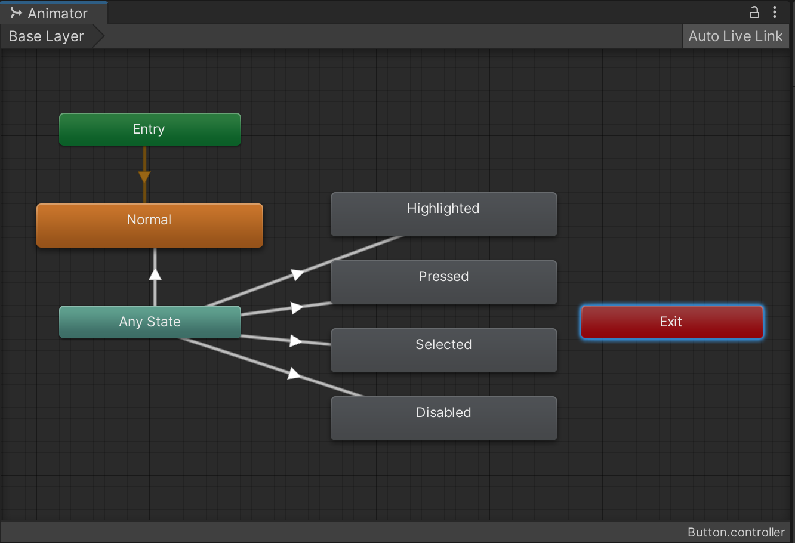

もし、凝ったアニメーションを実現したいのであれば、この `AnimationController` をカスタマイズするべきである。`AnimationController` をカスタマイズすることで、遷移のパターンによってアニメーションを細かく制御できる。たとえば、**Disabled** から他の `State` に遷移したい場合にはアニメーションの時間をゼロにしたいといった要望があるだろう。そういった要望を実現するためには **Any State** 経由ではなく、個別の `State` 間の遷移を定義するようにしたほうがよい。

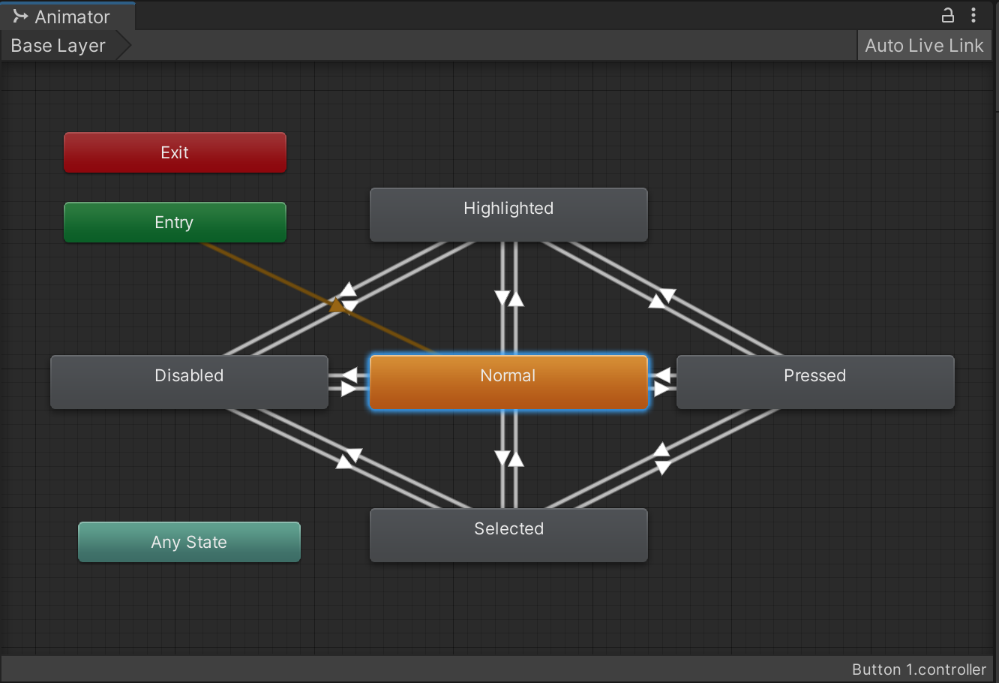

他にも、デフォルトのアニメーションでは **Transition Duration** が `0.25` 秒と、やや長めになっているので、ここもカスタマイズするポイントとなるだろう。

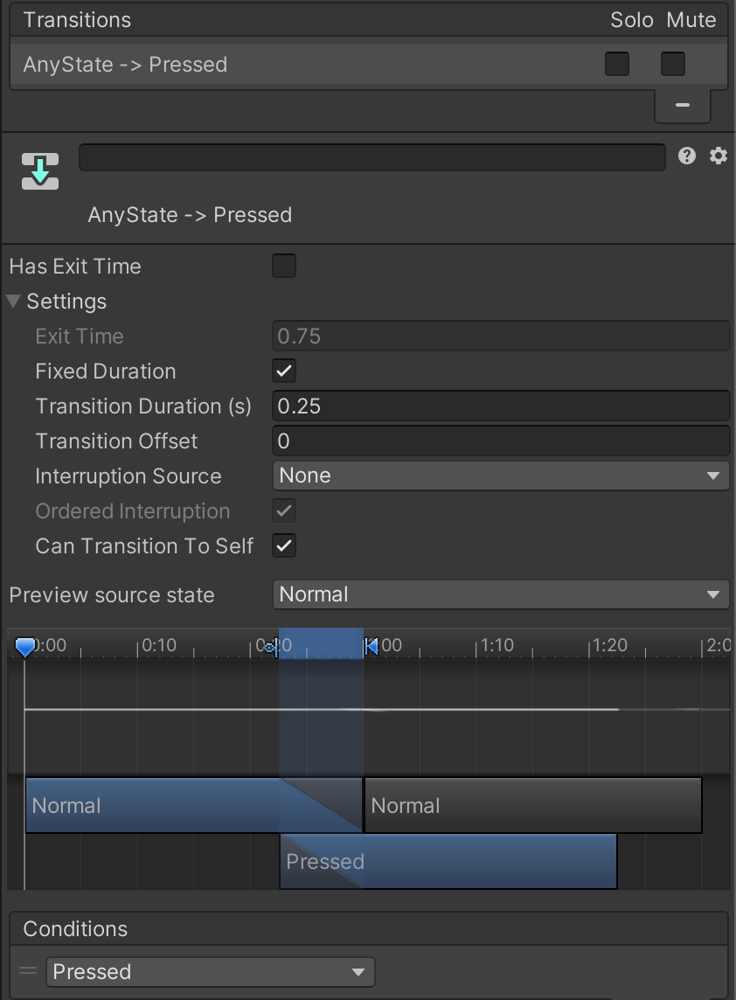

## Button

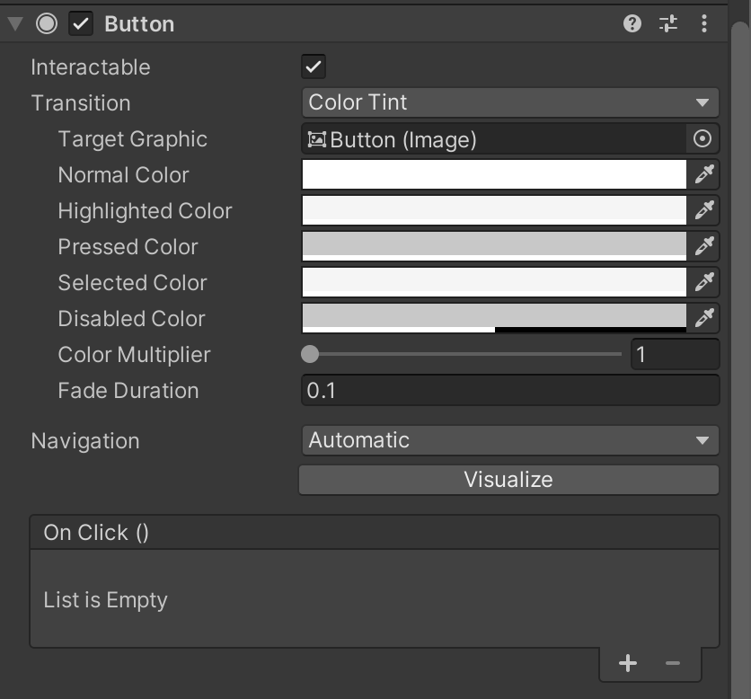

```c#
[AddComponentMenu("UI/Button", 30)]
public class Button : Selectable, IMoveHandler, IPointerDownHandler, IPointerUpHandler, IPointerEnterHandler, IPointerExitHandler, ISelectHandler, IDeselectHandler, IPointerClickHandler, ISubmitHandler, IEventSystemHandler
```

`Button` コンポーネントの基本的な機能のほとんどは `Selectable` コンポーネントで実装されている。追加で実装されているのはクリック時と Submit（決定）時の挙動の制御である。

### Button のプロパティ

#### onClick

```c#
public Button.ButtonClickedEvent onClick { get; set; }
```

ボタンがクリックされた際のコールバックを取得/設定する。以下に使い方のサンプルコードを示す。

```c#
using UnityEngine;
using UnityEngine.UI;

[RequireComponent(typeof(Button))]
public class ButtonClickSample : MonoBehaviour
{
    void Start()
    {
        var button = GetComponent<Button>();

        // クリックされた際のコールバックを追加
        button.onClick.AddListener(() =>
        {
            Debug.Log("ボタンがクリックされた");
        });
    }
}
```

### Button の public メソッド

#### OnPointerClick

```c#
public virtual void OnPointerClick(PointerEventData eventData);
```

ボタンが左または右クリックされた際に `StandAloneInputModule` などから呼ばれる。

このメソッドは `IPointerClickHandler` インターフェースを実装したメソッドである。

マウスの右クリック時にも呼ばれるので、**Pressed** 状態にするなどの処理は行われない。

#### OnSubmit

```c#
public virtual void OnSubmit(BaseEventData eventData);
```

キーボードの Enter キーなどが押された際に `StandAloneInputModule` などから呼ばれる。

このメソッドは `ISubmitHandler` インターフェースを実装したメソッドである。

Submit に対応する入力はデフォルトではキーボードの Enter キーとなっている。Submit に対応する入力を変更する方法は 2 つある。

Axes の Submit のボタンを変更する方法

  1. *Edit -> Project Settings -> Input* を開く。

  2. Axes セクションを展開する。

  3. もし Submit が存在していないなら Size を一つ増やしてセクションを追加して、追加されたセクションの名前を `Submit` にする。

  4. **Submit** の **Positive Button** を `return` から別のもの（たとえば `space`）に変更する。

Input Manager の Submit Button を変更する方法

  1. **Hierarchy** 内の `EventSystem` を選択する。

  2. **Inspector** の `StandaloneInputManager` の **Submit Button** を `Submit` から（Edit -> Project Settings -> Input の Axes セクションで定義されている）別のもの（たとえば `Fire1`）に変更する。

## Toggle

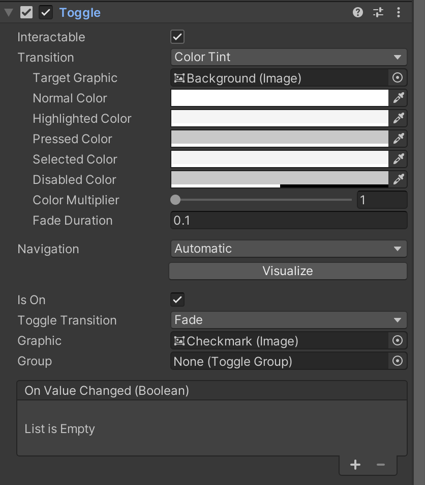

```c#
[AddComponentMenu("UI/Toggle", 31)]
[RequireComponent(typeof(RectTransform))]
public class Toggle : Selectable, IMoveHandler, IPointerDownHandler, IPointerUpHandler, IPointerEnterHandler, IPointerExitHandler, ISelectHandler, IDeselectHandler, IPointerClickHandler, ISubmitHandler, IEventSystemHandler, ICanvasElement
```

`Toggle` コンポーネントは `Selectable` コンポーネントを継承しており、ON / OFF 状態を表示するための `Graphic` を制御する。`Toggle` コンポーネントは非常に癖があり、カスタマイズできない挙動も多いため、このまま使うことはおすすめしない。`Selectable` を継承した独自のトグルのコンポーネントを作成したり、`Button` をカスタマイズしたほうが望む挙動を得られる可能性が高い。

### Toggle の public 変数

#### graphic

```c#
public Graphic graphic;
```

`Toggle` の ON / OFF が切り替わった際に影響を受ける `Graphic` である。

`graphic` は `Toggle` の子の要素である必要はない。切り替わりの際にこの `graphic` 意外に影響を与えたいのであれば、後述する `onValueChanged` にコールバックを設定する必要がある。

#### onValueChanged

```c#
public Toggle.ToggleEvent onValueChanged;
```

`Toggle` の ON / OFF が切り替わった際に呼ばれるコールバックである。

`Toggle.ToggleEvent` は `UnityEvent<bool>` なので `AddListener` で delegate を設定することができる。`onValueChanged` を使って、トグルが切り替わった時にコンソールにログを出力するサンプルを以下に示す。

```c#
using UnityEngine;
using UnityEngine.UI;

[RequireComponent(typeof(Toggle))]
public class ToggleCallbackSample : MonoBehaviour
{
    private void Start()
    {
        var toggle = GetComponent<Toggle>();

        toggle.onValueChanged.AddListener((isOn) =>
        {
            Debug.Log("トグルが切り替わった " + isOn);
        });
    }
}
```

#### toggleTransition

```c#
public Toggle.ToggleTransition toggleTransition;
```

`Toggle` が切り替わった際のトランジション処理を指定する。

トランジション処理は 2 種類あり、一つは即座に `graphic` のアルファ値を `0` から `1` で切り替える `None` であり、もう一つは 1 秒間かけて`graphic` のアルファ値を切り替える `Fade` である。残念ながら `Fade` の 1 秒間という間隔はカスタマイズすることはできない。

`Toggle.ToggleTransition` 列挙型の定義は以下のようになっている。

```c#
/// <summary>
/// トグルが ON または OFF になった際の表示設定
/// </summary>
public enum ToggleTransition
{
    /// <summary>
    /// トグルを即座に表示/非表示にする
    /// </summary>
    None,

    /// <summary>
    /// 徐々にトグルをフェードイン/フェードアウトさせる
    /// </summary>
    Fade
}
```

### Toggle のプロパティ

#### group

```c#
public ToggleGroup group { get; set; }
```

この `Toggle` が属する `ToggleGroup` を取得/設定する。

`ToggleGroup` は複数の `Toggle` をグループ化して一つの `Toggle` のみが ON になるように制御するためのコンポーネントである。`ToggleGroup` については後述する。

#### isOn

```c#
public bool isOn { get; set; }
```

この `Toggle` が ON 状態かどうかを取得/設定する。

ON 状態（`true`）に設定した場合には、以下の特徴的な動作が行われる。

1. `Toggle` が ON に設定されたのであれば `group` に自分が ON になったことを通知する。

2. `Toggle` が OFF に設定された場合でも、`group` の中に ON 状態のものが一つも存在せず ON 状態のトグルが存在することを許さない（`ToggleGroup.allowSwitchOff` が `false`）のであれば、自身を ON 状態にして、`group` に自分が ON になったことを通知する。

3. `toggleTransition` が `ToggleTransition.None` であれば即座に `graphic` のアルファ値を 1（ON 状態）あるいは 0（OFF）に変更する。`toggleTransition` が `ToggleTransition.None` 以外であれば 1 秒間かけて徐々にアルファ値をクロスフェードさせる。

4. `onValueChanged` を呼び出す。

### Toggle の public メソッド

#### OnPointerClick

```c#
public virtual void OnPointerClick(PointerEventData eventData);
```

ボタンが左または右クリックされた際に `StandAloneInputModule` などから呼ばれる。

このメソッドは `IPointerClickHandler` インターフェースを実装したメソッドである。

左クリックであったなら、トグルの状態を切り替える。

#### OnSubmit

```c#
public virtual void OnSubmit(BaseEventData eventData);
```

キーボードの Enter キーなどが押された際に `StandAloneInputModule` などから呼ばれる。

このメソッドは `ISubmitHandler` インターフェースを実装したメソッドである。

このメソッドが呼ばれると、トグルの状態を切り替える。

#### Rebuild

```c#
public virtual void Rebuild(CanvasUpdate executing);
```

Editor 実行時のみ、`Prelayout` ステージの際に `onValueChanged` を呼ぶ。

#### SetIsOnWithoutNotify

```c#
public void SetIsOnWithoutNotify(bool value)
```

`onValueChanged` を呼ばずに ON / OFF 状態を切り替える。

## ToggleGroup

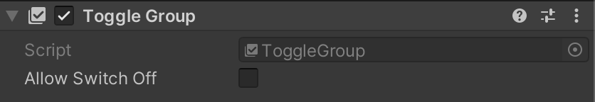

`ToggleGroup` は複数の `Toggle` をまとめ、一つの `Toggle` だけが ON になるように制御するためのコンポーネントである。`ToggleGroup` は必ずしも `Toggle` の親階層にある必要はない。

このコンポーネントは `Linq` を利用しており、それに伴っていくつかのメソッド呼び出しにて *GC Alloc* が発生する。`ToggleGroup` のメソッドは頻繁に呼ばれるメソッドではないはずだが、パフォーマンスには留意すること。

### ToggleGroup のプロパティ

#### allowSwitchOff

```c#
public bool allowSwitchOff { get; set; }
```

ON になっている `Toggle` が一つも存在しない、という状況を許すかどうかを取得/設定する。

このプロパティが `true` であれば現在 ON となっているトグルを押すと OFF になり、一つもトグルが ON になっていないことになる。このプロパティが `false` であれば、現在 ON となっているトグルを押しても状態は変わらない。たとえこのプロパティが `false` であったとしても、シーン読み込み直後あるいはインスタンス化直後に一つも ON となっているトグルが無かった場合にどれか一つを即座に強制的に ON にするようなことはせず、`Start()` あるいは `OnEnable()` で `EnsureValidState()` が呼ばれるまでその状態は是正されない。

### ToggleGroup の public メソッド

#### ActiveToggles

```c#
public IEnumerable<Toggle> ActiveToggles();
```

現在 ON になっている全ての `Toggle` を返す。

ただし、`GameObject` が非アクティブだったり `Toggle` コンポーネントが無効な `Toggle` は含まれない。このメソッドを呼ぶと *GC Alloc* が発生することに注意。

#### AnyTogglesOn

```c#
public bool AnyTogglesOn();
```

ON になっている `Toggle` が存在するかを返す。

#### EnsureValidState

```c#
public void EnsureValidState();
```

この `ToggleGroup` が適切な状態になるようにする。適切な状態にする、とは以下の処理となっている。

1. もし `allowSwitchOff` が `false` であるのにも関わらず ON となっている `Toggle` が一つも存在していないのであれば、最初の `Toggle` を ON にする。

2. 複数の `Toggle` が ON となっているのであれば、ON となっている 2 番目以降の `Toggle` を OFF にする。

このメソッドは `Start()` あるいは `OnEnable()` から呼ばれる。逆に言えば、それまでは適切ではない状態である可能性がある。このメソッドを呼ぶと *GC Alloc* が発生することに注意。

#### GetFirstActiveToggle

```c#
public Toggle GetFirstActiveToggle();
```

ON となっている `Toggle` を探し、一番最初に見つかったものを返す。

このメソッドを呼ぶと *GC Alloc* が発生することに注意。

#### NotifyToggleOn

```c#
public void NotifyToggleOn(Toggle toggle, bool sendCallback = true);
```

引数で与えられた `Toggle` が ON になったことを `ToggleGroup` に通知する。

まず `toggle` がこの `ToggleGroup` に属しているのかのチェックが行われ、違うのであれば `ArgumentException` 例外を投げる。さらに `sendCallback` が `true` であれば、それ以外の `Toggle` に対して `onValueChanged` が呼ばれる。

#### RegisterToggle

```c#
public void RegisterToggle(Toggle toggle);
```

この `ToggleGroup` に `toggle` を登録する。

登録した直後は `ToggleGroup` が適切な状態ではない可能性があるため `NotifyToggleOn()` あるいは `EnsureValidState()` を呼ぶ必要がある。

#### UnregisterToggle

```c#
public void UnregisterToggle(Toggle toggle);
```

この `ToggleGroup` から `toggle` を削除する。

削除した直後は `ToggleGroup` が適切な状態ではない可能性があるため `NotifyToggleOn()` あるいは `EnsureValidState()` を呼ぶ必要がある。

#### SetAllTogglesOff

```c#
public void SetAllTogglesOff(bool sendCallback = true);
```

全ての `Toggle` を OFF にする。

`sendCallback` が `true` であれば、各 `Toggle` の `onValueChanged` が呼ばれる。

## Slider

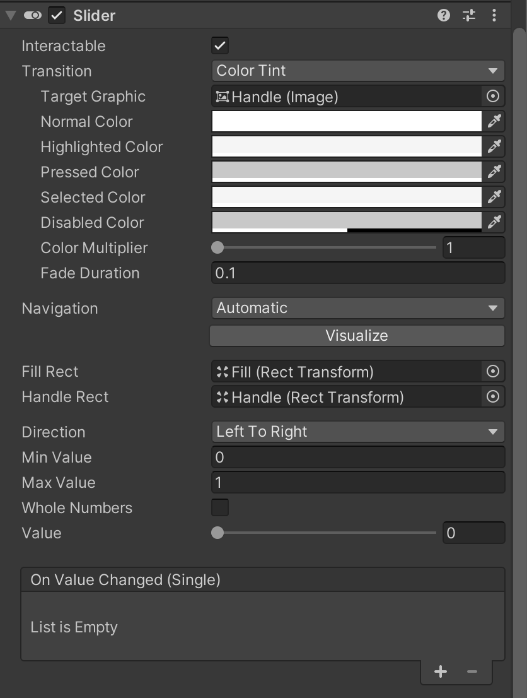

```c#
[AddComponentMenu("UI/Slider", 33)]
[ExecuteAlways]
[RequireComponent(typeof(RectTransform))]
public class Slider : Selectable, IMoveHandler, IPointerDownHandler, IPointerUpHandler, IPointerEnterHandler, IPointerExitHandler, ISelectHandler, IDeselectHandler, IDragHandler, IInitializePotentialDragHandler, IEventSystemHandler, ICanvasElement
```

`Slider` は最小値と最大値の間を移動できるスライダーを実装するためのコンポーネントである。

`Slider` コンポーネントは `Selectable` コンポーネントを継承している。`Slider` はフィルとハンドルを制御する。フィルは最小値から現在地までを覆う。フィルとハンドルの `RectTransform` は `Slider` によって変更される。フィルとハンドルは `Slider` の直下の子または間接的な子である。`Slider` の値が変更された際には `onValueChanged` に登録されたコールバックが呼ばれる。

### Slider のプロパティ

#### direction

```c#
public Slider.Direction direction { get; set; }
```

スライダーの方向を取得/設定する。

方向は `Slider.Direction` 列挙型として、左から右、右から左、下から上、上から下の 4 方向が定義されている。

```c#
/// <summary>
/// 4 つの方向うち 1 つを示す設定
/// </summary>
public enum Direction
{
    /// <summary>
    /// 左から右
    /// </summary>
    LeftToRight,

    /// <summary>
    /// 右から左
    /// </summary>
    RightToLeft,

    /// <summary>
    /// 下から上
    /// </summary>
    BottomToTop,

    /// <summary>
    /// 上から下
    /// </summary>
    TopToBottom,
}
```

たとえば `LeftToRight`（左から右）の場合、左が最小値で右が最小値となる。

#### fillRect

```c#
public RectTransform fillRect { get; set; }
```

最小値から現在地までを覆うフィルの `RectTransform` を取得/設定する。

スライダーの値によって `RectTransform` の `anchorMax` あるいは `anchorMin` が変わり、それによってフィルの見た目が変わる。`Direction` が `LeftToRight` または `BottomToTop` であれば `anchorMax` が変わり、 `Direction` が `RightToLeft` または `TopToBottom` であれば `anchorMin` が変わるようになっている。

#### handleRect

```c#
public RectTransform handleRect { get; set; }
```

ハンドルの `RectTransform` を取得/設定する。

ハンドルはあくまで表示上の UI 要素であり、ドラッグ判定はあくまで `Slider` 本体で行われる。

#### maxValue

```c#
public float maxValue { get; set; }
```

スライダーの最大値を取得/設定する。

デフォルト値は `1` である。

#### minValue

```c#
public float minValue { get; set; }
```

スライダーの最大値を取得/設定する。

デフォルト値は `0` である。

#### normalizedValue

```c#
public float normalizedValue { get; set; }
```

スライダーの値を `0` から `1` の範囲に正規化したものを取得/設定する。

取得だけではなく設定も可能であることに注目しよう。取得には `Mathf.InverseLerp()` が使われ、設定には `Mathf.Lerp()` が使われる。

#### onValueChanged

```c#
public Slider.SliderEvent onValueChanged { get; set; }
```

スライダーが変更された際に呼ばれるコールバックを取得/設定する。

`Slider.SliderEvent` は `UnityEvent<float>` である。

```c#
public class SliderEvent : UnityEvent<float> {}
```

`onValueChanged` を使って、スライダーが変更された時にコンソールにログを出力するサンプルを以下に示す。

```c#
using UnityEngine;
using UnityEngine.UI;

[RequireComponent(typeof(Slider))]
public class SliderCallbackSample : MonoBehaviour
{
    private void Start()
    {
        var slider = GetComponent<Slider>();

        slider.onValueChanged.AddListener((value) =>
        {
            Debug.Log("スライダーが変更された" + value);
        });
    }
}
```

#### value

```c#
public virtual float value { get; set; }
```

現在のスライダーの値を取得/設定する。

取得の際には `wholeNumbers` が `false` であれば値そのままが返されるが、`wholeNumbers` が `true` であれば `Mathf.Round()` であれば整数値に丸めた値が返される。

UI の操作によってスライダーが動かされた際に `OnMove()` コールバックが呼ばれ、その中で `value` が変更される。

#### wholeNumbers

```c#
public bool wholeNumbers { get; set; }
```

スライダーの値を整数のみに制限するか否かを設定する。

デフォルト値は `false` である。

### Slider の public メソッド

#### FindSelectableOnDown

```c#
public override Selectable FindSelectableOnDown();
```

ナビゲーションのために、下にある `Selectable` オブジェクトを探して返す。

このメソッドは `Selectable` コンポーネントで定義された `FindSelectableOnDown` のオーバーライドである。

`navigation` が `Navigation.Mode.Automatic` かつ `direction` が垂直方向（`BottomToTop` または `TopToBottom`) であれば（上下キー操作ではスライダーを上下させたいので）`null` が返される。そうでなければ `Selectable.FindSelectableOnDown()` の結果を返す。

#### FindSelectableOnLeft

```c#
public override Selectable FindSelectableOnLeft();
```

ナビゲーションのために、左にある `Selectable` オブジェクトを探して返す。

このメソッドは `Selectable` コンポーネントで定義された `FindSelectableOnLeft` のオーバーライドである。

`navigation` が `Navigation.Mode.Automatic` かつ `direction` が水平方向（`LeftToRight` または `RightToLeft`) であれば（左右キー操作ではスライダーを左右させたいので）`null` が返される。そうでなければ `Selectable.FindSelectableOnLeft()` の結果を返す。

#### FindSelectableOnRight

```c#
public override Selectable FindSelectableOnRight();
```

ナビゲーションのために、右にある `Selectable` オブジェクトを探して返す。

このメソッドは `Selectable` コンポーネントで定義された `FindSelectableOnRight` のオーバーライドである。

`navigation` が `Navigation.Mode.Automatic` かつ `direction` が水平方向（`LeftToRight` または `RightToLeft`) であれば（左右キー操作ではスライダーを左右させたいので）`null` が返される。そうでなければ `Selectable.FindSelectableOnRight()` の結果を返す。

#### FindSelectableOnUp

```c#
public override Selectable FindSelectableOnUp();
```

ナビゲーションのために、上にある `Selectable` オブジェクトを探して返す。

このメソッドは `Selectable` コンポーネントで定義された `FindSelectableOnDown` のオーバーライドである。

`navigation` が `Navigation.Mode.Automatic` かつ `direction` が垂直方向（`BottomToTop` または `TopToBottom`) であれば（上下キー操作ではスライダーを上下させたいので）`null` が返される。そうでなければ `Selectable.FindSelectableOnDown()` の結果を返す。

#### OnDrag

```c#
public virtual void OnDrag(PointerEventData eventData);
```

ドラッグされた際に `StandAloneInputModule` などから呼ばれる。

このメソッドは `IDragHandler` インターフェースを実装したメソッドである。
`eventData` から受け取った現在のマウスあるいは指の位置からスライダーの値を算出して設定する。

#### OnInitializePotentialDrag

```c#
public virtual void OnInitializePotentialDrag(PointerEventData eventData);
```

ドラッグが検知されて開始する直前に `StandAloneInputModule` から呼ばれる。

このメソッドは `IInitializePotentialDragHandler` インターフェースを実装したメソッドである。

ここでは `eventData` の `useDragThreshold` を `false` にしている。これにより、マウスや指の前回の位置と今回の位置の距離が一定以下であってもドラッグが開始されたと判定されるようになっている。もし `useDragThreshold` が `true` であれば `10` ピクセル以下の動きではドラッグ開始判定とはならない。

なお、この `10` ピクセルというドラッグ開始判定の閾値は `EventSystem.current.pixelDragThreshold` で変更することができる。

```c#
EventSystem.current.pixelDragThreshold = 20;
```

ただし、この設定は現在の `EventSystem` 全体に影響が及ぶので注意。

#### OnMove

```c#
public override void OnMove(AxisEventData eventData);
```

キー入力による上下左右移動の際に `StandAloneInputModule` などから呼ばれる。

このメソッドは `Selectable` コンポーネントで定義された（`IMoveHandler` インターフェースを実装した）`OnMove` のオーバーライドである。

`eventData` から移動方向を受け取り、`direction` の方向と一致していればスライダーの値を変更するようになっている。

#### OnPointerDown

```c#
public override void OnPointerDown(PointerEventData eventData);
```

タッチパネルで指がタッチされたりマウスが押されたりした際に `StandAloneInputModule` などから呼ばれる。

このメソッドは `Selectable` コンポーネントで定義された（`IPointerDownHandler` インターフェースを実装した）メソッドである。

まず `Selectable.OnPointerDown()` が呼ばれる。次に、押された位置がハンドルの内側であれば、そこをドラッグの起点位置とする。押された位置がハンドルの外側であれば、即座に押された位置にスライダーを移動させる。

#### Rebuild

```c#
public virtual void Rebuild(CanvasUpdate executing);
```

Editor 実行時のみ、`Prelayout` ステージの際に `onValueChanged` を呼ぶ。

#### SetDirection

```c#
public void SetDirection(Slider.Direction direction, bool includeRectLayouts);
```

スライダーの方向を示す `direction` を設定する。

`includeRectLayouts` が `true` であれば水平方向から垂直方向（あるいはその逆）に変わった際に `RectTransform` のサイズやアラインメントも入れ替え、子の要素についても同様に入れ替える。`includeRectLayouts` が `false` であればレイアウトの調整は特に行われない。

#### SetValueWithoutNotify

```c#
public virtual void SetValueWithoutNotify(float input);
```

`onValueChanged` を呼ばずにスライダーの値を変更する。

## Dropdown

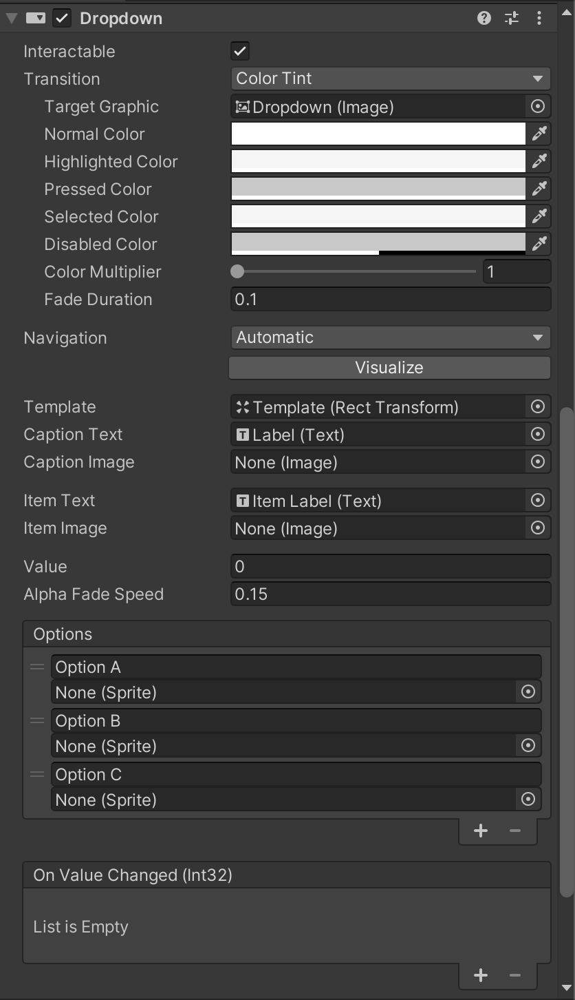

```c#
AddComponentMenu("UI/Dropdown", 35)]
[RequireComponent(typeof(RectTransform))]
public class Dropdown : Selectable, IMoveHandler, IPointerDownHandler, IPointerUpHandler, IPointerEnterHandler, IPointerExitHandler, ISelectHandler, IDeselectHandler, IPointerClickHandler, ISubmitHandler, ICancelHandler, IEventSystemHandler
```

`Dropdown` はクリックされると選択肢のリストが表示されるドロップダウンメニューを実装するためのコンポーネントである。

Editor の *UI -> Dropdown* でドロップダウンメニューを作成すると `Dropdown` および `Image` がアタッチされた `GameObject` が生成され、さらにその下に表示文字列の `Label`、下矢印画像の `Arrow`、メニューが開いた際の UI 要素の元となる `Template` が生成される。

`Template` には `ScrollRect` と `Scrollbar` が子として付いているが、メニューリストの個数が少ないのであればスクロールさせる必要は無い。各項目の `GameObject` には `Toggle` がアタッチされている必要がある。

ドロップダウンメニューを開くと、`Template` を元に *Dropdown List* という名前のオブジェクトがインスタンス化され、各項目がその子（孫あるいはひ孫）としてインスタンス化される。各項目には `DropdownItem` というコンポーネントがアタッチされる。

*Dropdown List* オブジェクトには `Canvas` コンポーネント（および `CanvasGroup` コンポーネント）がアタッチされ、サブ Canvas となる。このサブ Canvas は `overrideSorting` に `true` が設定され、`sortingOrder` には `30000` が設定される。同時に *Blocker* という Canvas が生成され、ドロップダウンメニューよりも下に存在する UI 要素がタッチされないようになる。この *Blokcer* の `sortingOrder` は *Dropdown List* Canvas の `sortingOrder - 1` の値、つまり `29999` が設定される。

*Dropdown List* の `Canvas` の `sortingOrder` の `30000` という値はハードコーディングされているが `Dropdown` を継承したコンポーネントで `CreateBlocker()` および `CreateDropdownList()` を override することでカスタマイズすることができる。

```c#
using UnityEngine;
using UnityEngine.UI;

#if UNITY_EDITOR
using UnityEditor;
using UnityEditor.UI;
#endif

// Inspector から customSortingOrder を変更できるようにする
public class DropdownCustomSortingOrder : Dropdown
{
    public int customSortingOrder = 10000;

    protected override GameObject CreateDropdownList(GameObject template)
    {
        var dropdownlistGO = base.CreateDropdownList(template);

        dropdownlistGO.GetComponent<Canvas>().sortingOrder = customSortingOrder;

        return dropdownlistGO;
    }

    protected override GameObject CreateBlocker(Canvas rootCanvas)
    {
        var blockerGO = base.CreateBlocker(rootCanvas);

        blockerGO.GetComponent<Canvas>().sortingOrder = customSortingOrder - 1;

        return blockerGO;
    }
}

#if UNITY_EDITOR
[CustomEditor(typeof(DropdownCustomSortingOrder), true)]
[CanEditMultipleObjects]
public class DropdownCustomSortingOrderEditor : DropdownEditor
{
    private SerializedProperty customSortingOrder;

    protected override void OnEnable()
    {
        base.OnEnable();
        customSortingOrder = serializedObject.FindProperty("customSortingOrder");
    }

    public override void OnInspectorGUI()
    {
        base.OnInspectorGUI();
        EditorGUILayout.Space();

        serializedObject.Update();
        EditorGUILayout.PropertyField(customSortingOrder);
        serializedObject.ApplyModifiedProperties();
    }
}
#endif
```

### Dropdown の プロパティ

#### alphaFadeSpeed

```c#
public float alphaFadeSpeed { get; set; }
```

ドロップダウンリストが表示/非表示になる際のフェードにかかる時間を取得/設定する。

デフォルト値は `0.15` 秒となっている。キビキビとした動きにしたいのであれば `0` 秒に設定しておくのも良いだろう。

#### captionImage

```c#
public Image captionImage { get; set; }
```

現在選択されている項目に対応した背景画像やアイコン画像を表示するための `Image` を取得/設定する。

デフォルト値は `null` である。

各項目ごとに `options` で指定した `Sprite` がこの `Image` に設定される。Play モードで実行すると `captionImage` の `sprite` が書き変わってしまい、Play 停止後も元の値に戻らないなどの癖のある挙動があるため、あまり使われていない。

#### captionText

```c#
public Text captionText { get; set; }
```

現在選択されている項目に対応した文字列を表示するための `Text` を取得/設定する。

各項目に対応した文字列は `options` で指定する。実はこのプロパティは `null` でも動作自体には問題無い。

#### itemImage

```c#
public Image itemImage { get; set; }
```

ドロップダウンリストを展開した際の各項目に対応した背景画像やアイコン画像を表示するための `Image` を取得設定する。デフォルト値は `null` である。

#### itemText

```c#
public Text itemText { get; set; }
```

ドロップダウンリストを展開した際の各項目に対応した文字列を表示するための `Text` を取得/設定する。

#### onValueChanged

```c#
public Dropdown.DropdownEvent onValueChanged { get; set; }
```

ドロップダウンメニューの選択項目が変更された際に呼ばれるコールバックを取得/設定する。

`Dropdown.DropdownEvent` は `UnityEvent<int>` である。

```c#
public class DropdownEvent : UnityEvent<int> {}
```

`onValueChanged` を使って、ドロップダウンメニューの選択項目が変更された時にコンソールにログを出力するサンプルを以下に示す。

```c#
using UnityEngine;
using UnityEngine.UI;

[RequireComponent(typeof(Dropdown))]
public class DropdownCallbackSample : MonoBehaviour
{
    private void Start()
    {
        var dropdown = GetComponent<Dropdown>();

        dropdown.onValueChanged.AddListener((index) =>
        {
            Debug.LogFormat("{0} 番目の項目が選択された", index);
        });
    }
}
```

#### options

```c#
public List<Dropdown.OptionData> options { get; set; }
```

ドロップダウンメニューの各項目の文字列と画像のリストを取得/設定する。

`Dropdown.OptionData` は以下のように定義されている。

```c#
public class OptionData
{
    [SerializeField]
    private string m_Text;
    [SerializeField]
    private Sprite m_Image;

    /// <summary>
    /// このオプションの文字列
    /// </summary>
    public string text  { get { return m_Text; }  set { m_Text = value;  } }

    /// <summary>
    /// このオプションの Sprite
    /// </summary>
    public Sprite image { get { return m_Image; } set { m_Image = value; } }
    ...
```

スクリプトから項目を追加/削除したい場合のコードは以下のようになる。

```c#
using UnityEngine;
using UnityEngine.UI;

[RequireComponent(typeof(Dropdown))]
public class DropdownOptionsCustom : MonoBehaviour
{
    // 各項目用の画像が Inspector から設定されているものとする
    public Sprite[] sprites = new Sprite[3];

    void Start()
    {
        var dropdown = GetComponent<Dropdown>();

        // 既存の項目を削除する
        dropdown.ClearOptions();

        // 項目を追加していく
        dropdown.options.Add(new Dropdown.OptionData
        {
            text = "Option1",
            image = sprites[0],
        });
        dropdown.options.Add(new Dropdown.OptionData
        {
            text = "Option2",
            image = sprites[1],
        });
        dropdown.options.Add(new Dropdown.OptionData
        {
            text = "Option3",
            image = sprites[2],
        });

        // 項目が変更されたことを知らせる
        dropdown.RefreshShownValue();
    }
}
```

#### template

```c#
public RectTransform template { get; set; }
```

ドロップダウンメニューリストのインスタンスを生成するための生成元となる `GameObject` の `RectTransform` を取得/指定する。

この `GameObject` より下の階層に `Toogle` がアタッチされたオブジェクトがあり、そのオブジェクトがに `DropdownItem` がアタッチされ、それがインスタンス化されて実行時の項目となる。

デフォルトのテンプレートの下には `ScrollRect` がアタッチされているが、これは必須ではない。また、マスク用に `Mask` コンポーネントが使われているので適宜 `Rectmask2D` に置き換えたほうが良いだろう。

#### value

```c#
public int value { get; set; }
```

現在選択されているドロップダウンメニューの項目のインデックスを取得/設定する。

このメソッド経由でインデックスを変更した際には、`onValueChanged` に設定したコールバック関数が呼ばれる。コールバック関数を呼びたくないのであれば、`SetValueWithoutNotify()` 経由で値を設定する必要がある。

### Dropdown の public メソッド

#### AddOptions

```c#
public void AddOptions(List<string> options);
public void AddOptions(List<Sprite> options);
public void AddOptions(List<Dropdown.OptionData> options);
```

ドロップダウンメニューの各項目を追加する。

文字列のみ渡す/画像のみ渡す/両方を渡す、の 3 種類のオーバーロードが存在する。

```c#
using UnityEngine;
using UnityEngine.UI;

[RequireComponent(typeof(Dropdown))]
public class DropdownOptionsCustomAdd : MonoBehaviour
{
    // 各項目用の画像が Inspector から設定されているものとする
    public Sprite[] sprites = new Sprite[2];

    void Start()
    {
        var dropdown = GetComponent<Dropdown>();

        // 既存の項目を削除する
        dropdown.ClearOptions();

        // 文字列だけの項目を追加
        dropdown.AddOptions(new List<string>()
        {
            "string 1",
        });

        // 画像だけの項目を追加
        dropdown.AddOptions(new List<Sprite>()
        {
            sprites[0],
        });

        // 文字列と画像の項目を追加
        dropdown.AddOptions(new List<Dropdown.OptionData>()
        {
            new Dropdown.OptionData("string 2", sprites[1])
        });
    }
}
```

#### ClearOptions

```c#
public void ClearOptions();
```

ドロップダウンメニューリストの項目を全削除する。

削除後は、`value` の値は `0` にリセットされる。

#### Hide

```c#
public void Hide();
```

開いているドロップダウンメニューリストを閉じる。

ドロップダウンメニューリストが閉じると *Dropdown List* オブジェクトは破棄される。

#### OnCancel(BaseEventData)

```c#
public virtual void OnCancel(BaseEventData eventData);
```

ドロップダウンメニューリストを開いている状態で他の箇所をタッチしたり Esc キーを押したりするなどして選択がキャンセルされた際に `StandAloneInputModule` などから呼ばれる…であるはずだが、残念ながら実際にはこのメソッドは呼ばれない。

実際には `DropdownItem` の `OnCancle()` か、*Blocker* にアタッチされた `Button` コンポーネントの `onClick()` 経由で `Hide()` が呼ばれることでドロップダウンメニューリストが閉じる処理が行われる。

`Hide()` は virtual メソッドではないので、ロップダウンメニューリストが閉じる際にコールバックを仕込むためには `Hide()` から呼ばれる protected メソッドである `DestroyDropdownList()` を override することになるだろう。

```c#
using UnityEngine;
using UnityEngine.UI;

public class DropdownCustomOnDestroyDropdownList : Dropdown
{
    protected override void DestroyDropdownList(GameObject dropdownList)
    {
        base.DestroyDropdownList(dropdownList);

        Debug.Log("ドロップダウンメニューリストが閉じられた");
    }
}
```

ただし、`DestroyDropdownList()` は項目が選択された場合も呼ばれるので、その直前に呼ばれる `onValueChanged` コールバックと協調して、選択されたのかキャンセルされたのかを判定する必要がある。

#### OnPointerClick

```c#
public virtual void OnPointerClick(PointerEventData eventData);
```

ボタンが左または右クリックされた際に `StandAloneInputModule` などから呼ばれる。

このメソッドは `IPointerClickHandler` インターフェースを実装したメソッドである。ここでは `Show()` が呼ばれるだけである。

#### OnSubmit

```c#
public virtual void OnSubmit(BaseEventData eventData);
```

キーボードの Enter キーなどが押された際に `StandAloneInputModule` などから呼ばれるコールバック。

このメソッドは `ISubmitHandler` インターフェースを実装したメソッドである。ここでは `Show()` が呼ばれるだけである。

#### RefreshShownValue()

```c#
public void RefreshShownValue();
```

`options` や `captionImage` や `captionText` を変更した際に呼ぶメソッドである。

各プロパティ経由あるいは `ClearOptions()` や `AddOptions()` 経由で変更を行った際は自動的にこのメソッドが呼ばれるので、通常は意識する必要はない。しかしながら、別のなんらかの方法（外部から Inspector 経由など）でそれらを変更した場合には明示的にこのメソッドを呼ぶ必要がある。

#### SetValueWithoutNotify

```c#
public void SetValueWithoutNotify(int input);
```

`onValueChanged` を呼ばずに選択している項目のインデックスを変更する。

#### Show()

```c#
public void Show();
```

ドロップダウンメニューリストを表示する。

このメソッドで行われる処理内容は非常に多いが、以下に処理内容をまとめた。

- テンプレートを適切に設定する。

  - `Toggle` コンポーネントを持った子オブジェクトを探し、それをリスト項目用オブジェクトとする。

  - リスト項目用オブジェクトに `DropdownItem` コンポーネントをアタッチする。

  - テンプレートに `Canvas` コンポーネントをアタッチしてサブ Canvas とする。

    - サブ Canvas の `sortingOrder` を `30000` に設定する。

    - 親 Canvas と同じ Raycaster を設定する。

    - `CanvasGroup `を設定する。

    - テンプレートを非アクティブにする。

- テンプレートを元に *Dropdown List* オブジェクトをインスタンス化する。

- *Dropdown List* オブジェクトの子としてインスタンス化された各項目の *DropdownItem* コンポーネントの `Toggle` を `value` に等しいインデックスのものだけ選択状態とする。

- ドロップダウンメニューリストが開かれる方向を決定する。たとえば、縦に開かれるドロップダウンメニューリストであれば、オブジェクトが Canvas の上のほうに位置していればリストは下に開かれ、逆に Canvas の下側に位置していればリストは上に開かれる。

- `alphaFadeSpeed` で定義された時間でフェードインアニメーションを開始する

- *Blocker* オブジェクトを生成する。

## InputField

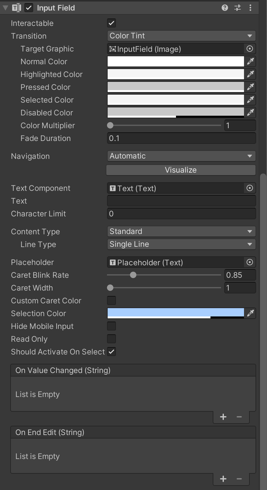

```c#
[AddComponentMenu("UI/Input Field", 31)]
public class InputField : Selectable, IMoveHandler, IPointerDownHandler, IPointerUpHandler, IPointerEnterHandler, IPointerExitHandler, ISelectHandler, IDeselectHandler, IUpdateSelectedHandler, IBeginDragHandler, IDragHandler, IEndDragHandler, IPointerClickHandler, ISubmitHandler, IEventSystemHandler, ICanvasElement, ILayoutElement
```

`InputField` はテキストを編集可能にするためのコンポーネントである。

他の UI コンポーネントと違い、`InputField` 自身は表示される要素ではなく表示される UI コンポーネントと組み合わせて使う。

`InputField` コンポーネントは既存の `Text` にアタッチすることができる。`InputField` コンポーネントをアタッチしたら、`InputField` の `textComponent` プロパティに自分自身を設定してあげれば良い。

ユーザーが `InputField` に入力すると `Text` の `text` プロパティが変更される。

リッチテキストは意図的にサポートされていない。実際のところ、`InputField` にリッチテキストのマークアップを入力するとそのマークアップは即座に適用されるのだが、その後にマークアップを編集したり削除することができなくなる。なのでサポートされていないということになる。

`InputField` のテキストを取得するには、表示している `Text` コンポーネントの `text` プロパティではなく `InputField` 自身の `text` プロパティにアクセスすべきである。なぜなら `Text` コンポーネントの `text` はテキストが切り落とされたり、パスワード用に "*" になったりするからである。

### キャレット

`InputField` の子としてキャレット（caret）というオブジェクトが生成される。キャレットは入力しようとする文字の位置をわかりやすくするために点滅するオブジェクトである。なお、スマートフォンの場合、入力キーボードでカーソル位置が制御されているのであればキャレットは表示されない。

キャレットはリビルドの `CanvasUpdate.LatePreRender` ステージで作成される。新しい `GameObject` が作成され、`CanvasRenderer` と `LayoutElement` コンポーネントがアタッチされる。キャレットのオブジェクトの名前は `InputField` の `GameObject` の名前に `" Input Caret"` を加えたものになる。

`CanvasRenderer` のマテリアルにはデフォルトマテリアル（`Graphic.defaultGraphicMaterial`）、テクスチャには `Texture2D.whiteTexture` が設定される。

`LayoutElement` の `ignoreLayout` は `true` に設定される。これによって、仮にキャレットが何かの `LayoutGroup` の下にあった場合でも、キャレットの位置を自由に変更することができる。

キャレットの `RectTransform` は `textComponent` から `localPosition` と `localRotation` と `localScale` と `anchorMin` と `anchorMax` と `anchoredPosition` と `sizeDelta` と `pivot` をコピーされ、キャレットと `textComponent` の位置が同じになる。

### InputField と日本語入力

MacOS X ではデフォルトの `InputField` では日本語入力を行うことができない。`lineType` プロパティを `InputField.LineType.MultiLineNewline` に設定することで日本語入力が可能になる。

また、WebGL ではいかなる設定でも `InputField` で日本語入力を行うことができない。これについては *WebGLNativeInputField* というライブラリが Unity Japan から提供されており、`InputField` の代わりに `ebGLNativeInputField` コンポーネントを利用することで解決できる。

<https://github.com/unity3d-jp/WebGLNativeInputField/>

### InputField のプロパティ

#### asteriskChar

```c#
public char asteriskChar { get; set; }
```

パスワードの表示につかうアスタリスクの文字を取得/設定する。

デフォルト値は `'*'` である。

#### caretBlinkRate

```c#
public float caretBlinkRate { get; set; }
```

キャレットの点滅レートを取得/設定する。

1 秒間に点滅するサイクルの数を指定することになる。デフォルト値は `0.85f` であり、最小値は `0`、最大値は `4` である。

#### caretColor

```c#
public Color caretColor { get; set; }
```

キャレットの色を取得/設定する。

デフォルトの色は `Color(50f / 255f, 50f / 255f, 50f / 255f, 1f)` である。なお、このプロパティは `customCaretColor` プロパティを `true` に設定した場合にのみ有効である。`customCaretColor` プロパティのデフォルト値は `false` なので `true` に変更するのを忘れないようにすること。`customCaretColor` プロパティが `false` の場合はキャレットの色は `textComponent.color` となる。

ここで指定される色は `UIVertex` の `color` である。

#### caretPosition

```c#
public int caretPosition { get; set; }
```

現在のキャレット位置を取得/設定する。

この位置は選択範囲の最後の位置でもある。なお、範囲選択中にこのプロパティを設定すると、範囲選択は解除される。

キャレット位置の更新はリビルドの `CanvasUpdate.LatePreRender` か、あるいは `LateUpdate` という遅いタイミングで行われる。

#### caretWidth

```c#
public int caretWidth { get; set; }
```

キャレットのピクセル数での幅を設定/取得する。デフォルト値は `1` である。最小値は `1` で、最大値は `5` である。

#### characterLimit

```c#
public int characterLimit { get; set; }
```

`InputField` に入力できる文字数の最大値を取得/設定する。デフォルト値は `0` だが、`0` に設定すると最大値は無限となる。

#### characterValidation

```c#
public InputField.CharacterValidation characterValidation { get; set; }
```

文字を入力した際に行うバリデーションの種類を取得/設定する。

`InputField.CharacterValidation` は以下のように定義されている。

```c#
/// <summary>
/// 文字列に追加できる文字の種類
/// </summary>
/// <remarks>
/// 文字のバリデーションは文字列全体に対しては行わない。あくまで追加しようとしている文字に対してのみバリエーションが行われる。
/// </remarks>
public enum CharacterValidation
{
    /// <summary>
    /// バリエーション無し。あらゆる入力が有効となる。
    /// </summary>
    None,

    /// <summary>
    /// （正負の）整数を許可する。
    /// <remarks>
    /// 0 から 9 までの数字と - (ダッシュ/マイナス符号)が許される。ダッシュは最初の文字でのみ許される。
    /// <remarks>
    /// </summary>
    Integer,

    /// <summary>
    /// 十進数の数を許可する。
    /// </summary>
    /// <remarks>
    /// 0 から 9 までの数字と .（ドット）と -（ダッシュ/マイナス符号）が許可される。ダッシュは最初の文字でのみ許される。ドットは文字列内で 1 つのみ許される。
    /// </remarks>
    Decimal,

    /// <summary>
    /// A から Z までの文字と、a から z までの文字と、0 から 9 までの数字が許可される。
    /// </summary>
    Alphanumeric,

    /// <summary>
    /// 名前のみが許可され、キャピタリゼーション（頭文字を大文字にすること）を強制する
    /// </summary>
    /// <remarks>
    /// 文字とスペースと ' （アポストロフィー）が許可される。スペースの後の文字は自動的に大文字に変換される。スペースの後ではない文字は自動的に小文字に変換される。アポストロフィーの後の文字は大文字でも小文字でもよい。アポストロフィーは文字列内で 1 つのみ許可される。複数のスペースを並べることは許可されない。
    ///
    /// .Net の Char.Isletter で実装されている Unicode 文字であれば文字であるとみなされる。
    /// </remarks>
    Name,

    /// <summary>
    /// email アドレスで使われる文字であれば許可される。
    /// Allows the characters that are allowed in an email address.
    /// </summary>
    /// <remarks>
    /// A から Z、a から z、0 から 9、@、.(dot)、!、#、$、%、&、'、*、+、-、/、=、?、^、_、`、{、|、}、~　が許可される。
    ///
    /// @ は文字列中に 1 つのみ許可される。複数のドットを並べることは許可されない。文字のバリデーションは文字列全体ではなく、追加しようとしている文字単位で行われる。RFC にのっとった正確なバリデーションではないことに注意。
    /// </remarks>
    EmailAddress
}
```

バリデーションの処理は `Validate()` という protected メソッドの中で行われる。自前でバリデーションしたいのであれば `onValidateInput` プロパティに自前のバリデーションメソッドを渡す必要がある。

#### contentType

```c#
public InputField.ContentType contentType { get; set; }
```

入力するテキストの種類を取得/設定する。`contentType` を設定すると、その値に応じて `InputType` と `CharacterValidation` と `LineType` と `TouchScreenKeyboardType` がそれぞれ適切に設定される。`InputField.ContentType` は以下のように定義されている。

```c#
/// <summary>
/// ContentType を設定することは、InputType と CharacterValidation と LineType と TouchScreenKeyboardType の組み合わせを設定するためのショートカットとして機能する。
/// </summary>
/// <remarks>
/// ContentType が影響を与えるのは、文字のバリデーション、（スクリーン上のキーボードがあるプラットフォームで）使われるキーボードの種類、複数の行を受け入れるか否か、（入力のオートコレクトがあるプラットフォームで）テキストがオートコレクトされるかどうか、文字がそのまま表示されないパスワードかどうかの設定である。
/// </remarks>
public enum ContentType
{
    /// <summary>
    /// 全ての入力が許可される。
    /// </summary>
    Standard,

    /// <summary>
    /// 全ての入力が許可され、プラットフォームでサポートされているならオートコレクトを行う。
    /// </summary>
    Autocorrected,

    /// <summary>
    /// （正負の）整数を許可する
    /// </summary>
    IntegerNumber,

    /// <summary>
    /// （正負の）十進数の数を許可する。
    /// </summary>
    DecimalNumber,

    /// <summary>
    /// A から Z までの文字と、a から z までの文字と、0 から 9 までの数字が許可される。    /// </summary>
    Alphanumeric,

    /// <summary>
    /// InputField は名前の入力に使われ、それぞれの単語の先頭文字にキャピタリゼーション（頭文字を大文字にすること）を強制する。ただし、自動的にキャピタリゼーションされた文字を削除することで、キャピタリゼーションを回避することができる。
    /// </summary>
    Name,

    /// <summary>
    /// The input is used for typing in an email address.
    /// 入力は email アドレスの入力のために使われる
    /// </summary>
    EmailAddress,

    /// <summary>
    /// 全ての入力が許可されるが、入力された文字はアスタリスクで隠される。
    /// </summary>
    Password,

    /// <summary>
    /// 整数のみが許可されるが、入力された文字はアスタリスクで隠される。
    /// </summary>
    Pin,

    /// <summary>
    /// ユーザーが定義した独自の設定。
    /// </summary>
    Custom
}
```

各 `ContentType` に応じた `lineType`、`inputType`、`keyboardType`、`characterValidation` の設定は以下の通りになる。

- `contentType` が `Standard` の場合
  - `lineType` は特に設定されない
  - `inputType` は `Standard`
  - `keyboardType` は `Default`
  - `characterValidation` は `None`
- `contentType` が `Autocorrected` の場合
  - `lineType` は特に設定されない
  - `inputType` は `AutoCorrect`
  - `keyboardType` は `Default`
  - `characterValidation` は `None`
- `contentType` が `IntegerNumber` の場合
  - `lineType` は `SingleLine`
  - `inputType` は `Standard`
  - `keyboardType` は `NumberPad`
  - `characterValidation` は `Integer`
- `contentType` が `DecimalNumber` の場合
  - `lineType` は `SingleLine`
  - `inputType` は `Standard`
  - `keyboardType` は `NumbersAndPunctuation`
  - `characterValidation` は `Decimal`
- `contentType` が `Alphanumeric` の場合
  - `lineType` は `SingleLine`
  - `inputType` は `Standard`
  - `keyboardType` は `ASCIICapable`
  - `characterValidation` は `Alphanumeric`
- `contentType` が `Name` の場合
  - `lineType` は `SingleLine`
  - `inputType` は `Standard`
  - `keyboardType` は `NamePhonePad`
  - `characterValidation` は `Name`
- `contentType` が `EmailAddress` の場合
  - `lineType` は `SingleLine`
  - `inputType` は `Standard`
  - `keyboardType` は `EmailAddress`
  - `characterValidation` は `EmailAddress`
- `contentType` が `Password` の場合
  - `lineType` は `SingleLine`
  - `inputType` は `Password`
  - `keyboardType` は `Default`
  - `characterValidation` は `None`
- `contentType` が `Pin` の場合
  - `lineType` は `SingleLine`
  - `inputType` は `Password`
  - `keyboardType` は `NumberPad`
  - `characterValidation` は `Integer`

#### customCaretColor

```c#
public bool customCaretColor { get; set; }
```

独自のキャレット色を使うか、`textComponent.color` を使うかどうかを取得/設定する。

このプロパティが `true` であればキャレットの色は `caretColor` の色となり、`false` であればキャレットの色は `textComponent.color` となる。

### flexibleWidth

```c#
public virtual float flexibleWidth { get; }
```

Auto Layout の際に用いられる flexible の幅を取得する。

常に `-1` を返すので、flexible の幅は無視される。詳細は *Chapter 9 Auto Layout* で説明する。

### flexibleHeight

```c#
public virtual float flexibleHeight { get; }
```

Auto Layout の際に用いられる flexible の高さを取得する。

常に `-1` を返すので、を返すので、flexible の高さは無視される。詳細は *Chapter 9 Auto Layout* で説明する。

#### inputType

```c#
public InputField.InputType inputType { get; set; }
```

入力の種類を取得/設定する。

このプロパティによって、ユーザーからの入力をそのまま入力とするか、オートコレクトの結果を入力とするか、入力をパスワードとしてアスタリスク表示にするか、を設定できる。`InputType` の定義は以下の通りである。

```c#
/// <summary>
/// キーボードから入力されるデータの種類
/// </summary>
public enum InputType
{
    /// <summary>
    /// 標準的なキーボード
    /// </summary>
    Standard,

    /// <summary>
    /// オートコレクト有り
    /// </summary>
    AutoCorrect,

    /// <summary>
    /// パスワード
    /// </summary>
    Password,
}
```

#### isFocused

```c#
public bool isFocused { get; }
```

この `InputField` がフォーカスされているか、つまり、入力が可能な状態かどうかを取得する。

たとえば、フォーカスされているかどうかで色を変えるという処理は以下のようになる。

```c#
var inputField = GetComponent<InputField>();
var image = inputField.GetComponent<Image>();
if (inputField.isFocused)
{
    image.color = Color.green;
}
else
{
    image.color = Color.white;
}
```

#### keyboardType

```c#
public TouchScreenKeyboardType keyboardType { get; set; }
```

iOS や Android などのモバイルのキーボードの種類を取得/設定する。

`TouchScreenKeyboardType` の定義は以下の通りである。（実際には iOS の Objective-C/Swift の `UIKeyboardType` 列挙型の定義とほぼ同一である）。

```c#
/// <summary>
///   <para>サポートされているタッチスクリーンキーボードの種類の enum</para>
/// </summary>
public enum TouchScreenKeyboardType
{
    /// <summary>
    ///   <para>ターゲットとしているプラットフォームでのデフォルトのキーボードレイアウト</para>
    /// </summary>
    Default,

    /// <summary>
    ///   <para>標準 ASCII キーのキーボード</para>
    /// </summary>
    ASCIICapable,

    /// <summary>
    ///   <para>数字と句読点のキーボード</para>
    /// </summary>
    NumbersAndPunctuation,

    /// <summary>
    ///   <para>URL 入力用のキーボード。"." と "/" と ".com" が利用できる。</para>
    /// </summary>
    URL,

    /// <summary>
    ///   <para>数字のキーボード</para>
    /// </summary>
    NumberPad,

    /// <summary>
    ///   <para>電話番号の入力に適したレイアウトのキーボード。数字と "*" と "#" が利用できる。 </para>
    /// </summary>
    PhonePad,

    /// <summary>
    ///   <para>アルファベットと数字のキーボード</para>
    /// </summary>
    NamePhonePad,

    /// <summary>
    ///   <para>email アドレスの入力に適したキーボード。"@"　と "." とスペースキーが利用できる。</para>
    /// </summary>
    EmailAddress,

    /// <summary>
    ///   <para>Nintendo Network 用のキーボード(Deprecated).</para>
    /// </summary>
    [Obsolete ("Wii U is no longer supported as of Unity 2018.1.")]
    NintendoNetworkAccount,

    /// <summary>
    ///   <para>Twitter などのソーシャルメディアのためのキーボード。"@" が利用可能である。iOS と tvOS では "#" が利用可能である。</para>
    /// </summary>
    Social,

    /// <summary>
    ///   <para>スペースキーの横に "." が付いたキーボード。検索に適している。</para>
    /// </summary>
    Search,

    /// <summary>
    ///   <para>数字と小数点のキーボード</para>
    /// </summary>
    DecimalPad,

    /// <summary>
    ///   <para>数字のみのキーボード。PIN 番号やワンタイムパスワードを入力するのに適している。iOS 12 以降であればワンタイム認証の自動入力を行うことができる。</para>
    /// </summary>
    OneTimeCode
}
```

#### layoutPriority

```c#
public virtual int layoutPriority { get; }
```

このコンポーネントのレイアウト優先度を取得する。

常に `1` を返す。

このプロパティは `ILayoutElement` インターフェースを実装したプロパティである。

#### lineType

```c#
public InputField.LineType lineType { get; set; }
```

この `InputField` の行の種類を取得/設定する。

`LineType` の定義は以下の通りである。

```c#
/// <summary>
/// InputField の行の挙動を指定する
/// </summary>
public enum LineType
{
    /// <summary>
    /// 1 行のみが許可される。水平方向のスクロールが可能である。textComponent プロパティの horizontalOverflow は HorizontalWrapMode.Overflow に設定される。Return キーを押すと submit が行われる。
    /// </summary>
    SingleLine,

    /// <summary>
    /// 複数行の入力が可能である。垂直方向のスクロールが可能である。textComponent の horizontalOverflow は HorizontalWrapMode.Wrap に設定される。Return キーを押すと submit が行われる。
    /// </summary>
    MultiLineSubmit,

    /// <summary>
    /// 複数行の入力が可能である。垂直方向のスクロールが可能である。textComponent の horizontalOverflow は HorizontalWrapMode.Wrap に設定される。Return キーを押すと改行文字が挿入される。
    /// </summary>
    MultiLineNewline
}
```

デフォルト値は `SingleLine` である。

たとえ 1 行しか必要なくても、以下の状況では `SingleLine` 以外を選択する必要が出てくる。

- MacOS X で日本語入力を行いたい場合。この場合は `lineType` を `MultiLineNewline` に設定する必要がある。

- BestFit あるいは自前のレイアウト計算のために `textComponent` の `horizontalOverflow` を `HorizontalWrapMode.Wrap` にしたい場合。この場合は`lineType` を `MultiLineSubmit` をする必要が出てくるだろう。

#### minHeight 

```c#
public virtual float minHeight { get; }
```

Auto Layout の際に用いられる最小の高さを取得する。

常に `0` を返す。詳細は *Chapter 9 Auto Layout* で説明する。

#### minWidth

```c#
public virtual float minWidth { get; }
```

Auto Layout の際に用いられる最小の幅を取得する。

常に `0` を返す。詳細は *Chapter 9 Auto Layout* で説明する。

#### multiLine

```c#
public bool multiLine { get; }
```

`InputField` が複数行をサポートしているかどうかを取得する。

`lineType` が `LineType.MultiLineNewline` または `LineType.MultiLineSubmit` であれば `true` を返す。そうでなければ（つまり、`lineType` が `SingleLine` であれば）`false` を返す。

#### onEndEdit

```c#
public InputField.SubmitEvent onEndEdit { get; set; }
```

編集が完了した際に呼ばれるコールバックを取得/設定する。

`InputField.SubmitEvent` は `UnityEvent<string>` である。

```c#
public class SubmitEvent : UnityEvent<string> {}
```

このコールバックが呼ばれるタイミングは以下の通りである。

- Enter キーが押された。

- `InputField` の外にフォーカスが当たった。

- モバイルのオンスクリーンキーボードが隠された。

- このオブジェクトの選択が解除された際に `StandAloneInputModule` などから`IDeselectHandler` インターフェースの `OnDeselect()` が呼ばれた。

- `GameObject` が非アクティブになるなどして `OnDisable()` が呼ばれた。

特に `OnDisable()` が呼ばれたタイミングで `onEndEdit` が呼ばれることがあることに注意。

#### onValidateInput

```c#
public InputField.OnValidateInput onValidateInput { get; set; }
```

入力された文字をバリデーションするためのコールバックを取得/設定する。

`InputField.OnValidateInput` の定義は以下の通りである。

```c#
public delegate char OnValidateInput(string text, int charIndex, char addedChar);
```

`onValidateInput` を設定するサンプルコードを以下に示す。

```c#
using UnityEngine;
using UnityEngine.UI;

public class MyInputFieldValidate : MonoBehaviour
{
    void Start()
    {
        var inputField = GetComponent<InputField>();
        inputField.onValidateInput = (text, charIndex, addedChar) =>
        {
            // 数字でなければ空文字に変換する
            if (!char.IsDigit(addedChar))
            {
                addedChar = '\0';
            }

            // 最終的に追加する文字を返す
            return addedChar;
        };
    }
}
```

もし `onValidateInput` プロパティが設定されていないのであれば、`characterValidation` の設定に基づいて `InputField.Validate()` でバリデーションが行われる。

#### onValueChanged

```c#
public InputField.OnChangeEvent onValueChanged { get; set; }
```

テキストが変更される際に呼ばれるコールバックを取得/設定する。

`InputField.OnChangeEvent` は `UnityEvent<string>` となっている。

```c#
public class OnChangeEvent : UnityEvent<string> {}
```

このコールバックはバリデーションが終わった後に呼ばれる。また、文字の追加だけではなく削除や Ctrl + X によるカットが行われた後も呼ばれる。このコールバックは様々な呼び出し元から呼ばれるが、自身の `LateUpdate()` から呼ばれることに注意。

#### placeholder

```c#
public Graphic placeholder { get; set; }
```

`InputField` のテキストが空だった場合に表示する `Graphic` を取得/設定する。

Editor から作成した `InputField` の場合は、"Enter text..." というテキストを持った `Text` コンポーネントを指している。`Graphic` を継承したコンポーネントであればなんでも設定する、たとえば `Image` コンポーネントを指定しても構わない。

#### preferredWidth

```c#
public virtual float preferredWidth { get; }
```

Auto Layout の際に、十分なスペースがあった場合に設定したい幅を取得する。

もし、`textComponent` が `null` でないなら、`text` を十分に表示できるだけの幅を返す（`textComponent` の `cachedTextGeneratorForLayout` を流用して、`text` を表示するのに必要な幅を `TextGenerator.GetPreferredWidth()` を使って計算して返す）。

もし、 `textComponent` が `null` なら `0` を返す。

`preferredWidth` がどのように使われるのかについての詳細は *Auto Layout* で説明する。

#### preferredHeight

```c#
public virtual float preferredHeight { get; }
```

Auto Layout の際に、十分なスペースがあった場合に設定したい高さを取得する。

もし、`textComponent` が `null` でないなら、`text` を十分に表示できるだけの高さを返す（`textComponent` の `cachedTextGeneratorForLayout` を流用して、`text` を表示するのに必要な高さを `TextGenerator.GetPreferredHeight()` を使って計算して返す）。

もし、 `textComponent` が `null` なら `0` を返す。

`preferredHeight` がどのように使われるのかについての詳細は *Auto Layout* で説明する。

#### readOnly

```c#
public bool readOnly { get; set; }
```

テキストを読み込み専用かどうかを取得/設定する。

デフォルト値は `false` である。

読み込み専用というのは、キーボードからの編集ができないという意味であり、スクリプトから `text` プロパティ経由で編集することは可能である。

また、読み込み専用であっても、キーボードの操作によるキャレットの移動は可能である。

#### selectionAnchorPosition

```c#
public int selectionAnchorPosition { get; set; }
```

選択範囲の最初の文字の位置を取得/設定する。

実際のところ、得られる値は `caretPosition` プロパティで得られる値と同一である。また、値を設定しようとした際、範囲選択中であれば何もしないが、範囲選択中でないなら `caretPosition` にその値が設定される。

#### selectionColor

```c#
public Color selectionColor { get; set; }
```

テキストをキーボードで範囲選択した際のハイライトの色を取得/設定する。

範囲選択のハイライトの矩形は `VertexHelper` を使って生成したメッシュによって描画されている。

#### selectionFocusPosition

```c#
public int selectionFocusPosition { get; set; }
```

範囲選択の最後の文字の位置を取得/設定する。

範囲選択中でなければ `selectionFocusPosition` と `selectionAnchorPosition` の値は一致する。値を設定しようとした際、範囲選択中であれば何もしないが、範囲選択中でないなら `caretPosition` にその値が設定される。

#### shouldHideMobileInput

```c#
public bool shouldHideMobileInput { get; set; }
```

モバイルのキーボードの入力エリアを隠すかどうかを取得/設定する。

iOS / tvOS / Android であればデフォルト値は `false` であり、このプロパティを通じて変更可能である。それ以外のプラットフォームであれば常に `true` を返す。

このプロパティが `false` であればキャレットは表示されない（モバイル端末の入力エリアにカーソルがあるため）。

#### text

```c#
public string text { get; set; }
```

`InputField` の現在のテキストの値を取得/設定する。

設定の際には `"\0"` が `string.Empty` に置き換えられる。また、`flineType` が `LineType.SingleLine` であるなら `"\n"` および `"\t"` が `""` に置き換えられる。

その後、`onValidateInput` あるいは `InputField.Validate()` 呼び出しによるバリデーションが行われる。また、テキストの長さが `characterLimit` を超えていないかのチェックが行われる。
 
最後に、テキストが変更された場合は `onValueChanged` コールバックが呼ばれる。

#### textComponent

```c#
public Text textComponent { get; set; }
```

画面に表示するために使われる `Text` コンポーネントを取得/設定する。

`textComponent` が設定される際には、`lineType` の値に応じて `textComponent` の `horizontalOverflow` プロパティが設定される。

#### touchScreenKeyboard

```c#
public TouchScreenKeyboard touchScreenKeyboard { get; }
```

モバイルプラットフォームで使われるタッチスクリーンキーボードを表す `TouchScreenKeyboard` オブジェクトを取得する。

`TouchScreenKeyboard` オブジェクトは、生成が必要な際に `LateUpdate()` のタイミングで  `TouchScreenKeyboard.Open()` を呼んで生成される。

#### wasCanceled

```c#
public bool wasCanceled { get; }
```

キーボードが隠されたり Esc キーが押されたりした結果 `DeactivateInputField()` が呼ばれて入力をキャンセルして元のテキストに戻そうとしているかどうかを取得する。

デフォルト値は `false` である。

この値は、一度 `true` になると再度入力をアクティブにするまでは `false` のままである。

### InputField の public メソッド

#### ActivateInputField

```c#
public void ActivateInputField();
```

イベントを処理できるように 入力フィールドをアクティブにする。

入力フィールドをアクティブにするというのは以下の処理を行うということである。

- `EventSystem.current.SetSelectedGameObject()` を呼んで、自身を現在選択中のオブジェクトとして登録する

- `TouchScreenKeyboard.Open()` を呼んで、モバイルプラットフォームで使われるタッチスクリーンキーボードを生成する。

- フォーカスを有効にする

- キャレットを表示する

- `textComponent` の `text` に `InputField` の `text` の文字列を設定する。

ただし、実際にアクティブになるのはこのメソッドが呼ばれてから最初の `LateUpdate()` のタイミングである。

#### CalculateLayoutInputHorizontal

```c#
public virtual void CalculateLayoutInputHorizontal();
```

`ILayoutElement` インターフェースの `CalculateLayoutInputHorizontal()` を実装したメソッドだが、中身は空である。

#### CalculateLayoutInputVertical

```c#
public virtual void CalculateLayoutInputVertical();
```

`ILayoutElement` インターフェースの `CalculateLayoutInputVertical()` を実装したメソッドだが、中身は空である。

#### DeactivateInputField

```c#
public void DeactivateInputField();
```

`InputField` を非アクティブにして、イベント処理を停止する。

もしキャンセルされたのでなければこのタイミングで Submit が行われ、`onEndEdit` コールバックが呼ばれることになる。

#### ForceLabelUpdate

```c#
public void ForceLabelUpdate();
```

強制的に即座に `textComponent` の `text` を更新する。

このメソッドが呼ばれるとキャレットの位置も再計算される。

#### GraphicUpdateComplete

```c#
public virtual void GraphicUpdateComplete();
```

`Graphic` のリビルドが完了した際に（`ICanvasElement` インターフェースを通じて）`CanvasUpdateRegistry` から呼ばれるが、中身は空である。

#### LayoutComplete

```c#
public virtual void LayoutComplete();
```

レイアウトのリビルドが完了した際に（`ICanvasElement` インターフェースを通じて）`CanvasUpdateRegistry` から呼ばれるが、中身は空である。

#### MoveTextEnd

```c#
public void MoveTextEnd(bool shift);
```

キャレットの位置をテキストの最後に移動させる。

`shift` が `true` の場合、現在のキャレット位置からテキストの最後までの範囲が範囲選択される。

#### MoveTextStart

```c#
public void MoveTextStart(bool shift);
```

キャレットの位置をテキストの最初に移動させる。

`shift` が `true` の場合、現在のキャレット位置からテキストの最初までの範囲が範囲選択される。

#### OnBeginDrag

```c#
public virtual void OnBeginDrag(PointerEventData eventData);
```

このメソッドはドラッグが実際に開始した（＝タッチ位置が移動した）タイミングで呼ばれる。

このメソッドは `IBeginDragHandler` インターフェースを実装したメソッドである。

入力フィールド内でドラッグを行うと範囲選択を行うことができるので、そのために実装されている。


#### OnDeselect

```c#
public override void OnDeselect(BaseEventData eventData);
```

このオブジェクトの選択が解除された際に `StandAloneInputModule` などから呼ばれる。

このメソッドは `IDeselectHandler` インターフェースを実装したメソッドである。

このメソッドが呼ばれると `DeactivateInputField()` が呼ばれて入力フィールドが非アクティブになる。

#### OnDrag

```c#
public virtual void OnDrag(PointerEventData eventData);
```

ドラッグされた際に `StandAloneInputModule` などから呼ばれる。

このメソッドは `IDragHandler` インターフェースを実装したメソッドである。

入力フィールド内でドラッグを行うと範囲選択を行うことができるので、そのために実装されている。


#### OnEndDrag

```c#
public virtual void OnEndDrag(PointerEventData eventData);
```

ドラッグが完了した際に `StandAloneInputModule` などから呼ばれる。

このメソッドは `IEndDragHandler` インターフェースを実装したメソッドである。

入力フィールド内でドラッグを行うと範囲選択を行うことができるので、そのために実装されている。

#### OnPointerClick

```c#
public virtual void OnPointerClick(PointerEventData eventData);
```

ボタンが左または右クリックされた際に `StandAloneInputModule` などから呼ばれる。

このメソッドは `IPointerClickHandler` インターフェースを実装したメソッドである。

左クリックが行われた際に入力フィールドをアクティブにするために実装されている。

#### OnPointerDown

```c#
public override void OnPointerDown(PointerEventData eventData);
```

タッチパネルで指がタッチされたりマウスが押されたりした際に `StandAloneInputModule` などから呼ばれる。

このメソッドは `Selectable` コンポーネントで定義された（`IPointerDownHandler` インターフェースを実装した）メソッドである。

ここで行われる処理は以下の通りである。

- `ActivateInputField()` を呼んで入力フィールドをアクティブ化する。

- `EventSystem.current.SetSelectedGameObject()` を呼んで、自身を現在選択中のオブジェクトとして登録する。

- タッチされた位置へのキャレット位置を設定する。

#### OnSubmit

```c#
public virtual void OnSubmit(BaseEventData eventData);
```

キーボードの Enter キーなどが押された際に `StandAloneInputModule` などから呼ばれる。

このメソッドは `ISubmitHandler` インターフェースを実装したメソッドである。

もし入力フィールドが非アクティブならアクティブ化される。

#### OnUpdateSelected

```c#
public virtual void OnUpdateSelected(BaseEventData eventData);
```

このオブジェクトが選択中の場合に `StandAloneInputModule` などから毎フレーム呼ばれる。

このメソッドは `IUpdateSelectedHandler` インターフェースを実装したメソッドである。

キー入力に応じて入力フィールドを非アクティブ化したり、テキストを全選択したりするために実装されている。

#### ProcessEvent

```c#
public void ProcessEvent(Event e);
```

主にキー入力イベントを処理する。

Backspace / Delete / Home / End / Insert / Enter(Return) / Esc / Ctrl + A / Ctrl + C / Ctrl + V / Ctrl + X / 上下キーのイベントが処理される。

#### Rebuild

```c#
public virtual void Rebuild(CanvasUpdate update);
```

Canvas リビルドの `LatePreRender` ステージのタイミングで `InputField` が生成したジオメトリ（キャレットとハイライトの矩形）を更新する。

## Scrollbar

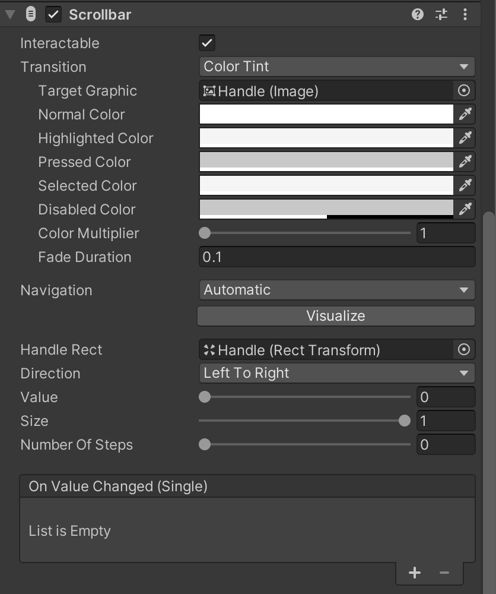

```c#
[AddComponentMenu("UI/Scrollbar", 34)]
[ExecuteAlways]
[RequireComponent(typeof(RectTransform))]
public class Scrollbar : Selectable, IMoveHandler, IPointerDownHandler, IPointerUpHandler, IPointerEnterHandler, IPointerExitHandler, ISelectHandler, IDeselectHandler, IBeginDragHandler, IDragHandler, IInitializePotentialDragHandler, IEventSystemHandler, ICanvasElement
```

`Scrollbar` は `0` から `1` の間を移動できるスクロールバーを実装するためのコンポーネントである。

`Scrollbar` コンポーネントは `Selectable` コンポーネントを継承している。`Scrollbar` は `Slider` からコピペされたコンポーネントであるが、、以下の点が異なる。

- `Slider` は値を設定する目的で使われ、`Scrollbar` は表示範囲を動かすために使われる。

- `Scrollbar` は値の範囲が `0` から `1` で固定となっている。

- `Scrollbar` には最小値から現在地までを覆うフィルが存在しない。

- `Scrollbar` のハンドルの大きさは可変である。

- `Scrollbar` は `IBeginDragHandler` インターフェースを実装している。これにより `OnBeginDrag()` コールバック経由でドラッグが実際に開始した（＝タッチ位置が移動した）タイミングを知ることができる。一方 `IInitializePotentialDragHandler` インターフェースの `OnInitializePotentialDrag()` コールバックはドラッグが検知されて開始する直前に呼ばれる。

### Scrollbar のプロパティ

#### direction

```c#
public Scrollbar.Direction direction { get; set; }
```

スクロールバーの方向を取得/設定する。

方向は `Scrollbar.Direction` 列挙型として、左から右、右から左、下から上、上から下の 4 方向が定義されている。

```c#
/// <summary>
/// 4 つの方向うち 1 つを示す設定
/// </summary>
public enum Direction
{
    /// <summary>
    /// 左から右
    /// </summary>
    LeftToRight,

    /// <summary>
    /// 右から左
    /// </summary>
    RightToLeft,

    /// <summary>
    /// 下から上
    /// </summary>
    BottomToTop,

    /// <summary>
    /// 上から下
    /// </summary>
    TopToBottom,
}
```

たとえば `LeftToRight`（左から右）の場合、左が `0` で右が `1` となる。

#### handleRect

```c#
public RectTransform handleRect { get; set; }
```

ハンドルの `RectTransform` を取得/設定する。

ハンドルはあくまで表示上の UI 要素であり、ドラッグ判定はあくまで `Scrollbar` 本体で行われる。

#### numberOfSteps

```c#
public int numberOfSteps { get; set; }
```

ハンドルの位置を離散的に（＝段階的に）表示する場合の分割数を取得/設定する。

このプロパティの値が `1` 以下であればハンドルは滑らかに移動し、`1` より大きければハンドルの位置が `0` から `1` の間で等分割された位置になる。デフォルト値は `0` である。

この値が `1` よりも大きい値に設定されていても、内部的な位置は float で滑らかに変化する。このプロパティはあくまで見た目場の位置を表していることに注意。

#### onValueChanged

```c#
public Scrollbar.ScrollEvent onValueChanged { get; set; }
```

スクロールバーが変更された際に呼ばれるコールバックを取得/設定する。

`Scrollbar.SliderEvent` は `UnityEvent<float>` である。

```c#
public class Scrollbar : UnityEvent<float> {}
```

`onValueChanged` を使って、スライダーが変更された時にコンソールにログを出力するサンプルコードを以下に示す。

```c#
[RequireComponent(typeof(Scrollbar))]
public class ScrollbarCallbackSample : MonoBehaviour
{
    private void Start()
    {
        var scrollbar = GetComponent<Scrollbar>();

        scrollbar.onValueChanged.AddListener((value) =>
        {
            Debug.Log("スクロールバーが変更された" + value);
        });
    }
}
```

#### size

```c#
public float size { get; set; }
```

`0` から `1` の範囲でハンドルのサイズを取得/設定する。

この値はスライダーエリア全体に対する割合を示す。デフォルト値は `0.2` である。

後述する `ScrollRect` コンポーネントは、スクロールするコンテンツのサイズに応じてこのスクロールバーの `size` を変更する。コンテンツのサイズが大きければスクロールバーの `size` を小さくし、コンテンツのサイズが小さければスクロールバーの `size` を大きくするように調整している。

#### value

```c#
public float value { get; set; }
```

現在のスクロールバーの値を取得/設定する。

`numberOfSteps` が `1` より大きければ、`0` から `1` の間で `numberOfSteps` で等分割された値が返される。

```c#
public float value
{
    get
    {
        float val = m_Value;
        if (m_NumberOfSteps > 1)
            val = Mathf.Round(val * (m_NumberOfSteps - 1)) / (m_NumberOfSteps - 1);
        return val;
    }
    set
    {
        Set(value);
    }
}
```

### Scrollbar の public メソッド

#### OnMove

```c#
public override void OnMove(AxisEventData eventData);
```

キー入力による上下左右移動の際に `StandAloneInputModule` などから呼ばれる。

このメソッドは `Selectable` コンポーネントで定義された（`IMoveHandler` インターフェースを実装した）`OnMove` のオーバーライドである。

`eventData` から移動方向を受け取り、`direction` の方向と一致していればスクロールバーの値を変更するようになっている。

#### FindSelectableOnDown

```c#
public override Selectable FindSelectableOnDown();
```

ナビゲーションのために、下にある `Selectable` オブジェクトを探して返す。

このメソッドは `Selectable` コンポーネントで定義された `FindSelectableOnDown` のオーバーライドである。

`navigation` が `Navigation.Mode.Automatic` かつ `direction` が垂直方向（`BottomToTop` または `TopToBottom`) であれば（上下キー操作ではスクロールバーを上下させたいので）`null` が返される。そうでなければ `Selectable.FindSelectableOnDown()` の結果を返す。

#### FindSelectableOnLeft

```c#
public override Selectable FindSelectableOnLeft();
```

ナビゲーションのために、左にある `Selectable` オブジェクトを探して返す。

このメソッドは `Selectable` コンポーネントで定義された `FindSelectableOnLeft` のオーバーライドである。

`navigation` が `Navigation.Mode.Automatic` かつ `direction` が水平方向（`LeftToRight` または `RightToLeft`) であれば（左右キー操作ではスクロールバーを左右させたいので）`null` が返される。そうでなければ `Selectable.FindSelectableOnLeft()` の結果を返す。

#### FindSelectableOnRight

```c#
public override Selectable FindSelectableOnRight();
```

ナビゲーションのために、右にある `Selectable` オブジェクトを探して返す。

このメソッドは `Selectable` コンポーネントで定義された `FindSelectableOnRight` のオーバーライドである。

`navigation` が `Navigation.Mode.Automatic` かつ `direction` が水平方向（`LeftToRight` または `RightToLeft`) であれば（左右キー操作ではスクロールバーを左右させたいので）`null` が返される。そうでなければ `Selectable.FindSelectableOnRight()` の結果を返す。

#### FindSelectableOnUp

```c#
public override Selectable FindSelectableOnUp();
```

ナビゲーションのために、上にある `Selectable` オブジェクトを探して返す。

このメソッドは `Selectable` コンポーネントで定義された `FindSelectableOnDown` のオーバーライドである。

`navigation` が `Navigation.Mode.Automatic` かつ `direction` が垂直方向（`BottomToTop` または `TopToBottom`) であれば（上下キー操作ではスクロールバーを上下させたいので）`null` が返される。そうでなければ `Selectable.FindSelectableOnDown()` の結果を返す。

#### SetDirection

```c#
public void SetDirection(Scrollbar.Direction direction, bool includeRectLayouts);
```

スクロールバーの方向を示す `direction` を設定する。

`includeRectLayouts` が `true` であれば水平方向から垂直方向（あるいはその逆）に変わった際に `RectTransform` のサイズやアラインメントも入れ替え、子の要素についても同様に入れ替える。`includeRectLayouts` が `false` であればレイアウトの調整は特に行われない。

#### OnInitializePotentialDrag

```c#
public virtual void OnInitializePotentialDrag(PointerEventData eventData);
```

ドラッグが検知されて開始する直前に `StandAloneInputModule` から呼ばれる。

`IInitializePotentialDragHandler` インターフェースを実装したメソッドである。

ここでは `eventData` の `useDragThreshold` を `false` にしている。これにより、マウスあるいは指の前回の位置と今回の位置の距離が一定以下であってもドラッグが開始されたと判定されるようになっている。もし `useDragThreshold` が `true` であれば `10` ピクセル以下の動きではドラッグ開始判定とはならない。

なお、この `10` ピクセルというドラッグ開始判定の閾値は `EventSystem.current.pixelDragThreshold` で変更することができる。

```c#
EventSystem.current.pixelDragThreshold = 20;
```

この設定は現在の `EventSystem` 全体に影響が及ぶ。

#### OnBeginDrag

```c#
public virtual void OnBeginDrag(PointerEventData eventData);
```

ドラッグが実際に開始した（＝タッチ位置が移動した）タイミングで `StandAloneInputModule` などから呼ばれる。

このメソッドは `IBeginDragHandler` インターフェースを実装したメソッドである。

ハンドルをタッチしただけでは移動量がゼロであり、このメソッドは呼ばれない。ハンドルをタッチしたり、ハンドル外をタッチして即座に移動するタイミングを検知したいのであれば `IInitializePotentialDragHandler` インターフェースの `OnInitializePotentialDrag()` を使う必要がある。

押された位置がハンドルの内側であればそこをドラッグの起点位置とする。`Slider` と違って `OnPointerDown()` ではなく `OnBeginDrag()` でこの処理が行われる理由は、長押ししている間に `ScrollRect` から `Scrollbar` が変更される可能性があるからである。

#### OnDrag

```c#
public virtual void OnDrag(PointerEventData eventData);
```

ドラッグされた際に `StandAloneInputModule` などから呼ばれる。

このメソッドは `IDragHandler` インターフェースを実装したメソッドである。

`eventData` から受け取った現在のマウスあるいは指の位置からスライダーの値を算出して設定する。

#### OnPointerDown

```c#
public override void OnPointerDown(PointerEventData eventData);
```

タッチパネルで指がタッチされたりマウスが押されたりした際に `StandAloneInputModule` などから呼ばれる。

このメソッドは `Selectable` コンポーネントで定義された（`IPointerDownHandler` インターフェースを実装した）メソッドである。

このメソッドが呼ばれると、まず `Selectable.OnPointerDown()` が呼ばれる。次に、押された位置がハンドルの内側であれば、そこをドラッグの起点位置とする。押された位置がハンドルの外側であれば、コルーチンを開始し、即座に押された位置にスクロールバーを移動させる処理を指が離れるかドラッグが開始されるまで継続する。この処理は `ScrollRect` の `LateUpdate` の処理が終わるまで `WaitForEndOfFrame` で待った後に行われる。これは `ScrollRect` が `Scrollbar` を変更するからである。

#### OnPointerUp

```c#
public override void OnPointerUp(PointerEventData eventData);
```

タッチパネルから指が離されたりマウスが離されたりした際に `StandAloneInputModule` などから呼ばれる。

このメソッドは `IPointerUpHandler` インターフェースを実装したメソッドである。現在の選択状態 `currentSelectionState` を（`SelectionState.Pressed` を解除するように）変えて、その後トランジションを行う。さらに、`OnPointerDown()` で開始した押しっぱなし判定をクリアする。

#### Rebuild

```c#
public virtual void Rebuild(CanvasUpdate executing);
```

Editor 実行時のみ、Canvas リビルドの `Prelayout` ステージの際に `onValueChanged` を呼ぶ。

#### SetValueWithoutNotify

```c#
public virtual void SetValueWithoutNotify(float input);
```

`onValueChanged` を呼ばずにスクロールバーの値を変更する。

# Chapter 8 Scroll View

Scroll View は `ScrollRect` および関連コンポーネントから構成されるスクロール可能 UI 要素である。Scroll View を作成するには、Editor から *UI -> Scroll View* を選択して作成するのが最も手っ取り早い。

Editor から *UI -> Scroll View* で作成した場合のオブジェクトの構造は以下のようになる。

```
Scroll View (ScrollRect/Image, Anchor:middle/center)
    Viewport (Mask/Image, Anchor:stretch/stretch)
        Content (Anchor:top/stretch)
    Scrollbar Horizontal (Scrollbar/Image, Anchor:bottom/stretch)
        Sliding Area (Anchor:stretch/stretch)
            Handle (Image, Anchor:stretch/stretch)
    Scrollbar Vertical (Scrollbar/Image, Anchor:stretch/right)
        Sliding Area (Anchor:stretch/stretch)
            Handle (Image, Anchor:custom/stretch)
```

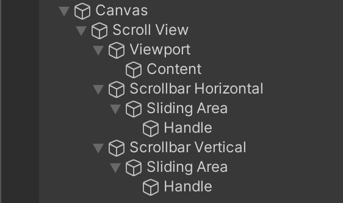


`ScrollRect` がアタッチされている `GameObject` がトップに存在し、その下にコンテンツ表示領域である *Viewport* と、表示コンテンツである *Content* があり、その他に水平および垂直の `Scrollbar` が存在している。`ScrollRect` とこれらのオブジェクトが協調動作することによってスクロールビューが実現されている。

`ScrollRect` は、*Viewport* と *Scrollbar Horizontal* と *Scrollbar Vertical* が *ScrollView* の直下に存在している前提で実装されている。なので、むやみにこの階層構造を変更するべきではない。

Scroll View は大きなパフォーマンス問題の原因となりうるので実装の際には気を付ける必要がある。

まず、Scroll View の中心的な役目を果たす `ScrollRect` コンポーネントについて見ていく。

## ScrollRect コンポーネント

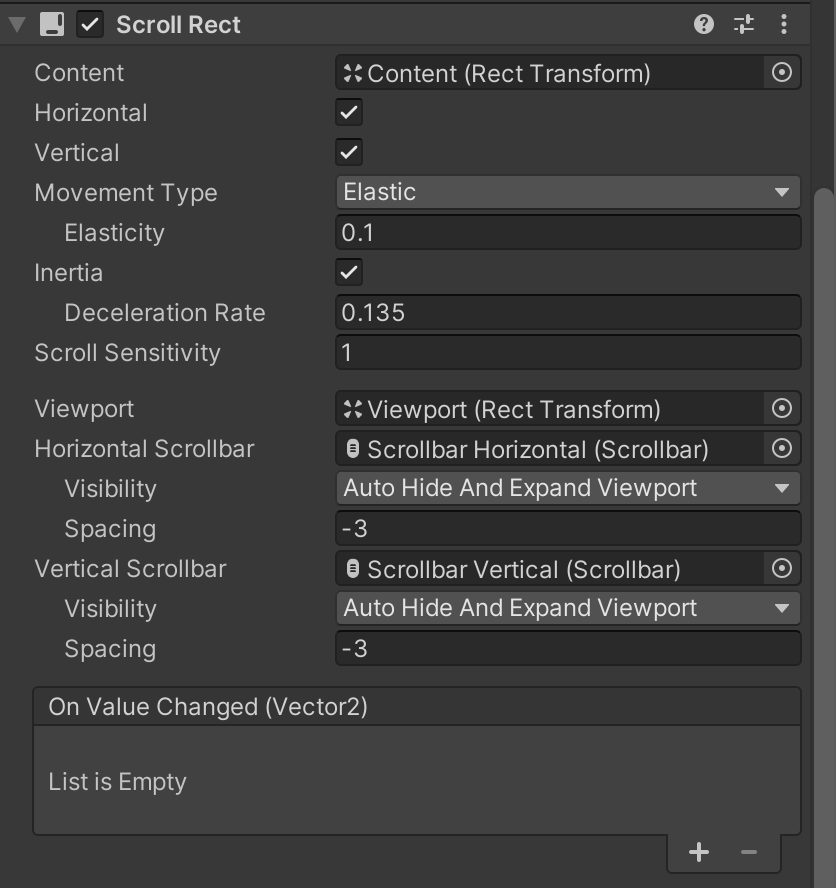

```c#
[AddComponentMenu("UI/Scroll Rect", 37)]
[SelectionBase]
[ExecuteAlways]
[DisallowMultipleComponent]
[RequireComponent(typeof(RectTransform))]
public class ScrollRect : UIBehaviour, IInitializePotentialDragHandler, IBeginDragHandler, IEndDragHandler, IDragHandler, IScrollHandler, IEventSystemHandler, ICanvasElement, ILayoutElement, ILayoutGroup, ILayoutController
```

### ScrollRect のプロパティ

#### content

```c#
public RectTransform content { get; set; }
```

スクロール可能なコンテンツの `RectTransform` を取得/設定する。

`content` の `GameObject` は `ScrollRect` よりも子の階層に存在するべきである。

表示したいコンテンツの量が少ない場合にはコンテンツ全てをこの `content` 配下にあらかじめ作成しておいても良いが、そうでない場合には動的に `content` 配下を変更していくことになるだろう。

#### viewport

```c#
public RectTransform viewport { get; set; }
```

コンテンツ表示領域のビューポートの `RectTransform` を取得/設定する。

*UI -> Scroll View* で作成した場合のオブジェクトの場合は、`Mask` コンポーネントがアタッチされた *Viewport* が設定されている。単純に矩形でマスクするのであれば `RectMask2D` コンポーネントに差し替えたほうがパフォーマンスが良い可能性がある。パフォーマンスについてはプラットフォームや UI の構成によって異なるので、必ず計測して選択すること。

ビューポートは `ScrollRect` の直下に存在している必要がある。

#### horizontalScrollbar

```c#
public Scrollbar horizontalScrollbar { get; set; }
```

水平方向のスクロールのための `Scrollbar` オブジェクトを設定/取得する。

スクロールバーは `ScrollRect` の直下に存在している必要がある。

#### verticalScrollbar

```c#
public Scrollbar verticalScrollbar { get; set; }
```

垂直方向のスクロールのための `Scrollbar` オブジェクトを設定/取得する。

スクロールバーは `ScrollRect` の直下に存在している必要がある。

#### inertia

```c#
public bool inertia { get; set; }
```

`RectScroll` 領域内でのドラッグが終了した後もしばらく速度を維持するか否かを取得/設定する。

デフォルト値は `true` となっている。このプロパティが `true` に設定されていた場合、ドラッグが終了した後に徐々に減速していくが、減速していく割合は `decelerationRate` で定義される。また、現在の秒間あたりの移動速度は `velocity` で取得/設定することができる。

なお、`RectScroll` 領域内でのドラッグではなく `Scrollbar` をドラッグしてスクロールしている場合は `velocity` は `0` に保たれたままであり、`Scrollbar` のドラッグを終了するとスクロールは即座に停止する。

このプロパティは水平方向と垂直方向の両方に共通である。

#### decelerationRate

```c#
public float decelerationRate { get; set; }
```

`inertia` が `true` であった場合の減速の割合を取得/設定する。

デフォルト値は `0.135f` となっている。現在ドラッグしておらず、さらにコンテンツがスクロール矩形を越えて弾性運動していない（`movementType` が `Elastic` ではない）場合に、`velocity` に `Mathf.Pow(decelerationRate, Time.unscaledDeltaTime)` が掛けられて減速することになる。よって、このプロパティの値が `0` であればすぐに停止し、`1` であれば速度を維持し、`1` より大きければ加速する。負の値に設定するとコンテンツが明後日の方向に消える（座標が `NaN` になる）ので、負の値に設定してはいけない。

このプロパティは水平方向と垂直方向の両方に共通である。

#### elasticity

```c#
public float elasticity { get; set; }
```

コンテンツがスクロール矩形を越えて移動するときに使用する弾力性の量を取得/設定する。

デフォルト値は `0.1f` となっている。このプロパティの値が `0` 以下であればスクロール矩形の外でドラッグを終了すると、コンテンツは矩形内の位置に即座に戻る。値が大きければゆっくりと戻る。なお、マウスのスクロールホイールでスクロールした場合には、弾性力は `3` 倍になる。

`inertia` と同様に、`RectScroll` 領域内でのドラッグではなく `Scrollbar` をドラッグしてスクロールしている場合は `velocity` は `0` に保たれたままであり、`Scrollbar` のドラッグを終了するとスクロールは即座に停止する。

このプロパティは水平方向と垂直方向の両方に共通である。

#### horizontal

```c#
public bool horizontal { get; set; }
```

水平方向のスクロールが有効かどうかを取得/設定する。

このプロパティが `true` であれば、`ScrollRect` 領域内でのドラッグによって横スクロールが可能となる。もし、このプロパティが `false` であっても `horizontalScrollbar` に水平スクロールバーが設定されていれば、スクロールバー経由で左右のスクロールは可能となってしまう。

`horizontalScrollbarVisibility` が `AutoHide` あるいは `AutoHideAndExpandViewport` で、コンテンツの水平方向の幅が `ScrollRect` と同じだった場合には水平スクロールバーは見えなくなるものの `ScrollRect` 内をドラッグしてのスクロール矩形を越えてのスクロールは可能である。

よって、水平方向のスクロールを使わないのであれば、必ず明示的にこのプロパティを `false` にするべきである。

#### vertical

```c#
public bool vertical { get; set; }
```

垂直方向のスクロールが有効かどうかを取得/設定する。

このプロパティが `true` であれば、`ScrollRect` 領域内でのドラッグによって縦スクロールが可能となる。挙動としては `horizontal` と同様である。

#### horizontalNormalizedPosition

```c#
public float horizontalNormalizedPosition { get; set; }
```

水平方向のスクロール位置を `0` から `1` の間で表した数値を取得/設定する。

`0` は左端を表す。スクロール矩形を超えてスクロールした状態であっても `0` から `1` の範囲に収まった値となる。

#### verticalNormalizedPosition

```c#
public float verticalNormalizedPosition { get; set; }
```

垂直方向のスクロール位置を `0` から `1` の間で表した数値を取得/設定する。

`0` は下端を表す。スクロール矩形を超えてスクロールした状態であっても `0` から `1` の範囲に収まった値となる。

#### horizontalScrollbarSpacing

```c#
public float horizontalScrollbarSpacing { get; set; }
```

水平スクロールバーとビューポート間の空白の高さを取得/設定する。

この高さ分だけビューポートの内側に水平スクロールバーのタッチ判定が広がることになる。

水平スクロールバーが存在している場合、この高さ分だけビューポートの高さと垂直スクロールバーの長さが短くなるようにアンカーが自動調整される。デフォルト値は `0` だが、Editor で *UI -> ScrollView* から作成した場合、`-3` が設定される（つまり、`3` ピクセル長くなる）。見た目の都合に合わせて調整するのが良いだろう。

このプロパティは `horizontalScrollbarVisibility` が `AutoHideAndExpandViewport` の場合にしか **Inspector** に現れないが、水平スクロールバーが存在している限り `horizontalScrollbarVisibility` の値に関わらず有効となるので注意したい。

#### verticalScrollbarSpacing

```c#
public float verticalScrollbarSpacing { get; set; }
```

垂直スクロールバーとビューポート間の空白の高さを取得/設定する。

挙動としては `verticalScrollbarSpacing` と同様である。

#### horizontalScrollbarVisibility

```c#
public ScrollRect.ScrollbarVisibility horizontalScrollbarVisibility { get; set; }
```

水平スクロールバーの表示モードを取得/設定する。

水平および垂直スクロールバーの表示モードは `ScrollRect.ScrollbarVisibility` 列挙型として定義されている。

```c#
/// <summary>
/// スクロールバーの表示モードを示す列挙型
/// </summary>
public enum ScrollbarVisibility
{
    /// <summary>
    /// 常にスクロールバーを表示
    /// </summary>
    Permanent,

    /// <summary>
    /// スクロールバーが不要（コンテンツがビューポートに収まる）のであればスクロールバーを隠す。
    /// この際、ビューポートの矩形サイズは変えない。
    /// </summary>
    AutoHide,

    /// <summary>
    /// スクロールバーが不要（コンテンツがビューポートに収まる）のであればスクロールバーを隠す。
    /// この際、ビューポートの矩形サイズをスクロールバーがあった分だけ広げる。
    /// </summary>
    /// <remarks>
    /// この設定が使われる場合、スクロールバーとビューポートの矩形は連動して動くようになる。
    /// スクロールバーとビューポートの RectTransform は自動的に計算されるので手動で編集することはできない。
    /// </remarks>
    AutoHideAndExpandViewport,
}
```

コンテンツの大きさが動的に変わるような場合、コンテンツのサイズが大きくなった際にビューポートのサイズが再計算されて複雑な挙動を引き起こすので `AutoHideAndExpandViewport` はあまりおすすめできない。そういった場合は `Permanent` か `AutoHide` を使うべきだろう。

もし、スクロールバーが視覚的に邪魔ということであれば、普段はスクロールバーのアルファ値を `0` にしておいて、スクロールされ始めたらアルファフェードさせるなどの方法もある。

#### verticalScrollbarVisibility

```c#
public ScrollRect.ScrollbarVisibility verticalScrollbarVisibility { get; set; }
```

水平スクロールバーの表示モードを取得/設定する。

挙動としては `horizontalScrollbarVisibility` と同様である。

#### movementType

```c#
public ScrollRect.MovementType movementType { get; set; }
```

コンテンツがスクロール矩形を越えて移動する際の挙動を取得/設定する。

`ScrollRect.MovementType` 列挙型の定義は以下の通りである。

```c#
public enum MovementType
{
    /// <summary>
    /// 移動に制限無し。コンテンツは永遠に移動できる。
    /// </summary>
    Unrestricted,

    /// <summary>
    /// 弾性のある移動。コンテンツは一時的に枠を超えて移動できるが、縮んで元に戻される。
    /// </summary>
    Elastic,

    /// <summary>
    // 枠内の移動。コンテンツは枠を超えて移動できない。
    /// </summary>
    Clamped,
}
```

デフォルト値は `Elastic` となっている。

#### normalizedPosition

```c#
public Vector2 normalizedPosition { get; set; }
```

スクロール位置を `Vector2` として `(0, 0)` から `(1, 1)` までの間で表現したものを取得/設定する。

`Vector2` の `x` が水平方向で、`y` が垂直方向を表しており、`(0, 0)` が左下で `(1, 1)` が右上となる。

#### onValueChanged

```c#
public ScrollRect.ScrollRectEvent onValueChanged { get; set; }
```

スクロール位置が変更されたり、表示領域や表示境界が変更された際に `LateUpdate()` から呼ばれるコールバックを取得/設定する。

`ScrollRect.ScrollRectEvent` は `UnityEvent<Vector2>` であり、引数として `normalizedPosition` が渡される。

呼ばれるタイミングが `LateUpdate()` であることは覚えておくべきだろう。

#### preferredHeight

```c#
public virtual float preferredHeight { get; }
```

Auto Layout の際に用いられる preferred の高さを取得する。

常に `-1` を返す。詳細は *Chapter 9 Auto Layout* で説明する。

#### preferredWidth

```c#
public virtual float preferredWidth { get; }
```

Auto Layout の際に用いられる preferred の高さを取得する。

常に `-1` を返す。詳細は *Chapter 9 Auto Layout* で説明する。

#### scrollSensitivity

```c#
public float scrollSensitivity { get; set; }
```

マウスのスクロールホイールとトラックパッドのスクロール感度を取得/設定する。

デフォルト値は `1` である。

スクロールの移動量にこの数字をかけて実際の移動量とみなす。`0` であればマウスのスクロールホイールやトラックパッドは効かなくなる。

#### velocity

```c#
public Vector2 velocity { get; set; }
```

水平方向および垂直方向のコンテンツの現在の速度を取得/設定する。

単位は秒間あたりのピクセル数である。`Vector2` の `x` が水平方向で、`y` が垂直方向を表している。`velocity` は `LateUpdate()` ごとに再計算されるので、もし手動で一定速度で動かし続けたいのであれば `Update()` などで繰り返し `velocity` を再設定する必要がある。

#### flexibleHeight

```c#
public virtual float flexibleHeight { get; }
```

Auto Layout の際に用いられる flexible の高さを取得する。

常に `-1` を返すので flexible の高さは無視される。詳細は *Chapter 9 Auto Layout* で説明する。

#### flexibleWidth

```c#
public virtual float flexibleWidth { get; }
```

Auto Layout の際に用いられる flexible の幅を取得する。

常に `-1` を返すので flexible の幅は無視される。詳細は *Chapter 9 Auto Layout* で説明する。

#### layoutPriority

```c#
public virtual int layoutPriority { get; }
```

Auto Layout の際に用いられる優先度を取得する。

常に `-1` を返す。詳細は *Auto Layout* で説明する。

#### minHeight

```c#
public virtual float minHeight { get; }
```

Auto Layout の際に用いられる最小の高さを取得する。

常に `-1` を返す。詳細は *Auto Layout* で説明する。

#### minWidth

```c#
public virtual float minWidth { get; }
```

Auto Layout の際に用いられる最小の幅を取得する。

常に `0` を返す。詳細は *Auto Layout* で説明する。


### ScrollRect の public メソッド

#### CalculateLayoutInputHorizontal

```c#
public virtual void CalculateLayoutInputHorizontal();
```

`ILayoutElement` インターフェースの `CalculateLayoutInputHorizontal()` を実装したメソッドだが、中身は空である。

このメソッドが呼ばれた後、レイアウトの水平方向の入力のプロパティは最新の値を返すべきである。また、このメソッドが呼ばれた時点で、子は常に最新のレイアウトの水平方向の入力を持っているはずである。

#### CalculateLayoutInputVertical

```c#
public virtual void CalculateLayoutInputVertical();
```

`ILayoutElement` インターフェースの `CalculateLayoutInputVertical()` を実装したメソッドだが、中身は空である。

このメソッドが呼ばれた後、レイアウトの垂直方向の入力のプロパティは最新の値を返すべきである。また、このメソッドが呼ばれた時点で、子は常に最新のレイアウトの垂直方向の入力を持っているはずである。

#### GraphicUpdateComplete

```c#
public virtual void GraphicUpdateComplete();
```

`Graphic` のリビルドが完了した際に（`ICanvasElement` インターフェースを通じて）`CanvasUpdateRegistry` から呼ばれるが、中身は空である。

#### IsActive

```c#
public override bool IsActive();
```

このオブジェクトがアクティブか否かを返す。

これは `UIBehaviour` で定義されている `IsActive()` を override したメソッドである。

```c#
public abstract class UIBehaviour : MonoBehaviour
{
    ...
    /// <summary>
    /// GameObject と Component がアクティブな場合に true を返す
    /// </summary>
    public virtual bool IsActive()
    {
        return isActiveAndEnabled;
    }
```

`ScrollRect` の場合はコンテンツが設定されているかどうかもチェックする。

```c#
public override bool IsActive()
{
    return base.IsActive() && m_Content != null;
}
```

#### LayoutComplete

```c#
public virtual void LayoutComplete();
```

レイアウトのリビルドが完了した際に（`ICanvasElement` インターフェースを通じて）`CanvasUpdateRegistry` から呼ばれるが、中身は空である。

#### OnInitializePotentialDrag

```c#
public virtual void OnInitializePotentialDrag(PointerEventData eventData);
```

ドラッグが検知されて開始する直前に `StandAloneInputModule` から呼ばれる。

このメソッドは `IInitializePotentialDragHandler` インターフェースを実装したメソッドである。

ここでは `velocity` が `Vector2.zero` に設定される。

#### OnBeginDrag

```c#
public virtual void OnBeginDrag(PointerEventData eventData);
```

ドラッグが実際に開始した（＝タッチ位置が移動した）タイミングで呼ばれる。

このメソッドは `IBeginDragHandler` インターフェースを実装したメソッドである。

ドラッグ中であるフラグをオンにして、コンテンツの位置とサイズを調整し、ドラッグの起点を記録する。

#### OnDrag

```c#
public virtual void OnDrag(PointerEventData eventData);
```

ドラッグされた際に `StandAloneInputModule` などから呼ばれる。

このメソッドは `IDragHandler` インターフェースを実装したメソッドである。

`OnBeginDrag` で記録したドラッグの起点からの差分を産出し、コンテンツの位置を変更する。

#### OnEndDrag

```c#
public virtual void OnEndDrag(PointerEventData eventData);
```

ドラッグが完了した際に `StandAloneInputModule` などから呼ばれる。

このメソッドは `IEndDragHandler` インターフェースを実装したメソッドである。

このメソッドが呼ばれると、ドラッグ中であることを示すフラグがオフにされる。

#### OnScroll

```c#
public virtual void OnScroll(PointerEventData data);
```

マウスのスクロールホイールとトラックパッドがスクロールした際に `StandAloneInputModule` などから呼ばれる。

このメソッドは `IScrollHandler` インターフェースを実装したメソッドである。

スクロールに移動量に `scrollSensitivity` を掛けた分だけコンテンツの位置を変更する。

#### Rebuild

```c#
public virtual void Rebuild(CanvasUpdate executing);
```

Canvas リビルドの `Prelayout` と `PostLayout` のステージで処理を行う。

`Prelayout` ステージでは以下の処理を行う。

- 水平/垂直スクロールバーの `RectTransform` のキャッシュを更新する。

- 水平/垂直スクロールバーの高さと幅 のキャッシュを更新する。

- 水平/垂直スクロールバーのスクロールバーが隠れた際にビューポートを広げるか否かのフラグのキャッシュを更新する。これは `horizontalScrollbarVisibility` や `verticalScrollbarVisibility` だけではなく、適切な階層構造になっているか（スクロールバーとビューポートが `ScrollRect` の直下に存在しているか）も考慮してフラグが決定される。

`PostLayout` ステージでは以下の処理を行う。

- コンテンツの位置とサイズを調整する。

- スクロールバーの位置を調整する。

- （もしまだ Canvas リビルドが発生していないなら）`LateUpdate()` で `Canvas` のリビルド（`Canvas.ForceUpdateCanvases()`）が発生するようにフラグを設定する。

#### SetLayoutHorizontal

```c#
public virtual void SetLayoutHorizontal();
```

本来は、Auto Layout の際に水平方向のレイアウトを設定するために呼ばれるメソッドだが、`ScrollRect` の場合はビューポートとコンテンツの位置とサイズを調整する処理が行われる。

このメソッドは（`ILayoutController` を継承した）`ILayoutGroup` インターフェースを実装したメソッドである。

#### SetLayoutVertical

```c#
public virtual void SetLayoutVertical();
```

本来は、Auto Layout の際に垂直方向のレイアウトを設定するために呼ばれるメソッドだが、`ScrollRect` の場合はスクロールバーの位置とサイズを調整する処理が行われる。

このメソッドは（`ILayoutController` を継承した）`ILayoutGroup` インターフェースを実装したメソッドである。

#### StopMovement

```c#
public virtual void StopMovement();
```

スクロールを停止するために呼ばれる。

このメソッドが呼ばれると `velocity` が `Vector2.zero` に設定される。

### Scroll View のコンテンツの設定方法

Scroll View の実行時パフォーマンスは非常に多くの場合で問題となる。Scroll View のコンテンツの設定方法には大きく分けて二つのアプローチが存在する。

1. 表示したいコンテンツ全てをあらかじめ　*Contents* 以下に用意しておく。

2. 必要に応じて表示したい UI 要素の位置を *Contents* 内に配置する。

これらのどちらのアプローチにも課題が存在する。

1 つ目のやり方は、固定要素を表示するだけの場合に有効だろう。ただし、表示すべき項目の数が増えるにつれ、UI 要素の全てをインスタンス化する時間が長くかかり、Scroll View をリビルドする時間も増える。もし Scroll View 内に必要な要素が少ししかないのであれば、このやり方はシンプルなので好まれるだろう。

2 つ目のやり方は個数不定の要素のリストの場合に有効だろう。ただし、これを実装するためには大量のコードが必要となる。表示する UI 要素のインスタンス化は負荷が重い処理なので、必然的にオブジェクトプールが必要となる。

### コンテンツ更新に関する注意点

上記の「必要に応じて表示したい UI 要素の位置を *Contents* 内に配置する」場合、スクロールに応じて動的にコンテンツを更新する必要がある。コンテンツを更新する際の注意事項を以下にまとめる。

- `ScrollRect` の `onValueChanged` コールバックは `LateUpdate()` の後半で呼ばれる。この時点ではコンテンツの位置とサイズ、スクロールバーの位置が確定している。なので、コンテンツの表示内容を更新する箇所は `onValueChanged` で良い。もし、コンテンツの位置やサイズ/スクロールバーの位置を自前で変更したいのであれば `LateUpdate()` よりも前、つまり `Update()` なので行うべきである。

- `transform` の親の付け替えだけではなくヒエラルキー内の兄弟順の変更時にも `OnTransformParentChanged()` が呼ばれ、`SetAllDirty()` で `Canvas` リビルドが行われる。なので、基本的にはコンテンツ内の要素の兄弟順は変更しないようにする。

- Scroll View の要素としてサブ `Canvas` を用いることも可能である。しかし、ドローコールの数が増えてしまい、`Canvas` リビルドの負荷も高いので、おすすめできない。

- （`ScrollRect` コンポーネントに限らないが）UI 要素のコンポーネントには `[ExecuteAlways]` 属性が付いていることが多く、下手に `Awake()` や `Start()` や `OnEnable()` でオブジェクトを変更すると Editor 実行時でもそれが反映されてしまう。なので、`ScrollRect` の機能を拡張したいのであれば、`ScrollRect` を継承したコンポーネントではなく、別のコンポーネントとして同一 `GameObject` にアタッチしたほうが安全である。

- `Canvas` のバッチングのコストは `Canvas` 内の `RectTransform` の数ではなく、`CanvasRenderer` の数に基づいて増える。

### Scroll View のサンプル

上記の注意点を考慮した上で以下の `VerticalScrollList` ようなヘルパークラスを作成することができる。この `VerticalScrollList` は縦方向のスクロールリストを実装するためのコンポーネントであり、`ScrollRect` コンポーネントと同一の `GameObject` にアタッチすることで動作する。

```c#
using System.Collections.Generic;
using UnityEngine;
using UnityEngine.UI;

[RequireComponent(typeof(ScrollRect))]
public class VerticalScrollList : MonoBehaviour
{
    // コンテンツ内の UI 要素のデータ
    public class ContentsElementData
    {
        // UI 要素の種類を決める何か
        public int type;

        // コンテンツ内での Y 座標（上が 0 で、下に行くほどプラスになるとする）
        public float y { set; get; }

        // 高さ
        public float height { set; get; }
    }

    // UI 要素の各種類のオブジェクトプール
    protected class ElementObjectPool
    {
        // プールされているオブジェクトのリスト
        private List<GameObject> list = new List<GameObject>();

        // このプールが管理するオブジェクトの type
        public int type { get; set; }

        // プールからオブジェクトを得る。プールが空なら新規作成して返す。
        public GameObject GetObject()
        {
            GameObject go;

            if (list.Count == 0) // プールが空なら
            {
                // GameObject を生成して
                go = new GameObject(string.Format("Contents Type:{0}", type), typeof(RawImage));
                
                // いい感じにコンポーネントをアタッチして
                var rawImage = go.GetComponent<RawImage>();
                
                // 種類に応じて中身を変える
                switch (type)
                {
                    case 0:
                        rawImage.color = Color.red;
                        break;

                    case 1:
                        rawImage.color = Color.blue;
                        break;

                    case 2:
                        rawImage.color = Color.green;
                        break;
                }
            }
            else // プールにあるなら
            {
                // プールから取り出す
                go = list[0];
                list.RemoveAt(0);
            }

            return go;
        }

        // オブジェクトをプールに返す
        public void ReleaseObject(GameObject go)
        {
            list.Add(go);
        }
    }

    // コンテンツ内の UI 要素の全データ
    protected List<ContentsElementData> contentsElementDatas = new List<ContentsElementData>();

    // 各 UI 要素の RectTransform のキャッシュ
    protected List<RectTransform> elementRectTransforms = new List<RectTransform>();

    // 同一 GameObject にアタッチされている ScrollRect のキャッシュ
    protected ScrollRect scrollRect;

    // type ごとのオブジェクトプール
    protected Dictionary<int, ElementObjectPool> elementPoolDict = new Dictionary<int, ElementObjectPool>();

    // スクロール位置を記憶しておく
    public static Dictionary<string, float> initialPositionDict = new Dictionary<string, float>();

    protected void Start()
    {
        scrollRect = GetComponent<ScrollRect>();

        // Mask を RectMask2D で置き換える
        // ※ ただし、（モバイルではなく）PC やコンソールであれば Mask のほうが速い可能性がある
        if (GetComponent<RectMask2D>() == null)
        {
            scrollRect.viewport.gameObject.AddComponent<RectMask2D>();
        }

        var mask = scrollRect.viewport.gameObject.GetComponent<Mask>();
        if (mask != null)
        {
            Destroy(mask);
        }

        // 水平スクロールは無効
        scrollRect.horizontal = false;

        // 垂直スクロールバーの Handle の anchorMin / anchorMax の変更によって
        // Graphic リビルドが発生するので垂直スクロールバーは非表示にする。
        // スクロールバーが必要なら anchor を使わない方法で自前実装したほうがパフォーマンスが良い。
        scrollRect.verticalScrollbar.gameObject.SetActive(false);
        scrollRect.verticalScrollbar = null;

        InitContentData();
        InitContentSize();

        // OnValueChanged を登録（※OnDestroy() での解除を忘れない）
        scrollRect.onValueChanged.AddListener(OnValueChanged);

        // 各 UI 要素の Y 座標を設定していく
        float totalY = 0.0f;

        for (int i = 0; i < contentsElementDatas.Count; i++)
        {
            // UI 要素の Y 座標はここで計算する
            contentsElementDatas[i].y = totalY;
            totalY += contentsElementDatas[i].height;

            elementRectTransforms.Add(null);
        }

        // 初回の UI 配置を行う
        scrollRect.normalizedPosition = new Vector2(0, 1);
        OnValueChanged(scrollRect.normalizedPosition);
    }

    protected void OnDestroy()
    {
        // OnValueChanged を解除
        scrollRect.onValueChanged.RemoveListener(OnValueChanged);
    }

    // type に対応したプールを得る
    protected ElementObjectPool GetElementPool(int type)
    {
        // プールの Dirctionary に無いならプールを新規作成する
        if (!elementPoolDict.ContainsKey(type))
        {
            var pool = new ElementObjectPool();
            pool.type = type;
            elementPoolDict.Add(type, pool);
        }

        return elementPoolDict[type];
    }

    // UI 要素を作成する
    protected RectTransform CreateElement(int index)
    {
        // UI 要素の中身を決めるデータを取得して
        var data = contentsElementDatas[index];

        // オブジェクトプールを取得して
        var elementPool = GetElementPool(data.type);

        // オブジェクトを得る
        var go = elementPool.GetObject();

        // オブジェクトの親は ScrollRect
        go.transform.SetParent(scrollRect.content, false);

        // オブジェクトの位置を設定
        var rectTransform = go.transforms as RectTransform;
        rectTransform.sizeDelta = new Vector2(scrollRect.content.rect.width - 50, data.height);
        rectTransform.anchorMin = new Vector2(0.5f, 1.0f);
        rectTransform.anchorMax = new Vector2(0.5f, 1.0f);
        rectTransform.pivot = new Vector2(0.5f, 1.0f);

        // 下に行くにつれ Y 座標は小さくなるので符号を逆にする
        rectTransform.anchoredPosition = new Vector3(0, -1 * data.y);

        elementRectTransforms[index] = rectTransform;

        return rectTransform;
    }

    // オブジェクトをプールに返す
    protected void ReleaseElement(int index)
    {
        var rectTransform = elementRectTransforms[index];

        var go = rectTransform.gameObject;

        var data = contentsElementDatas[index];
        var elementPool = GetElementPool(data.type);
        elementPool.ReleaseObject(go);

        elementRectTransforms[index] = null;
    }

    // UI 要素の中身を決めるデータを作成する
    protected void InitContentData()
    {
        // コンテンツ内の UI 要素のデータを決めていく
        for (int i = 0; i < 20; i++)
        {
            contentsElementDatas.Add(new ContentsElementData
            {
                type = 0,
                height = 20,
            });
            contentsElementDatas.Add(new ContentsElementData
            {
                type = 1,
                height = 30,
            });
            contentsElementDatas.Add(new ContentsElementData
            {
                type = 2,
                height = 40,
            });
        }

        // 各 UI 要素の RectTransform は最初は null として設定する。
        // Viewport 内で見えているなら RectTransform が設定される。
        elementRectTransforms = new List<RectTransform>(contentsElementDatas.Count);
        for (int i = 0; i < elementRectTransforms.Count; i++)
        {
            elementRectTransforms.Add(null);
        }
    }

    // コンテンツの RectTransform を初期設定する
    protected void InitContentSize()
    {
        var contentRectTransform = scrollRect.content.transform as RectTransform;
        
        // アンカーは top/stretch
        // （横は Viewport 幅いっぱい、縦はコンテンツ全てが収まる長さ）
        contentRectTransform.anchorMin = new Vector2(0.0f, 1.0f);
        contentRectTransform.anchorMax = new Vector2(1.0f, 1.0f);

        // 位置は上合わせ
        contentRectTransform.pivot = new Vector2(0.5f, 1.0f);

        // 初期位置は一番上
        contentRectTransform.anchoredPosition = Vector2.zero;

        // 横は stretch なので 0 にすれば Viewport 幅いっぱいになる
        // 縦はコンテンツ全てを収めるのに必要な長さ
        contentRectTransform.sizeDelta = new Vector2(0, CalcFullContentHeight());
    }

    // コンテンツ全体に必要なサイズを返す
    protected float CalcFullContentHeight()
    {
        float height = 0.0f;

        for (int i = 0; i < contentsElementDatas.Count; i++)
        {
            height += contentsElementDatas[i].height;
        }

        return height;
    }

    // スクロール位置が変わった際のコールバック
    protected void OnValueChanged(Vector2 position)
    {
        float viewportHeight = scrollRect.viewport.rect.height;

        // 現在のスクロール位置
        float scrollY = (1.0f - position.y) * (scrollRect.content.rect.height - viewportHeight);

        // 各 UI 要素が Viewport 内に収まっているかどうかを見ていく
        for (int i = 0; i < elementRectTransforms.Count; i++)
        {
            var data = contentsElementDatas[i];
            float elementY = data.y;
            float elementHeight = data.height;

            if (elementY + elementHeight < scrollY || elementY > scrollY + viewportHeight)
            {
                // UI 要素が Viewport の外にあるので、もしあればオブジェクトをプールに返す。
                // ReferenceEquals での比較のほうが高速なので使う。
                // （Destroy 後の null の扱いは要注意だが今回はセーフ）
                if (!ReferenceEquals(elementRectTransforms[i], null))
                {
                    ReleaseElement(i);

                    // Mask または RectMask2D で非表示にされるので
                    // わざわざ GameObject を非アクティブにしたりする必要は無い
                }
            }
            else
            {
                // UI 要素が Viewport の中にあるので、もし無ければオブジェクトをプールから得る
                if (ReferenceEquals(elementRectTransforms[i], null))
                {
                    CreateElement(i);
                }
            }
        }
    }
}
```

# Chapter 9 Auto Layout

## Auto Layout の概要

Auto Layout 関連コンポーネントは `RectTransform` のサイズと位置を制御するために使われる。Auto Layout を一言で表すと

「Minimum、Preferred、Flexible という 3 種類のプロパティを使って `RectTransform` の位置とサイズを決定するシステム」

である。

Auto Layout 関連コンポーネントは特定のインターフェースを実装しているため、`Image` や `Text` などのように `Graphic` のサブクラスであり、かつ Auto Layout 関連コンポーネントであるものが存在する。

以下に Auto Layout のインターフェースを示す。

- `ILayoutElement` : 要素を Auto Layout の対象とするためのインターフェース。`Image` や `Text` なども `ILayoutElement` インターフェースを実装している。

- `ILayoutGroup` : 子の `RectTransform` を操作するためのインターフェース。実装例としては `HorizontalLayoutGroup`、`VerticalLayoutGroup`、 `GridLayoutGroup`、`ScrollRect` がある。

- `ILayoutSelfController` : 自身の `RectTransform` を操作するためのインターフェース。実装例としては `ContentSizeFitter` や `AspectRatioFitter` がある。

- `ILayoutController` : `ILayoutGroup` および `ILayoutSelfController` の親インターフェース。

- `ILayoutIgnorer` : 自身を Auto Layout の対象から外すためのインターフェース。自身でレイアウトを制御するために使われる `LayoutElement` コンポーネントが実装している。

`RectTransform` ベースのレイアウトシステムは十分に柔軟であり、多くの異なる種類のレイアウトを扱って UI 要素を完全に自由に配置することができる。しかし、より構造的な仕組みが必要になることもある。

Auto Layout システムは、水平グループや垂直グループやグリッドなどのネストした Layout Group に UI 要素を置くための方法を提供する。また、要素が自動的に含まれるコンテンツに応じてサイズが変わるようにすることもできる。たとえば、パディングの付いたテキストにぴったりフィットしたサイズに動的にリサイズすることができる。

Auto Layout システムは基本的な `RectTransform` レイアウトシステムの上に構築されたシステムであり、一部あるいは全ての要素でオプションとして使うことができる。

Auto Layout システムは Layout Element と Layout Controller という概念に基づいている。Layout Element は `RectTransform` と他のコンポーネントを持った `GameObject` である。Layout Element はどのサイズを持つべきかを一定程度知っている。Layout Element は自身のサイズを直接設定しない。一方、Layout Controller は Layout Element のサイズ情報を利用してLayout Element の `RectTransform` のサイズを設定する。

Layout Element は `minWidth`、`minHeight`、`preferredWidth`、`preferredHeight`、`flexibleWidth`、`flexibleHeight` の 6 つのプロパティを持っている。

Layout Controller の例は、`ContentSizeFitter` と様々な `LayoutGroup` 系のコンポーネントである。

## Layout Element のサイズ決定ルール

Layout Group 内でどのように Layout Element のサイズが決まるのかの基本ルールは以下の通りである。

1. 最初に `minWidth` および `minHeight` が割り当てられる。

2. 十分な利用可能なスペースがあるなら `preferredWidth` および `preferredHeight` が割り当てられる。

3. さらに利用可能なスペースが余っているなら `flexibleWidth` および `flexibleHeight` が割り当てられる。

Layout Group 内の `RectTransform` を持った全ての `GameObject` は Layout Element として動作する。それらの min、preferred、flexible のサイズはデフォルトで `0` である。特定のコンポーネントが `GameObject` に割り当てられると、これらのプロパティの値が変更される。

`Image` と `Text` コンポーネントは Layout Element のプロパティを提供するコンポーネントの例である。それらは `preferredWidth` と `preferredHeight` を `Sprite` またはテキストの内容に一致させる。

## Layout Element コンポーネントによる手動サイズ調整

もし min、preferred、flexible のサイズを自分で調整したいのであれば、`GameObject` に `LayoutElement` コンポーネントをアタッチして、変更したいプロパティのチェックボックスを有効にして値を指定すれば良い。

`LayoutElement` の詳細については後述する。

## Layout Controller

Layout Controller は（1 つまたは複数の）レイアウト要素のサイズを制御するコンポーネントである。ここでいうレイアウト要素とは `RectTransform` を持った `GameObject` のことである。Layout Controller は自身のレイアウト要素を制御することもあれば、子のレイアウト要素を制御することもある。

Layout Controller として機能するコンポーネントはレイアウト要素としても機能することもある。

### ContentSizeFitter コンポーネントによる自身のサイズ調整

`ContentSizeFitter` は自身のレイアウト要素のサイズを制御する Layout Controller である。Auto Layout システムの動きを見る一番簡単な方法は `Text` コンポーネントを持った `GameObject` に `ContentSizeFitter` をアタッチすることである。

`ContentSizeFitter` の `horizontalFit` または `verticalFit` を `PreferredSize` に設定すると、`RectTransform` は幅あるいは高さを `Text` の中身に調整する。詳細は *ContentSizeFitter* の項で後述する。

### AspectRatioFitter コンポーネント

`AspectRatioFitter` は自身のレイアウト要素のサイズを制御する Layout Cotroller として機能する。

このコンポーネントは高さを幅に合わせたり、その逆にしたり、要素を親の内側にフィットさせたり親を包んだりする。`AspectRatioFitter` は Minimum Size や Preferred Size などのレイアウト情報は考慮しない。

## Layout Group

Layout Group は Layout Controller の一種であり、子の Layout 要素の位置とサイズを制御する。たとえば、`HorizontalLayoutGroup` は子をそれぞれ隣に配置し、`GridLayoutGroup` は子をグリッドに配置する。

Layout Group は自身のサイズを制御しない。そのかわりにレイアウト要素として機能して他の Layout Controller によって制御されたり、手動で制御される。

どんなサイズが Layout Group に割り当てられていても、たいていの場合は子のレイアウト要素それぞれに対するスペースの適切な量を、それらが報告する Minimum、Preferred、Flexible サイズに基づいて割り当てる。Layout Group は任意にネストできる。

## RectTransform のドリブンプロパティ

Auto Layout システムにおける Layout Controller は自動的に特定の UI 要素のサイズと配置を制御するので、それらの位置とサイズは **Inspector** や **Scene View** から手動で編集されるべきではない。そのように変更された値は次回のレイアウト計算時に結局 Layout Controller によってリセットされてしまうだけである。

`RectTransform` はこれを解決するためのドリブンプロパティという概念を持っている。たとえば、`ContentSizeFitter` の `horizontalFit` プロパティ が `MinSize` または `PreferredSize` に設定されているのであれば、`RectTransform` の幅は `ContentSizeFitter` によって制御される。この際、幅は read-only として表示され、`RectTransform` の一番上の小さな情報ボックスにプロパティが `ContentSizeFitter` によって制御されていることが記載される。

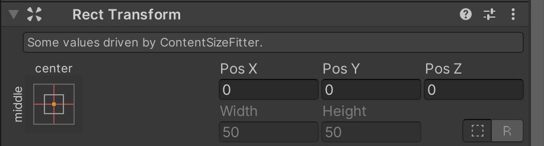

`RectTransform` のドリブンプロパティには、手動での編集を防ぐ以外の役割もある。レイアウトは画面解像度や **Game View** のサイズを変更しただけでも変わりうる。これは、今度は、レイアウト要素の配置やサイズにも変わり、ドリブンプロパティの値も変える。しかし、**Game View** がリサイズされただけなので保存されていない変更があると Scene がマークされることは望ましくない。これを防ぐため、ドリブンプロパティの値は Scene には保存されない。また、それらのプロパティの値が変更された場合でも、シーンが変更されたということにはならない。

自分でドリブンプロパティを設定したいのであれば、`DrivenRectTransformTracker` クラスを使って行うことができる。以下にサンプルコードを示す。

```c#
using UnityEngine;

// Inspector から RectTrasnform のプロパティを編集不能にする
[RequireComponent(typeof(RectTransform))]
[ExecuteAlways]
public class DrivenTransformPropertiesSample : MonoBehaviour
{
    // DrivenRectTransformTracker は未割り当てでも動作するが
    // warning が出るので抑制する
    #pragma warning disable 649
    private DrivenRectTransformTracker drivenRectTransformTracker;
    #pragma warning restore 649

    private void OnValidate()
    {
#if UNITY_EDITOR
        var rectTransform = transform as RectTransform>;

        // Position と Size を編集不能にする
        drivenRectTransformTracker.Add(this, rectTransform,
            DrivenTransformProperties.AnchoredPosition3D | DrivenTransformProperties.SizeDelta);
#endif
    }

    private void OnDisable()
    {
#if UNITY_EDITOR
        // 必ず OnDisable() で Clear() を呼ばないといけない
        drivenRectTransformTracker.Clear();
#endif
    }
}
```

## 独自の Auto Layout コンポーネントの作成

Auto Layout システムにはいくつかのコンポーネントが既に存在しているが、独自の方法でレイアウトを制御する新規コンポーネントを作成することも可能である。独自のコンポーネントを作成する場合、特定のインターフェースを実装すれば良い。

- `ILayoutElement` インターフェースを実装したコンポーネントは Auto Layout システムによってレイアウト要素として扱われる。

- `ILayoutGroup` インターフェースを実装したコンポーネントは子の `RectTransform` をドリブン制御すると期待される。

- `ILayoutSelfController` インターフェースを実装したコンポーネントは自身の `RectTransform` をドリブンプロパティとして制御すると期待される。

## レイアウトの計算

レイアウト要素の `minWidth`、`preferredWidth`、`flexibleWidth` は `ILayoutElement` を実装したコンポーネントの `CalculateLayoutInputHorizontal()` を呼ぶことで計算される。この計算はボトムアップで行われる。つまり、親よりも子が先に計算され、親は自身の計算の際に子の情報を考慮することができる。

レイアウト要素の実際の幅は `ILayoutController` を実装したコンポーネントの `SetLayoutHorizontal()` を呼ぶことで計算されて、設定される。この計算はトップダウンで行われる。つまり、親の後に子が計算され、子の幅は親が利用できる幅に基づいている必要がある。このステップが完了すると、レイアウト要素の `RectTransform` の幅が決まる。

レイアウト要素の `minHeight`、`preferredHeight`、`flexibleHeight` の高さは `ILayoutElement` を実装したコンポーネントの `CalculateLayoutInputVertical()` を呼ぶことで計算される。この計算はボトムアップで行われる。つまり、親よりも子が先に計算され、親は自身の計算の際に子の情報を考慮することができる。

レイアウト要素の実際の幅は、`ILayoutController` を実装したコンポーネントの `SetLayoutVertical()` を呼ぶことで計算されて設定される。この計算はトップダウンで行われる。つまり、親の後に子が計算され、子の高さは親で利用可能なフルの高さに基づいている必要がある。このステップが完了すると、レイアウト要素の `RectTransform` の高さが決まる。

これまで見てきたように、Auto Layout システムは幅を最初に評価し、その後に高さを評価する。なので、高さは幅に依存する可能性があるが、一方で計算済みの幅は高さに決して依存しない。

## Layout リビルドのトリガー

あるコンポーネントのあるプロパティが変更されたことで、現在のレイアウトがもはや有効ではなくなったなら、Layout リビルド、つまりレイアウトの再計算が必要である。Layout リビルドは `LayoutRebuilder.MarkLayoutForRebuild()` を呼ぶことで可能になる。

```c#
namespace UnityEngine.UI
{
    public class LayoutRebuilder : ICanvasElement
    {
        ...
        public static void MarkLayoutForRebuild(RectTransform rect)
```

`LayoutRebuilder.MarkLayoutForRebuild()` を呼んでも Layout リビルドは即座には発生しない。Layout リビルドは現在のフレームの最後の、レンダリングの直前に発生する（*Chapter 2 UI 要素と Canvas のリビルド* の *Canvas リビルド* の項を参照）。Layout リビルドが即座に発生しない理由は、同一フレームで何度もリビルドが発生する可能性があり、パフォーマンスに悪いからである。

Layout リビルドを要求すべきタイミングは以下の通りである。

- レイアウトを変更するプロパティの setter 内

- 以下のコールバック内

  - `OnEnable()`

  - `OnDisable()`

  - `OnRectTransformDimensionsChange()`

  - `OnValidate()` (Editor 実行時で必要な場合のみ）

  - `OnDidApplyAnimationProperties()`

## ILayoutElement インターフェース

```c#
public interface ILayoutElement
```

`ILayoutElement` インターフェースを実装したコンポーネントは Auto Layout の対象となるレイアウト要素となる。

レイアウトシステムは `CalculateLayoutInputHorizontal()` を呼び出すことによって、`minWidth` や `preferredWidth` や `flexibleWidth` の値を事前に計算しておくことができる。
これによって、各プロパティの呼び出し時に毎回計算する必要がなくなる。

同様に、レイアウトシステムは `CalculateLayoutInputVertical()` を呼び出すことによって、`minHeight` や `preferredHeight` や `flexibleHeight` の値を事前に計算しておくことができる。これによって、各プロパティの呼び出し時に毎回計算する必要がなくなる。

`minWidth` や `preferredWidth` や `flexibleWidth` プロパティはレイアウト要素の `RectTransform` のいかなるプロパティにも依存すべきではない。そうでないと、挙動が非決定的になってしまう。

一方、`minHeight` や `preferredHeight` や `flexibleHeight` プロパティは `RectTransform` の水平方向、たとえば `width` や `position` の `x` 要素などには依存しても良い。また、子のレイアウト要素の `RectTransform` の要素にも依存して構わない。

### ILayoutElement のプロパティ

#### minWidth

```c#
public float minWidth { get; }
```

このレイアウト要素が割り当てる最小の幅を取得する。

#### minHeight

```c#
public float minHeight { get; }
```

このレイアウト要素が割り当てる最小の高さを取得する。

#### preferredWidth

```c#
public float preferredWidth { get; }
```

Auto Layout の際に、十分なスペースがあった場合に設定したい幅を取得する。

このプロパティに `-1` を設定すると、`preferredWidth` 自体を無視することができる。

#### preferredHeight

```c#
public float preferredHeight { get; }
```

Auto Layout の際に、十分なスペースがあった場合に設定したい望ましい高さを取得する。

このプロパティに `-1` を設定すると、`preferredHeight` 自体を無視することができる。

#### flexibleWidth

```c#
public float flexibleWidth { get; }
```

余分に利用可能なスペースがあった場合にこのレイアウト要素に割り当てられる幅の割合を取得する。

#### flexibleHeight

```c#
public float flexibleHeight { get; }
```

余分に利用可能なスペースがあった場合にこのレイアウト要素が割り当てられる高さの割合を取得する。


#### layoutPriority

```c#
public int layoutPriority { get; }
```

このコンポーネントのレイアウト優先度を取得する。

もし同一 `GameObject` に `ILayoutElement` インターフェースを実装したコンポーネントが複数アタッチされていた場合、このプロパティが高い値を返すコンポーネントの値が使われる。ただし、各プロパティが `0` 未満だった場合は無視されるので、特定のプロパティだけ上書きするということも実現できる。

### ILayoutElement のメソッド

#### CalculateLayoutInputHorizontal 

```c#
public void CalculateLayoutInputHorizontal();
```

`minWidth` と `preferredWidth` と `flexibleWidth` を計算する。

このメソッドが呼ばれた後は、それらのプロパティの値は最新のものになっているはずである。さらに、このメソッドが呼ばれた時点では子の `minWidth` と `preferredWidth` と `flexibleWidth` は最新の値になっているはずである。

#### CalculateLayoutInputVertical

```c#
public void CalculateLayoutInputVertical();
```

`minHeight` と `preferredHeight` と `flexibleHeight` を計算する。

このメソッドが呼ばれた後は、それらのプロパティの値は最新のものになっているはずである。さらに、このメソッドが呼ばれた時点では子の `minHeight` と `preferredHeight` と `flexibleHeight` は最新の値になっているはずである。

## ILayoutController インターフェース

```c#
public interface ILayoutController
```

`ILayoutController` は `RectTransform` のレイアウトを制御するためのインターフェースである。

自身の `RectTransform` を制御したいのであれば `ILayoutSelfController` インターフェースを実装することになる。子の `RectTransform` を制御したいのであれば `ILayoutGroup` インターフェースを実装することになる。

レイアウトシステムは先に `SetLayoutHorizontal()` を呼び、その後で `SetLayoutVertical()` を呼ぶ。

`SetLayoutHorizontal` の呼び出し内部で、自身あるいは子に対して `LayoutUtility.GetMinWidth` や `LayoutUtility.GetPreferredWidth` や `LayoutUtility.GetPreferredWidth` を呼ぶことは問題ない。それによって自身あるいは子の幅を決定することができる。

また、`SetLayoutVertical` の呼び出し内部で、自身あるいは子に対して `LayoutUtility.GetMinHeight` や `LayoutUtility.GetPreferredHeight` や `LayoutUtility.GetFlexibleHeight` を呼ぶことは問題ない。それによって自身あるいは子の高さを決定することができる。

### ILayoutController の public メソッド

#### SetLayoutHorizontal

```c#
public void SetLayoutHorizontal();
```

Auto Layout システムがレイアウトの水平方向を処理するために呼ぶ。

#### SetLayoutVertical

Auto Layout システムがレイアウトの垂直方向を処理するために呼ぶ。

```c#
public void SetLayoutVertical();
```

## ILayoutGroup インターフェース

`ILayoutGroup` は子の `RectTransform` を制御する `ILayoutController` である。

`ILayoutGroup` は `ILayoutController` に対して特に追加しないので、中身は同一である。

### ILayoutSelfController インターフェース

`ILayoutSelfController` は自身の `RectTransform` を制御する `ILayoutController` である。

`ILayoutSelfController` は `ILayoutController` に対して特に追加しないので、中身は同一である。

`GameObject` 自身の `RectTransform` を制御したいのであれば `ILayoutSelfController` を使い、`GameObject` の子の `RectTransform` を制御したいのであれば `ILayoutGroup` を使うことになる。

レイアウトの横方向を制御したいなら `ILayoutController.SetLayoutHorizontal` を呼び、レイアウトの垂直方向を制御したいなら `ILayoutController.SetLayoutVertical` を呼ぶ。
`RectTransform` の幅、高さ、位置、回転を変更することは可能である。

## ILayoutIgnorer インターフェース

```c#
public interface ILayoutIgnorer
```

`ILayoutIgnorer` を実装したコンポーネントを持っているなら `RectTransform` はレイアウトシステムから無視される。

`ILayoutIgnorer` を実装したコンポーネントは、親のレイアウトグループコンポーネントがこの `RectTransform` をグループの一部として扱わないようにさせることができる。そうすることで、その `RectTransform` は Layout Group の子の `GameObject` であるにも関わらずレイアウトを自前で設定することができる。

### ILayoutIgnorer のプロパティ

#### ignoreLayout

```c#
bool ignoreLayout { get; }
```

レイアウトシステムによって `RectTransform` が無視されるべきかどうかを決める。このプロパティが `true` を返すと、親の Layout Group コンポーネントはこの `RectTransform` をグループの一部とみなさない。この `RectTransform` はそれから、レイアウトグループの子でもあるにも関わらず手動で配置することができる。

## LayoutElement コンポーネント

```c#
[AddComponentMenu("Layout/Layout Element", 140)]
[RequireComponent(typeof(RectTransform))]
[ExecuteAlways]
public class LayoutElement : UIBehaviour, ILayoutElement, ILayoutIgnorer
```

`LayoutElement` は、既存のレイアウト要素の `minWidth`、`minHeight`、`preferredWidth`、`preferredHeight`、`flexibleWidth`、`flexibleHeight` を上書きするために使うコンポーネントである。

上書きしたい値に `0` 以上の値を設定し、上書きしない値は `-1` のままにしておく。あるいは、`ignoreLayout` を `true` にすれば Auto Layout による配置を無視することもできる。

使い方の例をいくつか挙げる。

- `Text` に `ContentSizeFitter` をアタッチして `PreferredSize` に設定していた場合、テキストの文字列が空だと `RectTransform` のサイズが `(0, 0)` になってしまう。この場合、`LayoutElement` をアタッチして `minWidth` と`minHeight` を設定すれば、文字列が空でも `RectTransform` の矩形をキープできる。

- `VerticalLayoutGroup` の子の `Image` を持った `GameObject` に `LayoutElement` をアタッチする。そして `LayoutElement` の `ignoreLayout` をオンにすれば手動で位置を調整できる。

プロパティおよびメソッドの説明は `ILayoutElement` インターフェースと同一なので割愛する。

## LayoutGroup コンポーネント

```c#
[DisallowMultipleComponent]
[ExecuteAlways]
[RequireComponent(typeof(RectTransform))]
public abstract class LayoutGroup : UIBehaviour, ILayoutElement, ILayoutGroup
```

`LayoutGroup` は `HorizontalLayoutGroup` や `VerticalLayoutGroup` や `HorizontalOrVerticalLayoutGroup` や `GridLayoutGroup` の親クラスである。

`LayoutGroup` は abstract クラスなので `GameObject` にはアタッチできない。

### LayoutGroup のプロパティ

#### padding

```c#
public RectOffset padding { get; set; }
```

子のレイアウト要素の周囲に追加するパディングを取得/設定する。

このプロパティは `GridLayoutGroup` コンポーネントで利用されている。

#### childAlignment

```c#
public TextAnchor childAlignment { get; set; }
```

Layout Group の子のレイアウト要素に使われるアラインメントを取得/設定する。

`TextAnchor` については既に `Text` コンポーネントの `alignment` プロパティの項で説明したが、定義を再掲しよう。

```c#
namespace UnityEngine
{
    public enum TextAnchor
    {
        UpperLeft,
        UpperCenter,
        UpperRight,
        MiddleLeft,
        MiddleCenter,
        MiddleRight,
        LowerLeft,
        LowerCenter,
        LowerRight
    }
}
```

レイアウト要素に `flexibleWidth` または `flexibleHeight` が設定されていないのであれば、その子の要素は Layout Group で利用可能なスペースを使えないかもしれない。この場合、Layout Group で子をどのように整列するのかを示すために、このアラインメントの設定を用いる。

#### minWidth

```c#
public virtual float minWidth { get; }
```

このレイアウト要素が割り当てる最小の幅を取得する。

このプロパティは `ILayoutElement` インターフェースを実装したプロパティである。

`GridLayoutGroup` 以外では `0` を返す。

#### minHeight

```c#
public virtual float minHeight { get; }
```

このレイアウト要素が割り当てる最小の幅を取得する。

このプロパティは `ILayoutElement` インターフェースを実装したプロパティである。

`GridLayoutGroup` 以外では `0` を返す。

#### preferredWidth

```c#
public virtual float preferredWidth { get; }
```

十分なスペースがあった場合に設定したい幅を取得する。

このプロパティは `ILayoutElement` インターフェースを実装したプロパティである。

`GridLayoutGroup` 以外では `0` を返す。

#### preferredHeight

```c#
public virtual float preferredHeight { get; }
```

十分なスペースがあった場合に設定したい高さを取得する。

このプロパティは `ILayoutElement` インターフェースを実装したプロパティである。

`GridLayoutGroup` 以外では `0` を返す。

#### flexibleWidth

```c#
public virtual float flexibleWidth { get; }
```

余分に利用可能なスペースがあった場合にこのレイアウト要素に割り当てられる幅の割合を取得する。

このプロパティは `ILayoutElement` インターフェースを実装したプロパティである。

`GridLayoutGroup` では `-1`、それ以外のコンポーネントでは `0` を返す。

#### flexibleHeight

```c#
public virtual float flexibleHeight { get; }
```

余分に利用可能なスペースがあった場合にこのレイアウト要素が割り当てられる高さの割合を取得する。このプロパティは `ILayoutElement` インターフェースを実装したプロパティである。

`GridLayoutGroup` では `-1`、それ以外のコンポーネントでは `0` を返す。

#### layoutPriority

```c#
public virtual int layoutPriority { get; }
```

このコンポーネントのレイアウト優先度を取得する。

このプロパティは `ILayoutElement` インターフェースを実装したプロパティである。

もし同一 `GameObject` に `ILayoutElement` インターフェースを実装したコンポーネントが複数アタッチされていた場合、このプロパティが高い値を返すコンポーネントの値が使われる。ただし、各プロパティがゼロ未満だった場合は無視されるので、特定のプロパティだけ上書きするということも実現できる。

常に `0` を返す。

### LayoutGroup の public メソッド

#### CalculateLayoutInputHorizontal

```c#
public virtual void CalculateLayoutInputHorizontal();
```

`minWidth` と `preferredWidth` と `flexibleWidth` を計算するメソッド、ということになっているが実際には単に `ILayoutIgnorer` を持っていない `RectTransform` を列挙するだけである。。このメソッドは `ILayoutElement` インターフェースを実装したメソッドである。

#### CalculateLayoutInputHorizontal

```c#
public abstract void CalculateLayoutInputVertical();
```

`minHeight` と `preferredHeight` と `flexibleHeight` を計算するメソッド、ということになっているが、`LayoutGroup` ではこのメソッドは実装されていない。

## HorizontalOrVerticalLayoutGroup コンポーネント

```c#
[ExecuteAlways]
public abstract class HorizontalOrVerticalLayoutGroup : LayoutGroup, ILayoutElement, ILayoutGroup, ILayoutController
```

`HorizontalOrVerticalLayoutGroup` は `HorizontalLayoutGroup` と `VerticalLayoutGroup` に共通する機能を実装するクラスであり、それらの親クラスである。

### HorizontalOrVerticalLayoutGroup のプロパティ

#### childControlWidth

```c#
public bool childControlWidth { get; set; }
```

この Layout Group が子の幅を制御するかどうかを取得/設定する。

デフォルト値は `true` を返す。

このプロパティが `false` に設定されたなら、この Layout Group は子の幅以外にのみ影響を及ぼす。その場合、子の幅は `RectTransform` 経由で設定することができる。

このプロパティが `true` に設定されたなら、子の幅は `minWidth` と `flexibleWidth` と `preferredWidth` に応じて自動的に設定される。これは、利用可能なスペースに応じて子の幅が変わる場合に有用である。この場合、それぞれの子の幅は `RectTransform` 経由で設定することはできない。ただし、`minWidth` と `flexibleWidth` と `preferredWidth` は `LayoutElement` コンポーネントを追加することで制御することができる。

#### childControlHeight

```c#
public bool childControlHeight { get; set; }
```

この Layout Group が子の高さを制御するかどうかを取得/設定する。

デフォルト値は `true` である。

このプロパティが `false` に設定されたなら、この Layout Group は子の高さ以外にだけ影響を及ぼす。その場合、子の高さは `RectTransform` 経由で設定することができる。

このプロパティが `true` に設定されたなら、子の高さは `minHeight` と `flexibleHeight` と `preferredHeight` に応じて自動的に設定される。これは、利用可能なスペースに応じて子の高さが変わる場合に有用である。この場合、それぞれの子の高さは `RectTransform` 経由で設定することはできない。ただし、`minHeight` と `flexibleHeight` と `preferredHeight` は `LayoutElement` コンポーネントを追加することで制御することができる。

#### childForceExpandWidth

```c#
public bool childForceExpandWidth { get; set; }
```

水平方向に余分なスペースがあった場合、子がそれを埋めることを強制するかどうかを取得/設定する。

デフォルト値は `true` である。

#### childForceExpandHeight

```c#
public bool childForceExpandHeight { get; set; }
```

垂直方向に余分なスペースがあった場合、子がそれを埋めることを強制するかかどうかを取得/設定する。

デフォルト値は `true` である。

#### childScaleWidth

```c#
public bool childScaleWidth { get; set; }
```

子の幅を計算する際に子の `RectTransform` の `localScale` を利用するかどうかを取得/設定する。

デフォルト値は `false` である。

#### childScaleHeight

```c#
public bool childScaleHeight { get; set; }
```

子の高さを計算する際に子の `RectTransform` の `localScale` を利用するかどうかを取得/設定する。

デフォルト値は `false` である。

#### reverseArrangement

```c#
public bool reverseArrangement { get; set; }
```

子の順番を逆に並べ替えるかどうかを取得/設定する。

デフォルト値は `false` である。

このプロパティが `false` なら、最初の子オブジェクトは最初に配置される。このプロパティが `true` なら、最後の子オブジェクトは最初に配置される。

#### spacing

```c#
public float spacing { get; set; }
```

Layout Group 内のレイアウト要素間のスペーシングを取得/設定する。

デフォルト値は `0` である。

## HorizontalLayoutGroup コンポーネント

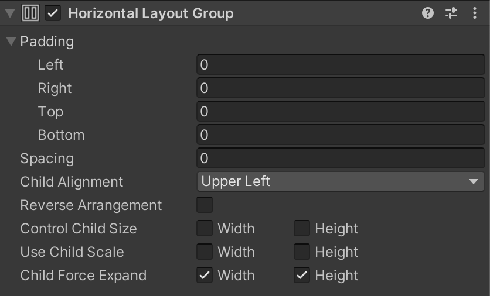

```c#
[AddComponentMenu("Layout/Horizontal Layout Group", 150)]
public class HorizontalLayoutGroup : HorizontalOrVerticalLayoutGroup, ILayoutElement, ILayoutGroup, ILayoutController
```

`HorizontalLayoutGroup` は水平方向に子のレイアウト要素を並べるためのコンポーネントである。

ほぼ全ての実装は、親クラスである `HorizontalOrVerticalLayoutGroup` に実装された機能を利用する形となっている。

それぞれのレイアウト要素の幅は `minWidth`、`preferredWidth`、`flexibleWidth` を用いて以下のように計算される。

1. 全ての子のレイアウト要素の `minWidth`（およびそれらの間のスペース）を全て足した結果を `HorizontalLayoutGroup` の `minWidth` とする。

2. 全ての子のレイアウト要素の `preferredHeight`（およびそれらの間のスペース）を全て足した結果を `HorizontalLayoutGroup` の `preferredHeight` とする。

3. もし `HorizontalLayoutGroup` の幅が `minWidth` 以下だったなら、子のレイアウト要素の幅はそれぞれの `minWidth` となる。

4. `HorizontalLayoutGroup` の幅が `minWidth` 以上かつ `preferredWidth` 以下だったなら、`HorizontalLayoutGroup` の幅が `preferredWidth` に近づけば近づけば近くほど、子のレイアウト要素の幅もそれぞれの `preferredWidth` に近づいていく。

5. `HorizontalLayoutGroup` の幅が `preferredWidth` よりも大きい場合、余った幅を子のレイアウト要素に `flexibleWidth` に応じて配分する。

### HorizontalLayoutGroup の public メソッド

#### CalculateLayoutInputHorizontal

```c#
public virtual void CalculateLayoutInputHorizontal();
```

`ILayoutElement` インターフェースの `CalculateLayoutInputHorizontal()` を実装したメソッドである。

#### CalculateLayoutInputVertical

```c#
public virtual void CalculateLayoutInputVertical();
```

`ILayoutElement` インターフェースの `CalculateLayoutInputVertical()` を実装したメソッドである。

#### SetLayoutHorizontal

```c#
public override void SetLayoutHorizontal();
```

レイアウトの水平方向を処理するために呼ぶ。

#### SetLayoutVertical

```c#
public override void SetLayoutVertical();
```

レイアウトの垂直方向を処理するために呼ぶ。

## VerticalLayoutGroup コンポーネント

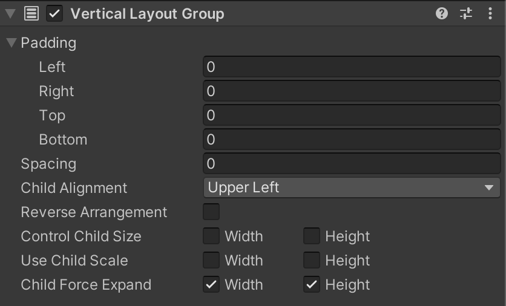

```c#
[AddComponentMenu("Layout/Vertical Layout Group", 151)]
public class VerticalLayoutGroup : HorizontalOrVerticalLayoutGroup, ILayoutElement, ILayoutGroup, ILayoutController
```

`VerticalLayoutGroup` は垂直方向に子のレイアウト要素を並べるためのコンポーネントである。

ほぼ全ての実装は、親クラスである `HorizontalOrVerticalLayoutGroup` に実装された機能を利用する形となっている。

それぞれのレイアウト要素の幅は `minWidth`、`preferredWidth`、`flexibleWidth` を用いて以下のように計算される。

1. 全ての子のレイアウト要素の `minHeight`（およびそれらの間のスペース）を全て足した結果を `VerticalLayoutGroup` の `minHeight` とする。

2. 全ての子のレイアウト要素の `preferredHeight`（およびそれらの間のスペース）を全て足した結果を `VerticalLayoutGroup` の `preferredHeight` とする。

3. もし `VerticalLayoutGroup` の高さが `minHeight` 以下だったなら、子のレイアウト要素の高さはそれぞれの `minHeight` となる。

4. `VerticalLayoutGroup` の幅が `minHeight` 以上かつ `preferredHeight` 以下だったなら、`VerticalLayoutGroup` の幅が `preferredHeight` に近づけば近づけば近くほど、子のレイアウト要素の幅もそれぞれの `preferredHeight` に近づいていく。

5. `VerticalLayoutGroup` の幅が `preferredHeight` よりも大きい場合、余った幅を子のレイアウト要素に `flexibleHeight` に応じて配分する。

### VerticalLayoutGroup の public メソッド

#### CalculateLayoutInputHorizontal

```c#
public virtual void CalculateLayoutInputHorizontal();
```

`ILayoutElement` インターフェースの `CalculateLayoutInputHorizontal()` を実装したメソッドである。

#### CalculateLayoutInputVertical

```c#
public virtual void CalculateLayoutInputVertical();
```

`ILayoutElement` インターフェースの `CalculateLayoutInputVertical()` を実装したメソッドである。

#### SetLayoutHorizontal

```c#
public override void SetLayoutHorizontal();
```

レイアウトの水平方向を処理するために呼ぶメソッドである。

#### SetLayoutVertical

```c#
public override void SetLayoutVertical();
```

レイアウトの垂直方向を処理するために呼ぶメソッドである。

## GridLayoutGroup コンポーネント

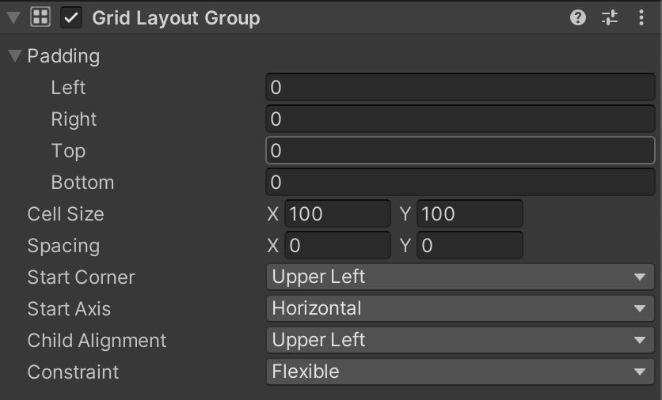

```c#
[AddComponentMenu("Layout/Grid Layout Group", 152)]
public class GridLayoutGroup : LayoutGroup, ILayoutElement, ILayoutGroup, ILayoutController
```

`GridLayoutGroup` は、配下のレイアウト要素を水平/垂直方向に揃えてグリッドのように配置するための `LayoutGroup` である。

他の `LayoutGroup` と異なり、`GridLayoutGroup` は内部のレイアウト要素の min / preferred / flexible のサイズを無視し、固定サイズである `LayoutGroup` の `cellSize` プロパティを全てのレイアウト要素に対して適用する。

`GridLayoutGroup` を `ContentSizeFitter` などの Auto Layout の一部として使う際には特に考慮しなければ点がいくつかある。

Auto Layout システムは水平および垂直方向のサイズをそれぞれ別に計算する。しかし、これは、行の数と列の数がお互いに依存する `GridLayoutGroup` の仕組みとは噛み合わない。

ある特定の数のセルに対して、グリッドを埋める行の数と列の数の組み合わせはいくつか存在しうる。レイアウトシステムを助けるために、`constraint` プロパティを使って行数あるいは列数を固定させることができる。

レイアウトシステムを `ContentSizeFitter` と一緒に使う方法をいくつか提案する。

### flexibleWidth と高さ固定の組み合わせ

要素が増えれば増えるほど水平方向にグリッドが拡大させていきたいのであれば、`flexibleWidth` と高さ固定の組み合わせとなるが、その場合は各プロパティを以下のように設定する。

- `GridLayoutGroup` の `constraint` を `FixedRowCount`
- `ContentSizeFitter` の `horizontalFit` を `PreferredSize`
- `ContentSizeFitter` の `verticalFit` を `PreferredSize` または `Unconstrained`

ただし、`verticalFit` が `Unconstrained` の場合、指定されたセルの列数に合う十分な高さは自前で計算して用意しなければならない。

### 幅固定と flexibleHeight の組み合わせ

要素が増えれば増えるほど垂直方向にグリッドを拡大していきたいのであれば、固定幅と `flexibleHeight` の組み合わせとなるが、その場合は各プロパティを以下のように設定する。

- `GridLayoutGroup` の `constraint` を `FixedColumnCount`
- `ContentSizeFitter` の `horizontalFit` を `PreferredSize` または `Unconstrained`
- `ContentSizeFitter` の `verticalFit` を `Preferred Size`

ただし、`horizontalFit` が `Unconstrained` の場合、指定されたセルの行数に合う十分な幅は自前で計算して用意しなければならない。

### flexibleWidth と flexibleHeight の組み合わせ

`flexibleWidth` と `flexibleHeight` の組み合わせでグリッドを使うことは可能だが、行と列の数を固定させることはできない。グリッドは行と列の数をほぼ同数にしようとする。この場合は、各プロパティを以下のように設定する。

- `GridLayoutGroup` の `constraint` を `Flexible`
- `ContentSizeFitter` の `horizontalFit` を `PreferredSize`
- `ContentSizeFitter` の `verticalFit` を `Preferred Size`

## ContentSizeFitter コンポーネント

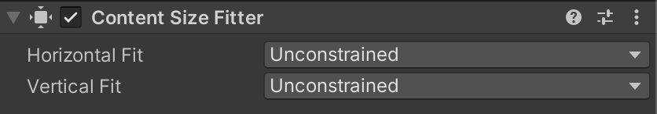

```c#
[AddComponentMenu("Layout/Content Size Fitter", 141)]
[ExecuteAlways]
[RequireComponent(typeof(RectTransform))]
public class ContentSizeFitter : UIBehaviour, ILayoutSelfController, ILayoutController
```

`ContentSizeFitter` は `RectTransform` を中身のサイズに合わせるためのコンポーネントである。

`ContentSizeFitter` は `Text` や `Image` や `HorizontalLayoutGroup` や `VerticalLayoutGroup` や `GridLayoutGroup` などのような `ILayoutElement` を（1 つあるいは複数）持った `GameObject` に対して使うことができる。

`ContentSizeFitter` は自身のレイアウト要素のサイズを制御するレイアウトコントローラーとして機能する。サイズは `GameObject` にアタッチされているレイアウト要素の minimum と preferred によって決まる。そのようなレイアウト要素は `Image` や `Text` やレイアウトグループや Layout Element コンポーネントである。

注意すべきは、`RectTransform` のサイズが変わる際は（それが `ContentSizeFitter` によるものか否かに関わらず）リサイズはピボットを中心に行われるということである。つまり、リサイズの方向はピボットを使って制御することができるということを意味する。

たとえば、ピボットが中央にあったなら、`ContentSizeFitter` は `RectTransform` を全ての方向に等しく拡大する。ピボットが左上にあったなら、`ContentSizeFitter` は `RectTransform` は右下に拡大される。

### ContentSizeFitter のプロパティ

#### horizontalFit

```c#
public ContentSizeFitter.FitMode horizontalFit { get; set; }
```

幅を決めるための Fit モードを取得/設定する。

Fit モードは以下のように定義されている。

```c#
/// <summary>
/// 利用できる Fit モード
/// </summary>
public enum FitMode
{
    /// <summary>
    /// リサイズは行わない
    /// </summary>
    Unconstrained,

    /// <summary>
    /// minimum サイズにリサイズする
    /// </summary>
    MinSize,

    /// <summary>
    /// preferred サイズにリサイズする
    /// </summary>
    PreferredSize
}
```

デフォルト値は `Unconstrained` であり、リサイズは行われない。

#### verticalFit

```c#
public ContentSizeFitter.FitMode verticalFit { get; set; }
```

高さを決めるための Fit モードを取得/設定する。

デフォルト値は `Unconstrained` であり、リサイズは行われない。

### ContentSizeFitter の public メソッド

#### SetLayoutHorizontal

```c#
public virtual void SetLayoutHorizontal();
```

Auto Layout システムがレイアウトの水平方向を処理するために呼ぶメソッドである。

このメソッドは `ILayoutController` インターフェースを実装したメソッドである。

`horizontalFit` の値に応じて `minWidth` あるいは `preferredWidth` を `RectTransform` の幅に設定する。その際は `RectTransform` の `SetSizeWithCurrentAnchors()` メソッドが用いられる。

#### SetLayoutVertical

```c#
public virtual void SetLayoutVertical();
```

Auto Layout システムがレイアウトの垂直方向を処理するために呼ぶメソッドである。

このメソッドは `ILayoutController` インターフェースを実装したメソッドである。

`verticalFit` の値に応じて `minHeight` あるいは `preferredHeight` を `RectTransform` の幅に設定する。その際は `RectTransform` の `SetSizeWithCurrentAnchors()` メソッドが用いられる。

## AspectRatioFitter コンポーネント

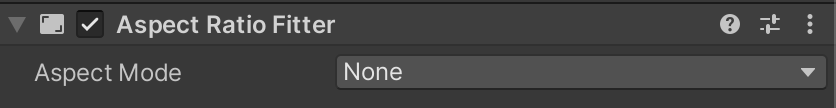

```c#
[AddComponentMenu("Layout/Aspect Ratio Fitter", 142)]
[ExecuteAlways]
[RequireComponent(typeof(RectTransform))]
[DisallowMultipleComponent]
public class AspectRatioFitter : UIBehaviour, ILayoutSelfController, ILayoutController
```

`AspectRatioFitter` は、指定されたアスペクト比および制御方法に基づいて `RectTransform` のサイズを変更するためのコンポーネントである。

### AspectRatioFitter のプロパティ

#### aspectMode

```c#
public AspectRatioFitter.AspectMode aspectMode { get; set; }
```

アスペクト比の制御方法を取得/設定する。

`AspectRatioFitter.AspectMode` の定義は以下の通りである。

```c#
/// <summary>
/// アスペクト比を強制するのに使うモードを指定する。
/// </summary>
public enum AspectMode
{
    /// <summary>
    /// アスペクト比を固定しない。
    /// </summary>
    None,

    /// <summary>
    /// アスペクト比に応じて高さを自動設定する。
    /// </summary>
    WidthControlsHeight,

    /// <summary>
    /// アスペクト比に応じて幅を自動設定する。
    /// </summary>
    HeightControlsWidth,

    /// <summary>
    /// アスペクト比を維持しつつ、親の矩形に完全に含まれるように（はみ出ないように）高さと幅を自動設定する。
    /// </summary>
    FitInParent,

    /// <summary>
    /// アスペクト比を維持しつつ、親の矩形がこの矩形に完全に含まれるように高さと幅を自動設定する。
    /// </summary>
    EnvelopeParent
}
```

デフォルト値は `None` である。

### aspectRatio

```c#
public float aspectRatio { get; set; }
```

アスペクト比（幅を高さで割った値）を取得/設定する。

たとえば、幅が `200` で高さが `100` であった場合、アスペクト比は `2` となる。

デフォルト値は `1` である。

### AspectRatioFitter の public メソッド

#### IsAspectModeValid

```c#
public bool IsAspectModeValid()
```

このアスペクト比の制御が正常に行われているかどうかを返す。
 
実際には、`aspectMode` が `FitInParent` または `EnvelopeParent` であるにも関わらず親が存在しない場合に `false` が返される。それ以外は `true` が返される。

#### IsComponentValidOnObject

```c#
public bool IsComponentValidOnObject()
```

このコンポーネントが有効かどうかを返す。

実際には、同一 `GameObject` に `Canvas` がアタッチされていて、`Canvas` の `renderMode` が `WorldSpace` でない場合に `false` を返す。

#### SetLayoutHorizontal

```c#
public virtual void SetLayoutHorizontal()
```

Auto Layout システムがレイアウトの水平方向を処理するために呼ぶが、中身は空である。

#### SetLayoutVertical

```c#
public virtual void SetLayoutVertical()
```

Auto Layout システムがレイアウトの垂直方向を処理するために呼ぶが、中身は空である。

## パフォーマンスのために Auto Layout ではなく Anchor を活用する

この章では Auto Layout システムを解説してきたが、Auto Layout が常に万能というわけではない。たとえば、`RectTransform` のアンカーを適切に割り当てることで、`RectTransform` の位置とサイズをその親に応じて調整することができる。

`RectTransform` のサイズと位置の計算は Transform システム自身によるネイティブコードで行われる。これは Layout システムに依存するよりも一般的にパフォーマンスが良い。また、`RectTransform` ベースのレイアウトを設定する `MonoBehaviour` を書くことも可能である。Auto Layout を利用する前に、アンカーを活用して目的のレイアウトを実現できないか考えてほしい。

# Chapter 10 EventSystem

`EventSystem` は、キーボードやマウスや画面タッチなどに対応したアプリケーションにおいてオブジェクトにイベントを送るための仕組みである。`EventSystem` はイベントを送るための複数のモジュールから構成されている。

`EventSystem` を `GameObject` にアタッチしても **Inspector** にはほどんど機能が表示されない。これは `EventSystem` が各種モジュール間の連携のためのマネージャーとして設計されているためである。

`EventSystem` の主な役割は以下の通りである。

- 現在選択中の `GameObject` を管理する。

- 現在使用中の InputModule を管理する。

- InputModule を毎フレーム更新する。

- レイキャストを管理する。

InputModule については後述するが、主に入力の処理、イベントの状態の管理、オブジェクトへのイベント送信を行う。

`EventSystem` はシーン内でのイベントの処理を行う。1 つのシーンには 1 つの `EventSystem` のみが置かれるべきである。もし（Additvive なシーンも含めて）シーン内に複数の `EventSystem` が存在していると Warning が表示されるので、マルチシーンを使う場合は注意したい。

`EventSystem` は、同じ `GameObject` にアタッチされている（1 つあるいは複数の）InputModule を探して保持する。

## EventSystem の Update()

`EventSystem` は `Update()` 時に以下の処理を行う。

- 管理している全ての InputModule の `UpdateModule()` を呼ぶ。InputModule の `UpdateModule()` では、マウス位置の更新やクリックやドラッグイベントの処理が行われる。たとえば、クリック時の `IPointerClickHandler` インターフェースの `OnPointerClick()` は `UpdateModule()` から呼ばれる。

- 現在アクティブな InputModule の `Process()` を呼んで以下の処理を行う。
  - 選択されているオブジェクトに対して `IUpdateSelectedHandler` インターフェスの `OnUpdateSelected()` を呼ぶ。
  - マウスのボタンの状態をチェックする。
  - 必要があれば `IMoveHandler` インターフェースの `OnMove()` を呼ぶ。
  - 必要があれば `ISubmitHandler` インターフェースの `OnSubmit()` を呼ぶ
  - 必要があれば `ICancelHandler` インターフェースの `OnCancel()` を呼ぶ

## EventSystem の無効化の際の注意

一時的に全ての入力を無効にするために、現在アクティブな `EventSystem` を無効にすることがあるかもしれない。

```c#
EventSystem.current.enabled = false;
```

このこと自体は問題ないが、ほとんどの場合この設定を行った直後に `EventSystem.current` は `null` となってしまう。なので、再び入力を有効にしようとして

```c#
EventSystem.current.enabled = true;
```

とすると NullReferenceException が発生する。
これを回避するには以下のように `EventSystem` の参照を別に持っておく必要がある。

```c#
EventSystem es = EventSystem.current;
EventSystem.current.enabled = false;
es.enabled = true;
```

もっとも、全ての入力の有効/無効にしたいのであれば、独自の InputModule を作成して、そこで制御したほうが素直かもしれない。独自の InputModule の作成方法については後述する。

## EventSystem コンポーネント

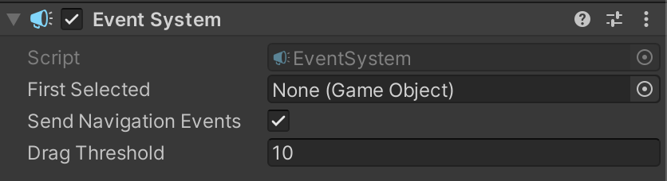

```c#
[AddComponentMenu("Event/Event System")]
[DisallowMultipleComponent]
public class EventSystem : UIBehaviour
```

### EventSystem の static プロパティ

#### current	

```c#
public static EventSystem current { get; set; }
```

現在アクティブな `EventSystem` を取得/設定する。

`EventSystem` は `OnEnable()` が呼ばれた際に static な `EventSystem` のリストに自分自身を登録する。これがアクティブな `EventSystem` となる。

逆に、`OnDisable()` が呼ばれた際に static な `EventSystem` のリストから自身を削除する。これによって `current` はリスト中の別のオブジェクトあるいは `null` になる。`EventSystem` オブジェクトは基本的には同時に 1 つしか存在しないので、`OnDisable()` が呼ばれた後は `current` は `null` となる。

### EventSystem の プロパティ

#### alreadySelecting

```c#
public bool alreadySelecting { get; }
```

現在選択中のオブジェクトを設定済みかどうかを取得する。

`Selectable` が自分自身を現在選択中のオブジェクトとして登録しようとする際に、このプロパティが `true` ではないことを確認する。

#### currentInputModule

```c#
public BaseInputModule currentInputModule { get; }
```

現在アクティブな InputModule を取得する。

#### currentSelectedGameObject

```c#
public GameObject currentSelectedGameObject { get; }
```

現在選択中の `GameObject` を取得する。

現在選択中の `GameObject` は `SetSelectedGameObject()` メソッドで設定される。

#### firstSelectedGameObject

```c#
public GameObject firstSelectedGameObject { get; set; }
```

最初の選択中オブジェクトとなる `GameObject` を取得/設定する。

デフォルト値は `null` なので、最初は何もオブジェクトが選択されていない状態である。

#### isFocused

```c#
public bool isFocused { get; }
```

`EventSystem` がフォーカス状態がどうかを取得する。

デフォルト値は `true` である。

`MonoBehaviour.OnApplicationFocus(bool)` で通知されたアプリケーションのフォーカスの状態がこのプロパティの値となる。

アプリケーションにフォーカスが当たっていない場合、InputModule は毎フレームの処理を行わない。

#### pixelDragThreshold

```c#
public int pixelDragThreshold { get; set; }
```

ドラッグの開始判定の閾値を取得/設定する。

デフォルト値は `10` である。

マウスあるいは指の前回の位置と今回の位置の距離がこのプロパティ以下ならドラッグが開始されたと判定されない。

ただし、`Slider`、`Scrollbar` では `OnInitializePotentialDrag()` で `eventData` の `useDragThreshold` を `false` にしているため、この閾値は使われない。

#### sendNavigationEvents

```c#
public bool sendNavigationEvents { get; set; }
```

Move や Submit や Cancel などのナビゲーションイベントを許可するかを取得/設定する。

デフォルト値は `true` である。

`true` であれば、InputManager が `Process()` でナビゲーションイベントの処理を行う。

### EventSystem の public メソッド

#### IsPointerOverGameObject

```c#
public bool IsPointerOverGameObject();
public bool IsPointerOverGameObject(int pointerId);
```

引数で指定された ID のポインターがいずれかの `GameObject` の上に存在しているか（別の言い方をすると、`OnPointerEnter` を受け取るオブジェクトが存在しているか）を返す。引数を省略すると通常のマウスポインターに対しての判定が行われる。

このメソッドのサンプルコードを以下に示す。

```c#
void Update()
{
    // マウスボタンが押されたかどうかをチェックする
    if (Input.GetMouseButtonDown(0))
    {
        // マウスが UI の上に存在しているかをチェックする
        if (EventSystem.current.IsPointerOverGameObject())
        {
            Debug.Log("UI 上でマウスが押された");
        }    
    }
}
```

なお、ポインターID は以下が定義されている。

|値|定義|説明|
|0以上の整数|Touch.fingerId|タッチしている指のインデックス|
|-1|PointerInputModule.kMouseLeftId|左マウスポインターイベント|
|-2|PointerInputModule.kMouseRightId|右マウスポインターイベント|
|-3|PointerInputModule.kMouseMiddleId|中マウスポインターイベント|
|-4|PointerInputModule.kFakeTouchesId|非タッチデバイスでのタッチシミュレーションイベント|

#### RaycastAll

```c#
public void RaycastAll(PointerEventData eventData, List<RaycastResult> raycastResults);
```

現在存在する全ての Raycaster を使ってシーンに対してレイキャストを行い、結果を`raycastResults` に格納する。

レイキャストについては *Raycaster* の項で後述する。

#### SetSelectedGameObject

```c#
public void SetSelectedGameObject(GameObject selected);
public void SetSelectedGameObject(GameObject selected, BaseEventData pointer);
```

現在選択中の `GameObject` を設定する。

ここで設定した `GameObject` は `currentSelectedGameObject` プロパティで取得できる。ただし、`alreadySelecting` プロパティが `true` の場合は設定できずにエラーが出力される。

既に設定されていた `GameObject` に対しては `OnDeselect()` が呼ばれ、新しく設定された `GameObject` に対しては `OnSelect()` が呼ばれる。

`Selectable` が `OnPointerDown(PointerEventData eventData)` からこのメソッドを呼ぶ際に `eventData` を `pointer` として渡す。

#### UpdateModules

```c#
public void UpdateModules();
```

同じ `GameObject` にアタッチされている（1 つあるいは複数の）InputModule を探して保持する。

このメソッドは `BaseInputModule` の `OnEnable()` および `OnDisable()` のタイミングで呼ばれる。

## EventSystem がサポートするイベント

`EventSystem` は多数のイベントをサポートしており、それらは 独自の InputModule でカスタマイズすることができる。

`StandaloneInputModule` によってサポートされるイベントはインターフェースによって提供されており、そのインターフェースを実装した `MonoBehaviour` で実装することができる。もし、有効な `EventSystem` を持っていたなら、イベントは適切なタイミングで呼ばれる。

以下はイベントのインターフェースと、そのインターフェースで実装するメソッドである。

- `IPointerEnterHandler` : `OnPointerEnter()` を実装する。このメソッドはポインターがオブジェクトに重なったタイミングで呼ばれる。

- `IPointerExitHandler` : `OnPointerExit()` を実装する。このメソッドはポインターがオブジェクトから離れたタイミングで呼ばれる。

- `IPointerDownHandler` : `OnPointerDown()` を実装する。このメソッドはポインターが押されたタイミングで呼ばれる。

- `IPointerUpHandler` : `OnPointerUp()` を実装する。このメソッドはポインターが離されたタミングで呼ばれる。

- `IPointerClickHandler` : `OnPointerClick'()` を実装する。このメソッドはポインターを押して話した結果クリックが確定したタイミングで呼ばれる。

- `IInitializePotentialDragHandler` : `OnInitializePotentialDrag()` を実装する。このメソッドはドラッグ処理が開始する直前に呼ばれる。

- `IBeginDragHandler` : `OnBeginDrag()` を実装する。このメソッドはドラッグが実際に開始した（＝タッチ位置が移動した）タイミングで呼ばれる。

- `IDragHandler` : `OnDrag()` を実装する。このメソッドはドラッグ中に移動があった場合に呼ばれる。

- `IEndDragHandler` : `OnEndDrag()` を実装する。このメソッドはドラッグが終了した際に呼ばれる。

- `IDropHandler` : `OnDrop()` を実装する。このメソッドはドロップが行われた際に呼ばれる。

- `IScrollHandler` : `OnScroll()` を実装する。このメソッドはマウスホイールでのスクロールが
発生した際に呼ばれる。

- `IUpdateSelectedHandler` : `OnUpdateSelected()` を実装する。このメソッドはゲームオブジェクトが選択中である場合に毎フレーム呼ばれる。

- `ISelectHandler` : `OnSelect()` を実装する。このメソッドはゲームオブジェクトが選択された際に呼ばれる。

- `IDeselectHandler` : `OnDeselect()` を実装する。このメソッドはゲームオブジェクトの選択が外れた際に呼ばれる。

- `IMoveHandler` : `OnMove()` を実装する。このメソッドはナビゲーションによる Move イベントが発生した際に呼ばれる。

- `ISubmitHandler` : `OnSubmit()` を実装する。このメソッドは Submit ボタンが押された際に呼ばれる。

- `ICancelHandler` : `OnCancel()` を実装する。このメソッドは Cancel ボタンが押された際に呼ばれる。

## Messaging System

### Messaging System の概要

uGUI では既存の `SendMessage` を置き換えるために設計された新しい Messaging System が利用されている。この Messaging System はピュア C# で書かれており、`SendMessage` の問題を解決する目的で作られている。

この Messaging System は独自のデータを送ることができる。また、イベントをヒエラルキーのどこまで送るのかも指定できる。特定の `GameObject` にのみ送ることもできるし、子や親に送ることもできる。さらに、メッセージングインターフェースを実装した `GameObject` を探すためのヘルパー関数も用意されている。

Messaging System は uGUI のためだけではなく汎用的にも使えるように設計されている。独自のメッセージングイベントを追加するのは比較的簡単であり、uGUI が全てのイベント処理で使っているとの同じフレームワークを使って動作する。

### Messaging System を使って独自のメッセージを送る

Messaging System を使って独自のメッセージを送るのは比較的簡単である。`UnityEngine.EventSystems` 名前空間の中に `IEventSystemHandler` というインターフェースが存在する。これを継承したインターフェースは Messaging System 経由でイベントを受け取れるターゲットとなる。

```c#
using UnityEngine.EventSystems;

// 独自のメッセージを受け取るためのインターフェース
public interface ICustomMessageTarget : IEventSystemHandler
{
    void Message();
    void MessageWithEventData(BaseEventData eventData);
    void MessageWithCustomData(string customData);
    ...
```

上記のようにインターフェースを定義したら `MonoBehaviour` と共に継承する。そうするとメッセージがこの `MonoBehaviour` の `GameObject` に対して発行された際に、メソッドが実行されるようになる。

```c#
using UnityEngine;
using UnityEngine.EventSystems;

// 独自のメッセージを受け取ることができるオブジェクト
public class CustomMessageTarget : MonoBehaviour, ICustomMessageTarget
{
    public void Message()
    {
        Debug.LogFormat("{0} の Message() が呼ばれた", this.name);
    }

    public void MessageWithEventData(BaseEventData eventData)
    {
        Debug.LogFormat("{0} の MessageWithEventData() が呼ばれた", this.name);
    }

    public void MessageWithCustomData(string customData)
    {
        Debug.LogFormat("{0} の MessageWithCustomData() が呼ばれた : {1}", this.name, customData);
    }
}
```

これでメッセージを受け取るスクリプトが出来上がった。次にメッセージを送る必要がある。通常これは疎結合されたイベントに対するものとなる。たとえば、uGUI では `PointerEnter` や `PointerExit` などのイベントを発行する。これは、ユーザーのアプリケーションへの入力に対して起きる他のものと同様である。

メッセージを送るための `ExecuteEvents` というヘルパークラスが存在する。この `ExecuteEvents` の `Execute()` メソッドを使ってメッセージを送信することができる。

```c#
// メッセージを送る先のオブジェクト
GameObject targetObject;
...

// 最もシンプルなメッセージ送信パターン
ExecuteEvents.Execute<ICustomMessageTarget>(targetObject, null, (target, eventData) =>
{
    target.Message();
});

// ターゲットがメッセージを受け取れるかチェックするパターン
if (ExecuteEvents.CanHandleEvent<ICustomMessageTarget>(targetObject))
{
    ExecuteEvents.Execute<ICustomMessageTarget>(targetObject, null, (target, eventData) =>
    {
        target.Message();
    });
}
else
{
    Debug.LogErrorFormat("{0} は ICustomMessageTarget のイベントを処理できません", targetObject.name);
}

// BaseEventData を渡すパターン
BaseEventData sendingEventData = new BaseEventData(EventSystem.current);
ExecuteEvents.Execute<ICustomMessageTarget>(targetObject, sendingEventData, (target, eventData) =>
{
    target.MessageWithEventData(eventData);
});

// 独自の引数を渡すパターン
ExecuteEvents.Execute<ICustomMessageTarget>(targetObject, null, (target, eventData) =>
{
    string customData = "カスタムデータ";
    target.MessageWithCustomData(customData);
});

// メッセージが受け取られなかったなら、その親へ登っていくパターン
ExecuteEvents.ExecuteHierarchy<ICustomMessageTarget>(gameObject, sendingEventData, (target, eventData) =>
{
    target.Message();
});
```

上記のコードは、`ICustomMessageTarget` インターフェースを実装した `GameObject` のコンポーネントに対して `Message()` メソッドの呼び出しを行う。`ExecuteEvents` クラスのリファレンスには子や親などに対してメッセージを送る `Execute()` メソッドが記載されている。

### Messaging System のメリットとデメリット

Messaging System のメリットは以下の通りである。

- `SendMessage()` と違ってインターフェースによるチェックが可能である。

- `SendMessage()` と違って引数を複数渡すことができる。

- `SendMessage()` よりもパフォーマンスが良い。

- **Inspector** の **Intercepted Event** に受け取れるメッセージが表示される。

一方、Messaging System のデメリットは以下の通りである。

- 実装がやや面倒である。

- あくまで特定の `GameObject` にメッセージを送る仕組みであって、不特定多数にメッセージをブロードキャストする仕組みは無い。

これらのメリットとデメリットを検討した上で Messaging System を使うのが良いだろう。

## InputModule 

InputModule は `EventSystem` のメインとなるロジックを担当するクラスである。

InputModule が行う処理は以下の通りである。

- 入力を処理する。

- イベントの状態を管理する。

- イベントをシーン内のオブジェクトに送る。

`EventSystem` 内部で、たった 1 つの InputModule のみがアクティブになることができる。InputModule は `EventSystem` コンポーネントと同一の `GameObject` にアタッチされていなければならない。

もし独自の InputModule を書きたいのであれば、Unity の既存の UI コンポーネントでサポートされているイベントを送信する必要がある。独自のイベントを作成するには前述の *Messaging System* の項の説明を呼んでほしい。

InputModule はイベントシステムのメインロジックを構成しているが、我々がカスタマイズすることが可能である。以前は、ゲームコントローラー/キーボード/マウス用の `StandaloneInputModule` と、スマートフォンなどのタッチパネル用の `TouchInputModule` の 2 種類の InputModule が存在していた。現在では `StandaloneInputModule` で全てのプラットフォームに対応しているので、InputModule というのは `StandaloneInputModule` のことを指すと思ってもらって問題ない。

InputModule はサポートしたい入力システムに基づいて拡張/修正されるように設計されている。InputModule の目的は（タッチやジョイスティックやマウスやモーションコントローラーなどの）ハードウェア固有の入力をメッセージシステム経由で送られるイベントにマッピングすることである。

## StandaloneInputModule コンポーネント

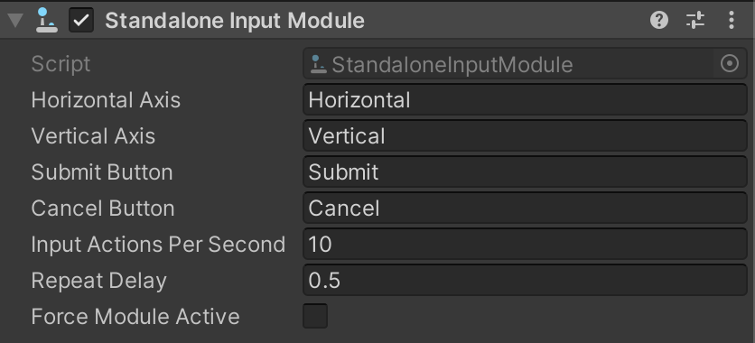

```c#
[AddComponentMenu("Event/Standalone Input Module")]
public class StandaloneInputModule : PointerInputModule
```

`StandaloneInputModule` は、コントローラーとマウス入力を扱うためのコンポーネントである。

ボタン押下やドラッグなどに対するイベントが入力への反応で送られる。

`StandaloneInputModule` は `PointerInputModule` を継承しているが、`PointerInputModule` は主にマウス入力やタッチパネル のための InputModule である。さらに、`PointerInputModule` は `BaseInputModule` という基本となる InputModule を継承している。

`StandaloneInputModule` は、マウスや入力デバイスが動いた際にポインターイベントをコンポーネントに送る。また、どの要素がポインターデバイスによって指されているのかを調べるために `GraphicsRaycaster` や `PhysicsRaycaster` を用いる。

また、`StandaloneInputModule` は *Input* ウィンドウで設定した `Input` に応じて Move や Submit や Cancel イベントを送信する。これはキーボードとコントローラーの入力の両方で動作する。

### StandaloneInputModule で設定可能な項目

`StandaloneInputModule` では以下の項目が設定可能である。

- キーボードとコントローラーによるナビゲーションに使われる Vertical 軸および Horizontal 軸

- Submit および Cancel イベントのボタン

- 秒間当たりに送られるイベントの最大数を決めるためのタイムアウト

### StandaloneInputModule の処理の流れ

`StandaloneInputModule` の処理の流れは以下の通りである。

- **Input** ウィンドウに設定された軸が入力されたなら、現在選択中のオブジェクトに対して Move イベントを送る。

- Submit またはキャンセルボタンが押されたなら、現在選択中のオブジェクトに対して Submit あるいはCancel イベントを送信する。

- マウスの入力を処理する。

  - もしボタン押下開始時なら

    - `PointerEnter` イベントを（受け取ることができるヒエラルキー全てのオブジェクトへ）送る。

    - `PointerPress` イベントを送る。

    - 適切なドラッグハンドラー（ヒエラルキー内でドラッグを処理できる最初の要素）を見つける。

    - 見つかったドラッグハンドラーに `BeginDrag` イベントを送る。

    - Pressed とされたオブジェクトを `EventSystem` の選択中オブジェクトとする。

  - 押下継続中なら

    - Move を処理する。

    - 見つかったドラッグハンドラーに `DragEvent` を送る。

    - もしタッチがオブジェクトの間を移動したなら `PointerEnter` および `PointerExit` を処理する。

  - もし離されたなら

    - `PointerPress` を受け取っていたオブジェクトに `PointerUp` イベントを送る。

    - もし現在の hover オブジェクトが `PointerPress` を受け取っていたオブジェクトなら `PointerClick` イベントを送る。

    - もし見つかったドラッグハンドラーがあったなら Drop イベントを送る。

    - ドラッグハンドラーがあったなら `EndDrag` を送る.

  - スクロールホイールイベントを処理する。

### StandaloneInputModule の static 変数

#### kMouseLeftId

```c#
public const int kMouseLeftId = -1;
```

マウスの左ポインタイベントを表すポインターID。

マウスの左クリックだけではなく、タッチパネルのタッチなどのデフォルトのポインター位置を表すのにも使われる。

#### kMouseRightId

```c#
public const int kMouseRightId = -2;
```

マウスの右ポインタイベントを表すポインターID。

#### kMouseMiddleId

```c#
public const int kMouseMiddleId = -3;
```

マウスの真ん中ポインタイベントを表すポインターID。

#### kFakeTouchesId

```c#
public const int kFakeTouchesId = -4;
```

タッチに対応しないデバイスにおいてタッチをシミュレートする際に用いるポインターID…ということになっているが実際には使われていない。

### StandaloneInputModule のプロパティ

#### cancelButton

```c#
public string cancelButton { get; set; }
```

`Input` において Cancel ボタンを表す文字列を取得/設定する。

デフォルト値は `"Cancel"` である。

*Project Settings* を開いて *Input Manager* を選択し、（複数存在するかもしれない）*Cancel* を開くと実際のキーボードやコントローラーで Cancel に対応するキーやボタンを設定することができる。

以下に Cancel ボタンが押されたことを検知するサンプルコードを示す。

```c#
using UnityEngine;
using UnityEngine.EventSystems;

public class StandaloneInputModuleCancelSample : MonoBehaviour
{
    void Update()
    {
        var inputModule = EventSystem.current.currentInputModule as StandaloneInputModule;

        if (inputModule != null)
        {
            string cancelButtonString = inputModule.cancelButton;

            if (Input.GetButton(cancelButtonString))
            {
                Debug.LogFormat("cancel ボタンが押された : {0}", cancelButtonString);
            }
        }
    }
}
```

#### submitButton

```c#
public string submitButton { get; set; }
```

`Input` において Submit ボタンを表す文字列を取得/設定する。

デフォルト値は `"Submit"` である。

*Project Settings* を開いて *Input Manager* を選択し、（複数存在するかもしれない）*Submit* を開くと実際のキーボードやコントローラーで Submit に対応するキーやボタンを設定することができる。

以下に Submit ボタンが押されたことを検知するサンプルコードを示す。

```c#
using UnityEngine;
using UnityEngine.EventSystems;

public class StandaloneInputModuleSubmitSample : MonoBehaviour
{
    void Update()
    {
        var inputModule = EventSystem.current.currentInputModule as StandaloneInputModule;

        if (inputModule != null)
        {
            string submitButtonString = inputModule.cancelButton;

            if (Input.GetButton(submitButtonString))
            {
                Debug.LogFormat("submit ボタンが押された : {0}", submitButtonString);
            }
        }
    }
}
```

#### horizontalAxis

```c#
public string horizontalAxis { get; set; }
```

`Input` において水平軸を表す文字列を取得/設定する。

デフォルト値は `"Horizontal"` である。

*Project Settings* を開いて *Input Manager* を選択し、（複数存在するかもしれない）*Horizontal* を開くと実際のキーボードやコントローラーで水平軸に対応するキーやボタンを設定することができる。

以下に 水平方向の軸が押されたことを検知するサンプルコードを示す。

```c#
using UnityEngine;
using UnityEngine.EventSystems;

public class StandaloneInputModuleHorizontalSample : MonoBehaviour
{
    void Update()
    {
        var inputModule = EventSystem.current.currentInputModule as StandaloneInputModule;
        if (inputModule != null)
        {
            string horizontalAxis = inputModule.horizontalAxis;

            float axisValue = Input.GetAxis(horizontalAxis);

            if (axisValue > 0)
            {
                Debug.LogFormat("右が押された : {0} {1}", horizontalAxis, axisValue);
            }
            else if (axisValue < 0)
            {
                Debug.LogFormat("左が押された : {0} {1}", horizontalAxis, axisValue);
            }
        }
    }
}
```

#### verticalAxis

```c#
public string verticalAxis { get; set; }
```

`Input` において垂直軸を表す文字列を取得/設定する。

デフォルト値は `"Vertical"` である。

*Project Settings* を開いて *Input Manager* を選択し、（複数存在するかもしれない）*Vertical* を開くと実際のキーボードやコントローラーで垂直軸に対応するキーやボタンを設定することができる。

以下に 垂直方向の軸が押されたことを検知するサンプルコードを示す。

```c#
using UnityEngine;
using UnityEngine.EventSystems;

public class StandaloneInputModuleVerticalSample : MonoBehaviour
{
    void Update()
    {
        var inputModule = EventSystem.current.currentInputModule as StandaloneInputModule;
        if (inputModule != null)
        {
            string verticalAxis = inputModule.verticalAxis;

            float axisValue = Input.GetAxis(verticalAxis);

            if (axisValue > 0)
            {
                Debug.LogFormat("上が押された : {0} {1}", verticalAxis, axisValue);
            }
            else if (axisValue < 0)
            {
                Debug.LogFormat("下が押された : {0} {1}", verticalAxis, axisValue);
            }
        }
    }
}
```

#### forceModuleActive

```c#
public bool forceModuleActive { get; set; }
```

この InputModule を強制的にアクティブにする。

実際には `EventSystem` の `Update()` のタイミングでこの InputModule の `ActivateModule()` が呼ばれる。

#### repeatDelay

```c#
public float repeatDelay { get; set; }
```

キーボード/コントローラーの入力方向が変わっていない場合に Move イベントを送るかどうかの閾値となる秒数を取得/設定する。入力方向が変わっていない場合、`repeatDelay` よりも長い時間が経過しないと Move イベントが送られない。デフォルト値は `0.5f` である。

いかにも汎用的な入力制御用のような名前をしているが、実はそうではないことに注意。

#### inputActionsPerSecond

```c#
public float inputActionsPerSecond { get; set; }
```

キーボード/コントローラーの入力方向が変わった場合に Move イベントを送るかどうかの閾値となる秒数を取得/設定する。入力方向が変わった場合、`1.0f / inputActionsPerSecond` よりも長い
時間が経過しないと move イベントが送られない。デフォルト値は `10` である。

いかにも汎用的な秒間最大入力数のような名前をしているが、実はそうではないことに注意。

#### input

```c#
public BaseInput input { get; }
```

現在使われている `BaseInput` を取得する。

`BaseInput` は、一言で表せば `Input` のラッパーである。後述する `inputOverride` と組み合わせることで、リプレイなどの偽の入力を InputModule に渡すことができる。`BaseInput` の詳細については *BaseInput* の項で後述する。

このプロパティは同一 `GameObject` にアタッチされている `BaseInput` クラスを返すが、存在しなかった場合には `BaseInput` を `AddComponent()` してコンポーネントを追加する。

Play モードにすると、`StandaloneInputModule` と同じ `GameObject` に `BaseInput` コンポーネントがアタッチされているのが確認できるだろう。

#### inputOverride

```c#
public BaseInput inputOverride { get; set; }
```

この InputModule のデフォルトの `BaseInput` を上書きするための `BaseInput` を取得/設定する。

このプロパティを使うことで、同じ InputModule を使いながら入力を差し替えることができる。たとえば、自動デバッグ用に `BaseInput` を継承したコンポーネントを作成して偽の入力を `StandaloneInputModule` を渡すことができるだろう。

### StandaloneInputModule の public メソッド

#### ActivateModule

```c#
public override void ActivateModule();
```

この InputModule がアクティブになった際に呼ばれる。

マウス位置の記録と、`EventSystem` の現在選択中のオブジェクトの設定が行われる。

#### DeactivateModule

```c#
public override void DeactivateModule();
```

この InputModule が非アクティブになった際に呼ばれる。

`EventSystem.OnDisable()` のタイミングで呼ばれる。`EventSystem` の現在選択中のオブジェクトが `null` に設定される。

#### IsModuleSupported

```c#
public override bool IsModuleSupported();
```

この InputModule がサポートされているかどうかを返す。

常に `true` を返す。

このクラスを継承した先で、プラットフォームによってサポート可否を変えたい場合に使うことができる。このメソッドが `false` を返した場合、`EventSystem` はその InputModule をアクティブにしない。

#### IsPointerOverGameObject

```c#
public override bool IsPointerOverGameObject(int pointerId);
```

引数で指定された ID のポインターがいずれかの `GameObject` の上に存在しているか（別の言い方をすると、`OnPointerEnter` を受け取るオブジェクトが存在しているか）を返す。

`EventSystem.IsPointerOverGameObject()` から呼ばれる。

#### UpdateModule

```c#
public override void UpdateModule();
```

内部状態を更新するために毎フレーム呼ばれる。

このメソッドは `EventSystem` の現在の InputModule でなくとも呼ばれる。

#### Process

```c#
public override void Process();
```

毎フレームの処理を行う。

このメソッドは `EventSystem` の現在の InputModule であった場合に呼ばれる。

実際に行う処理は以下の通りである。

- 選択されているオブジェクトに対して `IUpdateSelectedHandler` インターフェスの `OnUpdateSelected` を呼ぶ。

- マウスのボタンの状態をチェックする。

- 必要があれば `IMoveHandler` インターフェースの `OnMove()` を呼ぶ。

- 必要があれば `ISubmitHandler` インターフェースの `OnSubmit()` を呼ぶ。

- 必要があれば `ICancelHandler` インターフェースの `OnCancel()` を呼ぶ。

#### ShouldActivateModule

```c#
public override bool ShouldActivateModule();
```

この InputModule をアクティブにできるかどうかを返す。

このメソッドが `true` を返した場合、この InputModule は `EventSystem` によってアクティブにされる。このメソッドが `true` を返す条件は以下の通りである。

- `GameObject` がアクティブである。

- このコンポーネントの `enabled` が `true` である。

- `forceModuleActive` が `true` になっているか、何らかの入力が行われた。

## BaseInput

`BaseInput` は `BaseInputModule` によって使われる入力システムへのインターフェースである。
 簡単に言ってしまえば、`BaseInput` は `Input` のラッパーである。

`BaseInput` を継承したコンポーネントを作成することによって、同じ InputModule を使いながら入力を差し替えることができる。たとえば、自動デバッグ用に `BaseInput` を継承したコンポーネントを作成して各プロパティやメソッドを override することによって、人為的な入力を `StandaloneInputModule` を渡すことができるだろう。

### BaseInput のプロパティ

#### compositionString

```c#
public virtual string compositionString { get; }
```

現在ユーザーによって入力されている（日本語などの）IME で構成された文字列を取得する。

実際には `Input.compositionString` を取得する。

#### compositionCursorPos

```c#
public virtual Vector2 compositionCursorPos { get; set; }
```

（日本語などの）IME のウィンドウにおける現在のテキスト入力の位置を取得/設定する。

実際には `Input.compositionCursorPos` を取得/設定する。

#### imeCompositionMode

```c#
public virtual IMECompositionMode imeCompositionMode { get; set; }
```

（日本語などの）IME による入力を許可するかどうかを取得/設定する。

実際には `Input.imeCompositionMode` を取得/設定する。

Unity のデフォルトの挙動としては、`InputField` を選択した際に IME は有効になるが、このプロパティを `IMECompositionMode.Off` に設定すれば、IME を無効のままにすることができる。

#### mousePresent

```c#
public virtual bool mousePresent { get; }
```

マウスが存在しているかどうかを取得する。

実際には `Input.mousePresent` を取得する。

#### mousePosition

```c#
public virtual Vector2 mousePosition { get; }
```

マウスの位置を取得する。

画面の左下が `(0, 0)` で、右上は `(Screen.width, Screen.height)` となる。

実際には `Input.mousePresent` ではなく `MultipleDisplayUtilities.GetMousePositionRelativeToMainDisplayResolution()` を取得する。

`MultipleDisplayUtilities` は `UnityEngine.UI` のユーティリティクラスである。`Input.mousePosition` の値はレンダリング領域での座標を返すが、`MultipleDisplayUtilities.GetMousePositionRelativeToMainDisplayResolution()` はその座標をシステム座標に変換して返す。

#### mouseScrollDelta

```c#
public virtual Vector2 mouseScrollDelta { get; }
```

マウススクロールの移動量を取得する。

実際には `Input.mouseScrollDelta` を取得する。

#### touchCount

```c#
public virtual int touchCount { get; }
```

現在の同時タップ数を取得する。

実際には `Input.touchCount` を取得する。なお、`Input.touchCount` は現在のフレーム中では変更されないことが保証されている。

#### touchSupported

```c#
public virtual bool touchSupported { get; }
```

現在のデバイスがタッチをサポートしているかを取得する。

実際には `Input.touchSupported` を取得する。`Input.touchSupported` は現在のプラットフォームよりもさらに細くサポート状況をチェックするので、タッチをサポートするのであればシステムのプラットフォームをチェックするよりはこのプロパティをチェックすることをおすすめする。

### BaseInput の public メソッド

#### GetAxisRaw

```c#
public virtual float GetAxisRaw(string axisName);
```

スムーズ化のフィルタを通していない状態の軸の値を取得する。

実際には `Input.GetAxisRaw()` を返す。

なお、`BaseInput` には `GetAxis()` メソッドは存在しない。

#### GetButtonDown

```c#
public virtual bool GetButtonDown(string buttonName);
```

ボタンが押されているかどうかを返す。

実際には `Input.GetButtonDown()` を返す。

#### GetMouseButton

```c#
public virtual bool GetMouseButton(int button);
```

マウスボタンが押されている状態かどうかを返す。

実際には `Input.GetMouseButtonUp()` を返す。

#### GetMouseButtonDown

```c#
public virtual bool GetMouseButtonDown(int button);
```

マウスボタンが（離された状態から）押されたかどうかを返す。

実際には `Input.GetMouseButtonDown()` を返す。

#### GetMouseButtonUp

```c#
public virtual bool GetMouseButtonUp(int button);
```

マウスボタンが離されたかどうかを返す。

実際には `GetMouseButtonUp.GetMouseButtonUp()` を返す。

#### GetTouch

```c#
public virtual Touch GetTouch(int index)
```

現在のタッチ状況を取得する。

マルチタッチの場合は `index` は `1` 以上を指定する。実際には `Input.GetTouch()` を返す。

## Event Trigger コンポーネント

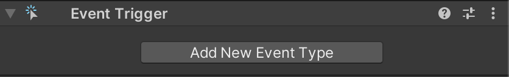

`EventTrigger` は `EventSystem` から任意のイベントを受け取り、イベントに対応したメソッドを呼びたい場合に使用するコンポーネントである。

たとえば、`Image` コンポーネントは `IPointerEnterHandler` を実装しているわけではないのでマウスカーソルが画像の上に重なった際に `OnPointerEnter()` が呼ばれたりはしない。画像を重なった場合の処理を実装したいためだけに `Image` コンポーネントを継承した新しいコンポーネントを作成するのは大げさである。そういった場合にこの `EventTrigger` を使うと便利である。

マウスカーソルが `Image` の上に重なったときになんらかの処理を実行したい場合の手順は以下の通りである。

1. `Image` コンポーネントと同一の `GameObject` に `EventTrigger` コンポーネントをアタッチする。

2. `EventTrigger` の *Add New Event Type* ボタンを押し、*PointerEnter* を選択する。

3. *PointerEnter* に対応したコールバックが設定できるようになったことを確認する。このコールバックは `BaseEventData` 型の引数を 1 つ持つ。よく注意してほしいのだが、引数の型は `PointerEventData` ではなく `BaseEventData` である。

4. 以下のような `TriggeredOnPointerEnter` スクリプトを作成し、`BaseEventData` を受け取るメソッドを作成する。

```c#
using UnityEngine;
using UnityEngine.EventSystems;

public class TriggeredOnPointerEnter : MonoBehaviour
{
    public void MyOnPointerEnter(BaseEventData baseEventData)
    {
        Debug.Log("マウスカーソルが重なった");
    }
}
```

5. 上記の `TriggeredOnPointerEnter` スクリプトを `Image` コンポーネントと同一の `GameObject` にアタッチする。

6. `EventTrigger` の *PointerEnter* に自身の `GameObject` をドラッグし、コールバックとして `MyOnPointerEnter()` を指定する。

以上により、この `Image` の上にマウスカーソルが重なるとログが出力される。

今回は `EventTrigger` の **Inspector** からコールバックを設定したが、スクリプトから設定する場合は以下のようになる。


```c#
using UnityEngine;
using UnityEngine.EventSystems;

[RequireComponent(typeof(EventTrigger))]
public class TriggeredOnPointerEnterFromScript : MonoBehaviour
{
    public void Start()
    {
        var trigger = GetComponent<EventTrigger>();

        // EventTrigger に登録する項目
        var entry = new EventTrigger.Entry();
        entry.eventID = EventTriggerType.PointerEnter;
        entry.callback.AddListener(MyOnPointerEnter);

        // EvnetTrigger に登録する
        trigger.triggers.Add(entry);
    }

    public void MyOnPointerEnter(BaseEventData baseEventData)
    {
        Debug.Log("マウスカーソルが重なった");
    }
}
```

以前は `EventTrigger` の **Inspector** から適切なコールバックを設定することができないバグが存在していたが、Unity 2018.4、Unity 2019.2、Unity 2020.1 以降では修正されている。

<https://issuetracker.unity3d.com/issues/events-generated-by-the-player-input-component-do-not-have-callbackcontext-set-as-their-parameter-type?_ga=2.42604581.127594340.1571029466-241225422.1516255303>

もし、うっかりこのバグに遭遇してしまったなら、Unity のバージョンを上げるか、スクリプトからコールバックを設定するようにしてみてほしい。

なお、`EventTrigger` でイベントを捕獲してしまうと、そのイベントはそれ以上は親には伝播しないので注意してほしい。

### EventTrigger で指定できるイベントの種類

`EventTrigger` で指定できるイベントタイプは `EventTriggerType` として定義されている。

```c#
namespace UnityEngine.EventSystems
{
    public enum EventTriggerType
    {
        /// <summary>
        /// IPointerEnterHandler.OnPointerEnter を捕獲する。
        /// </summary>
        PointerEnter = 0,

        /// <summary>
        /// IPointerExitHandler.OnPointerExit を捕獲する。
        /// </summary>
        PointerExit = 1,

        /// <summary>
        /// IPointerDownHandler.OnPointerDown を捕獲する。
        /// </summary>
        PointerDown = 2,

        /// <summary>
        /// IPointerUpHandler.OnPointerUp を捕獲する。
        /// </summary>
        PointerUp = 3,

        /// <summary>
        /// IPointerClickHandler.OnPointerClick を捕獲する。
        /// </summary>
        PointerClick = 4,

        /// <summary>
        /// IDragHandler.OnDrag を捕獲する。
        /// </summary>
        Drag = 5,

        /// <summary>
        /// IDropHandler.OnDrop を捕獲する。
        /// </summary>
        Drop = 6,

        /// <summary>
        /// IScrollHandler.OnScroll を捕獲する。
        /// </summary>
        Scroll = 7,

        /// <summary>
        /// IUpdateSelectedHandler.OnUpdateSelected を捕獲する。
        /// </summary>
        UpdateSelected = 8,

        /// <summary>
        /// ISelectHandler.OnSelect を捕獲する。
        /// </summary>
        Select = 9,

        /// <summary>
        /// IDeselectHandler.OnDeselect を捕獲する。
        /// </summary>
        Deselect = 10,

        /// <summary>
        /// IMoveHandler.OnMove を捕獲する。
        /// </summary>
        Move = 11,

        /// <summary>
        /// IInitializePotentialDrag.InitializePotentialDrag を捕獲する。
        /// </summary>
        InitializePotentialDrag = 12,

        /// <summary>
        /// IBeginDragHandler.OnBeginDrag を捕獲する。
        /// </summary>
        BeginDrag = 13,

        /// <summary>
        /// IEndDragHandler.OnEndDrag を捕獲する。
        /// </summary>
        EndDrag = 14,

        /// <summary>
        /// ISubmitHandler.Submit を捕獲する。
        /// </summary>
        Submit = 15,

        /// <summary>
        /// ICancelHandler.OnCancel を捕獲する。
        /// </summary>
        Cancel = 16
    }
}
```

いずれの `EventTriggerType` であっても、`EventTrigger` に設定するコールバックの引数は `BaseEventData` 型である。

## Raycaster

### Raycaster の概要

Raycaster はどれにポインターが重なっているのかを調べるのに使われる。

InputModule がポインティングデバイスが何に重なっているのかを調べるためには、シーン内に設定された Raycaster を使うのが普通である。

デフォルトでは 3 つの Raycaster が存在する。

- `GraphicRaycaster` : UI に使われる

- `PhysicsRaycaster` : 3D physics に使われる。

- `Physics2DRaycaster` : 2D physics に使われる

これらはいずれも `BaseRaycaster` を継承している。

```c#
public abstract class BaseRaycaster : UIBehaviour
```

```c#
[AddComponentMenu("Event/Graphic Raycaster")]
[RequireComponent(typeof(Canvas))]
public class GraphicRaycaster : BaseRaycaster
```

```c#
[AddComponentMenu("Event/Physics Raycaster")]
[RequireComponent(typeof(Camera))]
public class PhysicsRaycaster : BaseRaycaster
```

```c#
[AddComponentMenu("Event/Physics 2D Raycaster")]
[RequireComponent(typeof(Camera))]
public class Physics2DRaycaster : PhysicsRaycaster
```

> `BaseRaycaster` と `Physics2DRaycaster` と `PhysicsRaycaster` の名前空間は `UnityEngine.EventSystems` であるのに対して、`GraphicRaycaster` だけは名前空間が `UnityEngine.UI` になっている。

もし `Physics2DRaycaster` または `PhysicsRaycaster` がシーン内に設定されていた場合、非 UI 要素が InputModule からメッセージを受け取るのは簡単である。単にイベントインターフェースを実装したスクリプトをアタッチすれば良い。`PhysicsRaycaster` の利用の仕方の一例を以下に示す。

1. *Main Camera* に `PhysicsRaycaster` をアタッチする。

2. Editor メニューの *GameObject -> 3D Object -> Cube* で Cube を作成する。

3. Cube が *Main Camera* に写るように位置調整する。

4. Cube が `OnPointerClick()` コールバックを受け取れるように以下のスクリプトを作成する。

```c#
using UnityEngine;
using UnityEngine.EventSystems;

public class PointerClickHandlerComponent : MonoBehaviour, IPointerClickHandler
{
    public void OnPointerClick(PointerEventData eventData)
    {
        Debug.Log("クリックされた");
    }
}
```

5. 作成した `PointerClickHandlerComponent` を Cube の `GameObject` にアタッチする。

6. Play モードを開始し、**Game View** 内で Cube をクリックするとログが出力されるのを確認する。

7. 試しに Cube の `BoxCollider` を無効にすると、Cube をクリックしてもログが出力されなくなるのを確認する。

`EventSystem` は現在の入力イベントをどこに送るべきかを調べる方必要があるが、それを行うのが Raycaster である。あるスクリーン空間の位置を与えられると、Raycaster は全ての潜在的なターゲットを集め、それらが与えられた位置の下にあるかどうかを調べて、スクリーンに最も近いオブジェクトを返す。

ある Raycaster がシーン内で有効なら、Input Module から問い合わせがあったときは `EventSystem` によってその Raycaster が使われる。

複数の Raycaster が使われているなら、それら全てがレイキャストを行い、結果は要素への距離に応じてソートされる

uGUI では基本的に入力イベントを処理するために `GraphicRaycaster` コンポーネントが使われる。

Unity 5.4 より前は、`GraphicRaycaster` がアタッチされたアクティブな Canvas 全てが毎フレームレイキャストを投げてポインタの位置をチェックしていた。これはプラットフォームに関わらず発生しており、マウスが無い iOS と Android デバイスでもマウスの位置を探していた。これは純然たる CPU 時間の無駄遣いであり、Unity アプリケーションの CPU フレーム時間の 5% 以上を消費してた。この問題は Unity 5.4 で解決され、それ以降はマウスが存在しないデバイスはマウス位置を探さず、不要なレイキャストを行わない。

`GraphicRaycaster` は比較的素朴な実装であり、`raycastTarget` プロパティが `true` になっている全ての `Graphic` コンポーネントを辿る。それぞれの Raycast Target に対して、Raycaster は複数のテストを行う。もし Raycast Target が全てのテストをパスしたのであれば、ヒットしたリストに追加される。

## GraphicRaycaster

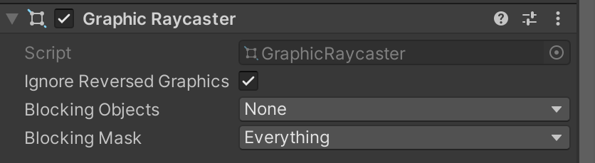

```c#
[AddComponentMenu("Event/Graphic Raycaster")]
[RequireComponent(typeof(Canvas))]
public class GraphicRaycaster : BaseRaycaster
```

`GraphicRaycaster` は `Canvas` に対してレイキャストを行うために使われるコンポーネントである。

`GraphicRaycaster` は `Canvas` 配下の全ての `Graphic` コンポーネントをチェックして、それらのいずれかが特定位置にヒットしていないかを調べる。

Editor から *GameObject -> UI -> Canvas* で作成した `GameObject` には `Canvas` と `CanvasScaler` の他に `GraphicRaycaster` がアタッチされている。

`GraphicRaycaster` は、後面あるいは前面にある `Graphic` を無視したり、2D / 3D オブジェクトを無視したりするように設定することができる。特定の要素の処理をレイキャストの前あるいは後にしたい場合には手動で優先度を設定することもできる。

### GraphicRaycaster のプロパティ

#### eventCamera

```c#
public override Camera eventCamera { get; }
```

この Raycaster に対して Ray を生成するカメラを取得する。

このプロパティは同一 `GameObject` にアタッチされている `Canvas` の設定によって異なる値を返す。このプロパティ以下の順で評価した結果を返す。

1. `Canvas` の `renderMode` が `ScreenSpaceOverlay` なら `null` を返す。
2. `Canvas` の `renderMode` が `ScreenSpaceCamera` かつ `Canvas` の `worldCamera` が `null` なら `null` を返す。
3. `GameObject` にアタッチされている `Canvas` の `worldCamera` が `null` でないならその値を返す。
4. `Camera.main` を返す。

このプロパティは `Camera.ScreenToViewportPoint()` でカメラ空間での位置を取得するのに使われたり、`Graphic.Raycast()` として使われる。

#### renderOrderPriority

```c#
public virtual int renderOrderPriority { get; }
```

Raycaster が複数存在した場合の優先度を取得する。

この値は基本的には `Canvas` の `renderOrder` である。

同一 `GameObject` にアタッチされている `Canvas` の `renderMode` が `ScreenSpaceOverlay` だった場合は `Canvas` の `rootCanvas` の `renderOrder` を返し、そうでなければ `int.MinValue` を返す。

#### rootRaycaster

```c#
public BaseRaycaster rootRaycaster { get; }
```

このヒエラルキーで一番上にある `BaseRaycaster` を取得する。

このプロパティは Bug Fix のために Unity 2019.1 で導入された。

#### sortOrderPriority

```c#
public virtual int sortOrderPriority { get; }
```

`Canvas` の `sortingOrder` に応じた優先度を取得する。

値が高いほうが優先度が高い。`Canvas` の `renderMode` が `ScreenSpaceOverlay` の場合に `Canvas` の `sortingOrder` を返し、そうでない場合は `int.MinValue` を返す。

#### blockingObjects

```c#
public GraphicRaycaster.BlockingObjects blockingObjects { get; set; }
```

2D あるいは 3D オブジェクトが `GraphicRaycaster` をブロックするかどうかを取得/設定する。

デフォルト値は `BlockingObjects.None` であり、つまり、2D あるいは 3D オブジェクトは `GraphicRaycaster` をブロックしない。

このプロパティは `canvas` の `renderMode` が `ScreenSpaceOverlay` 以外の場合にのみ有効である。なぜなら、`ScreenSpaceOverlay` であるなら UI は最前面に表示されるので 2D / 3D オブジェクトにブロックされることはないからである。

`BlockingObjects` の定義は以下の通りである。

```c#
/// <summary>
/// Canvas をブロックする要素をチェックするために使われる Raycaster の種類
/// </summary>
public enum BlockingObjects
{
    /// <summary>
    /// 何もレイキャストを行わない。
    /// </summary>
    None = 0,

    /// <summary> 
    /// 2D レイキャストを行う。
    /// </summary>
    TwoD = 1,

    /// <summary>
    /// 3D レイキャストを行う。
    /// </summary>
    ThreeD = 2,

    /// <summary>
    /// 2D および 3D レイキャストを行う。
    /// </summary>
    All = 3,
}
```

もし 2D レイキャストが有効なら `Physics2D.RaycastAll()` が呼ばれ、3D レイキャストが有効なら `Physics.RaycastAll()` が呼ばれ、それらのレイキャストでヒットしたオブジェクトは `GraphicRaycaster` でのレイキャストヒットをブロックする。

`blockingObjects` の挙動を理解するための手順を以下に示す。

1. *GameObject -> 3D Object -> Cube* で Cube を作成する。

2. Cube が *Main Camera* に写るように調整する。

3. *GameObject -> UI -> Button* で Button を作成する。

4. Button が Cube に半分重なるように調整する。

5. Play モードにする。

6. Button の Cube に隠れた部分をクリックすると Button が反応することを確認する。

7. `Canvas` にアタッチされている `GraphicRaycaster` の *Blocking Objects* を *Three D* に設定する。

8. Button の Cube に隠れた部分をクリックしても Button が反応しないことを確認する。

このように、`blockingObjects` の設定によって、3D オブジェクトによって `GraphicRaycaster` のレイキャストヒットがブロックされるようになることがわかる。

#### blockingMask

```c#
public LayerMask blockingMask { get; set; }
```

`blockingObjects` が `None` 以外の場合に `GraphicRaycaster` をブロックするオブジェクトの `LayerMask` を取得/設定する。

デフォルトでは全ての `LayerMask` のオブジェクトが `GraphicRaycaster` をブロックする。

> このプロパティは、以前は protected だったが Unity 2019.2 から public になった。

`blockingMask` の挙動を理解するための手順を以下に示す。

1. *GameObject -> 3D Object -> Cube* で Cube を作成する。

2. Cube が *Main Camera* に写るように調整する。

3. *GameObject -> UI -> Button* で Button を作成する。

4. Button が Cube に半分重なるように調整する。

5. `Canvas` にアタッチされている `GraphicRaycaster` の *Blocking Objects* を *Three D* に設定する。

6. Cube の *Layer* を **Water** にする

7. Play モードにする。

8. Button の Cube に隠れた部分をクリックしても Button が反応しないことを確認する。

9. `GraphicRaycaster` の *Blocking Mask* の **Water** のチェックを外す。

10. Button の Cube に隠れた部分をクリックすると Button が反応することを確認する。

このように、`blockingMask` の設定によって、`blockingObjects` の対象となるオブジェクトの *Layer* を設定することができる。

#### ignoreReversedGraphics

```c#
public bool ignoreReversedGraphics { get; set; }
```

裏向きになっている UI 要素をレイキャストで無視するかどうかを取得/設定する。

デフォルト値は `true` なので、裏向きになっている UI 要素はレイキャストヒットしない。

裏向きがかどうかの判定は、(`eventCamera` の)正面方向と UI 要素の向きの内積で判定している。

このプロパティの設定はワールド空間の UI でない場合には関係ないと思われがちだが、実はそうでもない。たとえば、スクリーン空間であっても `Button` の `Rotation` が 180 度だった場合、デフォルトではタッチに反応しない。このような場合にタッチに反応させたいのであれば、このプロパティを `false` に設定する必要がある。

### GraphicRaycaster の public メソッド

#### Raycast

```c#
public override void Raycast(PointerEventData eventData, List<RaycastResult> resultAppendList);
```

`eventData` で渡されたポインターの位置に `canvas` 配下の `Graphic` が存在しているかどうかを調べ、その結果を `resultAppendList` に格納する。

このメソッドは `EventSystem.Update()` から（`StandaloneInputModule` の親クラスである）`PointerInputModule` を通じて毎フレーム呼ばれる。

`Raycast()` で行われる処理のフローは以下の通りである。

1. ポインターの位置が `canvas` の外であれば何もしない。

2. `blockingObjects` の設定に応じて 2D / 3D オブジェクトがこのレイキャストをブロックするかを調べる。具体的には `Physics2D.RaycastAll()` と `Physics.RaycastAll()` のいずれかあるいは両方が呼ばれ、そのヒットよりも遠い `Graphic` は無視される。

3. `canvas` 配下の全ての `Graphic` に対して以下の処理を行う。

    - `Graphic` の `raycastTarget` が `false` なら以降の処理をスキップする。
    - `Graphic` の `canvasRenderer` の `cull` が `false` なら以降の処理をスキップする。
    - `Graphic` の `depth` が `-1` なら以降の処理をスキップする。
    - ポインターの位置が `RectTransform` の矩形の外なら以降の処理をスキップする。
    - `eventCamera` が `null` でない場合、`Graphic` が `farClipPlane` より遠くなら以降の処理をスキップする。
    - `Graphic` の `Raycast()` を呼び、ヒットしたならリストにその `Graphic` を追加する。

4. ヒットした `Graphic` のリストを `depth` でソートする。

5. ヒットした `Graphic` それぞれに対して以下の処理を行う。
    - `ignoreReversedGraphics` が `true` なら裏向きの `Graphic` をスキップする。
    - `Graphic` がカメラの裏にあるならスキップする。
    - `blockingObjects` が `None` でない場合、カメラから 2D / 3D オブジェクトまでの距離よりも `Graphic` までの距離が遠いならスキップする。
    - `Graphic` のオブジェクトの情報を `RaycastResult` に格納して `resultAppendList` に追加する。

## PhysicsRaycaster

`PhysicsRaycaster` は `Physics.RaycastAll()` または `Physics.RaycastNonAlloc()` を用いて、ポインターと（カメラに写っている範囲の） `Collider` との衝突判定を行う。

`Camera` がアタッチされている `GameObject` に `PhysicsRaycaster` をアタッチすると、ポインターと `Collider` の衝突判定が行われ、必要に応じて `Collider` がアタッチされているオブジェクトに対してコールバックが呼ばれる。

### PhysicsRaycaster のプロパティ

#### depth

```c#
public virtual int depth { get; }
```

イベントの優先度を決定するための深度を取得する…ということになっているが実際には使われていない。

`eventCamera` が `null` でないなら `eventCamera.depth` を返し、`eventCamera` が `null` なら `0xFFFFFF` を返す。

#### eventCamera

```c#
public override Camera eventCamera { get; }
```

この Raycaster に対して Ray を生成するカメラを取得する。

同一 `GameObject` に `Camera` がアタッチされているならそれを返し、そうでないなら `Camera.main` を返す。

#### eventMask

```c#
public LayerMask eventMask { get; set; }
```

レイキャスト対象をフィルターするための `LayerMask` を取得/設定する。

デフォルト値は `-1`、つまり `Everything` であり、全ての Layer がレイキャストの対象となる。

なお、最終的に `Physics.RaycastAll()` および `Physics.RaycastNonAlloc()` に渡される `LayerMask` は `finalEventMask` で得られる値となる。

#### finalEventMask

```c#
public int finalEventMask { get; }
```

最終的に `Physics.RaycastAll()` および `Physics.RaycastNonAlloc()` に渡される `LayerMask` の値を取得する。

もし、`eventCamera` が `null` でないなら `eventCamera.cullingMask` と `eventMask` の論理積が返される。もし、`eventCamera` が `null` なら `-1` つまり `Everything` が返される。

#### maxRayIntersections

```c#
public int maxRayIntersections { get; set; }
```

検出する Ray のヒット数の最大値を取得/設定する。

デフォルト値は `0` であり、`Physics.RaycastAll()` を使ってヒット数の制限無しでレイキャストヒットを検出する。`0` より大きい場合は `Physics.RaycastNonAlloc()` を使って最大ヒット数を制限してレイキャストヒットを検出する。

勘の良い読者なら気づいたであろうが、デフォルトでは `Physics.RaycastAll()` を呼ぶのでレイキャスト判定の度に GC Alloc が発生する。パフォーマンスを気にするのであれば、ゲームデザインに応じて最大ヒット数を設定しておくのが良いだろう。

### PhysicsRaycaster の public メソッド

#### Raycast

```c#
public override void Raycast(PointerEventData eventData, List<RaycastResult> resultAppendList);
```

`eventData` で渡されたポインターの位置に `Collider` が存在しているかどうかを調べ、その結果を `resultAppendList` に格納する。

このメソッドは `EventSystem.Update()` から（`StandaloneInputModule` の親クラスである）`PointerInputModule` を通じて毎フレーム呼ばれる。

`Raycast()` で行われる処理のフローは以下の通りである。

1. `eventCamera` が `null` なら何もしない。

2. ポインターの位置が `eventCamera` の `pixelRect` の外側なら何もしない。

3. `eventCamera.ScreenPointToRay()` にポインター位置を渡して `Ray` を作成する。

4. `maxRayIntersections` が `0` なら `Physics.RaycastAll()` を呼び、`Ray` とヒットする `Collider` を検出する。`maxRayIntersections` が `0` 以外なら `Physics.RaycastNonAlloc()` を呼び、`Ray` とヒットする `Collider` を検出する。

5. ヒットした `Collider` をソートして、`resultAppendList` に追加する。

## Physics2DRaycaster

```c#
[AddComponentMenu("Event/Physics 2D Raycaster")]
[RequireComponent(typeof(Camera))]
public class Physics2DRaycaster : PhysicsRaycaster
```

`Physics2DRaycaster` は `Physics2D.RaycastAll()` または `Physics2D.RaycastNonAlloc()` を用いて、ポインターと（カメラに写っている範囲の）`Collider` との衝突判定を行う。

`Camera` がアタッチされている `GameObject` に `Physics2DRaycaster` をアタッチすると、ポインターと `Collider` の衝突判定が行われ、必要に応じて `Collider` がアタッチされているオブジェクトに対してコールバックが呼ばれる。

`Physics2DRaycaster` は `PhysicsRaycaster` を継承しており、`Raycast()` メソッド以外の機能は `PhysicsRaycaster` と共通となっている。なので、`Raycast()` 以外のメソッドとプロパティについては `PhysicsRaycaster` を参照してほしい。

### Physics2DRaycaster の public メソッド

```c#
public override void Raycast(PointerEventData eventData, List<RaycastResult> resultAppendList);
```

`eventData` で渡されたポインターの位置に `Collider2D` が存在しているかどうかを調べ、その結果を `resultAppendList` に格納する。

このメソッドは `EventSystem.Update()` から（`StandaloneInputModule` の親クラスである）`PointerInputModule` を通じて毎フレーム呼ばれる。

`Raycast()` で行われる処理のフローは以下の通りである。

1. `eventCamera` が `null` なら何もしない。

2. ポインターの位置が `eventCamera` の `pixelRect` の外側なら何もしない。

3. `eventCamera.ScreenPointToRay()` にポインター位置を渡して `Ray` を作成する。

4. `maxRayIntersections` が `0` なら `Physics2D.GetRayIntersectionAll()` を呼び、`Ray` とヒットする `Collider2D` を検出する。`maxRayIntersections` が `0` 以外なら `Physics2D.GetRayIntersectionNonAlloc()` を呼び、`Ray` とヒットする `Collider2D` を検出する。

5. ヒットした `Collider2D` をソートして、`resultAppendList` に追加する。

> `Ray` とのヒット判定に `Physics2D.RaycastAll()` と `Physics2D.RaycastNonAlloc()` ではなく、`Physics2D.GetRayIntersectionAll()` と `Physics2D.GetRayIntersectionNonAlloc()` が呼ばれているが、最終的にはどちらも `Physics2D.OverlapPointAll()` と `Physics2D.OverlapPointNonAlloc()` が呼ばれる。

## StandaloneInputModule の拡張

`StandaloneInputModule` を拡張することで

1. 一定時間内のタッチ/クリックの連打を防ぐ。

2. タッチ/クリックを一括無効にするフラグを用意する。

3. SafeArea 内のタップを無効にする。

4. Scroll View 内の Click 判定を改善する。

といった便利機能を実現することができる。

ただし、`StandaloneInputModule` コンポーネントは拡張する前提の設計になっていない。なので、`StandaloneInputModule` をコピーしたクラスを作成して、そのクラスを変更していくことになる。

```c#
using System;
using UnityEngine;
using UnityEngine.Serialization;

namespace UnityEngine.EventSystems
{
    [AddComponentMenu("Event/Custom Standalone Input Module")]
    /// <summary>
    /// マウス/キーボード/コントローラーの入力を処理する独自の Input Module
    /// </summary>
    public class CustomStandaloneInputModule : PointerInputModule
    {
        // 以下、StandaloneInputModule のコピー
...
```

### 一定時間内のタッチ/クリックの連打を防ぐ

誤操作や不具合発生を回避するため、一定時間内のタップの連打を防ぎたいことはよくあるだろう。各 UI 要素側で防ぐこともできるが、InputModule 側でタップイベント自体をキャンセルしたほうが確実である。

具体的には、`StandaloneInputModule` でタッチパネルのタッチ処理を担当する `ProcessTouchPress()` メソッドおよびマウスのクリック処理を担当する `ProcessMousePress()` で一定時間内のタッチ/クリックを無効にするように変更すれば良い。

### タッチ/クリックを一括無効にするフラグを用意する

こちらも上記の `ProcessTouchPress()` および `ProcessMousePress()` でフラグに応じて、タッチ/クリックを無効にするようにすれば良い。

### SafeArea 内のタップを無効にする

iOS では SafeArea 内ではタッチ/クリックが発生すると AppStore での審査に落ちる可能性がある。この対応を各 UI 要素で対応しようとすると結構厄介だが、InputModule 側で処理すると楽である。

### ScrollView 内の Click 判定を改善する

デフォルトの状態では Scroll View 内に `Button` を配置すると、スクロールのドラッグ判定のほうが優先されるために `Button` のクリック判定が厳しくなってしまう。この問題を解決するためにいくつかの解決策が考えられる。

1. `pixelDragThreshold` の値を大きくする

    マウスや指の前回の位置と今回の位置の距離が `EventSystem.current.pixelDragThreshold` の値よりも小さい場合、ドラッグが開始されたとはみなされない。`EventSystem.current.pixelDragThreshold` のデフォルト値は `10` であるが、この値を大きくすることでドラッグ判定が厳しくなり、その結果として `Button` のクリック判定が行われるようになる。

    ```c#
    EventSystem.current.pixelDragThreshold = 20;
    ```

    ただし、この設定は現在の `EventSystem` 全体に影響が及ぶので注意が必要である。

2. `StandaloneInputModule` をカスタマイズしてドラッグ終了時にもクリック判定が行われるようにする。

    `ReleaseMouse()` メソッドで該当の処理を入れることになる。ただし、ドラッグ終了時に常にクリック判定を行うようにすると逆にクリックの誤爆が増えかねないので、ドラッグ移動距離に基づいてクリック判定を行うかどうかを決めたほうがいいだろう。

## CustomStandaloneInputModule の作成

ここまで説明してきた機能を実装した `StandaloneInputModule` の拡張は、以下のようなソースコードになる。

```c#
//#define DebugCustomStandaloneInputModule // デバッグログ出力用

using System;
using UnityEngine;
using UnityEngine.Serialization;

namespace UnityEngine.EventSystems
{
    [AddComponentMenu("Event/Custom Standalone Input Module")]
    /// <summary>
    /// マウス/キーボード/コントローラーの入力を処理する独自の Input Module
    /// </summary>
    public class CustomStandaloneInputModule : PointerInputModule
    {
        private float m_PrevActionTime;
        private Vector2 m_LastMoveVector;
        private int m_ConsecutiveMoveCount = 0;

        private Vector2 m_LastMousePosition;
        private Vector2 m_MousePosition;

        private GameObject m_CurrentFocusedGameObject;

        private PointerEventData m_InputPointerEvent;

        /// <summary>
        /// ダブルクリック判定の有効時間（秒）
        /// </summary>
        public float multiClickPeriod = 0.3f;

        /// <summary>
        /// 前回の Pointer Down 後から再度 Pointer Down が有効になるまでの時間（秒）。
        /// いわゆる連打対策に使うことができる。
        /// </summary>
        public float validPressInterval = 0.0f;

        /// <summary>
        /// ドラッグしてもクリック判定を有効にする距離（ピクセル数）。画面解像度に依存する。
        /// </summary>
        public float dragThreshold = 50f;

        /// <summary>
        /// 押下イベント処理を無視するかどうかを指定できる。
        /// </summary>
        public bool ignorePressEvent { get; set; } = false;

        /// <summary>
        /// 前回の Pointer Down の時間
        /// </summary>
        private float lastPointerDownTime = 0;


        protected CustomStandaloneInputModule()
        {
        }

        protected override void Awake()
        {
            base.Awake();
        }

        /// <summary>
        /// 水平軸を表す文字列
        /// </summary>
        [SerializeField]
        private string m_HorizontalAxis = "Horizontal";

        /// <summary>
        /// 垂直軸を表す文字列
        /// </summary>
        [SerializeField]
        private string m_VerticalAxis = "Vertical";

        /// <summary>
        /// Submit（決定）ボタンを表す文字列
        /// </summary>
        [SerializeField]
        private string m_SubmitButton = "Submit";

        /// <summary>
        /// Cancel ボタンを表す文字列
        /// </summary>
        [SerializeField]
        private string m_CancelButton = "Cancel";

        /// <summary>
        /// キーボード/コントローラーの入力方向が変わった場合に Move イベントを送るかどうかの閾値となる秒数
        /// </summary>
        [SerializeField]
        private float m_InputActionsPerSecond = 10;

        /// <summary>
        /// キーボード/コントローラーの入力方向が変わっていない場合に Move イベントを送るかどうかの閾値となる秒数
        /// </summary>
        [SerializeField]
        private float m_RepeatDelay = 0.5f;

        [SerializeField]
        [FormerlySerializedAs("m_AllowActivationOnMobileDevice")]
        private bool m_ForceModuleActive;

        /// <summary>
        /// この InputModule を強制的にアクティブにするかどうか
        /// </summary>
        /// <remarks>
        /// もしこれより高い優先度の高いモジュールがなかったなら、非アクティブにしようとしても強制的にアクティブになる
        /// </remarks>
        public bool forceModuleActive
        {
            get { return m_ForceModuleActive; }
            set { m_ForceModuleActive = value; }
        }

        /// <summary>
        /// キーボード/コントローラーの入力方向が変わった場合に Move イベントを送るかどうかの閾値となる秒数
        /// </summary>
        public float inputActionsPerSecond
        {
            get { return m_InputActionsPerSecond; }
            set { m_InputActionsPerSecond = value; }
        }

        /// <summary>
        /// キーボード/コントローラーの入力方向が変わっていない場合に Move イベントを送るかどうかの閾値となる秒数
        /// </summary>
        /// <remarks>
        /// もし、同じ方向が維持されているなら、inputActionsPerSecond プロパティがイベント発火率の制御に使える。しかし、ユーザーがうっかり同じアクションを受け取らないように、初回の繰り返しは遅らせることが望ましい。
        /// </remarks>
        public float repeatDelay
        {
            get { return m_RepeatDelay; }
            set { m_RepeatDelay = value; }
        }

        /// <summary>
        /// 水平軸を表す文字列
        /// </summary>
        public string horizontalAxis
        {
            get { return m_HorizontalAxis; }
            set { m_HorizontalAxis = value; }
        }

        /// <summary>
        /// 垂直軸を表す文字列
        /// </summary>
        public string verticalAxis
        {
            get { return m_VerticalAxis; }
            set { m_VerticalAxis = value; }
        }

        /// <summary>
        /// Submit ボタンを表す文字列
        /// </summary>
        public string submitButton
        {
            get { return m_SubmitButton; }
            set { m_SubmitButton = value; }
        }

        /// <summary>
        /// Cancel ボタンを表す文字列
        /// </summary>
        public string cancelButton
        {
            get { return m_CancelButton; }
            set { m_CancelButton = value; }
        }

        private bool ShouldIgnoreEventsOnNoFocus()
        {
#if UNITY_EDITOR
            return !UnityEditor.EditorApplication.isRemoteConnected;
#else
            return true;
#endif
        }

        public override void UpdateModule()
        {
            if (!eventSystem.isFocused && ShouldIgnoreEventsOnNoFocus())
            {
                if (m_InputPointerEvent != null && m_InputPointerEvent.pointerDrag != null && m_InputPointerEvent.dragging)
                {
                    ReleaseMouse(m_InputPointerEvent, m_InputPointerEvent.pointerCurrentRaycast.gameObject);
                }

                m_InputPointerEvent = null;

                return;
            }

            m_LastMousePosition = m_MousePosition;
            m_MousePosition = input.mousePosition;
        }

        public override bool IsModuleSupported()
        {
            return m_ForceModuleActive || input.mousePresent || input.touchSupported;
        }

        public override bool ShouldActivateModule()
        {
            if (!base.ShouldActivateModule())
                return false;

            var shouldActivate = m_ForceModuleActive;
            shouldActivate |= input.GetButtonDown(m_SubmitButton);
            shouldActivate |= input.GetButtonDown(m_CancelButton);
            shouldActivate |= !Mathf.Approximately(input.GetAxisRaw(m_HorizontalAxis), 0.0f);
            shouldActivate |= !Mathf.Approximately(input.GetAxisRaw(m_VerticalAxis), 0.0f);
            shouldActivate |= (m_MousePosition - m_LastMousePosition).sqrMagnitude > 0.0f;
            shouldActivate |= input.GetMouseButtonDown(0);

            if (input.touchCount > 0)
                shouldActivate = true;

            return shouldActivate;
        }

        /// <summary>
        /// この InputModule がアクティブになった際に呼ばれる。
        /// </summary>
        public override void ActivateModule()
        {
            if (!eventSystem.isFocused && ShouldIgnoreEventsOnNoFocus())
                return;

            base.ActivateModule();
            m_MousePosition = input.mousePosition;
            m_LastMousePosition = input.mousePosition;

            var toSelect = eventSystem.currentSelectedGameObject;
            if (toSelect == null)
                toSelect = eventSystem.firstSelectedGameObject;

            eventSystem.SetSelectedGameObject(toSelect, GetBaseEventData());
        }

        /// <summary>
        /// この InputModule が非アクティブになった際に呼ばれる。
        /// </summary>
        public override void DeactivateModule()
        {
            base.DeactivateModule();
            ClearSelection();
        }

        public override void Process()
        {
            if (!eventSystem.isFocused && ShouldIgnoreEventsOnNoFocus())
                return;

            bool usedEvent = SendUpdateEventToSelectedObject();

            // case 1004066
            // ナビゲーションイベントが現在選択中の GameObject を変更して、Submit ボタンがタッチ/マウスボタンであるなら
            // タッチ/マウスイベントは ナビゲーションイベントの前に処理されるべきである。

            // マウスエミュレーションレイヤーのためにタッチを優先する必要がある
            if (!ProcessTouchEvents() && input.mousePresent)
                ProcessMouseEvent();

            if (eventSystem.sendNavigationEvents)
            {
                if (!usedEvent)
                    usedEvent |= SendMoveEventToSelectedObject();

                if (!usedEvent)
                    SendSubmitEventToSelectedObject();
            }
        }

        private bool ProcessTouchEvents()
        {
            for (int i = 0; i < input.touchCount; ++i)
            {
                Touch touch = input.GetTouch(i);

                if (touch.type == TouchType.Indirect)
                    continue;

                bool released;
                bool pressed;
                var pointer = GetTouchPointerEventData(touch, out pressed, out released);

                ProcessTouchPress(pointer, pressed, released);

                if (!released)
                {
                    ProcessMove(pointer);
                    ProcessDrag(pointer);
                }
                else
                    RemovePointerData(pointer);
            }
            return input.touchCount > 0;
        }

        /// <summary>
        /// このメソッドはタッチイベントを処理する際に Unity から呼ばれる。タッチイベントを処理する独自の実装を行いたいのであればこのメソッドを override すること。
        /// </summary>
        /// <param name="pointerEvent">タッチイベントの対象オブジェクトに送られる位置や ID などのこのタッチイベントのイベントデータ。</param>
        /// <param name="pressed">タッチイベントの最初のフレームであれば true が渡され、それ以降のフレームであれば false が渡される。よってタッチイベントが発生した瞬間かどうかを判定するのに使うことができる。</param>
        /// <param name="released">タッチイベントの最後のフレームであれば true が渡される。</param>
        /// <remarks>
        /// このメソッドは派生クラスで override することでタッチイベントの処理を変えることができる。
        /// </remarks>
        protected void ProcessTouchPress(PointerEventData pointerEvent, bool pressed, bool released)
        {
            if (pressed)
            {
                ProcessTouchPressPressed(pointerEvent);
            }

            if (released)
            {
                ProcessTouchPressReleased(pointerEvent);
            }

            m_InputPointerEvent = pointerEvent;
        }

        /// <summary>
        /// タッチパネルの指が押されたのを処理する
        /// </summary>
        protected void ProcessTouchPressPressed(PointerEventData pointerEvent)
        {
            // 押下イベントを無視するように指定されているなら終了
            if (ignorePressEvent)
            {
                return;
            }

            // クリック判定は TimeScale の影響を受けない
            float time = Time.unscaledTime;

            // もし前回の押下から一定時間が経過していないなら終了
            if (time - lastPointerDownTime < validPressInterval)
            {
#if DebugCustomStandaloneInputModule
                Debug.LogFormat("前回の押下から時間が経っていない : {0} - {1} < {2}", time, lastPointerDownTime, validPressInterval);
#endif
                return;
            }

            lastPointerDownTime = time;

            // SafeArea 外の押下なら終了
            if (!Screen.safeArea.Contains(pointerEvent.position))
            {
#if DebugCustomStandaloneInputModule
                Debug.LogFormat("SafeArea の外 : {0}", pointerEvent.position);
#endif
                return;
            }

            // 現在指が重なっている GameObject
            var currentOverGo = pointerEvent.pointerCurrentRaycast.gameObject;

            pointerEvent.eligibleForClick = true;
            pointerEvent.delta = Vector2.zero;
            pointerEvent.dragging = false;
            pointerEvent.useDragThreshold = true;
            pointerEvent.pressPosition = pointerEvent.position;
            pointerEvent.pointerPressRaycast = pointerEvent.pointerCurrentRaycast;

            // 指が重なっている GameObject が変わったなら
            // 選択中オブジェクトを解除する
            DeselectIfSelectionChanged(currentOverGo, pointerEvent);

            // 指が重なっている GameObject が変わったなら…                
            if (pointerEvent.pointerEnter != currentOverGo)
            {
                // IPointerExitHandler の OnPointerExit イベントと
                // IPointerEnterHandler の OnPointerEnter イベントを送る
                HandlePointerExitAndEnter(pointerEvent, currentOverGo);
                pointerEvent.pointerEnter = currentOverGo;
            }

            // 指が重なっている GameObject およびその親以上の階層に
            // Pointer Down イベントを処理できるハンドラ（＝IPointerDownHandler を実装した GameObject）が無いか探し、
            // 見つかったらその GameObject へ OnPointerDown イベントを送る
            var newPressed = ExecuteEvents.ExecuteHierarchy(currentOverGo, pointerEvent, ExecuteEvents.pointerDownHandler);

            // 指が重なっている GameObject およびその親以上の階層に
            // Click イベントを処理できるハンドラ（＝IPointerDownHandler を実装した GameObject）が無いか探す。
            // ただし、Click イベントはまだ送らない。
            var newClick = ExecuteEvents.GetEventHandler<IPointerClickHandler>(currentOverGo);

            // Pointer Down イベントを処理できるハンドラが見つからなかったなら、
            // 便宜上 Click イベントを処理するオブジェクトを Pointer Down イベントを処理するハンドラとみなす。
            if (newPressed == null)
            {
                newPressed = newClick;
            }

#if DebugCustomStandaloneInputModule
            Debug.Log("タップされた : " + newPressed);
#endif

            // 前回と同じ GameObject が押されたなら
            if (newPressed == pointerEvent.lastPress)
            {
                var diffTime = time - pointerEvent.clickTime;

#if DebugCustomStandaloneInputModule
                Debug.Log("前回のタップからの経過秒数 : " + diffTime);
#endif

                // クリック間隔が短ければダブルタップ（あるいはそれ以上）とする
                if (diffTime < multiClickPeriod)
                {
                    ++pointerEvent.clickCount;
                }                
                else
                {
                    pointerEvent.clickCount = 1;
                }

                pointerEvent.clickTime = time;
            }
            else
            {
                // 前回とは違う GameObject が押されたのでシングルタップ
                pointerEvent.clickCount = 1;
            }

#if DebugCustomStandaloneInputModule
            switch (pointerEvent.clickCount)
            {
                case 1:
                    Debug.Log("シングルタップ"); ;
                    break;

                case 2:
                    Debug.Log("ダブルタップ"); ;
                    break;

                default:
                    Debug.LogFormat("{0} 回タップ", pointerEvent.clickCount);
                    break;
            }
#endif

            pointerEvent.pointerPress = newPressed;
            pointerEvent.rawPointerPress = currentOverGo;
            pointerEvent.pointerClick = newClick;
            pointerEvent.clickTime = time;

            // 指が重なっている GameObject およびその親以上の階層に
            // ドラッグを処理できるハンドラ（＝IDragHandler を実装した GameObject）が無いか探す                
            pointerEvent.pointerDrag = ExecuteEvents.GetEventHandler<IDragHandler>(currentOverGo);

            // ドラッグを処理できるハンドラがあるなら、その GameObject に対して
            // （もし実装しているなら）IInitializePotentialDragHandler の OnInitializePotentialDrag イベントを送る
            if (pointerEvent.pointerDrag != null)
            {
                ExecuteEvents.Execute(pointerEvent.pointerDrag, pointerEvent, ExecuteEvents.initializePotentialDrag);
            }
        }

        /// <summary>
        /// タッチパネルの指が離されたのを処理する
        /// </summary>
        protected void ProcessTouchPressReleased(PointerEventData pointerEvent)
        {
            var currentOverGo = pointerEvent.pointerCurrentRaycast.gameObject;

            // PointerUp イベントを送る
            ExecuteEvents.Execute(pointerEvent.pointerPress, pointerEvent, ExecuteEvents.pointerUpHandler);

#if DebugCustomStandaloneInputModule
            Debug.Log("指が離された");
#endif

            // 現在重なっている GameObject が Click ハンドラだったなら
            var pointerClickHandler = ExecuteEvents.GetEventHandler<IPointerClickHandler>(currentOverGo);


            if (pointerEvent.pointerClick == pointerClickHandler && pointerEvent.eligibleForClick)
            {
                // OnPointerClick を送る
                ExecuteEvents.Execute(pointerEvent.pointerClick, pointerEvent, ExecuteEvents.pointerClickHandler);
            }
            else if (pointerEvent.pointerDrag != null && pointerEvent.dragging)
            {
                Debug.Log("距離 " + (pointerEvent.pressPosition - pointerEvent.position).magnitude);

                // ドラッグ中かつ移動距離が一定未満ならクリックを有効にする
                // （※ 移動距離は解像度に依存する）
                if ((pointerEvent.pressPosition - pointerEvent.position).sqrMagnitude < dragThreshold * dragThreshold)
                {
                    Debug.Log("追加クリック");
                    ExecuteEvents.Execute(pointerEvent.pointerClick, pointerEvent, ExecuteEvents.pointerClickHandler);
                }

                // OnDrop を送る
                ExecuteEvents.ExecuteHierarchy(currentOverGo, pointerEvent, ExecuteEvents.dropHandler);
            }

            pointerEvent.eligibleForClick = false;
            pointerEvent.pointerPress = null;
            pointerEvent.rawPointerPress = null;
            pointerEvent.pointerClick = null;

            // OnEndDrag を送る
            if (pointerEvent.pointerDrag != null && pointerEvent.dragging)
            {
                ExecuteEvents.Execute(pointerEvent.pointerDrag, pointerEvent, ExecuteEvents.endDragHandler);
            }

            pointerEvent.dragging = false;
            pointerEvent.pointerDrag = null;

            // OnPointerExit を送る
            ExecuteEvents.ExecuteHierarchy(pointerEvent.pointerEnter, pointerEvent, ExecuteEvents.pointerExitHandler);
            pointerEvent.pointerEnter = null;
        }

        /// <summary>
        /// 現在選択中のオブジェクトに Submit を送る。
        /// </summary>
        /// <returns>Submit イベントが選択中のオブジェクトによって使われたなら true を返す。</returns>
        protected bool SendSubmitEventToSelectedObject()
        {
            if (eventSystem.currentSelectedGameObject == null)
                return false;

            var data = GetBaseEventData();
            if (input.GetButtonDown(m_SubmitButton))
                ExecuteEvents.Execute(eventSystem.currentSelectedGameObject, data, ExecuteEvents.submitHandler);

            if (input.GetButtonDown(m_CancelButton))
                ExecuteEvents.Execute(eventSystem.currentSelectedGameObject, data, ExecuteEvents.cancelHandler);
            return data.used;
        }

        private Vector2 GetRawMoveVector()
        {
            Vector2 move = Vector2.zero;
            move.x = input.GetAxisRaw(m_HorizontalAxis);
            move.y = input.GetAxisRaw(m_VerticalAxis);

            if (input.GetButtonDown(m_HorizontalAxis))
            {
                if (move.x < 0)
                    move.x = -1f;
                if (move.x > 0)
                    move.x = 1f;
            }
            if (input.GetButtonDown(m_VerticalAxis))
            {
                if (move.y < 0)
                    move.y = -1f;
                if (move.y > 0)
                    move.y = 1f;
            }
            return move;
        }

        /// <summary>
        /// Calculate and send a move event to the current selected object.
        /// 現在選択中のオブジェクトに Move イベントを送る
        /// </summary>
        /// <returns>Move イベントが選択中のオブジェクトによって使われたなら true を返す。</returns>
        protected bool SendMoveEventToSelectedObject()
        {
            float time = Time.unscaledTime;

            Vector2 movement = GetRawMoveVector();
            if (Mathf.Approximately(movement.x, 0f) && Mathf.Approximately(movement.y, 0f))
            {
                m_ConsecutiveMoveCount = 0;
                return false;
            }

            bool similarDir = (Vector2.Dot(movement, m_LastMoveVector) > 0);

            // 方向が 90 度以上変わっていないなら次のイベントまで待つ
            if (similarDir && m_ConsecutiveMoveCount == 1)
            {
                if (time <= m_PrevActionTime + m_RepeatDelay)
                    return false;
            }
            // もし方向が 90 度以上変わったか、一定時間が経過したなら、m_InputActionsPerSecond から計算される間隔で繰り返す
            // If direction changed at least 90 degree, or we already had the delay, repeat at repeat rate.
            else
            {
                if (time <= m_PrevActionTime + 1f / m_InputActionsPerSecond)
                    return false;
            }

            var axisEventData = GetAxisEventData(movement.x, movement.y, 0.6f);

            if (axisEventData.moveDir != MoveDirection.None)
            {
                ExecuteEvents.Execute(eventSystem.currentSelectedGameObject, axisEventData, ExecuteEvents.moveHandler);
                if (!similarDir)
                    m_ConsecutiveMoveCount = 0;
                m_ConsecutiveMoveCount++;
                m_PrevActionTime = time;
                m_LastMoveVector = movement;
            }
            else
            {
                m_ConsecutiveMoveCount = 0;
            }

            return axisEventData.used;
        }

        protected void ProcessMouseEvent()
        {
            ProcessMouseEvent(0);
        }

        [Obsolete("This method is no longer checked, overriding it with return true does nothing!")]
        protected virtual bool ForceAutoSelect()
        {
            return false;
        }

        /// <summary>
        /// 全てのマウスイベントを処理する。
        /// </summary>
        protected void ProcessMouseEvent(int id)
        {
            var mouseData = GetMousePointerEventData(id);
            var leftButtonData = mouseData.GetButtonState(PointerEventData.InputButton.Left).eventData;

            m_CurrentFocusedGameObject = leftButtonData.buttonData.pointerCurrentRaycast.gameObject;

            // 左マウスボタンの全部の処理を行う
            ProcessMousePress(leftButtonData);
            ProcessMove(leftButtonData.buttonData);
            ProcessDrag(leftButtonData.buttonData);

            // 右と中央クリックを処理する
            ProcessMousePress(mouseData.GetButtonState(PointerEventData.InputButton.Right).eventData);
            ProcessDrag(mouseData.GetButtonState(PointerEventData.InputButton.Right).eventData.buttonData);
            ProcessMousePress(mouseData.GetButtonState(PointerEventData.InputButton.Middle).eventData);
            ProcessDrag(mouseData.GetButtonState(PointerEventData.InputButton.Middle).eventData.buttonData);

            if (!Mathf.Approximately(leftButtonData.buttonData.scrollDelta.sqrMagnitude, 0.0f))
            {
                var scrollHandler = ExecuteEvents.GetEventHandler<IScrollHandler>(leftButtonData.buttonData.pointerCurrentRaycast.gameObject);
                ExecuteEvents.ExecuteHierarchy(scrollHandler, leftButtonData.buttonData, ExecuteEvents.scrollHandler);
            }
        }

        protected bool SendUpdateEventToSelectedObject()
        {
            if (eventSystem.currentSelectedGameObject == null)
                return false;

            var data = GetBaseEventData();
            ExecuteEvents.Execute(eventSystem.currentSelectedGameObject, data, ExecuteEvents.updateSelectedHandler);
            return data.used;
        }

        /// <summary>
        /// 全てのマウスボタン状態の変更を処理する
        /// </summary>
        protected void ProcessMousePress(MouseButtonEventData data)
        {
            ProcessMousePressPressed(data);

            ProcessMousePressReleased(data);
        }

        /// <summary>
        /// マウスボタンの押下を処理する
        /// </summary>
        protected void ProcessMousePressPressed(MouseButtonEventData data)
        {
            // 押下されていないなら終了
            if (!data.PressedThisFrame())
            {
                return;
            }

            // 押下イベントを無視するように指定されているなら終了
            if (ignorePressEvent)
            {
                return;
            }

            // クリック判定は TimeScale の影響を受けない
            float time = Time.unscaledTime;

            // もし前回の押下から一定時間が経過していないなら終了
            if (time - lastPointerDownTime < validPressInterval)
            {
#if DebugCustomStandaloneInputModule
                Debug.LogFormat("前回の押下から時間が経っていない : {0} - {1} < {2}", time, lastPointerDownTime, validPressInterval);
#endif
                return;
            }

            lastPointerDownTime = time;

            var pointerEvent = data.buttonData;

            // SafeArea 外の押下なら終了
            if (!Screen.safeArea.Contains(pointerEvent.position))
            {
#if DebugCustomStandaloneInputModule
                Debug.LogFormat("SafeArea の外 : {0}", pointerEvent.position);
#endif
                return;
            }

            // 現在マウスポインタが重なっている GameObject
            var currentOverGo = pointerEvent.pointerCurrentRaycast.gameObject;

            pointerEvent.eligibleForClick = true;
            pointerEvent.delta = Vector2.zero;
            pointerEvent.dragging = false;
            pointerEvent.useDragThreshold = true;
            pointerEvent.pressPosition = pointerEvent.position;
            pointerEvent.pointerPressRaycast = pointerEvent.pointerCurrentRaycast;

            // マウスポインタが重なっている GameObject が変わったなら
            // 選択中オブジェクトを解除する
            DeselectIfSelectionChanged(currentOverGo, pointerEvent);

            // マウスポインタが重なっている GameObject およびその親以上の階層に
            // Pointer Down イベントを処理できるハンドラ（＝IPointerDownHandler を実装した GameObject）が無いか探し、
            // 見つかったらその GameObject へ OnPointerDown イベントを送る
            GameObject newPressed = ExecuteEvents.ExecuteHierarchy(currentOverGo, pointerEvent, ExecuteEvents.pointerDownHandler);

            // マウスポインタが重なっている GameObject およびその親以上の階層に
            // Click イベントを処理できるハンドラ（＝IPointerDownHandler を実装した GameObject）が無いか探す。
            // ただし、Click イベントはまだ送らない。
            GameObject newClick = ExecuteEvents.GetEventHandler<IPointerClickHandler>(currentOverGo);

            // Pointer Down イベントを処理できるハンドラが見つからなかったなら、
            // 便宜上 Click イベントを処理するオブジェクトを Pointer Down イベントを処理するハンドラとみなす。
            if (newPressed == null)
            {
                newPressed = newClick;
            }

#if DebugCustomStandaloneInputModule
            Debug.Log("マウスボタンが押された : " + newPressed);
#endif

            // 前回と同じ GameObject が押された場合
            if (newPressed == pointerEvent.lastPress)
            {
                var diffTime = time - pointerEvent.clickTime;

#if DebugCustomStandaloneInputModule
                Debug.Log("前回のクリックからの経過秒数 : " + diffTime);
#endif

                // クリック間隔が短ければダブルクリック（あるいはそれ以上）とする
                if (diffTime < multiClickPeriod)
                {
                    ++pointerEvent.clickCount;
                }
                else
                {
                    pointerEvent.clickCount = 1;
                }

                pointerEvent.clickTime = time;
            }
            else
            {
                // 前回とは違う GameObject が押されたのでシングルクリック
                pointerEvent.clickCount = 1;
            }

#if DebugCustomStandaloneInputModule
            switch (pointerEvent.clickCount)
            {
                case 1:
                    Debug.Log("シングルクリック"); ;
                    break;

                case 2:
                    Debug.Log("ダブルクリック"); ;
                    break;

                default:
                    Debug.LogFormat("{0} 回クリック", pointerEvent.clickCount);
                    break;
            }
#endif

            pointerEvent.pointerPress = newPressed;
            pointerEvent.rawPointerPress = currentOverGo;
            pointerEvent.pointerClick = newClick;
            pointerEvent.clickTime = time;

            // マウスポインタが重なっている GameObject およびその親以上の階層に
            // ドラッグを処理できるハンドラ（＝IDragHandler を実装した GameObject）が無いか探す                
            pointerEvent.pointerDrag = ExecuteEvents.GetEventHandler<IDragHandler>(currentOverGo);

            // ドラッグを処理できるハンドラがあるなら、その GameObject に対して
            // （もし実装しているなら）IInitializePotentialDragHandler の OnInitializePotentialDrag イベントを送る
            if (pointerEvent.pointerDrag != null)
            {
                ExecuteEvents.Execute(pointerEvent.pointerDrag, pointerEvent, ExecuteEvents.initializePotentialDrag);
            }

            m_InputPointerEvent = pointerEvent;
        }

        /// <summary>
        /// マウスボタンが離されたのを処理する
        /// </summary>
        protected void ProcessMousePressReleased(MouseButtonEventData data)
        {
            var pointerEvent = data.buttonData;

            // 現在マウスポインタが重なっている GameObject
            var currentOverGo = pointerEvent.pointerCurrentRaycast.gameObject;

            // もしマウスボタンが離されたなら
            if (data.ReleasedThisFrame())
            {
                ReleaseMouse(pointerEvent, currentOverGo);
            }
        }

        /// <summary>
        /// マウスボタンが離されたのを処理する
        /// </summary>
        private void ReleaseMouse(PointerEventData pointerEvent, GameObject currentOverGo)
        {
            ExecuteEvents.Execute(pointerEvent.pointerPress, pointerEvent, ExecuteEvents.pointerUpHandler);

            var pointerClickHandler = ExecuteEvents.GetEventHandler<IPointerClickHandler>(currentOverGo);

            // PointerClick and Drop events
            if (pointerEvent.pointerClick == pointerClickHandler && pointerEvent.eligibleForClick)
            {
                ExecuteEvents.Execute(pointerEvent.pointerClick, pointerEvent, ExecuteEvents.pointerClickHandler);
            }

            if (pointerEvent.pointerDrag != null && pointerEvent.dragging)
            {
                // ドラッグ中かつ移動距離が一定未満ならクリックを有効にする
                if ((pointerEvent.pressPosition - pointerEvent.position).sqrMagnitude < dragThreshold * dragThreshold)
                {
                    ExecuteEvents.Execute(pointerEvent.pointerClick, pointerEvent, ExecuteEvents.pointerClickHandler);
                }

                ExecuteEvents.ExecuteHierarchy(currentOverGo, pointerEvent, ExecuteEvents.dropHandler);
            }

            pointerEvent.eligibleForClick = false;
            pointerEvent.pointerPress = null;
            pointerEvent.rawPointerPress = null;
            pointerEvent.pointerClick = null;

            if (pointerEvent.pointerDrag != null && pointerEvent.dragging)
            {
                ExecuteEvents.Execute(pointerEvent.pointerDrag, pointerEvent, ExecuteEvents.endDragHandler);
            }

            pointerEvent.dragging = false;
            pointerEvent.pointerDrag = null;

            // PointerEnter と PointerExit を再度行う。
            // これによって、以前は他のオブジェクトが押されていたために無視されていたマウスオーバーを処理できるようになる。
            if (currentOverGo != pointerEvent.pointerEnter)
            {
                HandlePointerExitAndEnter(pointerEvent, null);
                HandlePointerExitAndEnter(pointerEvent, currentOverGo);
            }

            m_InputPointerEvent = pointerEvent;
        }

        protected GameObject GetCurrentFocusedGameObject()
        {
            return m_CurrentFocusedGameObject;
        }
    }
}    
```

# Chapter 11 プロファイリング

## uGUI の プロファイリングツール

uGUI のパフォーマンス解析のためのプロファイリングツールとしては、Unity 標準の **Profiler** の他にも、**Frame Debugger** が利用可能である。また、iOS に関しては Xcode に付属している **Instruments** および **Frame Debugger** を使うこともできる。

## Unity Profiler

Unity の Profiler の基本的な使い方については Unity 公式マニュアルや、「Unity 2017 最適化ガイド」などを参照してほしい。

Unity 公式マニュアル　プロファイラー概要

<https://docs.unity3d.com/ja/current/Manual/Profiler.html>

Unity 2017 最適化ガイド
    
<https://tatsu-zine.com/books/unity-2017-game-optimization>

### CPU Usage エリア

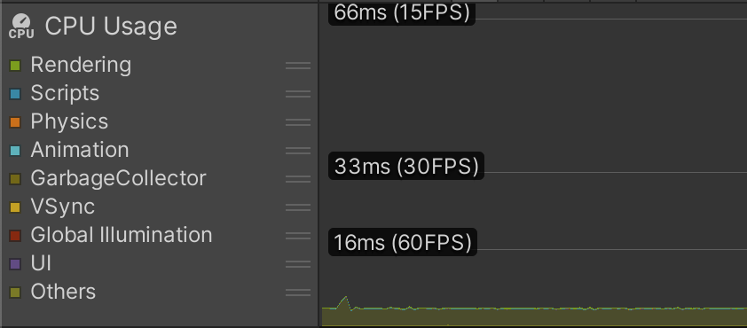

Unity 2017.1 で UI 関連の処理の計測値が追加された。UI 関連の処理は **CPU Usage** 内で紫色で示される。残念ながら、UI に関する処理はきちんと分類されていないため、ここで表示されていない UI 関連の処理が存在する可能性がある。たとえば、`Canvas.SendWillRenderCanvases` （Canvas リビルド）は UI に分類されているが、`Canvas.BuildBatch` （バッチビルド）は緑色の Rendering と 黄緑色の Others に分類されている。なので、UI 関連の負荷について詳しく見たいのであれば、CPU Usage よりも後述する UI エリアと UI Detail エリアを調べよう。

### Memory エリア

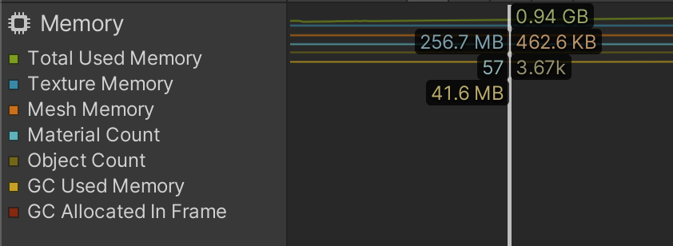

**Memory** エリアにおいて UI のプロファイリングの際に注目したいのは **Texture Memory** と **GC Allocated In Frame** であろう。**Texture Memory** は文字通りテクスチャが使用しているメモリ量である。具体的にどのテクスチャがどれだけメモリを消費しているかを見たいのであれば、ブレークダウンビューで **Take Sample Playmode** でメモリ使用状況のスナップショットを撮り、*Assets/Texture2D* や *SceneMemory/Material* を見ていくと良いだろう。

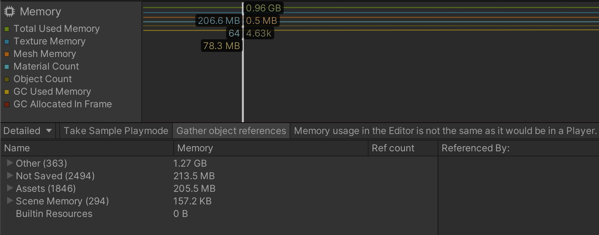

**GC Allocated** は将来ガベージコレクションの対象になるメモリが割り当てられた量を表している。UI の操作によって GC Alloc が発生し、近い将来にガベージコレクションが発生することによってパフォーマンスが悪化することになる。フレームレートの低下が発生するようであれば、**GC Allocated In Frame** に注目していくと良いだろう。

### UI エリア

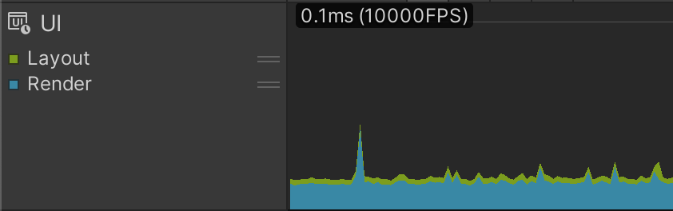

UI エリアは Unity 2017.1 で新設されたエリアである。Profiler のウィンドウを下にスクロールしていくと現れる。

UI エリアには、Layout と Render で消費された CPU 時間が表示される。ただし、上で説明したように、ここには表示されていない UI 関連の CPU 処理が存在する可能性があるので、参考程度に見て欲しい。

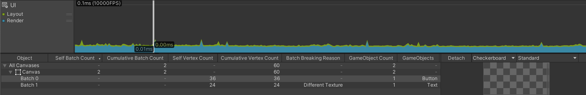

右端のプレビュータイプを **Standard** から **Overdraw** もしくは **Composite overdraw** に変更すると、負荷が高い（何度も重ねて描画されている）箇所を見ることができ、フィルレートの問題が発生しているかどうかを見るのに役立つだろう。

オーバードローの場合は赤く明るい箇所が負荷が高く、混合オーバードローの場合は赤い箇所が負荷が高いことを示している。

ブレークダウンビューには各 Canvas と Batch が表示されており、各 Canvas をクリックすると右の UI System View にそれぞれの描画内容が表示される。プレビューの背景を **Checkerboard**（透明）/ **white** / **black** のいずれかに変更でき、プレビュータイプを **Standard** / **Overdraw** / **Composite overdraw** のいずれかに変更できる。**Detach** をボタンを推すと、**UI System View** のウィンドウを切り離すことができる。

#### Self Batch Count

この `Canvas` のバッチ数を示す。基本的には、少なければ少ないほど良い。

#### Cumulative Batch Count

全 `Canvas` のバッチの合計数。基本的には、少なければ少ないほど良い。

#### Self Vertex Count

この `Canvas` の頂点数。

#### Cumulative Vetex Count

全 `Canvas` の頂点の合計数。

#### Batch Breaking Reason

Unity の **Profiler** や **Frame Debugger** ではレンダリングのバッチが中断した理由（**Batch Breaking Reason**）を見ることができる。バッチの総数を減らすことで描画のパフォーマンスを改善できるので、できるだけバッチが中断されないようにしたい。

バッチ中断の理由の一覧およびバッチ中断を発生させるサンプルプロジェクトが GitHub で公開されている。

<https://github.com/Unity-Technologies/BatchBreakingCause>

サンプルプロジェクトを実行して **Frame Debugger** の "Why this draw call can't be batched with the previous one（なぜこのドローコールが直前のものとバッチできないのか）" の項を見れば、このメッシュが直前のバッチに含めることができなかった理由の詳細がわかる。

以下に、理由のリストと詳細を載せる。

- **Additional Vertex Streams** : MeshRenderer.additionalVertexStreams でオブジェクトに頂点ストリームを追加したため。

- **Deferred Objects on Different Lighting Layers** :（Deferred Rendering を使っていて）GameObject の Layer が直前のバッチとは異なるため。

- **Deferred Objects Split by Shadow Distance** :（Deferred Rendering を使っていて）Shadow のカスケードが直前のバッチとは異なるため。

- **Different Combined Meshes** :（StaticBatchingUtility.Combine や自動の静的バッチングで）結合されたメッシュが直前のバッチとは異なるため。

- **Different Custom Properties** : 直前のバッチのものとは異なる Material Property Block の Property が存在するため。

- **Different Lights** : Light が直前のバッチとは異なるため。

- **Different Materials** : Material が直前のバッチとは異なるため。

- **Different Reflection Probes** : Reflection Probes が直前のバッチとは異なるため。

- **Different Shadow Caster Hash** : Shadow Casting のシェーダーが直前のバッチとは異なる。あるいは、Shadow Caster パスに影響を与えるシェーダープロパティ/キーワードに直前のバッチとは異なる値が設定されているため。

- **Different Shadow Receiving Settings** : MeshRenderer の Lighting の Receive Shadows の設定が直前のバッチとは異なるため。

- **Different Static Batching Flags** : GameObject の Static フラグが異なる（Batching Static か否か）ため。

- **Dynamic Batching Disabled to Avoid Z-Fighting** : Player Settings で動的バッチングが無効にされている。あるいは Z ファイティングを避けるために一時的に動的バッチングが無効にされたため。

- **Instancing Different Geometries** : 直前のバッチとは異なる GPU インスタンシングのメッシュ/サブメッシュをレンダリングしようとしたため。

- **Lightmapped Objects** : オブジェクトに直前のものとは異なるライトマップが使われている。あるいは、同じライトマップだが異なるライトマップ UV トランスフォーメーションが使われているため。

- **Lightprobe Affected Objects** : 直前のバッチとは異なる Lightprobe の影響を受けているため。

- **Mixed Sided Mode Shadow Casters** : Cast Shadows の設定が直前のバッチとは異なるため。

- **Multipass** : マルチパスのシェーダーを使用しているため。

- **Multiple Forward Lights** : Forward Rendering を使っていて、複数の Light が使われているため。

- **Non-instanceable Property Set** :（GPU インスタンシングを行っていて）インスタンス化されていないプロパティ値が直前のバッチとは異なっているため。

- **Odd Negative Scaling** : 直前のバッチのメッシュと Negative Scaling（Trasnform の Scale の x, y, z の要素のうち負の要素の数の偶奇）が異なるため。たとえば、Scale が `(1, 1, 1)` のメッシュと `(-1, 1, 1)` のメッシュは別のバッチになる。

- **Shader Disables Batching** : シェーダーの Tags に "DisableBatching"="True" が設定されているため。

- **Too Many Indices in Dynamic Batch** : 動的バッチングでの Index が多すぎるため（32768 個超）。

- **Too Many Indices in Static Batch** : 静的バッチングでの Index が多すぎるため（MacOSX では 32768 個超、OpenGLES では 49152 超、それ以外では 65536 個超）。

- **Too Many Vertex Attributes for Dynamic Batching** : 動的バッチングで頂点アトリビュートが多すぎる（900 個超）ため。

- **Too Many Vertices for Dynamic Batching** : 動的バッチングで頂点が多すぎる（300 頂点超）。

### UI Details エリア

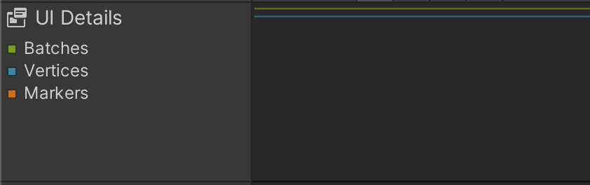

**UI Details エリア** も Unity 2017.1 で新設されたエリアである。

**UI Details エリア**では、**Batches** で `Canvas` のバッチの総数、**Vertices** で頂点数、**Markers** でイベントマーカーの数が表示される。

#### Batches

全 `Canvas` のバッチの数を見ることができる。ブレークダウンビューには各 `Canvas` のバッチの全てが表示される。ここで一番注目すべきなのは後述する **Batch Breaking Reason** である。

#### Vertices

全 `Canvas` の頂点数を見ることができる。

#### Markers

ボタンクリックや、スライダー操作などのインタラクションイベントを示す。パフォーマンス調査の際には邪魔になることもあるので、その場合は左のオレンジ色のボックスをクリックして表示に無効にすると良い。

## Frame Debugger

Unity の Frame Debugger は uGUI で生成されたドローコールを削減したり、バッチ中断の理由を調査したりするのに役立つ。Frame Debugger を起動するには Editor の　*Window -> Analysis -> Frame Debugger* を選択する。Frame Debugger の Enable を押すと、その時点でのフレームのレンダリングの様子を 1 ステップずつ見ることができる。

Frame Debugger は Play Mode でなくても実行できるので、各種の試行錯誤を行うのに有用である。

`Canvas` コンポーネントの `renderMode` 次第でドローコールがどこに表示されるかが異なることに注意。

`ScreenSpaceOverlay` の場合、*UGUI.Rendering.RenderOverlays -> Canvas.RenderOverlays* 以下にある Draw Mesh がそれである。


`ScreenSpaceCamera` あるいは `WorldSpace` の場合、 *Camera.Render -> Drawing -> Render.TransparentGeometry* 以下にある Draw Mesh がそれである。


ウィンドウ上部にあるスライダーを左右に動かすか、左右の三角ボタンを押すと、レンダリングの各ステップが実行されていく様子を見ることができる。**Game View** を開いた状態でスライダーを左右に動かすと分かりやすいだろう。

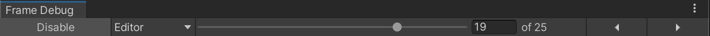

`RenderTexture` にレンダリングする場合のみ、インフォメーションパネル上部の、Red/Gree/Blue/Alpha チャンネルに分けて表示することができる。また、**Levels** スライダーを使うと明るさレベル別に分けて表示することができる。

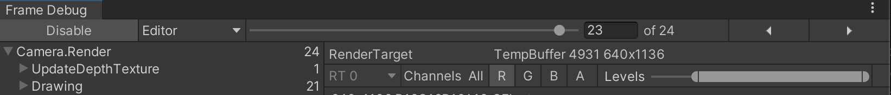

各ドローコールごとにシェーダー名やシェーダーパス、各プロパティを見ることができる。

UI 用の独自のシェーダーを使っていないのであれば、シェーダーは *UI/Default* などの組み込みシェーダーが表示されているだろう。

**Preview** タブを選択すると、そのドローコールの頂点数とインデックス数が表示される。

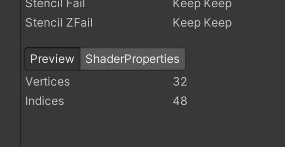

**ShaderProperties** タブを選択すると、シェーダーのプロパティが表示される。

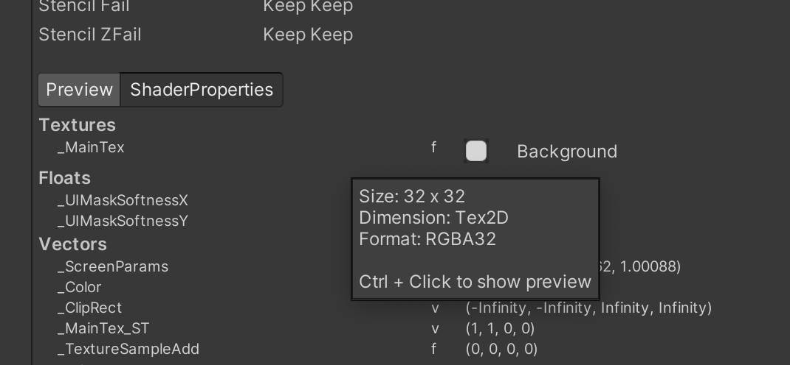

これはトラブルシューティング時やシェーダーのデバッグ時に役立つだろう。また、テクスチャが設定されたプロパティにマウスカーソルを合わせるとサイズ/次元/フォーマットが表示される。更にその状態で Ctrl + クリックするとそのテクスチャが大きく表示される。

## CPU Usage エリアの解析と原因のパターン

Unity Profiler の CPU Usage エリアに注目してみよう。

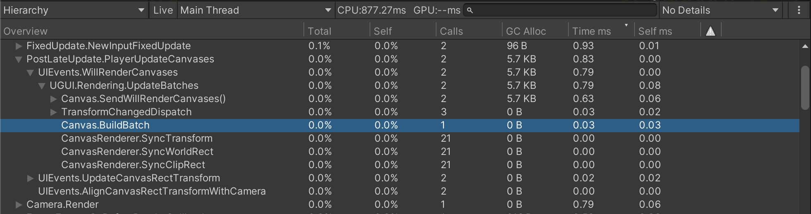

`Canvas.BuildBatch` は Canvas のバッチビルド処理を行うネイティブコードの計算である。

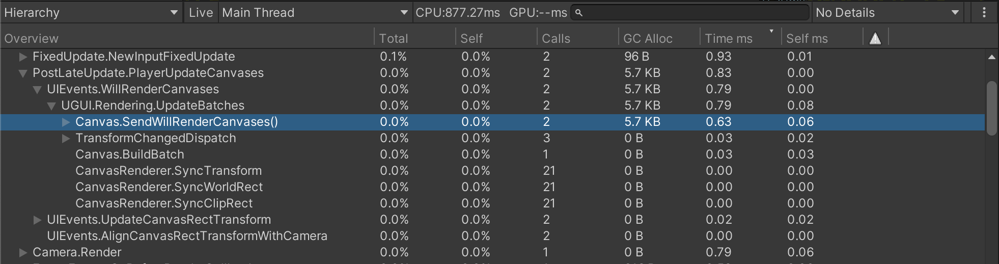

`Canvas.SendWillRenderCanvases` は、`Canvas` コンポーネントの `willRenderCanvases` イベントを購読している C# スクリプトの呼び出しを含んでいる。前述の通り、uGUI の `CanvasUpdateRegistry` クラスはこのイベントを受け取って、リビルド処理を実行するためにそれを使用する。ダーティーな UI コンポーネントもこの時に自身の `CanvasRenderer` を更新することになる。

CPU Usage エリアの解析結果から得られるパフォーマンス劣化の原因には以下のようなパターンがある。

- `Canvas.BuildBatch` または `Canvas::UpdateBatches` が非常に多くの CPU 時間を消費していたのであれば、1 つの `Canvas` に対して `CanvasRenderer` コンポーネントの数があまりにも多すぎる可能性がある。Canvas をサブ Canvas に分割することを検討しよう。

- 多くの時間が GPU の UI 描画で費やされていたなら、フラグメントシェーダーパイプラインがボトルネックであることを示し、GPU が処理可能であるピクセルレートを超えている可能性がある。もっともありそうな原因は、UI オーバードローが多すぎることである。*Chapter 3 レンダリング* の *レンダリングのパフォーマンス改善* の項を参考にして、サンプリングするピクセル数を減らすように改善しよう。

- CPU 時間の大半が `Canvas.SendWillRenderCanvases` または `Canvas::SendWillRenderCanvases` であれば　Layout リビルドまたは Graphic リビルドが CPU を使い過ぎている。さらに詳しい解析が必要である。

- `WillRenderCanvas` の大部分が `IndexedSet_Sort` または `CanvasUpdateRegistry_SortLayoutList` で消費されている場合、ダーティーな `ICanvasElement` のリストのソートで消費されている。このソートは Canvas リビルドの各ステージの最初に行われる。Canvas 内の `ICanvasElement` コンポーネントの数を削減する（≒ UI 要素の数を削減する）ことを検討すること。Canvas をサブ Canvas に分割するのも効果的である。

- `Text_OnPopulateMesh` で大量の時間が消費されているようであれば、原因はテキストのメッシュの作成である。`Text` の `resizeTextForBestFit` を `true` になっていないか確認すること。また、テキストも文字列が頻繁に更新されていないか確認すること。もし、単に文字列を表示したくないのであれば `localScale` を `(0, 0, 0)` にするなどしたほうがパフォーマンスが改善する可能性がある。

- `Shadow_ModifyMesh` または `Outline_ModifyMesh`（あるいは他の `ModifyMesh` の実装）で時間が消費されているのであれば、問題は `MeshModifier` の計算時間である。これらのコンポーネントを削除したり、静的な画像でそれらの画像エフェクトを実現したり、あるいは TextMesh Pro を使用することを検討しよう。